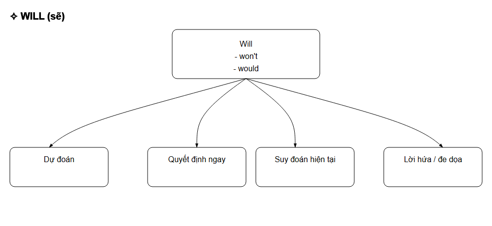
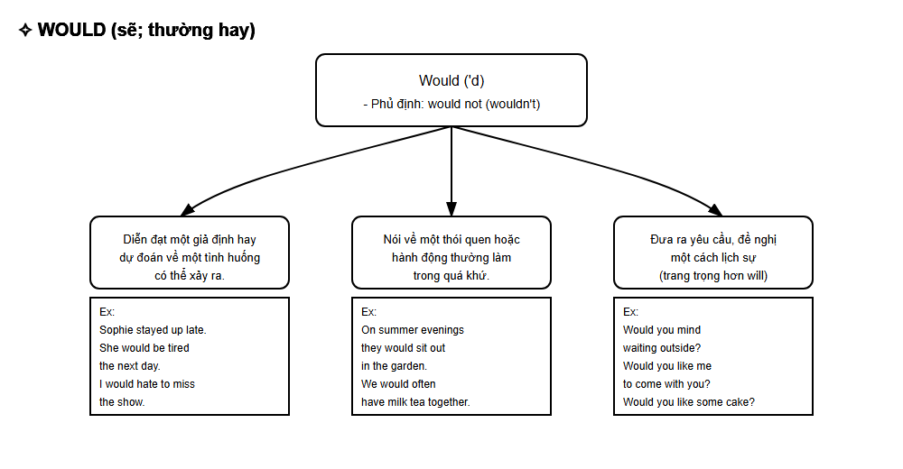
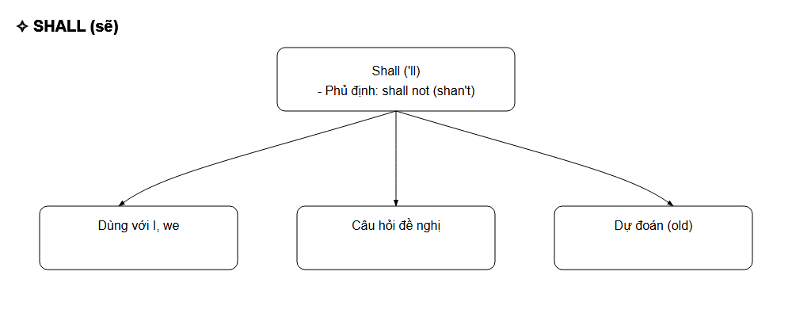
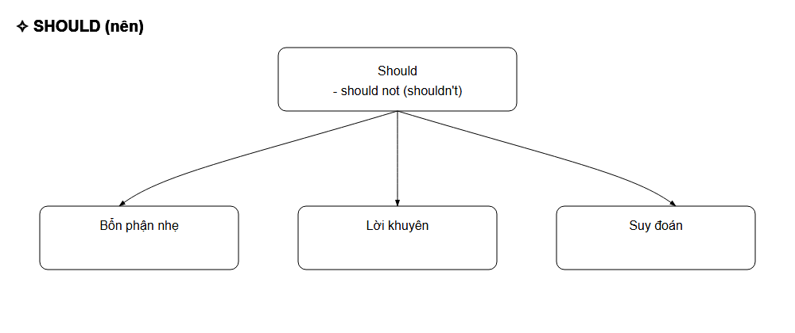
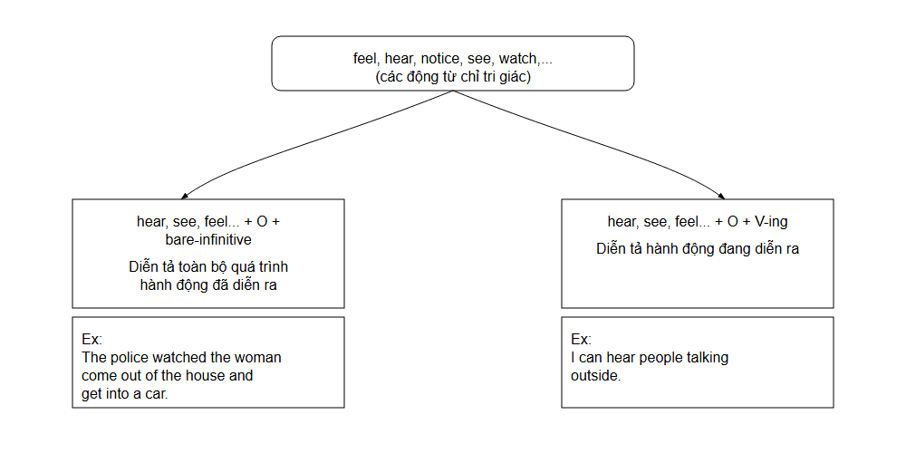
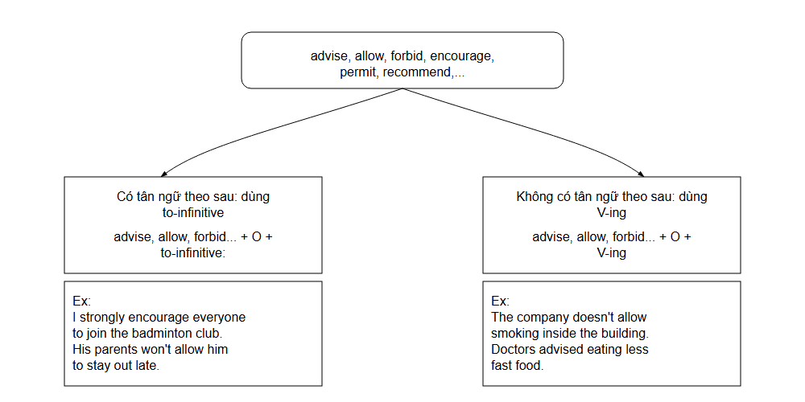

# TỪ LOẠI PARTS OF SPEECH

## Mục tiêu học tập:

Phân biệt các loại danh từ và hiểu được chức năng của danh từ.

- Biết cách thành lập sở hữu cách.

- Biết cách thành lập danh từ.

Danh từ là từ hoặc cụm từ chỉ người, con vật, đó vật hoặc sự vật, nơi chốn, khái niệm, và các đối tượng trừu tượng khác.

## Các loại danh từ (Types of nouns)

## 1. Danh từ chung và danh từ riêng (Common and proper nouns)

1. Danh từ chung (common nouns) là tên gọi chung cho một loại sự vật, hiện tượng, khái niệm.

Ex: computer, city, student, freedom, knowledge, animal, water

Danh từ chung có thể được chia thành ba loại: danh từ cụ thể, danh từ trừu tượng và danh từ tập hợp.

- Danh từ cụ thể (concrete nouns) chỉ những hiện tượng, sự vật hoặc đối tượng hữu hình có thể được cảm nhận và nhận biết thông qua các giác quan.

Ex: door, bicycle, phone

- Danh từ trừu tượng (abstract nouns) mô tả những hiện tượng, sự vật hoặc đối tượng mà ta không thể chạm vào hoặc nhìn thấy nhưng ta có nhận thức về chúng.

Ex: happiness, greed, wisdom

- Danh từ tập hợp (collective nouns) chỉ một tập thể/ nhóm người hoặc đồ vật như một thể thống nhất (có thể dùng với động từ số it hoặc số nhiều).

Ex: army, family, government, police, staff, team

Danh từ cụ thể và danh từ trĩu tương có thể được tiếp tục phân loại thành danh từ đếm được và không đếm được.

- Danh từ đếm được (countable nouns) là những danh từ chỉ người, sự vật, sự việc hoặc khái niệm có thể đếm được, kể cả khi con số là cực kì lớn (như dân số thế giới).

Ex: word, chair, apple

Danh từ số ít (singular nouns) dùng để chỉ một sự vật, hiện tượng đếm được với số đếm là một và thường đi kèm với mạo từ a/an.

Ex: a word, a chair, an apple

Danh từ số nhiều (plural nouns) dùng để chỉ sự vật, hiện tượng đếm được với số đếm từ hai trở lên và có thể đi kèm với con số cụ thể hoặc các lượng từ như some, any, many, few, v.v.

Ex: 300 words, a few chairs, many apples

##### Cách thành lập danh từ số nhiều

a. Hầu hết các danh từ số nhiều được thành lập bằng cách thêm -s vào danh từ số ít.

Ex: scientist → scientists

hospital → hospitals

bag → bags

Ngoài ra, ta còn thêm 's để tạo thành hình thức số nhiều của các chữ cái, chữ số, kí hiệu và chữ viết tắt.

Ex: There are 4 t's, 2 p's, and 4 s's in the word "Mississippi".

MP3's used to be the most popular music devices. [MP3's phổ biến hơn]

Fashion trends from the 2000's are coming back in today's pop culture. [the 2000s phó biến hơn]

b. Ta thêm -es vào các danh từ tận cùng bàng -s, -ss, -sh, -x, -z, -ch để tạo thành số nhiều.

<table border=1 style='margin: auto; word-wrap: break-word;'><tr><td style='text-align: center; word-wrap: break-word;'> bus</td><td style='text-align: center; word-wrap: break-word;'>→</td><td style='text-align: center; word-wrap: break-word;'>buses</td></tr><tr><td style='text-align: center; word-wrap: break-word;'>business</td><td style='text-align: center; word-wrap: break-word;'>→</td><td style='text-align: center; word-wrap: break-word;'>businesses</td></tr><tr><td style='text-align: center; word-wrap: break-word;'>dish</td><td style='text-align: center; word-wrap: break-word;'>→</td><td style='text-align: center; word-wrap: break-word;'>dishes</td></tr><tr><td style='text-align: center; word-wrap: break-word;'>tax</td><td style='text-align: center; word-wrap: break-word;'>→</td><td style='text-align: center; word-wrap: break-word;'>taxes</td></tr><tr><td style='text-align: center; word-wrap: break-word;'>quiz</td><td style='text-align: center; word-wrap: break-word;'>→</td><td style='text-align: center; word-wrap: break-word;'>quizzes</td></tr><tr><td style='text-align: center; word-wrap: break-word;'>church</td><td style='text-align: center; word-wrap: break-word;'>→</td><td style='text-align: center; word-wrap: break-word;'>churches</td></tr></table>

c. Đối với các danh từ tận cùng bằng phụ âm + y (consonant + y), ta tạo thành số nhiều bảng cách đối y thành i rồi thêm -es.

Ex: puppy → puppies

city → cities

sky → skies

Các danh từ tận cùng bằng một nguyên âm + y (vowel + y) thì chỉ thêm -s.

Ex: boy → boys

monkey → monkeys

day → days

d. Đối với một số danh từ tận cùng bằng -f hoặc -fe, ví dụ như calf, half, knife, leaf, life, loaf, self, thief, wife, wolf, v.v. ta tạo thành danh từ số nhiều bằng cách đổi -f hoặc -fe thành -ves.

Ex: self → selves

life → lives

leaf → leaves

Các danh từ tận cùng bằng -f hoặc -f khác thì thêm -s theo cách thông thường.

Ex: chef → chefs

giraffe → giraffes

proof → proofs

Ngoại lệ: Một số danh từ tận cùng bảng -f có thể có hình thức số nhiều bảng cách thêm -s hoặc -ves đều được.

Ex: calf → calfs, calves

scarf → scarfs, scarves

hoof → hoofs, hooves

e. Đối với một số danh từ tận cùng bằng phụ âm + o (consonant + o), ta tạo thành số nhiều bảng cách thêm -es.

Ex: potato → potatoes

tomato → tomatoes

hero → heroes

Đối với các danh từ tận cùng bằng nguyên âm + o (vowel + o), các từ vay mượn từ ngôn ngữ khác sang tiếng Anh, từ được viết tắt, hoặc các nhạc cụ thì ta chỉ cần thêm -s để tạo thành số nhiều.

Ex: zoo → zoos

casino → casinos

photo (photograph) → photos

piano → pianos

Ngoại lệ: Một số danh từ tận cùng bằng -o có thể có hình thức số nhiều bằng cách thêm -s hoặc -es đều được, chẳng hạn như buffalo, mango, mosquito, tornado, volcano, zero, v.v.

buffalo → buffalos, buffaloes

mango → mangos, mangoes

volcano → volcanos, volcanoes

1. Một số danh từ luôn tồn tại ở hình thức số nhiều (luôn được dùng với động từ số nhiều)

- quần áo gồm hai phần: jeans, pants, pyjamas, shorts, trousers, v.v.

- dụng cụ hoặc thiết bị gồm hai phần: headphones, glasses, scissors, v.v.

- Vì vậy, ta có thể dùng a pair of cho các danh từ chỉ quần áo hoặc dụng cụ gồm hai phần.

Ex: a pair of jeans, six pairs of scissors

- một số danh từ luôn ở thế số nhiều khác: belongings, clothes, earnings, goods, savings, surroundings, v.v

g. Một số danh từ có nguồn gốc từ tiếng Hy Lạp hoặc Latin thường có dạng số nhiều đặc biệt theo luật của tiếng Hy Lạp và Latin.

Ex: analysts → analyses

cactus → cacti

datum → data

Danh từ số nhiều bất quy tắc

a. Danh từ thay đổi khi ở số nhiều.

 $ \underline{Ex} $: child  $ \rightarrow $ children
foot  $ \rightarrow $ feet
goose  $ \rightarrow $ geese
man  $ \rightarrow $ men
mouse  $ \rightarrow $ mice
person  $ \rightarrow $ people
tooth  $ \rightarrow $ teeth

b. Danh từ không thay đổi khi ở số nhiều.

Ex: sheep → sheep
deer → deer
fish → fish

c. Một số danh từ tận cùng bằng -s vừa là số ít vừa là số nhiều: headquarters, means, series, species, v.v.

Danh từ không đếm được (uncountable nouns) chỉ những thứ không thể đếm được một cách cụ thể, như vật liệu, chất liệu, chất lỏng, những khái niệm trừu tượng hoặc hiện tượng tự nhiên.

Ex: sand, gold, tea, rice, money, furniture, education, wind, thunder

Vì không đếm được nên loại danh từ này không thể theo sau mạo từ a/an hoặc một con số cụ thể, thay vào đó ta có thể dùng các lượng từ như some, any, much, a lot of, little, a little, v.v.

 a sand  -> a lot of sand 
 a furniture -> some furniture

Một số danh từ luôn ở hình thức số nhiều, tận cùng là -s nhưng lại là danh từ không đếm được và được dùng với động từ số it. Đó là:

- Môn học hoặc môn thế thao tận cùng là -ics: mathematics, physics, economics, politics, linguistics, genetics, athletics, gymnastics, v.v.

- Trò chơi: billtards, darts, v.v.

- Bệnh: measles, mumps, diabetes, v.v.

- Quốc gia: the Philippines, the United States, the Netherlands, v.v.

Một số danh từ không đếm được khác: news, advice, equipment, furniture, information, luggage, money, work, v.v.

Ex: Physics is my favourite subject.

Billiards  $ \underline{\text{challenges}} $ players to think ahead.

Mumps was once a common childhood illness.

The Philippines  $ \underline{\text{is known}} $ for its stunning beaches.

2. Danh từ riêng (proper nouns) chỉ tên riêng của sự vật như tên người, tên địa danh, tên tổ chức, v.v. Danh từ riêng có chữ cái đầu được viết hoa.

Ex: Samsung, Paris, Kayla

### LƯU Ý:

- Để "đếm" danh từ không đếm được, ta có thể dùng danh từ chỉ sự đo lường.

Ex: a slice of meat, a piece of information, five bars of chocolate, v.v.

- Ta cũng có thể thành lập hình thức số nhiều cho danh từ riêng.

Ex: There are four Emilys in my school.

Hoặc dùng the + danh từ riêng số nhiều để chỉ một gia đình.

Ex: the Johnsons = the Johnson family

- Nhiều danh từ có thể được dùng như danh từ đếm được lần không đếm được, nhưng sẽ khác nhau về nghĩa.

Ex: I broke a glass yesterday. (= một cái ly)

The window is made of glass. (= thủy tĩnh)

Danh từ chỉ nguyên liệu, thức uống như sugar, salt, pepper, coffee, beer, tea, juice, v.v. thuốc không đếm được, chỉ trừ trường hợp các từ này mang nghĩa "tách, ly, chai, thia, v.v".

Ex: No one should drink too much beer. (= thuộc uống bia)

After a hard day's work, I enjoy a beer or two. (= một hoặc hai ly bia)

### II. Danh từ đơn và danh từ ghép (Simple and compound nouns)

1. Danh từ đơn (simple nouns) là danh từ chỉ có một từ.

Ex: flower, lizard, file, friend, baby, office, happiness, food, weather

2. Danh từ ghép (compound nouns) là danh từ được kết hợp bởi hai từ trỏ lên, thông thường là danh từ + danh từ (noun + noun) hoặc tính từ + danh từ (adjective + noun), nhưng vẫn có những dạng kết hợp khác (xem bên dưới). Mỗi một danh từ ghép là một đơn vị độc lập và vẫn có thể được bổ nghĩa bởi tính từ hoặc các danh từ khác.

Về mặt chính tả, danh từ ghép được thế hiện dưới 3 hình thức:

- Có khỏang cách giữa các từ

Ex: Ice cream, post office, bus stop

- Có dấu gạch ngang giữa các từ. Tuy nhiên, trong tiếng Anh hiện đại, lối viết có gạch ngang ở giữa ít thông dụng

Ex: son-in-law (hoặc son in law), merry-go-round, runner-up

- Không có khoảng cách giữa các từ

Ex: lighthouse, password, rainbow

Cách thành lập danh từ ghép

<table border=1 style='margin: auto; word-wrap: break-word;'><tr><td style='text-align: center; word-wrap: break-word;'>Danh từ+danh từ(noun+noun)</td><td style='text-align: center; word-wrap: break-word;'>Ex:bookshelf, snowman, laptop</td></tr><tr><td style='text-align: center; word-wrap: break-word;'>Tính từ+danh từ(adjective+noun)</td><td style='text-align: center; word-wrap: break-word;'>Ex:blackboard, greenhouse, software</td></tr><tr><td style='text-align: center; word-wrap: break-word;'>Danh từ+động từ(noun+verb)</td><td style='text-align: center; word-wrap: break-word;'>Ex:sunset, haircut, raindrop</td></tr><tr><td style='text-align: center; word-wrap: break-word;'>Danh từ+danh động từ(noun+gerund)</td><td style='text-align: center; word-wrap: break-word;'>Ex:timekeeping, sightseeing, birdwatching</td></tr><tr><td style='text-align: center; word-wrap: break-word;'>Danh động từ+danh từ(gerund+noun)</td><td style='text-align: center; word-wrap: break-word;'>Ex:swimming pool, driving license, walking stick</td></tr><tr><td style='text-align: center; word-wrap: break-word;'>Tính từ+dòng từ(adjective+verb)</td><td style='text-align: center; word-wrap: break-word;'>Ex:dry-cleanting, hard work</td></tr><tr><td style='text-align: center; word-wrap: break-word;'>Động từ+danh từ(verb+noun)</td><td style='text-align: center; word-wrap: break-word;'>Ex:runway, pickpocket, skateboard</td></tr><tr><td style='text-align: center; word-wrap: break-word;'>Giới từ+động từ(preposition+verb)</td><td style='text-align: center; word-wrap: break-word;'>Ex:outset, underestimate, outbreak</td></tr><tr><td style='text-align: center; word-wrap: break-word;'>Dòng từ+giới từ(verb+preposition)</td><td style='text-align: center; word-wrap: break-word;'>Ex:takeout, breakup, check-in</td></tr><tr><td style='text-align: center; word-wrap: break-word;'>Danh từ+giới từ(noun+preposition)</td><td style='text-align: center; word-wrap: break-word;'>Ex:passer-by, looker-on</td></tr><tr><td style='text-align: center; word-wrap: break-word;'>Danh từ+tính từ(noun+adjective)</td><td style='text-align: center; word-wrap: break-word;'>Ex:secretary-general, attorney-general</td></tr><tr><td style='text-align: center; word-wrap: break-word;'>Nhiều hơn hai từ</td><td style='text-align: center; word-wrap: break-word;'>Ex:high-speed internet connection, board of directors, editor-in-chief</td></tr></table>

#### Số nhiều của danh từ ghép

Cách phổ biến nhất để thành lập hình thức số nhiều của danh từ ghép là thêm đuôi số nhiều vào phần cuối của danh từ ghép đó.

Ex: bookshelf → bookshelves

blackboard → blackboards

swimming pool → swimming pools

Hoặc khi không có thành phần nào là danh từ thì ta cũng thêm đuôi số nhiều vào phần cuối của danh từ ghép đó.

Ex: breakup → breakups

check-in → check-ins

Δ Tuy nhiên, đối với hình thức danh từ ghép danh từ + giới từ (noun + preposition), thì hình thức số nhiều được thành lập với danh từ đầu tiên.

Ex: passer-by → passers-by

editor-in-chief → editors-in-chief

#### Cách phát âm đuôi -s hoặc -es của danh từ số nhiều

Có 3 cách phát âm đuôi -s/-es của danh từ số nhiều: /s/, /z/ và /ɪz/

/ɪz/ khi thêm -es vào các danh từ có âm tận cùng là: /s/, /z/, /ʃ/, /tʃ/, /ʒ/, /dʒ/. Các âm này thường được thể hiện qua mặt chủ tân cùng là -ce, -s, -ss, -x, -z, -ze, -sh, -ch, -ge.

<table border=1 style='margin: auto; word-wrap: break-word;'>
<tr>
<td style='text-align: center;'>Âm tận cùng</td>
<td style='text-align: center;'>Thể hiện qua mặt chữ tận cùng</td>
<td style='text-align: center;'>Thêm -es</td>
</tr>

<tr>
<td style='text-align: center;'>/s/</td>
<td style='text-align: center;'>Ex: chance /tʃɑːns/ bus /bʌs/ kiss /kɪs/ box /bɒks/</td>
<td style='text-align: center;'>chances /'tʃɑːnsɪz/ buses /'bʌsɪz/ kisses /'kɪsɪz/ boxes /'bɒksɪz/</td>
</tr>

<tr>
<td style='text-align: center;'>/ʃ/</td>
<td style='text-align: center;'>Ex: brush /brʌʃ/ wish /wɪʃ/</td>
<td style='text-align: center;'>brushes /'brʌʃɪz/ wishes /'wɪʃɪz/</td>
</tr>

<tr>
<td style='text-align: center;'>/ʒ/</td>
<td style='text-align: center;'>Ex: massage /'mæsaː/ garage /'gæraː/</td>
<td style='text-align: center;'>massages /'mæsaːz/ garages /'gæraːz/</td>
</tr>

<tr>
<td style='text-align: center;'>/z/</td>
<td style='text-align: center;'>Ex: quiz /kwɪz/ prize /praɪz/</td>
<td style='text-align: center;'>quizzes /'kwɪzɪz/ prizes /'praɪzɪz/</td>
</tr>

<tr>
<td style='text-align: center;'>/tʃ/</td>
<td style='text-align: center;'>Ex: church /tʃɜːtʃ/ match /mætʃ/</td>
<td style='text-align: center;'>churches /'tʃɜːtʃɪz/ matches /'mætʃɪz/</td>
</tr>

<tr>
<td style='text-align: center;'>/dʒ/</td>
<td style='text-align: center;'>Ex: language /'læŋɡwɪdʒ/ stage /steɪdʒ/</td>
<td style='text-align: center;'>languages /'læŋɡwɪdʒɪz/ stages /'steɪdʒɪz/</td>
</tr>

<tr>
<td style='text-align: center;'>Âm tận cùng</td>
<td style='text-align: center;'>Thể hiện qua mặt chữ tận cùng</td>
<td style='text-align: center;'>Thêm -s</td>
</tr>

<tr>
<td style='text-align: center;'>/f/</td>
<td style='text-align: center;'>Ex: laugh /lɑːf/ roof /ruːf/ giraffe /dʒɜːrəːf/</td>
<td style='text-align: center;'>laughs /lɑːfs/ roofs /ruːfs/ giraffes /dʒɜːrəːfs/</td>
</tr>

<tr>
<td style='text-align: center;'>/t/</td>
<td style='text-align: center;'>Ex: hat /hæt/ vote /vəʊt/</td>
<td style='text-align: center;'>hats /hæts/ votes /vəʊts/</td>
</tr>

<tr>
<td style='text-align: center;'>/k/</td>
<td style='text-align: center;'>Ex: book /bʊk/ cake /keɪk/</td>
<td style='text-align: center;'>books /bʊks/ cakes /keɪks/</td>
</tr>

<tr>
<td style='text-align: center;'>/p/</td>
<td style='text-align: center;'>Ex: map /mæp/ pipe /paɪp/</td>
<td style='text-align: center;'>maps /mæps/ pipes /paɪps/</td>
</tr>

<tr>
<td style='text-align: center;'>/θ/</td>
<td style='text-align: center;'>Ex: month /mʌnθ/ length /lɛŋkθ/</td>
<td style='text-align: center;'>months /mʌnθs/ lengths /lɛŋkθs/</td>
</tr>

</table>
/s/ khi thêm -s vào các danh từ có âm tận cùng là: /f/, /t/, /k/, /p/, /θ/. Các âm này thường được thể hiện qua mặt chủ tận cùng là -f / -fe, -gh [đôi khi], -t / -te, -k / -ke, -p / -pe, -th.

/z/ khi -s được thêm vào các danh từ có âm tận cùng khác với hai trường hợp đã nêu ở trên.

Ex: tree /tri:/ → trees /tri:z/

shoe /ʃuː/ → shoes /ʃuːz/

leg /leg/ → legs /legz/

bed /bed/ → beds /bedz/

## Chức năng của danh từ (Functions of Nouns)

<table border=1 style='margin: auto; word-wrap: break-word;'><tr><td style='text-align: center; word-wrap: break-word;'>Chức năng</td><td style='text-align: center; word-wrap: break-word;'>Định nghĩa</td><td style='text-align: center; word-wrap: break-word;'>Ví dụ</td></tr><tr><td style='text-align: center; word-wrap: break-word;'>Chủ ngữ (Subject)</td><td style='text-align: center; word-wrap: break-word;'>Thực hiện hành động</td><td style='text-align: center; word-wrap: break-word;'>
  My mom made pasta last night. Chủ ngữ 'my mom'thực hiện hành động 'quotmade'.</td>
</tr></table>

<table border=1 style='margin: auto; word-wrap: break-word;'><tr><td rowspan="3">Tân ngữ (Object)</td><td style='text-align: center; word-wrap: break-word;'>• Tân ngữ trực tiếp (Direct object) Đối tượng chịu tác động trực tiếp của động từ</td><td style='text-align: center; word-wrap: break-word;'>The manager sent an email. → Động từ “sent” tác động lên “an email” nên “an email” là tân ngữ trực tiếp.</td></tr><tr><td style='text-align: center; word-wrap: break-word;'>• Tân ngữ gián tiếp (Indirect object) Người hoặc vật nhận lợi ích hoặc mục đích của hành động</td><td style='text-align: center; word-wrap: break-word;'>The manager sent me an email. → Người nhận là “me”, nên “me” là tân ngữ gián tiếp.</td></tr><tr><td style='text-align: center; word-wrap: break-word;'>• Tân ngữ của giới từ (Object of a Preposition) Danh từ nào đi sau giới từ cùng đều làm tân ngữ cho giới từ đó.</td><td style='text-align: center; word-wrap: break-word;'>The children went to the football game. → Danh từ “football game” đi sau bổ nghĩa cho giới từ “to”, nên “football game” là tân ngữ của giới từ.</td></tr><tr><td style='text-align: center; word-wrap: break-word;'>Bổ ngữ cho chủ ngữ (Subject complement)</td><td style='text-align: center; word-wrap: break-word;'>Mô tả thêm thông tin cho chủ ngữ, được dùng sau động từ be và các động từ liên kết (linking verbs) become, seem, feel, look, sound, taste, grow, appear, remain, v.v.</td><td style='text-align: center; word-wrap: break-word;'>She became a popular actress. → “a popular actress” cho biết thêm thông tin về chủ ngữ “she”.</td></tr><tr><td style='text-align: center; word-wrap: break-word;'>Bổ ngữ cho tân ngữ (Object complement)</td><td style='text-align: center; word-wrap: break-word;'>Mô tả thêm thông tin cho tân ngữ</td><td style='text-align: center; word-wrap: break-word;'>She named the baby Jane. → Tên riêng “Jane” cho biết thêm thông tin về tân ngữ “the baby”.</td></tr><tr><td style='text-align: center; word-wrap: break-word;'>Đồng vị ngữ (Appositive)</td><td style='text-align: center; word-wrap: break-word;'>Là danh từ hoặc cụm danh từ theo sau một danh từ khác để bổ sung nghĩa cho danh từ đó. Đồng vị ngữ thường được ngăn cách với danh từ bằng dấu phấy, dấu ngoặc tròn và dấu gạch ngang.</td><td style='text-align: center; word-wrap: break-word;'>John, my neighbour, grows beautiful roses. → “my neighbour” bổ sung thêm thông tin về “John”.</td></tr></table>

### Sở hữu cách (Possessive/ Genitive Case)

Sở hữu cách diễn đạt sự sở hữu của danh từ.

## 1. Cách thành lập sở hữu cách

<table border="1" style="margin: auto; word-wrap: break-word;"><tr><td style="text-align: center; word-wrap: break-word;">Loại từ</td><td style="text-align: center; word-wrap: break-word;">Quy tắc</td><td style="text-align: center; word-wrap: break-word;">Ví dụ</td><td style="text-align: center; word-wrap: break-word;">Ghi chú</td></tr><tr><td style="text-align: center; word-wrap: break-word;">1. Danh từ số ít</td><td style="text-align: center; word-wrap: break-word;">Thêm ’s</td><td style="text-align: center; word-wrap: break-word;">- The car’s tail- John’s new haircut</td><td style="text-align: center; word-wrap: break-word;">Áp dụng cho hầu hết danh từ số ít</td></tr><tr><td style="text-align: center; word-wrap: break-word;">2. Danh từ số ít tận cùng bằng -s</td><td style="text-align: center; word-wrap: break-word;">Thêm ’s (hiện đại) hoặc chỉ ’ (truyền thống)</td><td style="text-align: center; word-wrap: break-word;">- James’s book / James’ book- The princess’s crown / the princess’ crown</td><td style="text-align: center; word-wrap: break-word;">Đa số các hướng dẫn viết hiện đại đều ưu tiên ’s</td></tr><tr><td style="text-align: center; word-wrap: break-word;">3. Danh từ số nhiều tận cùng bằng -s</td><td style="text-align: center; word-wrap: break-word;">Chỉ thêm dấu ’</td><td style="text-align: center; word-wrap: break-word;">- the Taylors’ hair salon- Teachers’ day</td><td style="text-align: center; word-wrap: break-word;">Tránh trùng âm /s/</td></tr><tr><td style="text-align: center; word-wrap: break-word;">4. Danh từ số nhiều bất quy tắc</td><td style="text-align: center; word-wrap: break-word;">Thêm ’s</td><td style="text-align: center; word-wrap: break-word;">- Children’s playground- Men’s clothing</td><td style="text-align: center; word-wrap: break-word;">Áp dụng cho danh từ số nhiều không tận cùng bằng -s</td></tr><tr><td style="text-align: center; word-wrap: break-word;">5. Tên riêng (nhân vật lịch sử, cổ điển)</td><td style="text-align: center; word-wrap: break-word;">Chỉ thêm ’s</td><td style="text-align: center; word-wrap: break-word;">- Socrates’ philosophy- Moses’ laws</td><td style="text-align: center; word-wrap: break-word;">Quy tắc truyền thống cho các tên cổ điển</td></tr><tr><td style="text-align: center; word-wrap: break-word;">6. Danh từ ghép</td><td style="text-align: center; word-wrap: break-word;">Thêm ’s vào từ cuối cùng</td><td style="text-align: center; word-wrap: break-word;">- My mother-in-law’s house- The editor-in-chief’s dection</td><td style="text-align: center; word-wrap: break-word;"></td></tr><tr><td style="text-align: center; word-wrap: break-word;">7. Sở hữu chung</td><td style="text-align: center; word-wrap: break-word;">Thêm ’s vào danh từ cuối cùng</td><td style="text-align: center; word-wrap: break-word;">- Tom and Mary’s house- Jack and Jill’s apartment</td><td style="text-align: center; word-wrap: break-word;">Chỉ vật số hữu chung của các danh từ</td></tr><tr><td style="text-align: center; word-wrap: break-word;">8. Sở hữu riêng</td><td style="text-align: center; word-wrap: break-word;">Thêm ’s vào từng danh từ</td><td style="text-align: center; word-wrap: break-word;">- Sarah’s and Mike’s reports- The hospital’s and clinic’s doctors</td><td style="text-align: center; word-wrap: break-word;">Chỉ vật số hữu riêng của mỗi danh từ</td></tr><tr><td style="text-align: center; word-wrap: break-word;">9. Cụm từ chỉ thời gian, tiền bạc hoặc giá trị</td><td style="text-align: center; word-wrap: break-word;">Thêm ’s (số it) Thêm ’s (số nhiều)</td><td style="text-align: center; word-wrap: break-word;">- A day’s work- Today’s news- Ten years’ time- Two weeks’ notice- A dollar’s worth of candy- Fifty pounds’ worth of goods</td><td style="text-align: center; word-wrap: break-word;"></td></tr><tr><td style="text-align: center; word-wrap: break-word;">10. Một số cụm từ cố định</td><td style="text-align: center; word-wrap: break-word;">Thêm 's hoặc tùy cụm</td><td style="text-align: center; word-wrap: break-word;">- For heaven's sake- For goodness' sake- At arm's length</td><td style="text-align: center; word-wrap: break-word;"></td></tr></table>

Phân biệt sở hữu cách 's và sở hữu of + danh từ
 

<table border="1" style="margin:auto; border-collapse:collapse;">
<tr>
<td style="text-align:center; padding:10px;"><b>Dùng 's (Danh từ + 's + danh từ)</b></td>
<td style="text-align:center; padding:10px;"><b>Dùng of (Danh từ + of + danh từ)</b></td>
</tr>

<tr>
<td style="padding:10px; vertical-align:top;">
Khi chủ sở hữu là người, động vật, hoặc sinh vật sống  
Ex: 
My friend's car 
The dog's toy 
Sarah's idea
</td>

<td style="padding:10px; vertical-align:top;">
Khi chủ sở hữu là vật vô tri, địa điểm hoặc khái niệm trừu tượng  
Ex: 
The roof of the house 
(NOT The house's roof)  

The door of the building 
(NOT The building's door)  

The history of Vietnam 
(NOT Vietnam's history)
</td>
</tr>
</table>

Ngoại lệ & Trường hợp đặc biệt

of thường được dùng trong văn phong trang trọng:

The success of the project (✓) thay vì The project's success (it trang trọng hơn).

Một số cụm từ có thể dùng cả hai cách:

The company's employees (nghe tự nhiên hơn) vs. The employees of the company (trang trọng hơn nhưng vấn đúng).

The world's population (nghe tư nhiên hơn) vs. The population of the world (văn chấp nhận được).

### II. Phép thế từ trong sở hữu cách

## 1. Sở hữu cách dạng rút gọn

Trong những trường hợp này, ’s thế hiện sở hữu, nhưng danh từ bị sở hữu (của hàng, văn phòng, nhà, v.v.) được lược bỏ vi người nghe/ người đọc có thể tự hiếu.

Cấu trúc này thường được sử dụng cho của hàng kinh doanh, văn phòng chuyên môn hoặc nhà riêng.

Ex: The butcher's shop → the butcher's

The doctor's office → the doctor's

→ Cửa hàng kinh doanh: the baker's, the butcher's, the florist's, the grocer's, the newsagent's, the optician's, the chemist's, v.v.

Văn phòng chuyên môn: the doctor's, the dentist's, the vet's, the lawyer's, the accountant's, v.v.

Nhà riêng: my parents', my uncle's, my friend's, the Smiths', v.v.

- Một số địa điểm khác: the hairdresser's, the barber's, the tailor's, the cleaner's, the cleaner's, v.v.

Trong tiếng Anh hiện đại, các cụm từ như the doctor, the dentist, the hairdresser, the butcher có thể được dùng không có 's.

Ex: Tom is at the dentist('s).

## 2. Thay thế danh từ bị sở hữu

Khi danh từ chính đã được nói đến trước hoặc sắp được nói đến, ta có thể lược bỏ danh từ do sau sổ hữu cách ('s).

Ex: My car is faster than John's. [= John's car]

Mary's is the only house that is painted pink. [= Mary's house]

### III. Sở hữu kép (Double Possessives)

Sở hữu kếp là cấu trúc trong tiếng Anh kết hợp cá giới từ of và sở hữu cách (’s) trong cùng một cụm từ. Nó thường được dùng để nhấn mạnh sự sở hữu cá nhân hoặc chỉ một phần trong một nhóm lớn hơn.

Cấu trúc:

A + danh từ + of + đại từ sở hữu / danh từ sở hữu

Ex: A friend of Tom's

That idea of yours

Some paintings of Van Gogh's

#### LƯU Ý:

- Sở hữu kép chỉ được dùng với danh từ chỉ người hoặc vật có tính cá nhân.

- Không dùng với vật vô tri

Ex: A leg of the table (NOT A leg of the table's)

### Cách thành lập danh từ

## 1. Thành lập danh từ bằng cách thêm hậu tố (suffix) vào sau động từ

Hậu tố chỉ hành động, quá trình, hoặc trạng thái
 

<table border=1 style='margin: auto; word-wrap: break-word;'><tr><td style='text-align: center; word-wrap: break-word;'>Động từ</td><td style='text-align: center; word-wrap: break-word;'>Hậu tố</td><td style='text-align: center; word-wrap: break-word;'>→</td><td style='text-align: center; word-wrap: break-word;'>Danh từ</td></tr><tr><td style='text-align: center; word-wrap: break-word;'>educate, invite</td><td style='text-align: center; word-wrap: break-word;'>-tion</td><td style='text-align: center; word-wrap: break-word;'>→</td><td style='text-align: center; word-wrap: break-word;'>education, invitation</td></tr><tr><td style='text-align: center; word-wrap: break-word;'>organise, present</td><td style='text-align: center; word-wrap: break-word;'>-ation</td><td style='text-align: center; word-wrap: break-word;'>→</td><td style='text-align: center; word-wrap: break-word;'>organisation, presentation</td></tr><tr><td style='text-align: center; word-wrap: break-word;'>expand, decide</td><td style='text-align: center; word-wrap: break-word;'>-ston</td><td style='text-align: center; word-wrap: break-word;'>→</td><td style='text-align: center; word-wrap: break-word;'>expansion, decision</td></tr><tr><td style='text-align: center; word-wrap: break-word;'>develop, improve</td><td style='text-align: center; word-wrap: break-word;'>-ment</td><td style='text-align: center; word-wrap: break-word;'>→</td><td style='text-align: center; word-wrap: break-word;'>development, improvement</td></tr><tr><td style='text-align: center; word-wrap: break-word;'>perform, accept</td><td style='text-align: center; word-wrap: break-word;'>-ance</td><td style='text-align: center; word-wrap: break-word;'>→</td><td style='text-align: center; word-wrap: break-word;'>performance, acceptance</td></tr><tr><td style='text-align: center; word-wrap: break-word;'>exist, differ</td><td style='text-align: center; word-wrap: break-word;'>-ence</td><td style='text-align: center; word-wrap: break-word;'>→</td><td style='text-align: center; word-wrap: break-word;'>existence, difference</td></tr><tr><td style='text-align: center; word-wrap: break-word;'>swim, read</td><td style='text-align: center; word-wrap: break-word;'>-ing</td><td style='text-align: center; word-wrap: break-word;'>→</td><td style='text-align: center; word-wrap: break-word;'>swimming, reading</td></tr><tr><td style='text-align: center; word-wrap: break-word;'>marry, pack</td><td style='text-align: center; word-wrap: break-word;'>-age</td><td style='text-align: center; word-wrap: break-word;'>→</td><td style='text-align: center; word-wrap: break-word;'>marriage, package</td></tr><tr><td style='text-align: center; word-wrap: break-word;'>approve, arrive</td><td style='text-align: center; word-wrap: break-word;'>-al</td><td style='text-align: center; word-wrap: break-word;'>→</td><td style='text-align: center; word-wrap: break-word;'>approval, arrival</td></tr></table>

#### Hậu tố chỉ người

<table border=1 style='margin: auto; word-wrap: break-word;'><tr><td style='text-align: center; word-wrap: break-word;'>Động từ</td><td style='text-align: center; word-wrap: break-word;'>Hậu tố</td><td style='text-align: center; word-wrap: break-word;'>→</td><td style='text-align: center; word-wrap: break-word;'>Danh từ</td></tr><tr><td style='text-align: center; word-wrap: break-word;'>teach, drive</td><td style='text-align: center; word-wrap: break-word;'>-er</td><td style='text-align: center; word-wrap: break-word;'>→</td><td style='text-align: center; word-wrap: break-word;'>teacher, driver</td></tr><tr><td style='text-align: center; word-wrap: break-word;'>act, conduct</td><td style='text-align: center; word-wrap: break-word;'>-or</td><td style='text-align: center; word-wrap: break-word;'>→</td><td style='text-align: center; word-wrap: break-word;'>actor, conductor</td></tr><tr><td style='text-align: center; word-wrap: break-word;'>assist, consult</td><td style='text-align: center; word-wrap: break-word;'>-ant</td><td style='text-align: center; word-wrap: break-word;'>→</td><td style='text-align: center; word-wrap: break-word;'>assistant, consultant</td></tr><tr><td style='text-align: center; word-wrap: break-word;'>employ, train</td><td style='text-align: center; word-wrap: break-word;'>-ee</td><td style='text-align: center; word-wrap: break-word;'>→</td><td style='text-align: center; word-wrap: break-word;'>employee, trainee</td></tr></table>

### Một số hậu tố chỉ người khác nhưng được thành lập từ danh từ

<table border=1 style='margin: auto; word-wrap: break-word;'><tr><td style='text-align: center; word-wrap: break-word;'>Danh từ</td><td style='text-align: center; word-wrap: break-word;'>Hậu tố</td><td style='text-align: center; word-wrap: break-word;'>→</td><td style='text-align: center; word-wrap: break-word;'>Danh từ</td></tr><tr><td style='text-align: center; word-wrap: break-word;'>art, science</td><td style='text-align: center; word-wrap: break-word;'>-ist</td><td style='text-align: center; word-wrap: break-word;'>→</td><td style='text-align: center; word-wrap: break-word;'>artist, scientist</td></tr><tr><td style='text-align: center; word-wrap: break-word;'>muslc, magic</td><td style='text-align: center; word-wrap: break-word;'>-ian</td><td style='text-align: center; word-wrap: break-word;'>→</td><td style='text-align: center; word-wrap: break-word;'>musician, magician</td></tr><tr><td style='text-align: center; word-wrap: break-word;'>engine, mountain</td><td style='text-align: center; word-wrap: break-word;'>-eer</td><td style='text-align: center; word-wrap: break-word;'>→</td><td style='text-align: center; word-wrap: break-word;'>engineer, mountaineer</td></tr><tr><td style='text-align: center; word-wrap: break-word;'>study, reside</td><td style='text-align: center; word-wrap: break-word;'>-ent</td><td style='text-align: center; word-wrap: break-word;'>→</td><td style='text-align: center; word-wrap: break-word;'>student, resident</td></tr><tr><td style='text-align: center; word-wrap: break-word;'>sales, sports</td><td style='text-align: center; word-wrap: break-word;'>-man / -woman / -person</td><td style='text-align: center; word-wrap: break-word;'>→</td><td style='text-align: center; word-wrap: break-word;'>salesman / saleswoman, sportsperson</td></tr></table>

II. Thành lập danh từ bằng cách thêm hậu tố (suffix) vào sau danh từ
 

<table border=1 style='margin: auto; word-wrap: break-word;'><tr><td style='text-align: center; word-wrap: break-word;'>Danh từ</td><td style='text-align: center; word-wrap: break-word;'>Hậu tố</td><td style='text-align: center; word-wrap: break-word;'>→</td><td style='text-align: center; word-wrap: break-word;'>Danh từ</td></tr><tr><td style='text-align: center; word-wrap: break-word;'>child, brother</td><td style='text-align: center; word-wrap: break-word;'>-hood</td><td style='text-align: center; word-wrap: break-word;'>→</td><td style='text-align: center; word-wrap: break-word;'>childhood, brotherhood</td></tr><tr><td style='text-align: center; word-wrap: break-word;'>friend, leader</td><td style='text-align: center; word-wrap: break-word;'>-ship</td><td style='text-align: center; word-wrap: break-word;'>→</td><td style='text-align: center; word-wrap: break-word;'>friendship, leadership</td></tr><tr><td style='text-align: center; word-wrap: break-word;'>study, reside</td><td style='text-align: center; word-wrap: break-word;'>-ism</td><td style='text-align: center; word-wrap: break-word;'>→</td><td style='text-align: center; word-wrap: break-word;'>heroism, patriotism</td></tr><tr><td style='text-align: center; word-wrap: break-word;'>China, Portugal</td><td style='text-align: center; word-wrap: break-word;'>-ese</td><td style='text-align: center; word-wrap: break-word;'>→</td><td style='text-align: center; word-wrap: break-word;'>Chinese, Portuguese</td></tr><tr><td style='text-align: center; word-wrap: break-word;'>booklet, droplet</td><td style='text-align: center; word-wrap: break-word;'>-let</td><td style='text-align: center; word-wrap: break-word;'>→</td><td style='text-align: center; word-wrap: break-word;'>booklet, droplet</td></tr></table>

## III. Thành lập danh từ bằng cách thêm tiền tố (prefix) vào trước danh từ

<table border=1 style='margin: auto; word-wrap: break-word;'><tr><td style='text-align: center; word-wrap: break-word;'>Danh từ</td><td style='text-align: center; word-wrap: break-word;'>Hậu tố</td><td style='text-align: center; word-wrap: break-word;'>→</td><td style='text-align: center; word-wrap: break-word;'>Danh từ</td></tr><tr><td style='text-align: center; word-wrap: break-word;'>title, marine</td><td style='text-align: center; word-wrap: break-word;'>sub-</td><td style='text-align: center; word-wrap: break-word;'>→</td><td style='text-align: center; word-wrap: break-word;'>subtitle, submarine</td></tr><tr><td style='text-align: center; word-wrap: break-word;'>market, power</td><td style='text-align: center; word-wrap: break-word;'>super-</td><td style='text-align: center; word-wrap: break-word;'>→</td><td style='text-align: center; word-wrap: break-word;'>supermarket, superpower</td></tr><tr><td style='text-align: center; word-wrap: break-word;'>president, employee</td><td style='text-align: center; word-wrap: break-word;'>ex-</td><td style='text-align: center; word-wrap: break-word;'>→</td><td style='text-align: center; word-wrap: break-word;'>ex-president, ex-employee</td></tr><tr><td style='text-align: center; word-wrap: break-word;'>view, payment</td><td style='text-align: center; word-wrap: break-word;'>pre-</td><td style='text-align: center; word-wrap: break-word;'>→</td><td style='text-align: center; word-wrap: break-word;'>preview, prepayment</td></tr><tr><td style='text-align: center; word-wrap: break-word;'>war, graduate</td><td style='text-align: center; word-wrap: break-word;'>post-</td><td style='text-align: center; word-wrap: break-word;'>→</td><td style='text-align: center; word-wrap: break-word;'>postwar, postgraduate</td></tr><tr><td style='text-align: center; word-wrap: break-word;'>founder, worker</td><td style='text-align: center; word-wrap: break-word;'>co-</td><td style='text-align: center; word-wrap: break-word;'>→</td><td style='text-align: center; word-wrap: break-word;'>co-founder, co-worker</td></tr><tr><td style='text-align: center; word-wrap: break-word;'>van, skirt</td><td style='text-align: center; word-wrap: break-word;'>mini-</td><td style='text-align: center; word-wrap: break-word;'>→</td><td style='text-align: center; word-wrap: break-word;'>minlvan, miniskirt</td></tr></table>

## IV. Thành lập danh từ bằng cách thêm hậu tố (suffix) vào sau tính từ

<table border=1 style='margin: auto; word-wrap: break-word;'><tr><td style='text-align: center; word-wrap: break-word;'>Tính từ</td><td style='text-align: center; word-wrap: break-word;'>Hậu tố</td><td style='text-align: center; word-wrap: break-word;'>→</td><td style='text-align: center; word-wrap: break-word;'>Danh từ</td></tr><tr><td style='text-align: center; word-wrap: break-word;'>happy, sad</td><td style='text-align: center; word-wrap: break-word;'>-ness</td><td style='text-align: center; word-wrap: break-word;'>→</td><td style='text-align: center; word-wrap: break-word;'>happiness, sadness</td></tr><tr><td style='text-align: center; word-wrap: break-word;'>active, creative</td><td style='text-align: center; word-wrap: break-word;'>-ity</td><td style='text-align: center; word-wrap: break-word;'>→</td><td style='text-align: center; word-wrap: break-word;'>activity, creativity</td></tr><tr><td style='text-align: center; word-wrap: break-word;'>certain, cruel</td><td style='text-align: center; word-wrap: break-word;'>-ty</td><td style='text-align: center; word-wrap: break-word;'>→</td><td style='text-align: center; word-wrap: break-word;'>certainty, cruelty</td></tr><tr><td style='text-align: center; word-wrap: break-word;'>private, efficient</td><td style='text-align: center; word-wrap: break-word;'>-cy</td><td style='text-align: center; word-wrap: break-word;'>→</td><td style='text-align: center; word-wrap: break-word;'>privacy, efficiency</td></tr><tr><td style='text-align: center; word-wrap: break-word;'>free, wise</td><td style='text-align: center; word-wrap: break-word;'>-dom</td><td style='text-align: center; word-wrap: break-word;'>→</td><td style='text-align: center; word-wrap: break-word;'>freedom, wisdom</td></tr><tr><td style='text-align: center; word-wrap: break-word;'>strong, long</td><td style='text-align: center; word-wrap: break-word;'>-th</td><td style='text-align: center; word-wrap: break-word;'>→</td><td style='text-align: center; word-wrap: break-word;'>strength, length</td></tr></table>

## ĐẠI TỪ (PRONOUNS)

#### Mục tiêu học tập:

Phân biệt các loại đại từ và hiểu được chức năng của đại từ.

Đại từ là từ thay thế cho danh từ để tránh lập lại và làm cho câu văn mạch lạc hơn, giúp câu gọn gàng và rõ ràng hơn.

Ex: Không dùng đại từ: Tim said Tim would bring Tìm's books to school.

Dùng đại từ: Tìm said he would bring his books to school.

#### Các loại đại từ (Types of pronouns)

#### Đại từ nhân xưng (Personal Pronouns)

Đại từ nhân xưng dùng để chi người hoặc vật cụ thể. Chúng thay đổi theo ngôi, số và cách. Các đại từ nhân xưng bao gồm:

<table border=1 style='margin: auto; word-wrap: break-word;'><tr><td style='text-align: center; word-wrap: break-word;'>Đại từ chủ ngữ</td><td style='text-align: center; word-wrap: break-word;'>Đại từ tân ngữ</td><td style='text-align: center; word-wrap: break-word;'>Đại từ sở hữu</td></tr><tr><td style='text-align: center; word-wrap: break-word;'>I</td><td style='text-align: center; word-wrap: break-word;'>me</td><td style='text-align: center; word-wrap: break-word;'>mlne</td></tr><tr><td style='text-align: center; word-wrap: break-word;'>You</td><td style='text-align: center; word-wrap: break-word;'>you</td><td style='text-align: center; word-wrap: break-word;'>yours</td></tr><tr><td style='text-align: center; word-wrap: break-word;'>He</td><td style='text-align: center; word-wrap: break-word;'>him</td><td style='text-align: center; word-wrap: break-word;'>his</td></tr><tr><td style='text-align: center; word-wrap: break-word;'>She</td><td style='text-align: center; word-wrap: break-word;'>her</td><td style='text-align: center; word-wrap: break-word;'>hers</td></tr><tr><td style='text-align: center; word-wrap: break-word;'>We</td><td style='text-align: center; word-wrap: break-word;'>us</td><td style='text-align: center; word-wrap: break-word;'>ours</td></tr><tr><td style='text-align: center; word-wrap: break-word;'>They</td><td style='text-align: center; word-wrap: break-word;'>them</td><td style='text-align: center; word-wrap: break-word;'>theirs</td></tr><tr><td style='text-align: center; word-wrap: break-word;'>It</td><td style='text-align: center; word-wrap: break-word;'>it</td><td style='text-align: center; word-wrap: break-word;'>KHÔNG TỒN TẠI</td></tr></table>

##### Đại từ chủ ngữ

Đứng đầu câu làm chủ ngữ

Ex: Michael enjoys playing basketball. He practises every afternoon. [He = Michael]

They are watching a movie.

I don't usually go out on weekends.

## b. Đại từ tân ngữ

Dùng làm tân ngữ của động từ hoặc giới từ

Ex: David called Sarah to invite her to the party. [her = Sarah]

Mum helped me with homework.

Lisa shared the cookies with us.

## c. Đại từ sở hữu

Chỉ quyền sở hữu, thường đứng một mình không có danh từ theo sau chúng thay thế cho tính từ sở hữu + danh từ hoặc thay thế cho danh từ đã được nhắc đến

Ex: I lost my pen, so she lent me hers. [hers = her pen]

These seats are ours. [ours = our seats]

This book isn't mine; it's his. [mine = my book; his = his book]

d. Dùng trong sở hữu kép

Ex: That idea of mine was successful. [of mine = one of my ideas]

(NOT That idea of me was successful.)

She's a close friend of his. [of his = one of his friends]

#### LƯU Ý:

- It có thể dùng để chỉ thời tiết, khoảng cách hoặc thực tế.

Ex: It's raining.

It's 5 kilometres from here.

- They được dùng để chỉ một người không xác định giới tính:

Ex: If someone calls, tell them I'll call back.

- Tính từ sở hữu bao gồm: my, your, his, her, our, their, its. Tính từ sở hữu phải có danh từ theo sau.

Ex: I lost my pen (NOT Hest-my)

- It không có dạng đại từ sở hữu. Its là dạng tính từ sở hữu của it.

- Không dùng mạo từ (a, an, the) trước đại từ sở hữu.

Ex: His car is red, but hers is blue. (NOT His car is red, but the hers is blue.)

### II. Đại từ phản thân và đại từ nhấn mạnh (Reflexive and Intensive Pronouns)

Đại từ phản thân

- Được dùng khi chủ ngữ và tân ngữ trong câu là cùng một người hoặc vật.

- Thường dùng sau động từ để chỉ hành động quay trở lại chính chủ thể.

<table border=1 style='margin: auto; word-wrap: break-word;'><tr><td style='text-align: center; word-wrap: break-word;'>Đại từ nhân xưng</td><td style='text-align: center; word-wrap: break-word;'>Đại từ phản thân</td></tr><tr><td style='text-align: center; word-wrap: break-word;'>I</td><td style='text-align: center; word-wrap: break-word;'>myself</td></tr><tr><td style='text-align: center; word-wrap: break-word;'>You</td><td style='text-align: center; word-wrap: break-word;'>yourself / yourselves</td></tr><tr><td style='text-align: center; word-wrap: break-word;'>We</td><td style='text-align: center; word-wrap: break-word;'>ourselves</td></tr><tr><td style='text-align: center; word-wrap: break-word;'>They</td><td style='text-align: center; word-wrap: break-word;'>themselves</td></tr><tr><td style='text-align: center; word-wrap: break-word;'>He</td><td style='text-align: center; word-wrap: break-word;'>himself</td></tr><tr><td style='text-align: center; word-wrap: break-word;'>She</td><td style='text-align: center; word-wrap: break-word;'>herself</td></tr><tr><td style='text-align: center; word-wrap: break-word;'>It</td><td style='text-align: center; word-wrap: break-word;'>itself</td></tr></table>

Ex: I hurt myself while cooking.

He introduced himself to the new class.

The cat cleaned itself after eating.

##### LƯU Ý:

Đại từ phản thân không bao giờ được dùng làm chủ ngữ trong câu.

- Không dùng myself, yourself, v.v. thay cho I, you, v.v.

Ex: My friend and I went to the market. (NOT My friend and myself went to the market.)

- Đại từ ourselves và themselves luôn ở dạng số nhiều vì chúng đại diện cho chủ ngữ số nhiều.

Đại từ you có thể dùng cho cả số ít lẫn số nhiều. Vì vậy:

→ Khi nói với một người → dùng yourself

→ Khi nói với nhiều người → dùng yourselves

Ex: Mark you should believe in yourself.

Everyone, you should believe in yourselves.

## b. Đại từ nhấn mạnh

- Có hình thức giống hệt với đại từ phản thân nhưng dùng để nhấn mạnh chủ ngữ hoặc tân ngữ trong câu.

- Thường đứng ngay sau chủ ngữ hoặc cuối câu.

Ex: I myself prepared the entire meal.

The CEO himself attended the meeting.

She fixed the car herself.

##### LƯU Ý

Nếu bỏ đại từ nhấn mạnh đi, câu văn dùng về mặt ngữ pháp nhưng mất đi sự nhấn mạnh.

Ex: ✓ He cleaned the room.

✓ He cleaned the room himself. [Nhấn mạnh rằng anh ấy tự làm mà không cần giúp đỡ.]

Cấu trúc by + đại từ phản thân diễn đạt trạng thái ‘một mình’ hoặc ‘không có ai giúp đỡ’.

Ex: He was sitting by himself in the corner. [Anh ấy ngồi một mình]

She learned how to play the piano by herself. [Cô ấy tự học chơi piano]

### II. Đại từ chỉ định (Demonstrative Pronouns)

Đại từ chỉ định là loại đại từ dùng để chỉ rõ người, vật hoặc sự việc mà người nói đang để cập tới. Các đại từ này có thể thay thế cho danh từ khi danh từ đó đã được xác định trong ngữ cảnh hoặc đã được nhắc đến trước đó.

<table border=1 style='margin: auto; word-wrap: break-word;'><tr><td style='text-align: center; word-wrap: break-word;'>Đại từ chỉ định</td><td style='text-align: center; word-wrap: break-word;'>Số ít</td><td style='text-align: center; word-wrap: break-word;'>Số nhiều</td></tr><tr><td style='text-align: center; word-wrap: break-word;'>Gần</td><td style='text-align: center; word-wrap: break-word;'>this</td><td style='text-align: center; word-wrap: break-word;'>these</td></tr><tr><td style='text-align: center; word-wrap: break-word;'>Xa</td><td style='text-align: center; word-wrap: break-word;'>that</td><td style='text-align: center; word-wrap: break-word;'>those</td></tr></table>

Đại từ chỉ định được sử dụng để:

#### - Chỉ người hoặc vật

• This/ These dùng để chỉ người hoặc vật ở gần ngưỡi nội.

- That/Those dùng để chỉ người hoặc vật ở xạ nguồn nói.

Ex: This is my phone.

That is my car over there.

These are my keys.

Those are my friends.

#### - Chỉ thời gian

• This/These dùng để nói về thời điểm hiện tại hoặc tương lai gần.

- That/ Those dùng để nói về quá khứ hoặc sự việc xa hơn trong thời gian.

#### Ex: This morning was really busy

I remember that day clearly.

These days, people rely a lot on technology.

Back in the 90s... Ah, those were the days!

#### - Nhấn mạnh hoặc thế hiện cảm xúc

• This/These thường diễn tả sự ngạc nhiên tích cực hoặc thân mật.

- That/Those có thể diễn tả sự khó chịu hoặc bất ngờ tiêu cực.

Ex: Guess what? I won the lottery! This is incredible!

He forgot our anniversary again. That really annoyed me.

#### - Giới thiệu hoặc trong các cuộc gọi điện thoại

- This thường được dùng khí giới thiệu bản thân qua diện thoại.

- That dùng để nhắc đến người khác trong cuộc gọi.

 $ \underline{Ex} $: Hello, this is John speaking. (Xin chào, John nghe.)

Is that Mary on the phone?

#### Thay thế ý tưởng

- This và these thường được dùng khí muốn nhắc lại hoặc nhấn mạnh một ý tưởng, sự việc vừa mới được để cặp.

 $ \underline{Ex:} $  $ \underline{She's} $ decided to  $ \underline{quit} $ her  $ \underline{job} $. This surprised everyone.

The company introduced  $ \underline{\text{new policies}} $. These will significantly improve productivity.

### - That và those dùng khi nhắc đến một ý tưởng, sự việc đã nói từ lâu hoặc khi muốn giữ khoảng cách cảm xúc

####  $ \underline{Ex:} $  $ \underline{\text{He worked for years without a break.}} $ That must have been exhausting

I remember  $ \underline{\text{the summers}} $ we spent at grandma's house. Those were wonderful days.

### IV. Đại từ nghi vấn (Interrogative Pronouns)

Đại từ nghi vấn là những từ được sử dụng để đặt câu hỏi về người, sự vật, sự việc hoặc thông tin cụ thể. Các đại từ này thường dùng dấu câu hỏi và có thể đóng vai trò là chủ ngữ, tán ngữ, hoặc bổ ngữ trong câu. Dưới đây là các đại từ nghi vấn phổ biến và cách sử dụng chúng:

<table border=1 style='margin: auto; word-wrap: break-word;'><tr><td style='text-align: center; word-wrap: break-word;'>Đại từ nghi vấn</td><td style='text-align: center; word-wrap: break-word;'>Ý nghĩa và cách dùng</td><td style='text-align: center; word-wrap: break-word;'>Ví dụ</td><td style='text-align: center; word-wrap: break-word;'>Ghi chú</td></tr><tr><td style='text-align: center; word-wrap: break-word;'>Who</td><td style='text-align: center; word-wrap: break-word;'>Ai, người nào (hỏi về người - làm chủ ngữ)</td><td style='text-align: center; word-wrap: break-word;'>Who called you last night? Who is coming to the meeting?</td><td style='text-align: center; word-wrap: break-word;'></td></tr><tr><td style='text-align: center; word-wrap: break-word;'>Whom</td><td style='text-align: center; word-wrap: break-word;'>Ai, người nào (hỏi về người - làm tân ngữ)</td><td style='text-align: center; word-wrap: break-word;'>Whom should I contact for more information? Whom did you invite to dinner?</td><td style='text-align: center; word-wrap: break-word;'>Trong văn nói, người bản ngữ thường dùng who thay thế cho whom, nhưng trong văn viết trang trong, whom được ưu tiên. Nếu có giới từ đi kèm, dùng whom là chính xác nhất. Ex: To whom should I address the letter?</td></tr><tr><td style='text-align: center; word-wrap: break-word;'>Whose</td><td style='text-align: center; word-wrap: break-word;'>Của ai (hỏi về sở hữu - có thể dùng trước danh từ hoặc dùng độc lập trong câu)</td><td style='text-align: center; word-wrap: break-word;'>Whose book is this? Whose is this car?</td><td style='text-align: center; word-wrap: break-word;'></td></tr><tr><td style='text-align: center; word-wrap: break-word;'>What</td><td style='text-align: center; word-wrap: break-word;'>Cái gì, điều gì, việc gì (hỏi về sự vật hoặc thông tin cụ thể)</td><td style='text-align: center; word-wrap: break-word;'>What is your favourite colour? What happened yesterday?</td><td style='text-align: center; word-wrap: break-word;'>Dùng khi có nhiều khả năng trả lời hoặc không rõ số lượng lựa chọn. Which khi có một số lượng lựa chọn nhất định (ít hon what).</td></tr><tr><td style='text-align: center; word-wrap: break-word;'>Which</td><td style='text-align: center; word-wrap: break-word;'>Cái nào, người nào (lựa chọn trong một nhóm)</td><td style='text-align: center; word-wrap: break-word;'>Which movie do you prefer-action or comedy? Which is your car, the red one or the blue one?</td><td style='text-align: center; word-wrap: break-word;'>Dùng khi có một số lượng lựa chọn nhất định (ít hon what).</td></tr></table>

### V. Đại từ quan hệ (Relative Pronouns)

Đại từ quan hệ là những từ được dùng để nói mệnh đề quan hệ (relattive clause) với mệnh đề chính trong câu. Mệnh đề quan hệ có vai trò bổ sung thông tin về người, sự vật hoặc sự việc mà ta đang để cập đến. Các đại từ quan hệ phổ biến bao gồm:

<table border=1 style='margin: auto; word-wrap: break-word;'><tr><td style='text-align: center; word-wrap: break-word;'>Đại từ quan hệ</td><td style='text-align: center; word-wrap: break-word;'>Dùng để chỉ</td><td style='text-align: center; word-wrap: break-word;'>Ví dụ</td></tr><tr><td style='text-align: center; word-wrap: break-word;'>Who</td><td style='text-align: center; word-wrap: break-word;'>Người (làm chủ ngữ)</td><td style='text-align: center; word-wrap: break-word;'>The woman who called you is my aunt.</td></tr><tr><td style='text-align: center; word-wrap: break-word;'>Whom</td><td style='text-align: center; word-wrap: break-word;'>Người (làm tân ngữ)</td><td style='text-align: center; word-wrap: break-word;'>The  author, whom I greatly admire, will be speaking at the conference.</td></tr><tr><td style='text-align: center; word-wrap: break-word;'>Whose</td><td style='text-align: center; word-wrap: break-word;'>Số hữu (người hoặc vật)</td><td style='text-align: center; word-wrap: break-word;'>The student whose laptop is broken needs help.</td></tr><tr><td style='text-align: center; word-wrap: break-word;'>Which</td><td style='text-align: center; word-wrap: break-word;'>Vật hoặc sự việc</td><td style='text-align: center; word-wrap: break-word;'>The which you recommended is amazing.</td></tr><tr><td style='text-align: center; word-wrap: break-word;'>That</td><td style='text-align: center; word-wrap: break-word;'>Người, vật hoặc sự việc</td><td style='text-align: center; word-wrap: break-word;'>The that he drives is brand new.</td></tr></table>

#### LƯU Ý:

Đại từ quan hệ whom dùng để thay thế cho người khi người đó đóng vai trò là tân ngữ trong mệnh đề quan hệ. Trong văn nói, người bản ngữ thường dùng cho thay thế cho whom trong trường hợp này.

Ex: The girl who/ whom you met yesterday is my cousin.

Tuy nhiên, nếu có giới từ dùng trước, luôn dùng whom.

Ex: The client to whom I sent the email has replied. (NOT The client to who ...)

- Sau whose phải đi với danh từ để thể hiện mỗi quan hệ của người vật được sở hữu của danh từ đứng trước.

Ex: The boy whose backpack is blue is my brother.

(cặp sách của cậu bé)

I saw a house whose windows were broken.

(cửa sổ của ngôi nhà)

### VI. Đại từ bất định (Indefinite Pronouns)

Đại từ bất định dùng để chỉ người hoặc vật không xác định. Đại từ bất định được chia thành các nhóm chính bảng sự kết hợp giữa every-, any-, some-, no- với -one/-body, -thing, -where.

<table border="1" style="margin: auto; word-wrap: break-word;"><tr><td style="text-align: center; word-wrap: break-word;"></td><td style="text-align: center; word-wrap: break-word;">-one/-body chỉ người</td><td style="text-align: center; word-wrap: break-word;">-thing chỉ vật</td><td style="text-align: center; word-wrap: break-word;">-where chỉ nơi chốn</td></tr><tr><td style="text-align: center; word-wrap: break-word;">every- chỉ tất cả mọi thành phần trong cùng một nhóm.</td><td style="text-align: center; word-wrap: break-word;">everyone / everybody Ex: Everybody knows that she's a great singer.</td><td style="text-align: center; word-wrap: break-word;">everything Ex: Everything is ready for the trip.</td><td style="text-align: center; word-wrap: break-word;">everywhere Ex: I've looked everywhere, but I can't find my keys.</td></tr><tr><td style="text-align: center; word-wrap: break-word;">any-diễn đạt sự không giới hạn hoặc bất kì khả năng nào (trong câu khẳng định), và được dùng trong câu phủ định để mang ý nghĩa trái ngược.</td><td style="text-align: center; word-wrap: break-word;">anyone / anybody Ex: Has anybody seen my glasses?</td><td style="text-align: center; word-wrap: break-word;">anything Ex: You can do anything you want.</td><td style="text-align: center; word-wrap: break-word;">anywhere Ex: I don't want to go anywhere.</td></tr><tr><td style="text-align: center; word-wrap: break-word;">some-thương chi một người hoặc một vật nào đó.</td><td style="text-align: center; word-wrap: break-word;">someone / somebody Ex: Someone left their phone on the table.</td><td style="text-align: center; word-wrap: break-word;">something Ex: I need something to drink.</td><td style="text-align: center; word-wrap: break-word;">somewhere Ex: Let's go somewhere quiet to talk.</td></tr><tr><td style="text-align: center; word-wrap: break-word;">no-nghĩa là không có.</td><td style="text-align: center; word-wrap: break-word;">no one / nobody Ex: Nobody knows the answer.</td><td style="text-align: center; word-wrap: break-word;">nothing Ex: Nothing can stop us now.</td><td style="text-align: center; word-wrap: break-word;">nowhere Ex: There's nowhere to park around here.</td></tr></table>

- Ta dùng động từ số ít sau đại từ bất định.

 Ex : Everyone is excited about the upcoming event.

Someone wants to speak with you.

- Với các mệnh đề chứa đại từ có 'no', ta không chia động từ phủ định nữa.

Ex: Nothing  was found in the drawer. (NOT Nothing isn't found ...)

No one sees the girl in the red dress. (NOT No one didn't see ...)

- Khi đề cập lại đại từ bất định, ta dùng đại từ nhân xưng hoặc đại từ sở hữu phù hợp.

- Khi đại từ bất định chỉ người → Đùng đại từ they/them/their để tránh phân biệt giới tính.

 Ex:Anyone  can join the club if they are interested.

 Somebody forgot their umbrella in the lobby.

Khi đại từ bất định chỉ vật → Dùng đại từ it.

Ex:Something smells strange in the kitchen. I think it  might be the trash.

 Nothing is impossible if you believe in  it.

- Ta có thể thêm 's vào đại từ bất định để thành lập sở hữu.

 Ex: Can I borrow someone's  phone charger?

It's everyone's responsibility to clean up.

- Ta dùng else sau đại từ bất định để chỉ người khác hoặc vật khác.

Ex: This seat is taken - you'll have to ask somebody else.

If there's nothing else you need, I'll head out now.

### VII. Đại từ hỗ tương (Reciprocal Pronouns)

Đại từ hỗ tương được dùng để chỉ một quan hệ qua lại giữa hai hoặc nhiều người/ vật.

Trong tiếng Anh, có hai đại từ hỗ tương chính là:

• Each other → Dùng khi nói về hai đối tượng.

• One another → Dùng khi nói về từ ba đối tượng trở lên.

 Ex: The two friends always help each other.

The team members congratulated one another after winning the match.

Tuy nhiên, trong tiếng Anh hiện đại, hai từ này có thể dùng thay thế nhau trong hầu hết các tình huống.

Đại từ hỗ tương thường dùng:

- Sau động từ chính.

- Sau giới từ nếu là tân ngữ của giới từ.

Ex: They smiled at each other.

The students were talking to one another.

- Khi muốn diễn đạt ý sở hữu, ta thêm 's vào đại từ hỗ tương.

Ex: They looked at each other's phones.

The students corrected one another's essays.

<h3>VIII. Đại từ phân bổ (Distributive Pronouns)</h3>

Đại từ phân bổ là những đại từ dùng để chỉ từng cá nhân hoặc từng phần trong một nhóm.
Chúng thường nhấn mạnh tính chất riêng lẻ hoặc phân chia trong tập hợp.
Các đại từ phân bố phổ biến:

<table border="1" style="margin:auto; border-collapse:collapse; width:100%;">
<tr>
<th>Đại từ phân bổ</th>
<th>Nghĩa</th>
<th>Dùng với danh từ</th>
<th>Chia động từ</th>
</tr>

<tr>
<td rowspan="2"><b>Each</b></td>
<td>Mỗi (người/ vật trong nhóm)</td>
<td>
• each + danh từ số ít 
• each of + danh từ số nhiều
</td>
<td>Số ít</td>
</tr>
<tr>
<td colspan="3">
Ex: Each student has a workbook. 
Each of the students has a workbook.
</td>
</tr>

<tr>
<td rowspan="2"><b>Either</b></td>
<td>Một trong hai (người/ vật)</td>
<td>
• either + danh từ số ít 
• either of + danh từ số nhiều
</td>
<td>Số ít</td>
</tr>
<tr>
<td colspan="3">
Ex: Either answer is correct. 
Either of the answers is correct.
</td>
</tr>

<tr>
<td rowspan="2"><b>Neither</b></td>
<td>Không ai trong hai (người/ vật)</td>
<td>
• neither + danh từ số ít 
• neither of + danh từ số nhiều
</td>
<td>Số ít</td>
</tr>
<tr>
<td colspan="3">
Ex: Neither option is suitable. 
Neither of the options is suitable.
</td>
</tr>

<tr>
<td rowspan="5"><b>Any</b></td>
<td rowspan="4">Bất kỳ ai/ cái gì trong số (nhiều hơn 2)</td>
<td>• any + danh từ không đếm được</td>
<td>Số ít</td>
</tr>
<tr>
<td>• any + danh từ đếm được số ít</td>
<td>Số ít</td>
</tr>
<tr>
<td>• any + danh từ đếm được số nhiều</td>
<td>Số nhiều</td>
</tr>
<tr>
<td colspan="2">* Tương tự với any of</td>
</tr>
<tr>
<td colspan="3">
Ex: Is there any water left? 
Any student is allowed to join. 
Any of these books is good.
</td>
</tr>

<tr>
<td rowspan="2"><b>None of</b></td>
<td>Không ai/ không cái nào (trong số nhiều)</td>
<td>
• none of + danh từ không đếm được 
• none of + danh từ đếm được số nhiều
</td>
<td>Số ít (trang trọng) hoặc Số nhiều (thân mật)</td>
</tr>
<tr>
<td colspan="3">
Ex: None of the evidence is valid. 
None of the guests have arrived yet.
</td>
</tr>

<tr>
<td rowspan="3"><b>All</b></td>
<td rowspan="2">Tất cả</td>
<td>
• all + danh từ không đếm được 
• all + danh từ đếm được số nhiều
</td>
<td>Số ít / Số nhiều</td>
</tr>
<tr>
<td colspan="2">* Tương tự với all of</td>
</tr>
<tr>
<td colspan="3">
Ex: All the money is gone. 
All of the students are present.
</td>
</tr>

<tr>
<td rowspan="3"><b>Half</b></td>
<td rowspan="2">Một nửa</td>
<td>
• half + danh từ không đếm được 
• half + a/an + danh từ đếm được số ít 
• half + danh từ đếm được số nhiều
</td>
<td>Số ít / Số nhiều</td>
</tr>
<tr>
<td colspan="2">* Tương tự với half of</td>
</tr>
<tr>
<td colspan="3">
Ex: There was half an apple left in the fruit bowl. 
Half of the employees are absent.
</td>
</tr>

<tr>
<td rowspan="2"><b>Both</b></td>
<td>Cả hai (người/ vật)</td>
<td>• both / both of + danh từ đếm được số nhiều</td>
<td>Số nhiều</td>
</tr>
<tr>
<td colspan="3">
Ex: Both (of the) players are ready.
</td>
</tr>

</table>

# SỰ TƯƠNG HỢP GIỮA CHỦ NGŨ VÀ ĐỘNG TỪ (SUBJECT-VERB AGREEMENT)

### Kiến thức cần nhớ:

- Định nghĩa và phân loại danh từ ở Chương 1.

- Định nghĩa và phân loại động từ ở Chương 1.

## Mục tiêu học tập:

- Chia động từ hoà hợp theo thì, số và cách với chủ ngữ.

Trong tiếng Anh, chủ ngữ và động từ cân phải tương hợp với nhau.

## 1. Động từ số ít (Singular verbs)

Động từ số ít thương được dùng trong câu có chủ ngữ là:

Danh từ đếm được số ít hoặc danh từ không đếm được

Ex: The painter creates a masterpiece.

Information is a valuable resource.

Hai danh từ nối với nhau bằng and cùng chỉ về một người, một vật hoặc một sự việc.

Ex: Peanut butter and jelly is a classic sandwich.

My mentor and coach, Sarah, is visitingnext week.

• Each/Every/Either/Neither+danh từ số it

Ex: Every house in the neighbourhood has its security system.

Do you prefer Harry Potter or The Lord of the Rings? - Either book is fine.

Each child   gets a medal for participating in the competition.

Neither shirt is my size.

• Each of/ every one of/ either of/ neither of/ any of/ none of +  tính từ sở hữu/ từ chỉ định + danh từ số nhiều/ đại từ tân ngữ số nhiều

Ex: Each of my friends   enjoys different types of music. (NOT Each of friends...)

Every one of my colleagues   is attending the meeting.

Either of these roads   leads to the same destination. (NOT Either of roads...)

Neither of my parents   knows how to swim.

Does any of the options sound good to you?

None of the information   is useful for our research.

##### LƯU Ý:

- each of = every one of

Ex He shook hands with each of the guests at the event

= He shook hands with every one of the guests at the event.

- Trong văn phong trang trọng, động từ theo sau each of/ neither of/ either of/ none of/ any of + danh từ số nhiều/ đại từ số nhiều thường ở SỐ ÍT. Tuy nhiên trong  thường ngày, động từ cùng có thể ở số nhiều. Tuy nhiên, thế số ít vẫn được ưa chuộng hơn về mặt ngữ pháp.

Ex: Any of the solutions   works / work for this problem.

None of the students is/are present today.

- Tương tự, sau các cụm từ như one In/ one out of + số + danh từ số nhiều có thể dùng cả động từ số ít lẫn số nhiều.

Ex: One in ten children need/ needs extra support in reading.

One out of five students   choose/chooses to study abroad.

##### • More than one + danh từ đếm được số ít

  Ex:  More than one scientist   is trying to find a cure for HIV.

More than one person   was injured in the accident.

• Everyone, everybody, everything, everywhere (và các từ tương tự bất đầu bằng any-, some- và no-)

  Ex : No one  tells  me what to do.

Somebody   has made  a mistake.

- Cụm từ chỉ sự đo lường, số lượng, khoảng cách, khoảng thời gian, số tiền

  Ex : Five kilometres   is  a challenging distance for beginners to run.

Two hours   feels  like forever when waiting in line.

Ten dollars   seems  like a fat price for the book.

Đối với phân số + of + danh từ, ta hoà hợp động từ theo danh từ.

Ex: Two-thirds of the project is complete.

Two-thirds of the   players have signed the contract.

One-third of the   cake   has been eaten.

One-third of the   houses are damaged in the storm.

Tên và tiêu đề của một cuốn sách, một bài báo, một câu chuyện, một bộ phim, v.v.

  Ex : National Geographic   explores  the wonders of the natural world.

"Friends"   continues  to be a popular sitcom worldwide.

Một mệnh đề, danh động từ hoặc cụm từ

Ex: That he lied to us is disappointing.

Reading helps me relax.

Learning a new language   takes time and effort.

### II. Động từ số nhiều (Plural verbs)

Động từ số nhiều thường được dùng khi chủ ngữ là:

Danh từ số nhiều

  Ex ; My friends   love  going to the beach.

These books are mine.

Hai danh từ nói với nhau bằng and chỉ hai người, hai vật hoặc hai sự vật khác nhau.

  Ex : The manager and his assistants   handle  customer complaints.

Rice and beans  taste delicious together.

The + tính từ hình thành một danh từ chỉ nhóm người mang cùng tính chất với tính từ đó.

  Ex:  The young   are  full of energy and ambition.

The elderly  need special care and attention.

• Some, a few, both, many, a lot of, all, v.v. + danh từ số nhiều

Ex: Many tourists   visit this city in summer.

All the employees   work  hard to meet the deadline.

#### Danh từ tập hợp

Một số danh từ tập hợp phổ biến: army, audience, band, cast, cattle, choir, class, club, committee, community, company, council, crowd, family, firm, gang, group, orchestra, organisation, police, school, staff, team, v.v. và tên của một số tổ chức như the BBC, IBM, the United Nations, v.v.

Danh từ tập hợp có thể đi với động từ số ít hoặc số nhiều, tùy theo cách sử dụng trong câu.

- Khi danh từ tập hợp mang ý nghĩa tập thể hoạt động như một khối thống nhất, động từ đi cùng phải chia ở số ít.

  Ex : The committee   has  decided on the new policy.

The team is playing well this season.

- Khi danh từ tập hợp mang ý nghĩa từng thành viên hoạt động riêng lẻ, động từ đi cùng phải chia ở số nhiều.

Ex: The staff have different opinions about the new policy.

The audience   were  clapping and cheering loudly.

#### Danh từ tập hợp nào luôn đi với số ít hoặc số nhiều?

Danh từ tập hợp gần như luôn đi cùng động từ số ít, bao gồm: government, company, organisation, army, class, v.v.

Ex: The company is expanding internationally.

The army   defends the country.

Danh từ tập hợp luôn đi cùng động từ số nhiều, bao gồm: police, people, cattle

  Ex : The police   are  looking for the suspect.

The people  want  a change.

Hai danh từ/ đại từ kết hợp với nhau bàng with, along with, as well as, together with, v.v. → động từ chia theo danh từ/ đại từ đầu tiên

  Ex: John, together with   his friends,   is planning the event.

California, along with Florida and Hawaii, is among the most popular US tourist destinations.

Hai danh từ/ đại từ kết hợp với nhau bàng: or, either...or, neither...nor, not...but, not only...but also → động từ được chia theo danh từ/ đại từ thứ hai

  Ex:  Either   John  or   his  sisters   are  calling us tonight.

Neither   the cats nor   the dog is allowed on the couch.

Với cấu trúc neither...nor, động từ thường chia ở số ít, nhưng động từ số nhiều cùng có thể được dùng trong lối nói ít trang trọng hơn.

• "The number of" và "A number of"

- The number of+ danh từ số nhiều → chia động từ số ít

The number of chỉ một số lượng tổng thế

  Ex : The number of storms this season   has  been unusually high.

- A number of+ danh từ số nhiều → chia động từ số nhiều

* A number of = many

  Ex:  A number of weather stations   have  reported heavy snowfall in the region.

- Cụm danh từ gồm 2 danh từ được kết hợp bằng giới tử of

Danh từ + giới từ of + danh từ → động từ chia theo danh từ đầu tiên

Ex: A bouquet of flowers brightens up the room.

The   effects of   stress   are significant on people's health.

- Trong câu trúc There/ Here + be + noun, động từ be được chia theo chủ từ thật (real subject) dùng ngay sau nó.

There/ Here + be + noun

Ex: There is a storm approaching from the north.

There   are many issues to discuss in the meeting.

Here   is the coffee you ordered.

Here   are the keys to the office.

## TÍNH TỪ (ADJECTIVES)

#### Kiến thức cần nhớ:

Khái niệm cơ bản về danh từ, động từ, câu, mệnh đề.

#### Mục tiêu học tập:

- Nắm được định nghĩa, chức năng và vị trí của tính từ.

- Nhớ được các loại tính từ cơ bản.

- Hiểu được cách thành lập tính từ.

- Nắm được cách dùng phân từ như tính tử (sự khác biệt giữa tính tử dưới -ed và v-ing.

- Nhớ được trật tự tính từ trước danh từ.

- Nắm được cách dùng tính từ như danh từ.

##### Định nghĩa

Tính từ (adjectives) có chức năng bổ nghĩa cho danh từ. Tính từ có thể dùng để chỉ tính chất của người, sự vật hoặc sự việc (an adorable child), thái độ hoặc quan điểm của người nói (a fantastic film), chủng loại (a residential area), nguồn gốc (Vietnamese silk), địa điểm (overseas trips), tần suất (a daily basis), mức độ (a complete disaster), sự cần thiết (necessary measures) và mức độ chắc chắn (the possible cause).

Tính từ chỉ có một dạng duy nhất. Tính từ không thay đổi dạng khi đi với chủ ngữ số ít hoặc số nhiều.

#### Vị trí của tính từ

Tính từ có thể dùng ở hai vị trí trong câu: trước danh từ mà nó bổ nghĩa (vị trí thuộc ngữ - attributive), hoặc sau động từ be và các liên động từ (linking verb) khác như appear, become, feel, get, look, seem, v.v. (vị trí vị ngữ - predicative).

Ex: attributive: She is a confident girl.

predicative: The girl is confident.

Đa số tính từ có thể đứng ở cả hai vị trí, nhưng cũng có một số trường hợp đặc biệt.

##### Vị trí thuộc ngữ (Attributive)

- Tính từ đứng ở vị trí thuộc ngữ khi nó đúng trước danh từ mà nó bổ nghĩa.

Ex: loud music an interesting story a successful cooperation important business elegant dresses a clever, resourceful boy

- Một số tính từ chỉ có thể đúng ở vị trí thuộc ngữ:

<table border=1 style='margin: auto; word-wrap: break-word;'><tr><td style='text-align: center; word-wrap: break-word;'>chief</td><td style='text-align: center; word-wrap: break-word;'>indoor</td><td style='text-align: center; word-wrap: break-word;'>only</td><td style='text-align: center; word-wrap: break-word;'>sheer (= complete)</td></tr><tr><td style='text-align: center; word-wrap: break-word;'>elder (= older)</td><td style='text-align: center; word-wrap: break-word;'>inner</td><td style='text-align: center; word-wrap: break-word;'>outdoor</td><td style='text-align: center; word-wrap: break-word;'>sole (= only)</td></tr><tr><td style='text-align: center; word-wrap: break-word;'>eldest (= oldest)</td><td style='text-align: center; word-wrap: break-word;'>mere (= only)</td><td style='text-align: center; word-wrap: break-word;'>outer</td><td style='text-align: center; word-wrap: break-word;'>upper</td></tr><tr><td style='text-align: center; word-wrap: break-word;'>eventual former (= earlier)</td><td style='text-align: center; word-wrap: break-word;'>main</td><td style='text-align: center; word-wrap: break-word;'>principal (= main)</td><td style='text-align: center; word-wrap: break-word;'>utter (= complete)</td></tr></table>

 $ \underline{Ex} $: the chief reason an outdoor stadium

outer space utter rubbish

## II. Vị trí vị ngữ (Predicative)

- Tính từ

 dùng ở vị trí vị ngữ khi nó dùng sau động từ be và các liên động từ (linking verb) khác như appear, become, feel, get, look, seem, v.v.

Ex: The pie looks great.

The band became famous overnight.

I can't find my keys anywhere. That is strange.

- Một số tính từ chỉ có thể dùng ở vị trí vị ngữ, cụ thể:

+ Các tính từ được thành lập bằng cách thêm tiền tố a-: afraid, alike, altve, alone, ashamed, asleep, awake, aware, v.v

 $ \underline{Ex} $: √ The boy feels afraid. × the-afraid-boy

+ Các tính từ thế hiện cảm xúc: content, glad, pleased, sorry, upset, delighted

Ex: ✓ The mother is glad to see her son. X the glad mother

##### LƯU Ý:

- Một số tính từ có tiền tố a có nghĩa tương đồng và có thể dùng ở vị trí thuộc ngữ hoặc vị ngữ.

- Một số tính từ như pleased, glad và upset có thể dùng ở vị trí thuộc ngữ khi không mô tả người.

Ex: ✓ We heard about the upset news this morning.

✓ The girl was upset about the news.

X the upset girl

- Các tính từ ít khi hoặc KHÔNG dùng ở vị trí vị ngữ:

+ Tính từ nhấn mạnh cảm xúc của người nói về vấn đề gì đó (emphasizing adjectives): complete, absolute, entire, mere, sheer, total, utter.

Ex: √ That was a complete disaster. X The disaster was complete.

+ Các tính từ mô tả chủng loại (classifying adjectives):

<table border=1 style='margin: auto; word-wrap: break-word;'><tr><td style='text-align: center; word-wrap: break-word;'>annual</td><td style='text-align: center; word-wrap: break-word;'>eastern</td><td style='text-align: center; word-wrap: break-word;'>maximum</td><td style='text-align: center; word-wrap: break-word;'>phonetic</td></tr><tr><td style='text-align: center; word-wrap: break-word;'>atomic</td><td style='text-align: center; word-wrap: break-word;'>environmental</td><td style='text-align: center; word-wrap: break-word;'>minimum</td><td style='text-align: center; word-wrap: break-word;'>southern</td></tr><tr><td style='text-align: center; word-wrap: break-word;'>chemical</td><td style='text-align: center; word-wrap: break-word;'>general</td><td style='text-align: center; word-wrap: break-word;'>northern</td><td style='text-align: center; word-wrap: break-word;'>underlying</td></tr><tr><td style='text-align: center; word-wrap: break-word;'>cubic</td><td style='text-align: center; word-wrap: break-word;'>medical</td><td style='text-align: center; word-wrap: break-word;'>occasional</td><td style='text-align: center; word-wrap: break-word;'>western</td></tr><tr><td style='text-align: center; word-wrap: break-word;'>digital</td><td style='text-align: center; word-wrap: break-word;'></td><td style='text-align: center; word-wrap: break-word;'></td><td style='text-align: center; word-wrap: break-word;'></td></tr><tr><td colspan="4">Ex: We need to do something about the world&#x27;s environmental problems.</td></tr></table>

## III. Sự khác biệt về nghĩa của từ khi đứng ở vị trí thuộc ngữ hoặc vị ngữ

- Một vài tính từ không có sự khác biệt về nghĩa dù dùng ở vị trí thuộc ngữ hay vị ngữ.

Ex: a beautiful painting/ The painting is beautiful.

a guilty doctor/ The doctor was found guilty.

unfair decisions/ The decisions seem unfair.

- Và ngược lại, một số tính từ sẽ mang nghĩa khác nhau tùy theo vị trí đứng trong câu theo như bảng sau.

<table border=1 style='margin: auto; word-wrap: break-word;'><tr><td style='text-align: center; word-wrap: break-word;'>Vị trí thuộc ngữ</td><td style='text-align: center; word-wrap: break-word;'>Vị trí vị ngữ</td></tr><tr><td style='text-align: center; word-wrap: break-word;'>They agreed on a certain amount of money. (= exact)</td><td style='text-align: center; word-wrap: break-word;'>I&#x27;m certain that I will pass the exam. (= sure)</td></tr><tr><td style='text-align: center; word-wrap: break-word;'>The late president loved this garden very much. (= dead)</td><td style='text-align: center; word-wrap: break-word;'>The train was late. (= not on time)</td></tr><tr><td style='text-align: center; word-wrap: break-word;'>The present situation doesn&#x27;t look good. (= current)</td><td style='text-align: center; word-wrap: break-word;'>I was present at the meeting. (= I was there.)</td></tr></table>

## IV. Tính từ đứng sau danh từ và đại từ

Tính từ có thể đứng ngay sau danh từ mà nó bổ nghĩa trong các trường hợp sau:

Bổ nghĩa cho các đại từ bất định something, anything, nothing, everything, someone, anyone, somewhere, v.v.

 $ \underline{Ex} $: There's something  $ \underline{smelly} $ in here.

The father did everything  $ \underline{\text{possible}} $ to save his daughter.

Did you see anyone  $ \underline{\text{suspicious}} $ yesterday evening?

Diễn tả sự đo lường (chiều dài, chiều cao, độ sâu, tuổi tác, v.v.).

Ex: Our teacher is 50 years old.

The Amazon River is 6,400 kilometres long.

The cherry blossom tree was 10 metres tall.

- Hai hoặc nhiều tính từ được nối với nhau bằng and hoặc but và cùng bổ nghĩa cho một danh từ.

Ex: It was a girl young but clever.

The man has a pair of hands strong and scarred.

Mrs. Mara was a lady learned and open-minded.

Tính từ tận cùng bằng -able và -ible. (Tính từ này cũng có thể đúng trước danh từ.)

Ex: These are the only books available/ the only available books.

The team has thought of every option possible/every possible option.

We will definitely catch the person responsible/ the responsible person.

## V. Tính từ trong cấu trúc động từ + tân ngữ + tính từ

Chúng ta có thể dùng cấu trúc động từ + tân ngữ + tính từ để bổ nghĩa cho tân ngữ.

Ex: He finds Violet lovely.

The good news makes him happy the whole day.

The visually-stunning presentation kept us interested in what the speaker said.

##### Phân loại tính từ

Dựa trên các tiêu chí khác nhau, tính từ sẽ được phân thành:

### 1. Tính từ mô tả và tính từ giới hạn (Descriptive adjectives and limiting adjectives)

### 1. Tính từ mô tả (Descriptive adjectives)

Là tính từ dùng để mô tả kích thước, hình dáng, màu sắc, nguồn gốc, chất liệu, mục đích sử dụng, v.v. của người, sự vật hoặc sự việc. Tính từ mô tả có thể dùng ở vị trí thuộc ngữ, vị ngữ hoặc cả hai. Chẳng hạn như: confused, gorgeous, healthy, humble, kind, nice, outgoing, proud, poor, rich, strong, v.v.

Ex: Peter is a nice and humble guy.

You look gorgeous in red.

### 2. Tình từ giới hạn (Limiting adjectives)

Là tính từ dùng để đặt giới hạn cho danh từ mà nó bổ nghĩa và phân biệt với người, sự vật hoặc sự việc khác. Tính từ giới hạn luôn nằm ở vị trí thuộc ngữ. Có 4 loại tính từ giới hạn chính như sau:

a. Từ xác định hoặc tính từ chỉ sự sở hữu (Possessive determiners/adjectives):

Dùng để thể hiện danh từ mà nó bổ nghĩa thuộc về ai hoặc vật nào.

<table border=1 style='margin: auto; word-wrap: break-word;'><tr><td style='text-align: center; word-wrap: break-word;'>Personal Pronouns (Đại từ nhân xưng)</td><td style='text-align: center; word-wrap: break-word;'>Possessive Determiners/Adjectives (Từ xác định hoặc tính từ chi sự số hữu)</td></tr><tr><td style='text-align: center; word-wrap: break-word;'>1</td><td style='text-align: center; word-wrap: break-word;'>my</td></tr><tr><td style='text-align: center; word-wrap: break-word;'>he</td><td style='text-align: center; word-wrap: break-word;'>hls</td></tr><tr><td style='text-align: center; word-wrap: break-word;'>she</td><td style='text-align: center; word-wrap: break-word;'>her</td></tr><tr><td style='text-align: center; word-wrap: break-word;'>it</td><td style='text-align: center; word-wrap: break-word;'>its</td></tr><tr><td style='text-align: center; word-wrap: break-word;'>we</td><td style='text-align: center; word-wrap: break-word;'>our</td></tr><tr><td style='text-align: center; word-wrap: break-word;'>you</td><td style='text-align: center; word-wrap: break-word;'>your</td></tr><tr><td style='text-align: center; word-wrap: break-word;'>they</td><td style='text-align: center; word-wrap: break-word;'>their</td></tr></table>

Ex: Look at my new car!

They have all kinds of fruit trees in their garden.

Have you done your homework?

b. Từ xác định hoặc tính từ chỉ định (Demonstrative determiners/adjectives): this, that, these, those, another, other và the other

this/ that + danh từ số ít

those/ those + danh từ số nhlếu

- this/ these dùng để chỉ người hay vật ở gần với người nơi.

Ex: Mommy, I want this toy car.

Have you seen this man before?

These shoes come from Italy.

- that/ those dùng để chỉ người hay vật cách xa so với người nói.

Ex: That church was built 100 years ago.

You can ask those policemen for help.

Look! Those swans are fighting.

- Khi dùng với danh từ chỉ thời gian, this/ these chỉ thời gian hiện tại, quá khứ gần hoặc tương lai gần; that/ those chi thời gian trong qua khứ hoặc xa hơn trong tương lai.

Ex: I saw Emily this morning.

He proposed to her that night.

The economy is pretty stagnant these days.

- another+danh từ số ít: dùng để chỉ một người, sự vật hoặc sự việc khác ngoài cái đã được nhắc tới trước đó.

Ex: It looks like we need another plan.

Another storm is coming.

Would you like another cup of tea?

• other + danh từ đếm được hoặc danh từ không đếm được: dùng để chỉ một hoặc nhiều người, sự vật, sự việc ngoài cái đã được nhắc tới trước đó.

 $ \underline{Ex} $: Let's move to the next room. I want to see other paintings.

I have other business to attend to.

Karen doesn't really care what other people think.

##### LƯU Ý:

- Để hẹn gặp mặt hoặc hẹn làm một việc gì đó vào một thói gian khác, ta có thể dùng some other time.

Ex: I'm busy today. Let's meet some other time.

- Để nói về một mốc thời gian gần đây, ta có thể dùng the other day/ morning/ evening/ week/ v.v..

Ex: I saw Sally in the supermarket the other day.

- the other + danh từ số ít: dùng để chỉ cái thứ hai trong hai cái, hoặc cái ở hướng ngược lại với cái đã được nhắc tới.

Ex: I live on the other side of town.

Write your question on one side and your name on the other side of the paper.

He heard a strange voice on the other end of the line.

• the other + danh từ số nhiều: dùng để chỉ những người, sự vật hoặc sự việc còn lại ngoài cái đã được nhắc tới; phần còn lại trong một nhóm.

 $ \underline{Ex} $: I have three pairs of sneakers. I'm wearing this pair because the other two are dirty. Some dancers wear blue dresses. The other dancers wear pink ones.

We arrived first. The other people arrived half an hour later.

c. Từ xác định hoặc tính từ phân bổ (Distributive determiners/adjectives): each, every, both, either, neither

each/every + danh từ số ít: dùng để chỉ nhóm người hoặc vật, theo sau là động từ số ít.

Ex: The newlyweds took a photo with every guest.

Every student in my school takes part in an extracurricular activity.

Each employee is given their own work station.

each (mọi) và every (mọi, mối) có thể thay thế cho nhau trong đa số trường hợp.

Ngoại trừ:

<table border=1 style='margin: auto; word-wrap: break-word;'><tr><td style='text-align: center; word-wrap: break-word;'>each</td><td style='text-align: center; word-wrap: break-word;'>every</td></tr><tr><td style='text-align: center; word-wrap: break-word;'>Dùng khi xem xét từng cá thế hoặc vật thế một trong một nhóm.</td><td style='text-align: center; word-wrap: break-word;'>Dùng khi ta xem tất cả người hoặc vật như một nhóm duy nhất.</td></tr><tr><td style='text-align: center; word-wrap: break-word;'>Ex: We need to check each file carefully.</td><td style='text-align: center; word-wrap: break-word;'>Ex: Every light in the house is turned on.</td></tr><tr><td style='text-align: center; word-wrap: break-word;'>Thường dùng cho nhóm người hoặc vật có số lượng nhỏ.</td><td style='text-align: center; word-wrap: break-word;'>Thường dùng cho nhóm người hoặc vật có số lượng lớn.</td></tr><tr><td style='text-align: center; word-wrap: break-word;'>Ex: There are five of us, so each person will do one part of the presentation.</td><td style='text-align: center; word-wrap: break-word;'>Ex: The old man plans to cycle to every province in the country.</td></tr><tr><td style='text-align: center; word-wrap: break-word;'>Dùng khi nói về cá hai người hoặc hai vật trong ngữ cảnh cụ thể.</td><td style='text-align: center; word-wrap: break-word;'>KHÔNG có cách dùng này.</td></tr><tr><td style='text-align: center; word-wrap: break-word;'>Ex: Each side of the coin has a different symbol.</td><td style='text-align: center; word-wrap: break-word;'></td></tr><tr><td style='text-align: center; word-wrap: break-word;'>Có thể dì kèm với danh từ số ít hoặc không. Khi dùng một minh, each dược dùng như một dại từ.</td><td style='text-align: center; word-wrap: break-word;'>Cán dị kèm với danh từ số ít.</td></tr><tr><td style='text-align: center; word-wrap: break-word;'>Ex: We don't have a lot of nurses at the hospital.</td><td style='text-align: center; word-wrap: break-word;'>Ex: ✓ Every nurse has to care for ten patients.</td></tr><tr><td style='text-align: center; word-wrap: break-word;'>✓ Each nurse has to care for ten patients.</td><td style='text-align: center; word-wrap: break-word;'>✗ Every has to care for...</td></tr><tr><td style='text-align: center; word-wrap: break-word;'>✓ Each has to care for ten patients.</td><td style='text-align: center; word-wrap: break-word;'></td></tr><tr><td style='text-align: center; word-wrap: break-word;'>KHÔNG có cach dùng này.</td><td style='text-align: center; word-wrap: break-word;'>Dùng cấu trúc every + số đếm + danh từ chỉ thời gian để chỉ mức độ thường xuyên xảy ra một việc gì đó. Ex: You should visit a dentist every six months.</td></tr><tr><td style='text-align: center; word-wrap: break-word;'>KHÔNG có cách dùng này.</td><td style='text-align: center; word-wrap: break-word;'>Dùng trong các cụm từ thể hiện thời gian hoặc sự việc có tính chất thường xuyên, lập lại, như: every other (day), every single (time), every so often, every few (hours), every now and then.  Ex: She thinks about her ex-lover every now and then. The chef put a cherry on every other cupcake.</td></tr></table>

both + danh từ số nhiều: dùng để chỉ cả hai người, sự vật hoặc sự việc.

Ex: Both women went to the same school.

I'm getting both shirts because I can't decide which one to buy.

When we entered the room, we saw a man with both hands tied behind his back.

either + danh từ số it: dùng để chỉ một trong hai người, sự vật hoặc sự việc.

 $ \underline{Ex} $: Which wallpaper colour should I choose, pink or beige? - Either colour looks good.

Shane has two pens but he can't find either one.

Dvide the dough into two halves. Put either half into the fridge and continue with the other part.

• neither + danh từ số ít: không có/ không phải (nghĩa phủ định) người, sự vật, sự việc này cùng không có/ không phải người, sự vật, sự việc kia.

 $ \underline{Ex} $: We have two rose bushes in our garden. Neither bush is blooming at the moment.

I have opened neither window in my room because it's too cold.

There were two security guards at the museum, but neither person was aware of the theft last night.

d. Từ xác định hoặc tính từ chỉ số lượng (Quantitative determiners/adjectives): all, most, some, any, many, much, few, little, enough, a lot of/lots of, v.v.

- all + danh từ số nhiều hoặc danh từ không đếm được: dùng để chỉ toàn bộ người, sự vật hoặc sự việc đang được nói đến. Động từ theo sau được chia ở dạng số nhiều hay số ít tụy thuộc vào danh từ.

Ex: We must protect all wildlife.

All passengers need to fasten their seatbelts before the plane lands.

The news reached all villagers in a matter of minutes.

Ex: Does your kid have many friends at school?

We don't have much gasoline left. We'll need to find a gas station soon.

Many companies are making full use of new technology at the cost of the environment.

♦ (a) few/ (a) little

(a) few + danh từ số nhiều

(a) little + danh từ không đếm được

Ex: Add a little oil to a hot pan and pour in your egg mixture.

Few artists are as successful as Michael Jackson.

Because of poaching, there are few rhinos in the wild now.

• Enough + danh từ đếm được hoặc danh từ không đếm được: dùng để diễn tả việc có đủ số lượng của thứ gì đó.

Ex: There is enough cake for everyone.

We don't have enough time to finish our project.

Are there enough places for all of the guests?

A lot of/lots of+ danh từ số nhiều hoặc danh từ không đếm được: dùng để diễn tả số lượng lớn người, sự vật hoặc sự việc, và thường dùng cho câu khẳng định trong văn phong không trang trọng.

Ex: I have lots of homework to do.

Our store isn't getting a lot of customers these days.

If you visit the other side of the island, you'll see a lot of birds and monkeys.

##### LƯU Ý:

many/ much thương được dùng cho câu khẳng định trong văn phong trang trọng thay cho a lot of/ lots of.

Ex: The meeting aims to address many urgent issues.

## II. Tính từ đơn và tính từ ghép (Simple adjectives and compound adjectives)

1. Tính từ đơn (simple adjectives): là tính từ chỉ có một từ.

 $ \underline{Ex} $: careful, determined, endearing, lively, loud, mental, patient, rich, soundless, sensitive, tender, v.v.

2. Tính từ ghép (compound adjectives): là tính từ được thành lập bằng cách ghép hai hoặc nhiều từ lại với nhau và được xem như một tính từ duy nhất. Tình từ ghép có thể được viết thành một từ hoặc hai từ có dấu gạch nối (-) ở giữa.

Ex: dairy-free, fulltime, long-term, middle-aged, mind-blowing, thick-skinned, time-consuming, outgoing, v.v.

3. Cách thành lập tính từ ghép:

<table border=1 style='margin: auto; word-wrap: break-word;'><tr><td style='text-align: center; word-wrap: break-word;'>Cách thành lập</td><td style='text-align: center; word-wrap: break-word;'>Ví dụ</td></tr><tr><td style='text-align: center; word-wrap: break-word;'>danh từ + tính từ</td><td style='text-align: center; word-wrap: break-word;'>fat-free, family-friendly, self-confident, world-weary, v.v.</td></tr><tr><td style='text-align: center; word-wrap: break-word;'>tính từ + danh từ</td><td style='text-align: center; word-wrap: break-word;'>high-quality, last-minute, long-distance, short-term, v.v.</td></tr><tr><td style='text-align: center; word-wrap: break-word;'>tính từ + danh từ +-ed</td><td style='text-align: center; word-wrap: break-word;'>black-haired, left-handed, old-fashioned, wide-brimmed v.v.</td></tr><tr><td style='text-align: center; word-wrap: break-word;'>danh từ + quá khứ/ hiện tại phân từ</td><td style='text-align: center; word-wrap: break-word;'>firefighting, fundraising, eye-catching, home-made, v.v.</td></tr><tr><td style='text-align: center; word-wrap: break-word;'>tính từ + quá khứ/ hiện tại phân từ</td><td style='text-align: center; word-wrap: break-word;'>absentminded, clear-headed, easy-going, soft-spoken, v.v.</td></tr><tr><td style='text-align: center; word-wrap: break-word;'>trạng từ + quá khứ/ hiện tại phân từ</td><td style='text-align: center; word-wrap: break-word;'>ill-advised, hardworking, high-spirited, well-paid, v.v.</td></tr><tr><td style='text-align: center; word-wrap: break-word;'>số đếm + danh từ số ít</td><td style='text-align: center; word-wrap: break-word;'>300-page, five-star, one-way, seven-room, ten-year v.v.</td></tr></table>

### Cách thành lập tính từ (How to form adjectives)

## I. Thành lập tính từ bằng cách thêm hậu tố (suffix) vào sau danh từ

<table border=1 style='margin: auto; word-wrap: break-word;'><tr><td style='text-align: center; word-wrap: break-word;'>Danh từ</td><td style='text-align: center; word-wrap: break-word;'>Hậu tố</td><td style='text-align: center; word-wrap: break-word;'>→</td><td style='text-align: center; word-wrap: break-word;'>Tính từ</td></tr><tr><td style='text-align: center; word-wrap: break-word;'>rain, sun</td><td style='text-align: center; word-wrap: break-word;'>-y</td><td style='text-align: center; word-wrap: break-word;'>→</td><td style='text-align: center; word-wrap: break-word;'>rainy, sunny</td></tr><tr><td style='text-align: center; word-wrap: break-word;'>beauty, wonder</td><td style='text-align: center; word-wrap: break-word;'>-ful</td><td style='text-align: center; word-wrap: break-word;'>→</td><td style='text-align: center; word-wrap: break-word;'>beautiful, wonderful</td></tr><tr><td style='text-align: center; word-wrap: break-word;'>hope, use</td><td style='text-align: center; word-wrap: break-word;'>-less</td><td style='text-align: center; word-wrap: break-word;'>→</td><td style='text-align: center; word-wrap: break-word;'>hopeless, useless</td></tr><tr><td style='text-align: center; word-wrap: break-word;'>child, style</td><td style='text-align: center; word-wrap: break-word;'>-tsh</td><td style='text-align: center; word-wrap: break-word;'>→</td><td style='text-align: center; word-wrap: break-word;'>childish, stylish</td></tr><tr><td style='text-align: center; word-wrap: break-word;'>hero, academy</td><td style='text-align: center; word-wrap: break-word;'>-ic</td><td style='text-align: center; word-wrap: break-word;'>→</td><td style='text-align: center; word-wrap: break-word;'>heroic, academic</td></tr><tr><td style='text-align: center; word-wrap: break-word;'>danger, mystery</td><td style='text-align: center; word-wrap: break-word;'>-ous</td><td style='text-align: center; word-wrap: break-word;'>→</td><td style='text-align: center; word-wrap: break-word;'>dangerous, mysterious</td></tr><tr><td style='text-align: center; word-wrap: break-word;'>nature, centre</td><td style='text-align: center; word-wrap: break-word;'>-al</td><td style='text-align: center; word-wrap: break-word;'>→</td><td style='text-align: center; word-wrap: break-word;'>natural, central</td></tr><tr><td style='text-align: center; word-wrap: break-word;'>effect, support</td><td style='text-align: center; word-wrap: break-word;'>-ive</td><td style='text-align: center; word-wrap: break-word;'>→</td><td style='text-align: center; word-wrap: break-word;'>effective, supportive</td></tr></table>

## II. Thành lập tính từ bằng cách thêm hậu tố (suffix) vào sau động từ

<table border=1 style='margin: auto; word-wrap: break-word;'><tr><td style='text-align: center; word-wrap: break-word;'>Động từ</td><td style='text-align: center; word-wrap: break-word;'>Hậu tố</td><td style='text-align: center; word-wrap: break-word;'>→</td><td style='text-align: center; word-wrap: break-word;'>Tính từ</td></tr><tr><td style='text-align: center; word-wrap: break-word;'>rely, access</td><td style='text-align: center; word-wrap: break-word;'>-able/-ible</td><td style='text-align: center; word-wrap: break-word;'>→</td><td style='text-align: center; word-wrap: break-word;'>reliable, accessible</td></tr><tr><td style='text-align: center; word-wrap: break-word;'>create, attract</td><td style='text-align: center; word-wrap: break-word;'>-ive</td><td style='text-align: center; word-wrap: break-word;'>→</td><td style='text-align: center; word-wrap: break-word;'>creative, attractive</td></tr><tr><td style='text-align: center; word-wrap: break-word;'>depend, tolerate</td><td style='text-align: center; word-wrap: break-word;'>-ent/-ant</td><td style='text-align: center; word-wrap: break-word;'>→</td><td style='text-align: center; word-wrap: break-word;'>dependent, tolerant</td></tr><tr><td style='text-align: center; word-wrap: break-word;'>exclte, bore</td><td style='text-align: center; word-wrap: break-word;'>-ed</td><td style='text-align: center; word-wrap: break-word;'>→</td><td style='text-align: center; word-wrap: break-word;'>excited, bored</td></tr><tr><td style='text-align: center; word-wrap: break-word;'>exclte, bore</td><td style='text-align: center; word-wrap: break-word;'>-ing</td><td style='text-align: center; word-wrap: break-word;'>→</td><td style='text-align: center; word-wrap: break-word;'>exciting, boring</td></tr></table>

III. Thành lập tính từ mang nghĩa đối lập bằng cách thêm tiền tố (prefix) trước tính từ

<table border=1 style='margin: auto; word-wrap: break-word;'><tr><td style='text-align: center; word-wrap: break-word;'>Tính từ</td><td style='text-align: center; word-wrap: break-word;'>Tiền tố</td><td style='text-align: center; word-wrap: break-word;'>→</td><td style='text-align: center; word-wrap: break-word;'>Tính từ</td></tr><tr><td style='text-align: center; word-wrap: break-word;'>happy, safe</td><td style='text-align: center; word-wrap: break-word;'>un-</td><td style='text-align: center; word-wrap: break-word;'>→</td><td style='text-align: center; word-wrap: break-word;'>unhappy, unsafe</td></tr><tr><td style='text-align: center; word-wrap: break-word;'>capable, accurate</td><td style='text-align: center; word-wrap: break-word;'>in-</td><td style='text-align: center; word-wrap: break-word;'>→</td><td style='text-align: center; word-wrap: break-word;'>incapable, inaccurate</td></tr><tr><td style='text-align: center; word-wrap: break-word;'>possible, polite</td><td style='text-align: center; word-wrap: break-word;'>im-</td><td style='text-align: center; word-wrap: break-word;'>→</td><td style='text-align: center; word-wrap: break-word;'>impossible, impolite</td></tr><tr><td style='text-align: center; word-wrap: break-word;'>logical, legal</td><td style='text-align: center; word-wrap: break-word;'>il-</td><td style='text-align: center; word-wrap: break-word;'>→</td><td style='text-align: center; word-wrap: break-word;'>illogical, illegal</td></tr><tr><td style='text-align: center; word-wrap: break-word;'>regular, relevant</td><td style='text-align: center; word-wrap: break-word;'>tr-</td><td style='text-align: center; word-wrap: break-word;'>→</td><td style='text-align: center; word-wrap: break-word;'>irregular, irrelevant</td></tr><tr><td style='text-align: center; word-wrap: break-word;'>pleased, satisfied</td><td style='text-align: center; word-wrap: break-word;'>dis-</td><td style='text-align: center; word-wrap: break-word;'>→</td><td style='text-align: center; word-wrap: break-word;'>displeased, dissatisfied</td></tr><tr><td style='text-align: center; word-wrap: break-word;'>existent, poisonous</td><td style='text-align: center; word-wrap: break-word;'>non-</td><td style='text-align: center; word-wrap: break-word;'>→</td><td style='text-align: center; word-wrap: break-word;'>non-existent, non-poisonous</td></tr></table>

### Phân từ dùng như tính từ (Participes functioning as adjectives)

Hiện tại phần từ (present participle - V-ing) và quá khứ phần từ (past participle - V-ed) có thể được dùng như tính từ dùng trước danh từ hoặc sau động từ be và các liên động từ khác.

Hện tại phần từ (present participles): được dùng để diễn tả đặc điểm của người, sự vật, sự việc hoặc cảm xúc mà chúng mang lại.

Ex: Alex is an interesting person.

Jan wrote a fascinating article about the smartphone industry.

The Olympic Games are one of the most exciting sports events in the world.

II. Quá khứ phân từ (past participes): được dùng để diễn tả trạng thái hoặc cảm xúc được tạo ra bởi người, sự vật hoặc sự việc khác.

 $ \underline{Ex:} $ I was shocked when I heard the shocking news.

They are bored because they are watching a boring film.

The boy had an embarrassing accident, but he didn't feel embarrassed about it.

##### Trật tự của tính từ khi đứng trước danh từ

Chúng ta có thể dùng hai hoặc nhiều tính tử trước một danh từ để bổ nghĩa cho danh từ đó. Khi đó, các tính tử thường được sắp xếp theo thứ tự từ trái qua phải theo bảng sau, với nhóm 1. Từ xác định (Determiners) dùng ở vị trí đầu tiên (xa danh từ nhất) và nhóm 12. Mục đích (Purpose) dùng cuối cùng (gần danh từ nhất).

<table border=1 style='margin: auto; word-wrap: break-word;'><tr><td style='text-align: center; word-wrap: break-word;'></td><td style='text-align: center; word-wrap: break-word;'>Loại tính từ</td><td style='text-align: center; word-wrap: break-word;'>Ví dụ</td></tr><tr><td style='text-align: center; word-wrap: break-word;'>Đặc điểm đề</td><td style='text-align: center; word-wrap: break-word;'>1. Từ xác định (determiners)</td><td style='text-align: center; word-wrap: break-word;'>a/an, the, this, that, my, your, many, little, v.v.</td></tr><tr><td rowspan="7">thay đổi hơn</td><td style='text-align: center; word-wrap: break-word;'>2. Số đếm (numbers)</td><td style='text-align: center; word-wrap: break-word;'>eleven, second, 40th, last, v.v.</td></tr><tr><td style='text-align: center; word-wrap: break-word;'>3. Quan điểm (opinion - how good?)</td><td style='text-align: center; word-wrap: break-word;'>awful, boring, lovely, nice, wonderful, v.v.</td></tr><tr><td style='text-align: center; word-wrap: break-word;'>4. Kich thuộc (size - how big?)</td><td style='text-align: center; word-wrap: break-word;'>large, small, long, short, tall, v.v.</td></tr><tr><td style='text-align: center; word-wrap: break-word;'>5. Tinh chất (quality)</td><td style='text-align: center; word-wrap: break-word;'>busy, clear, famous, important, quiet, v.v.</td></tr><tr><td style='text-align: center; word-wrap: break-word;'>6. Tuôi (age - how old?)</td><td style='text-align: center; word-wrap: break-word;'>new, old, young, middle-aged, elderly, ripe, v.v.</td></tr><tr><td style='text-align: center; word-wrap: break-word;'>7. Hình dáng (shape)</td><td style='text-align: center; word-wrap: break-word;'>square, round, circular, triangular, v.v.</td></tr><tr><td style='text-align: center; word-wrap: break-word;'>8. Màu sắc (colour)</td><td style='text-align: center; word-wrap: break-word;'>blue, green, purple, red, yellow, v.v.</td></tr><tr><td rowspan="4">Đặc điểm khó thay đổi</td><td style='text-align: center; word-wrap: break-word;'>9. Nguôn góc (origin - where from?)</td><td style='text-align: center; word-wrap: break-word;'>Asian, Canadian, Eastern European, v.v.</td></tr><tr><td style='text-align: center; word-wrap: break-word;'>10. Chất liệu (material - made of?)</td><td style='text-align: center; word-wrap: break-word;'>cotton, glass, gold, metal, wooden, v.v.</td></tr><tr><td style='text-align: center; word-wrap: break-word;'>11. Chúng loal (type - what kind?)</td><td style='text-align: center; word-wrap: break-word;'>business, human, non-profit, scientific, v.v.</td></tr><tr><td style='text-align: center; word-wrap: break-word;'>12. Mục dích (purpose - what for?)</td><td style='text-align: center; word-wrap: break-word;'>dining (room), hiking (boots), washing (machine), v.v.</td></tr></table>

 $ \underline{Ex} $: I have ordered some new research equipment for the lab.

determiner age type

It is a beautiful red Arabian woolen carpet.

determiner opinion colour origin material

We met two lovely charming old Chinese ladies last night.

number opinion quality age origin

Nhìn chung, tính từ đứng càng gần danh từ thì càng có mối liên hệ chặt chẽ về nghĩa với danh từ và thể hiện đặc điểm, tính chất, thông tin khó thay đổi của danh từ. Tính từ đứng xa danh từ hơn thường mô tả đặc điểm, tính chất, thông tin dễ thay đổi hoặc phản anh quan điểm nhận xét về danh từ đó.

Ex: This is our old Swedish piano.

age origin

(tuổii - thay đổi theo thời gian) (nguồn gốc - không thể thay đổi)

We were welcomed by a polite bank clerk.

quality type

(tính chất - có thể thay đổi) (chung loại - không thể thay đổi)

My father is making a big wooden house for our dog.

size material

(kích thước - có thể thay đổi) (chất liệu - không thể thay đổi)

- Khi có hai hoặc nhiều tính từ thuộc cùng một nhóm, ta ưu tiên xếp tính từ ngắn đứng trước tính từ dài hơn.

Ex: a soft comfortable bed a peaceful picturesque village

- Trong nhóm 2. Số đếm (Numbers), tình tử chi thử tự (ordinal adjectives - first, second, third,...) đùng trước tính tử chỉ số lượng (cardinal adjectives - one, two, three, ...).

Ex: the last three men the first two weeks

Tính từ chỉ kích thuớc và chiều dài (big, small, short, tall, long,...) thường dùng trước tính từ chỉ hình dạng và chiều rộng (round, square, fat, thin, narrow, wide,...)

Ex: a big fat fluffy teddy bear a pair of long tight trousers

• old và young đúng ngay trước danh từ khi dùng dê mô tả người.

Ex: a tall thin young lady cheerful old men

#### Tính từ được dùng như danh từ (the + tính từ)

Chúng ta có thể dùng cấu trúc the + tính từ để nói về một nhóm người có cùng đặc điểm, thường là những nhóm người có đặc điểm kinh tế - xã hội, tình trạng thế lực, sức khoẻ hoặc tuổi tác giống nhau.

- Đặc điểm kinh tế - xã hội: the rich, the poor, the wealthy, the unemployed, the homeless, the elite, v.v.

- Tình trạng thế lực, sức khoẻ: the sick, the injured, the blind, the deaf, v.v.

- Tuổi tác: the young, the old, the elderly, v.v.

Cấu trúc: the + tính tử + đại từ và động từ số nhiều.

 $ \underline{Ex:} $ The elderly usually have a lot of health problems.

Do you think the rich should help the poor?

The blind can use walking canes or guide dogs to help them move around.

- The + tính từ có thể được dùng để cập đến những khái niệm trừu tượng và dưới với động từ số ít: the good, the bad, the new, the old, the unexplained, the unknown, v.v.

Ex: Out with the old, in with the new.

It was the age-old conflict between the good and the bad.

Humans tend to be scared of the unknown.

- Trong một số cụm từ cố định có tính trang trọng, the + tính từ có thể có nghĩa số ít: the accused, the undersigned, the deceased, the former và the latter, v.v.

 $ \underline{Ex} $: The accused has arrtved with her lawyers.

We will arrange to have the deceased returned to his family.

The lecturer poses two questions. The former is a well-known topic of discussion but the latter is completely new to us.

## TRẠNG TỪ (ADVERBS)

##### Kiến thức cần nhớ:

- Khái niệm cơ bản về danh từ, động từ, tính từ, câu, mệnh đề.

- Khái niệm cơ bản về cụm danh từ, cụm giới từ, mệnh đề trạng ngữ.

Mục tiêu học tập:

- Nắm được định nghĩa, chức năng và vị trí của trạng từ và trạng ngữ.

- Nhớ được các loại trạng từ cơ bản.

- Hiểu được cách thành lập trạng tư.

- Nắm được các trường hợp đảo ngữ sau trạng từ.

### Định nghĩa

Cách dùng (Usage)

<table border=1 style='margin: auto; word-wrap: break-word;'><tr><td style='text-align: center; word-wrap: break-word;'>Chức năng</td><td style='text-align: center; word-wrap: break-word;'>Ý nghĩa</td><td style='text-align: center; word-wrap: break-word;'>Ví dụ</td></tr><tr><td style='text-align: center; word-wrap: break-word;'>Bố nghĩa cho động từ</td><td style='text-align: center; word-wrap: break-word;'></td><td style='text-align: center; word-wrap: break-word;'></td></tr><tr><td style='text-align: center; word-wrap: break-word;'>- Cách thức (Manner)</td><td style='text-align: center; word-wrap: break-word;'>Blếu thị cách thức hành động xảy ra</td><td style='text-align: center; word-wrap: break-word;'>The old lady walks slowly.</td></tr><tr><td style='text-align: center; word-wrap: break-word;'>- Thời gian (Time)</td><td style='text-align: center; word-wrap: break-word;'>Biểu thị thời điểm hoặc khoảng thời gian</td><td style='text-align: center; word-wrap: break-word;'>Last week, we met Jane.</td></tr><tr><td style='text-align: center; word-wrap: break-word;'>- Nơi chốn (Place)</td><td style='text-align: center; word-wrap: break-word;'>Biểu thị địa điểm xây ra hành động</td><td style='text-align: center; word-wrap: break-word;'>They are building a new school here.</td></tr><tr><td style='text-align: center; word-wrap: break-word;'>- Tần suất (Frequency)</td><td style='text-align: center; word-wrap: break-word;'>Biểu thị mức độ thường xuyên của hành động</td><td style='text-align: center; word-wrap: break-word;'>My neighbours often go hiking on the weekend.</td></tr><tr><td style='text-align: center; word-wrap: break-word;'>- Mức độ (Degree)</td><td style='text-align: center; word-wrap: break-word;'>Biểu thị mức độ hoặc cường độ</td><td style='text-align: center; word-wrap: break-word;'>Are you absolutely sure about this?</td></tr><tr><td style='text-align: center; word-wrap: break-word;'>Bổ nghĩa cho thành phần khác</td><td style='text-align: center; word-wrap: break-word;'></td><td style='text-align: center; word-wrap: break-word;'></td></tr><tr><td style='text-align: center; word-wrap: break-word;'>- Tính từ</td><td rowspan="4">Nhấn mạnh sắc thái và biểu thị thái độ, ý kiến về sự vật/sự việc.</td><td style='text-align: center; word-wrap: break-word;'>The cake is perfectly decorated.</td></tr><tr><td style='text-align: center; word-wrap: break-word;'>- Trạng từ khác</td><td style='text-align: center; word-wrap: break-word;'>Kurt drives too fast.</td></tr><tr><td style='text-align: center; word-wrap: break-word;'>- Cụm từ</td><td style='text-align: center; word-wrap: break-word;'>Fred is really afraid of snakes.</td></tr><tr><td style='text-align: center; word-wrap: break-word;'>- Cả câu</td><td style='text-align: center; word-wrap: break-word;'>Fortunately, no one was hurt in the accident.</td></tr></table>

Khi một cụm từ hoặc một mệnh đề đóng vai trò như trạng từ trong câu, cụm từ hoặc mệnh đề đó được gọi là trạng ngữ (adverbial).

Ex: When we got home, we saw a man waiting for us. (mệnh đề trạng ngữ)

The old couple like to go out in the evening. (cum gioi tư)

I got my test results last night. (cum danh tủ)

Nhằm giúp người đọc để theo dõi nội dung ở chương này, hai khái niệm trạng từ và trạng ngữ sẽ được gọi chung là trạng từ.

##### Dạng (Form)

Trạng từ thường kết thúc bảng dưới -ly.

Ex: boldly, confidently, extremely, interestingly, individually, kindly, perfectly, promptly, really, shortly, v.v.

• Và một số trạng từ không kết thúc bằng dưới -ly.

Ex: always, often, sometimes, doubtless, even, hard, only, still, well, v.v.

Tuy nhiên, có một số từ kết thúc bằng dưới -ly nhưng là tính từ: cowardly, friendly, likely, lively, lonely, lovely, silly, timely, ugly, v.v.

Chúng ta không thể thành lập trạng từ với những tính từ này, nhưng có thể dùng cấu trúc in a + tính từ + way/manner để có được trạng ngữ với ý nghĩa tương ứng.

Ex: ✓ He displayed some cowardly behaviours.

X He behaved cowardily.

✓ He behaved in a cowardly manner.

✓ She does a lovely flower arrangement.

X She arranges the flowers lovely.

✓ The stranger gave us a friendly look.

✓ She arranges the flowers in a lovely way.

X The stranger looked at us friendly.

✓ The stranger looked at us in a friendly way.

Một số trạng từ cùng hình thức với tính tử:

deep fine high low right

early free late near straight

fast hard long

Ex:

<table border=1 style='margin: auto; word-wrap: break-word;'><tr><td style='text-align: center; word-wrap: break-word;'>Tinh tủ</td><td style='text-align: center; word-wrap: break-word;'>Trạng tủ</td></tr><tr><td style='text-align: center; word-wrap: break-word;'>This exercise is so hard! Can you show me how to do it?</td><td style='text-align: center; word-wrap: break-word;'>If you want to pass your finals, you must work hard.</td></tr><tr><td style='text-align: center; word-wrap: break-word;'>Buy two tickets and you&#x27;ll get one free popcorn.</td><td style='text-align: center; word-wrap: break-word;'>After they were rescued, the bears were set free.</td></tr><tr><td style='text-align: center; word-wrap: break-word;'>Ted and Josie plan to have children in the near future.</td><td style='text-align: center; word-wrap: break-word;'>At the workplace, we should have fire extinguishers near at hand.</td></tr></table>

Một số từ có thể có hai trạng từ, một trạng từ có cùng hình thức với tính từ và một trang từ đuôi -ly có nghĩa khác.

deep - deeply  free - freely  high - highly  near - nearly  short - shortly

fair - fairly hard - hardly late - lately right - rightly wide - widely

fine - finely

Ex: If you want to pass your finals, you must work hard. (= with great effort)

Tom is so busy these days that I hardly see him. (= almost not)

After they were rescued, the bears were set free. (= released)

Let's go to my office. We can speak freely there. (= without limitations)

He is happy that his parents live near. (= close)

I nearly fell asleep on the bus because I was so tired. (= almost)

- Một số trạng từ có thể có hoặc không có dưới -ly mà không có sự khác biệt về nghĩa. Hình thức không có dưới -ly thường dùng trong ngữ cảnh không trang trọng cheap(ly), clear(ly), direct(ly), fair(ly), loud(ly), quick(ly), slow(ly), tight(ly), v.v.

Ex: We hug each other tightly. = We hug each other tight.

The man spoke loudly and clearly. = The man spoke loud and clear.

The black horse runs very quickly. = The black horse runs very quick.

#### LƯU Ý:

Well là trạng từ của good.

Ex ✓ She sings well.

X She sings goody.

### Các loại trạng từ

Tùy theo ý nghĩa của chúng trong câu, trạng từ có thể được phân thành 5 loại chính như sau:

## 1. Trạng từ chỉ cách thức (Adverbs of manner)

Trạng từ chỉ cách thức cho biết sự việc xảy ra hoặc được thực hiện như thế nào. Trạng từ chỉ cách thức có thể được dùng để trả lời cho các câu hỏi với how.

Một số trạng từ chỉ cách thức thương gặp: badly, carefully, confidently, generously, honestly, nicely, patiently, poorly, reliably, seriously, shyly, weakly, v.v.

Ex: How did Steve do at the race? - He won first prize easily.

How did the meeting go? - Unfortunately, everyone argued with each other angrily.

When the police arrived, the robbers quickly escaped by car.

### II. Trạng từ chỉ nơi chốn (Adverbs of place)

Trạng từ chỉ nơi chốn cho biết sự việc xảy ra tại nơi nào. Trạng từ chỉ nơi chốn có thể được dùng để trả lời cho các câu hỏi với vừa.

Một số trạng từ chỉ nơi chốn thường gặp:

<table border=1 style='margin: auto; word-wrap: break-word;'><tr><td style='text-align: center; word-wrap: break-word;'>here</td><td style='text-align: center; word-wrap: break-word;'>around</td><td style='text-align: center; word-wrap: break-word;'>upstairs</td><td style='text-align: center; word-wrap: break-word;'>at the airport</td></tr><tr><td style='text-align: center; word-wrap: break-word;'>there</td><td style='text-align: center; word-wrap: break-word;'>inside</td><td style='text-align: center; word-wrap: break-word;'>downstairs</td><td style='text-align: center; word-wrap: break-word;'>on the 5th floor</td></tr><tr><td style='text-align: center; word-wrap: break-word;'>somewhere</td><td style='text-align: center; word-wrap: break-word;'>outdoors</td><td style='text-align: center; word-wrap: break-word;'>domestically</td><td style='text-align: center; word-wrap: break-word;'>on both sides of the street</td></tr><tr><td style='text-align: center; word-wrap: break-word;'>anywhere</td><td style='text-align: center; word-wrap: break-word;'>high</td><td style='text-align: center; word-wrap: break-word;'>locally</td><td style='text-align: center; word-wrap: break-word;'>in Brazil</td></tr><tr><td style='text-align: center; word-wrap: break-word;'>everywhere</td><td style='text-align: center; word-wrap: break-word;'>low</td><td style='text-align: center; word-wrap: break-word;'>overseas</td><td style='text-align: center; word-wrap: break-word;'></td></tr></table>

Ex: The teacher told the children to come inside.

Lily can't find her glasses anywhere.

The ingredients are sourced locally.

Giới từ chỉ phương hướng của chuyển động (above, around, from, to, into, under, v.v.) đứng trước trạng từ chỉ địa điểm.

Ex: Max climbs up the tree.

The guests move  $ \underline{\text{into the garden}} $ to begin the party.

Her brother goes jogging  $ \underline{\text{around the local park}} $ every morning.

### III. Trạng từ chỉ thời gian (Adverbs of time)

Trạng từ chỉ thời gian cho biết sự việc xảy ra lúc nào. Trạng từ chỉ thòi gian có thể được dùng để trả lời cho các câu hỏi với when.

Một số trạng từ chỉ thời gian thường gặp:

<table border=1 style='margin: auto; word-wrap: break-word;'><tr><td style='text-align: center; word-wrap: break-word;'>now</td><td style='text-align: center; word-wrap: break-word;'>soon</td><td style='text-align: center; word-wrap: break-word;'>three days ago</td><td style='text-align: center; word-wrap: break-word;'>this week</td><td style='text-align: center; word-wrap: break-word;'>this morning</td></tr><tr><td style='text-align: center; word-wrap: break-word;'>then</td><td style='text-align: center; word-wrap: break-word;'>immediately</td><td style='text-align: center; word-wrap: break-word;'>at two o&#x27;clock</td><td style='text-align: center; word-wrap: break-word;'>last month</td><td style='text-align: center; word-wrap: break-word;'>Friday afternoon</td></tr><tr><td style='text-align: center; word-wrap: break-word;'>today</td><td style='text-align: center; word-wrap: break-word;'>already</td><td style='text-align: center; word-wrap: break-word;'>at 11 A.M.</td><td style='text-align: center; word-wrap: break-word;'>next year</td><td style='text-align: center; word-wrap: break-word;'>in the evening</td></tr><tr><td style='text-align: center; word-wrap: break-word;'>yesterday</td><td style='text-align: center; word-wrap: break-word;'>recently</td><td style='text-align: center; word-wrap: break-word;'>on March 27th</td><td style='text-align: center; word-wrap: break-word;'></td><td style='text-align: center; word-wrap: break-word;'></td></tr><tr><td style='text-align: center; word-wrap: break-word;'>tomorrow</td><td style='text-align: center; word-wrap: break-word;'>currently</td><td style='text-align: center; word-wrap: break-word;'></td><td style='text-align: center; word-wrap: break-word;'></td><td style='text-align: center; word-wrap: break-word;'></td></tr></table>

Ex: When will Rob leave for Paris? - He leaves tomorrow.

Martin is currently writing a new novel.

The Smith family have lived in New York for ten years.

### IV. Trạng từ chỉ tần suất (Adverbs of frequency)

Trạng từ chỉ tần suất cho biết sự việc xảy ra thường xuyên như thế nào. Trạng từ chỉ tần suất có thể được dùng để trả lời các câu hỏi vớl how often.

Trạng từ chỉ tần suất có thể chia thành 2 loại chính: trạng từ chi tần suất không xác định (adverbs of indefinite frequency) và trạng từ chỉ tần suất xác định (adverbs of definite frequency).

## 1. Trạng từ chỉ tần suất không xác định (adverbs of indefinite frequency)

Một số trạng từ chỉ tần suất không xác định tương giữ

<h3 style="text-align:center;">Adverbs of Frequency</h3>

<!-- Funnel -->

100%

always

usually / normally

often

sometimes

occasionally

hardly

never

0%

 

<h4>Examples:</h4>

<ul>
<li>My sister always drinks a cup of tea in the morning.</li>
<li>Normally I drive to work.</li>
<li>The workers often go swimming after school.</li>
<li>We go to see the movies sometimes.</li>
<li>Occasionally Anna visits the beach for some fresh air.</li>
<li>Some people hardly shop at the market.</li>
<li>Neil has never been to Australia.</li>
</ul>

My teacher always brings a cup of tea to me the meeting.

Nearly 10 days to work.

The students often go to school.

We go to see the countries sometimes.

Occasionally Anne was the head of her school fresh air.

Some people hardly shop at the market

Neil has never been to Australia

#### LƯU Ý:

<table border=1 style='margin: auto; word-wrap: break-word;'><tr><td style='text-align: center; word-wrap: break-word;'>always và never không dùng ở vị trí đầu câu hoặc cuối câu</td></tr><tr><td style='text-align: center; word-wrap: break-word;'>Ex ✓ The old man always stays until midnight.</td></tr><tr><td style='text-align: center; word-wrap: break-word;'>X The old man stays until midnight always.</td></tr><tr><td style='text-align: center; word-wrap: break-word;'>✓ Tom never washes his car.</td></tr><tr><td style='text-align: center; word-wrap: break-word;'>X Never Tom washes his car.</td></tr></table>

## 2. Trạng từ chỉ tần suất xác định (adverbs of definite frequency)

Một số trạng từ chỉ tần suất xác định thường gặp:

annually

every day

every 20 minutes

monthly

once a month

every Saturday

every half an hour

twice a week

weekly

every November

every five years

three times a year

daily

each month

 $ \underline{Ex} $: You need to take the medicine three times a day.

The FIFA World Cup is held every four years.

Annually, the research center publishes its findings in a journal.

#### LƯU Ý:

<table border=1 style='margin: auto; word-wrap: break-word;'><tr><td style='text-align: center; word-wrap: break-word;'>Các trạng ngữ như every day, every 20 minutes, once a month, v.v. thuờng đứng ở vị trí đầu câu hoặc cuối câu.</td></tr><tr><td style='text-align: center; word-wrap: break-word;'>Ex: ✓ Every year, we go back to our hometown for Tet.</td></tr><tr><td style='text-align: center; word-wrap: break-word;'>✓ We go back to our hometown for Tet every year.</td></tr><tr><td style='text-align: center; word-wrap: break-word;'>X We go every year back to our hometown for Tet.</td></tr></table>

### V. Trạng từ chỉ mức độ (Adverbs of degree)

- Trang từ chỉ mức độ cho biết mức độ (t. nhịu,...) của một tính chất hoặc một đặc điểm.

Một số trạng từ chỉ mức độ thường gặp:

<table border=1 style='margin: auto; word-wrap: break-word;'><tr><td style='text-align: center; word-wrap: break-word;'>100</td><td style='text-align: center; word-wrap: break-word;'>almost</td><td style='text-align: center; word-wrap: break-word;'>absolutely</td></tr><tr><td style='text-align: center; word-wrap: break-word;'>very</td><td style='text-align: center; word-wrap: break-word;'>enough</td><td style='text-align: center; word-wrap: break-word;'>extremely</td></tr><tr><td style='text-align: center; word-wrap: break-word;'>really</td><td style='text-align: center; word-wrap: break-word;'>quite</td><td style='text-align: center; word-wrap: break-word;'>largely</td></tr><tr><td style='text-align: center; word-wrap: break-word;'></td><td style='text-align: center; word-wrap: break-word;'></td><td style='text-align: center; word-wrap: break-word;'>nearly</td></tr></table>

 $ \underline{Ex} $: We couldn't catch the fish. It swam away too quickly.

She almost called him, but changed her mind at the last minute.

That is largely a matter of mismanagement.

- Trạng từ chỉ mức độ thường đứng trước tính từ hoặc trạng từ mà nó bổ nghĩa, nhưng enough đứngng sau tính từ hoặc trạng từ.

Ex: The boat isn't big enough for five people.

He shouted loud enough to be heard.

I thought Dave was driving too fast, but he was driving fast enough to get there in time.

Một số trạng từ chỉ mức độ có thể bổ nghĩa cho động từ và thường đứng ở vị trí giữa câu: almost, barely, hardly, nearly, quite, rather, really, scarcely, v.v.

 $ \underline{Ex} $: I have barely heard from Emma since we left school.

We hardly need Michael's help. We can do this on our own.

The detective doesn't quite believe the man's story.

### Vị trí của trạng từ

Trạng từ có thể dùng ở 3 vị trí trong câu như sau:

### Vị trí đầu câu (front position)

Một số trạng từ chỉ cách thức, trạng từ chỉ tần suất, trạng từ chỉ thời gian có thể dùng ở đầu câu.

Ex: Suddenly the train stopped.

Normally, the students have a 30-minute break, but today the break is only 20 minutes long.

On Monday morning, we met with the client to discuss the next phase of the project. Một số trạng từ chỉ nơi chốn có thể đứng ở đầu câu và cần được ngắn cách với phần còn lại của câu bằng dấu phấy (.).

 $ \underline{Ex} $: At the spring festival, you can take part in a lot of traditional games.

In some cold regions, people live in snow houses called igloos.

On the island, scientists found a substance that can cure many rare diseases.

### II. Vị trí giữa câu (mid position)

Một số trạng từ chỉ cách thức, trạng từ chỉ tần suất và trạng từ chỉ mức độ có thể đứng

ở 4 vị trí giữa câu như sau:

## 1. Trước động từ chính

Ex:

<table border=1 style='margin: auto; word-wrap: break-word;'><tr><td style='text-align: center; word-wrap: break-word;'>Chủ ngữ</td><td style='text-align: center; word-wrap: break-word;'>Trạng từ</td><td style='text-align: center; word-wrap: break-word;'>Động từ chính</td><td style='text-align: center; word-wrap: break-word;'></td></tr><tr><td style='text-align: center; word-wrap: break-word;'>The children</td><td style='text-align: center; word-wrap: break-word;'>usually</td><td style='text-align: center; word-wrap: break-word;'>go</td><td style='text-align: center; word-wrap: break-word;'>to school at 7 o&#x27;clock.</td></tr><tr><td style='text-align: center; word-wrap: break-word;'>Otto</td><td style='text-align: center; word-wrap: break-word;'>really</td><td style='text-align: center; word-wrap: break-word;'>wants</td><td style='text-align: center; word-wrap: break-word;'>to buy a new pair of shoes.</td></tr><tr><td style='text-align: center; word-wrap: break-word;'>The police</td><td style='text-align: center; word-wrap: break-word;'>immediately</td><td style='text-align: center; word-wrap: break-word;'>found</td><td style='text-align: center; word-wrap: break-word;'>the missing boy.</td></tr></table>

## 2. Sau động từ be

Ex:

<table border=1 style='margin: auto; word-wrap: break-word;'><tr><td style='text-align: center; word-wrap: break-word;'>Chủ ngữ</td><td style='text-align: center; word-wrap: break-word;'>Động từ be</td><td style='text-align: center; word-wrap: break-word;'>Trạng từ</td><td style='text-align: center; word-wrap: break-word;'></td></tr><tr><td style='text-align: center; word-wrap: break-word;'>Candace</td><td style='text-align: center; word-wrap: break-word;'>Is</td><td style='text-align: center; word-wrap: break-word;'>always</td><td style='text-align: center; word-wrap: break-word;'>late for work.</td></tr><tr><td style='text-align: center; word-wrap: break-word;'>We</td><td style='text-align: center; word-wrap: break-word;'>are</td><td style='text-align: center; word-wrap: break-word;'>very</td><td style='text-align: center; word-wrap: break-word;'>pleased to meet you.</td></tr><tr><td style='text-align: center; word-wrap: break-word;'>Those people</td><td style='text-align: center; word-wrap: break-word;'>were</td><td style='text-align: center; word-wrap: break-word;'>definitely</td><td style='text-align: center; word-wrap: break-word;'>tourists.</td></tr></table>

## 3. Giữa trợ động từ và động từ chính

<h4>3. Giữa trợ động từ và động từ chính</h4>

<b>Ex:</b>

<table border="1" style="width:100%; border-collapse:collapse; text-align:center;">
<tr>
<th>Chủ ngữ</th>
<th>Trợ động từ</th>
<th>Trạng từ</th>
<th>Động từ chính</th>
<th></th>
</tr>

<tr>
<td>We</td>
<td>don't</td>
<td>really</td>
<td>understand</td>
<td>Ben's story.</td>
</tr>

<tr>
<td>I</td>
<td>can</td>
<td>never</td>
<td>tell</td>
<td>Emma and her twin sister apart.</td>
</tr>

<tr>
<td>The young girl</td>
<td>will</td>
<td>soon</td>
<td>reunite</td>
<td>with her family.</td>
</tr>

</table>

## 4. Khi có hai hoặc hơn hai trợ động từ, trạng từ thường dùng sau trợ động từ đâu tiến Ex:

<table border=1 style='margin: auto; word-wrap: break-word;'><tr><td style='text-align: center; word-wrap: break-word;'>Chủ ngữ</td><td style='text-align: center; word-wrap: break-word;'>Trợ động từ</td><td style='text-align: center; word-wrap: break-word;'>Trạng từ</td><td style='text-align: center; word-wrap: break-word;'>Trợ động từ</td><td style='text-align: center; word-wrap: break-word;'>Động từ chính</td><td style='text-align: center; word-wrap: break-word;'></td></tr><tr><td style='text-align: center; word-wrap: break-word;'>John</td><td style='text-align: center; word-wrap: break-word;'>has</td><td style='text-align: center; word-wrap: break-word;'>probably</td><td style='text-align: center; word-wrap: break-word;'>been</td><td style='text-align: center; word-wrap: break-word;'>working</td><td style='text-align: center; word-wrap: break-word;'>all day.</td></tr><tr><td style='text-align: center; word-wrap: break-word;'>You</td><td style='text-align: center; word-wrap: break-word;'>should</td><td style='text-align: center; word-wrap: break-word;'>never</td><td style='text-align: center; word-wrap: break-word;'>have</td><td style='text-align: center; word-wrap: break-word;'>said</td><td style='text-align: center; word-wrap: break-word;'>that to her.</td></tr><tr><td style='text-align: center; word-wrap: break-word;'>Sora</td><td style='text-align: center; word-wrap: break-word;'>will</td><td style='text-align: center; word-wrap: break-word;'>surely</td><td style='text-align: center; word-wrap: break-word;'>have</td><td style='text-align: center; word-wrap: break-word;'>arrived</td><td style='text-align: center; word-wrap: break-word;'>by tomorrow.</td></tr></table>

<table border=1 style='margin: auto; word-wrap: break-word;'><tr><td colspan="2">LUO YA</td></tr><tr><td colspan="2">Trạng từ không được đứng giữa động từ và tân ngữ.</td></tr><tr><td style='text-align: center; word-wrap: break-word;'>Ex</td><td style='text-align: center; word-wrap: break-word;'>✓ They eat breakfast quickly.</td></tr><tr><td style='text-align: center; word-wrap: break-word;'>X</td><td style='text-align: center; word-wrap: break-word;'>They eat quickly breakfast.</td></tr></table>

### III. Vị trí cuối câu (end position)

Trạng từ chỉ cách thức, thời gian và nơi chốn thường dùng ở vị trí cuối câu.

Ex: The dog barked notsily.

Amelia is moving back to her hometown next year.

Grandma has planted some flowers in the garden.

Trạng từ ở vị trí cuối câu thường theo thứ tự:

### IV. Trật tự của trạng từ khi có nhiều trạng từ

1. cách thức (manner)

2. nơi chốn (place)

3. tán suất (frequency)

4. thời gian (time)

Tuy nhiên, trật tự này chỉ mang tính tương đối. Trật tự thực tế của trạng từ trong câu còn phụ thuộc vào cách người nói muốn cung cấp thông tin.

Ex: My old class are meeting up at a café next Sunday.

nơi chốn thời gian

Despite the neighbors' complaint, Yuri practised her guitar  $ \underline{\text{loudly in her room all summer.}} $

cách thức nơi chốn thời gian

I had to travel  $ \underline{\text{to the Osaka branch every month last year.}} $

- Khi có nhiều trạng từ hoặc trạng ngữ ở vị trí cuối câu, trạng từ đơn (trạng từ có một từ duy nhất) hoặc trạng ngữ ngắn hơn thường dùng trước trạng ngữ dài hơn.

Ex: Julie dances  $ \underline{\text{beautifully}} $ in her new dress.

It rained heavily for some time yesterday evening.

The teacher lives  $ \underline{\text{in Moscow}} $  $ \underline{\text{most of the time.}} $

- Khi có hai trạng từ hoặc trạng ngữ cùng loại, trạng từ hoặc trạng ngữ bổ sung thông tin chi tiết hơn sẽ dùng trước.

 $ \underline{Ex:} $  $ \underline{\text{At 10 o'clock this morning}} $, Carol boarded the train to Istanbul.

Eric puts the laptop  $ \underline{\text{on the desk in his room.}} $

I was lying on a beach in Greece  $ \underline{\text{this time last year}} $.

### Cách thành lập trạng từ

- Hầu hết tính từ đều trở thành trạng từ bằng cách thêm đuôi -ly.

Ex: careful + ly → carefully

excite + ly → excitingly

slow + ly → slowly

Một số lưu ý về chính tả:

- Tính từ kết thúc bằng -y → đổi chữ y thành chủ i rồi thêm -ly.

- Trạng từ bất quy tắc: Một số trạng từ không tuân theo quy tắc thêm -ly.

 $ \underline{Ex} $: early → early

fast → fast

good → well

hard → hard

late → late

## Đảo ngữ sau trạng từ

Trật tự thông thường trong câu trần thuật (câu khẳng định/ câu phủ định) là chủ ngữ + động từ. Trong một số trường hợp, trật tự này được đảo ngược thành động từ + chủ ngữ, hay còn gọi là đảo ngữ (inversion). Có 2 cấu trúc đảo ngữ chính như sau:

động từ + chủ ngữ

trợ động từ + chủ ngữ + động từ chính

Ở phần này, chúng ta sẽ xét các trường hợp đảo ngữ sau trạng từ. Đối với các trường hợp đảo ngữ trong câu điều kiện if,

Có 2 trường hợp đảo ngữ sau trạng từ như sau:

## Đảo ngữ sau trạng từ chỉ nơi chốn hoặc hướng chuyển động

Chúng ta có thể đặt trạng từ chỉ nơi chốn hoặc hướng chuyển động ở đầu câu hoặc mệnh đề dễ nhấn mạnh trạng từ đó hoặc thông tin ở cuối câu.

- Khi đặt trạng từ chỉ nơi chốn ở đầu câu hoặc mệnh đề, cần đảo ngữ theo cấu trúc

động từ be + chủ ngữ.

Ex: A turkey was in the oven. = In the oven was a turkey.

A large bear statue is next to the fireplace. = Next to the fireplace is a large bear statue.

The young students were on a field trip. = On a field trip were the young students.

Chúng ta có thể dùng cấu trúc Here comes + danh từ hoặc There goes + danh từ để chỉ người hoặc vật di chuyển lại gần hoặc xa hơn người nói.

Ex: ✓ Here comes the bus.

X Here the bus comes.

✓ There goes our train.

X There our train goes.

- Khi đặt trạng từ chỉ nơi chốn hoặc trạng từ chỉ hướng chuyển động (như along, away, back, beyond, down, in, off, out, through, up, v.v.) ở đầu câu hoặc mệnh đề, và sử dụng một số nội động từ nhất định, cần đảo ngữ theo cấu trúc nội động từ + chủ ngữ.

Các nội động từ áp dụng hình thức đảo ngữ này:

<table border=1 style='margin: auto; word-wrap: break-word;'><tr><td style='text-align: center; word-wrap: break-word;'>nội động từ chỉ tư thế/ trạng thái</td><td style='text-align: center; word-wrap: break-word;'>nội động từ chỉ chuyến động</td></tr><tr><td style='text-align: center; word-wrap: break-word;'>hang lie live sit stand</td><td style='text-align: center; word-wrap: break-word;'>come fly go march walk</td></tr></table>

 $ \underline{Ex} $: Some Christmas socks hung on the fireplace. = On the fireplace hung some Christmas socks.

The children swim through the clear lake. = Through the clear lake swim the children.

Audrey stood in front of the store. = In front of the store stood Audrey.

#### LƯU Ý:

- Không đảo ngữ khi chủ ngữ là đại từ.

Ex: ✓ There the boy goes.

√ There he goes.

X There goes he.

- KHÔNG đảo ngữ khi có trạng từ chỉ cách thức, nội động từ khác ngoài các nội động từ nêu trên, hoặc ngọai động từ.

Ex: ✓ The children swim happily through the clear lake.

X Through the clear-lake swim the children happy.

✓ The couple work on opposite sides of town.

X On opposite sides of town work the couple.

✓ Hans rides his motorbike through the countryside.

X Through the countryside rides Hans His motorbike.

## II. Đảo ngữ sau trạng từ phủ định

Khi đặt trạng từ mang nghĩa phủ định ở đầu câu hoặc mệnh đề để nhấn mạnh, cần đảo ngữ theo một trong hai cấu trúc sau:

(trợ động từ + chủ ngữ + động từ chính) (nếu có trợ động từ)

hoặc (do/ does/ did + chủ ngữ + động từ nguyên mẫu)

(nếu động từ chia theo thi hiện tại don - present simple tense)

Một số trạng từ phủ định thương gặp:

1. Trạng từ chỉ thời gian mang nghĩa phủ định

<table border=1 style='margin: auto; word-wrap: break-word;'><tr><td style='text-align: center; word-wrap: break-word;'>never, rarely, seldom</td><td style='text-align: center; word-wrap: break-word;'>Seldom does Diana skip breakfast.</td></tr><tr><td style='text-align: center; word-wrap: break-word;'>barely/ hardly/ scarcely ... when/ before</td><td style='text-align: center; word-wrap: break-word;'>Scarcely had Simon left the office when he got a mysterious call.</td></tr><tr><td style='text-align: center; word-wrap: break-word;'>no sooner ... than</td><td style='text-align: center; word-wrap: break-word;'>No sooner have I turned on the computer than I makes some strange noise.</td></tr></table>

2. Cụm từ bắt đầu  bằng only + từ/cụm từ chỉ thời gian

<table border=1 style='margin: auto; word-wrap: break-word;'><tr><td style='text-align: center; word-wrap: break-word;'>only after</td><td style='text-align: center; word-wrap: break-word;'>Only after harvest is finished can we prepare the soil for t next season.</td></tr><tr><td style='text-align: center; word-wrap: break-word;'>only later</td><td style='text-align: center; word-wrap: break-word;'>Only later does  $ \underline{\text{Jude miss}} $ her.</td></tr><tr><td style='text-align: center; word-wrap: break-word;'>only if</td><td style='text-align: center; word-wrap: break-word;'>Only if there is a big discount will I buy their products.</td></tr><tr><td style='text-align: center; word-wrap: break-word;'>only once</td><td style='text-align: center; word-wrap: break-word;'>Only once have I tried durian in my entire life.</td></tr><tr><td style='text-align: center; word-wrap: break-word;'>only then</td><td style='text-align: center; word-wrap: break-word;'>Only then did the tourists go to the police.</td></tr><tr><td style='text-align: center; word-wrap: break-word;'>only when</td><td style='text-align: center; word-wrap: break-word;'>Only when the deadline draws near do the students begin their project.</td></tr></table>

### 3. Cụm từ bắt đầu bằng NOT

<table border=1 style='margin: auto; word-wrap: break-word;'><tr><td style='text-align: center; word-wrap: break-word;'>not only ... (but also/too)</td><td style='text-align: center; word-wrap: break-word;'>Not only do the teenagers raise money for charity but they also volunteer at the local nursing home.</td></tr><tr><td style='text-align: center; word-wrap: break-word;'>not until</td><td style='text-align: center; word-wrap: break-word;'>Not until tomorrow will we know the election results.</td></tr><tr><td style='text-align: center; word-wrap: break-word;'>not since</td><td style='text-align: center; word-wrap: break-word;'>Not since she left her hometown had she met her best friend again.</td></tr><tr><td style='text-align: center; word-wrap: break-word;'>not for one moment</td><td style='text-align: center; word-wrap: break-word;'>Not for one moment does Nina believe the stranger.</td></tr><tr><td style='text-align: center; word-wrap: break-word;'>not a + danht tù</td><td style='text-align: center; word-wrap: break-word;'>Not a drop of alcohol has he drunk since last year.</td></tr></table>

### LƯU Ý:

Đối với câu có mệnh đề trạng ngữ bắt đầu bằng only after, only when, only if và not until, ta cần đảo ngữ mệnh để chính.

<table border=1 style='margin: auto; word-wrap: break-word;'><tr><td style='text-align: center; word-wrap: break-word;'>Ex: Only after the plane departs does Martha realise that her phone is gone.</td><td style='text-align: center; word-wrap: break-word;'></td></tr><tr><td style='text-align: center; word-wrap: break-word;'>mênh dê trang ngữ</td><td style='text-align: center; word-wrap: break-word;'>mênh dê chính</td></tr></table>

### 4. Một số cụm từ mang nghĩa phủ định

<table border=1 style='margin: auto; word-wrap: break-word;'><tr><td style='text-align: center; word-wrap: break-word;'>under/in no circumstances</td><td style='text-align: center; word-wrap: break-word;'>Under no circumstances can you open this box.</td></tr><tr><td style='text-align: center; word-wrap: break-word;'>on no account</td><td style='text-align: center; word-wrap: break-word;'>On no account should we go out during a storm.</td></tr><tr><td style='text-align: center; word-wrap: break-word;'>in no way</td><td style='text-align: center; word-wrap: break-word;'>In no way could Nina change his mind.</td></tr><tr><td style='text-align: center; word-wrap: break-word;'>at no time/point/stage</td><td style='text-align: center; word-wrap: break-word;'>At no time did the local residents give in to the Investor&#x27;s demand.</td></tr></table>

### 5. Little (với nghĩa phủ định)

 $ \underline{Ex:} $ Little does Abby realise there is a coffee stain on her dress. (= she doesn't realize or she doesn't realize enough)

Little did I know that I needed to turn left instead of right. (= I didn't know or I didn't know enough)

Little do they remember that a terrible accident happened here 3 years ago. (= they don't remember or they don't remember enough)

6. So + tính từ ... + that và such + be ... that

Chúng ta có thể dùng cấu trúc so + tính từ ở đâu mệnh đề để nhấn mạnh tính từ.

Ex: So expensive was the necklace that we didn't buy it.

So successful has the startup become that it attracts a lot of investment.

So kindhearted is my mother that she never hurts even a fly.

Chúng ta có thể dùng cấu trúc such + be ở đầu mệnh đề để nhấn mạnh mức độ hoặc phạm vi của một điều gì đó.

Ex: Such is the startup's success that it attracts a lot of investment.

Such was Alan's charm that he won everyone over almost instantly.

Such were the project's costs that it was cancelled.

# CÁC PHÉP SO SÁNH CỦA TÍNH TỪ VÀ TRẠNG TỪ (COMPARISON OF ADJECTIVES & ADVERBS)

##### Kiến thức cần nhớ:

Khái niệm cơ bản về tính từ, trạng từ, câu, mệnh đề.

#### Mục tiêu học tập:

- Nắm được phép so sánh bảng as ... as ... và the same as ...

- Nhớ được cách thành lập hình thức so sánh hơn của tính từ và trạng từ; cấu trúc tổng quát của phép so sánh hơn.

- Nhớ được cách thành lập hình thức so sanh nhất của tính từ và trạng từ; cấu trúc tổng quát của phép so sanh nhất.

- Hiểu được cách thêm dưới -er và -est vào tính từ và trạng từ.

- Nắm được hình thức so sánh bất quy tắc.

- Nắm được phép so sánh kép.

### Các hình thức so sánh cơ bản (Regular forms of comparison)

Chúng ta sử dụng các hình thức so sánh của tính từ và trạng từ để so sánh cùng một đặc điểm hoặc tính chất giữa nhiều người, sự vật hoặc sự việc khác nhau.

Có 3 cấp độ so sánh: so sánh bằng, so sánh hơn, và so sánh nhất.

## 1. So sánh bằng (Positive form)

Chúng ta sử dụng phép so sánh bằng khi nói hai người, sự vật hoặc sự việc tương tự nhau về một đặc điểm hoặc tính chất nào đó.

Hình thức so sánh bằng được thành lập bằng cách thêm as vào trước và sau tính từ hoặc trạng từ.

S + V + as + adj/ adv + as + noun/ pronoun/ clause

Ex: Mai plays the violin as well as him.

The princess was as beautiful as a jewel.

This jacket is as expensive as the one I own.

- Trong câu phủ định, so có thể được dùng thay cho as.

not as/so + adj/adv + as

Ex: Mark is not as/ so strong as Elton.

I did not arrive as/ so promptly as my boss.

This customer is not as/ so patient as the last one.

Chúng ta cũng có thể sử dụng cấu trúc the the same as để so sánh bằng.

S+V+the same+(noun)+as+noun/pronoun

Ex: Emery looks the same as his brother.

Grace lives in the same neighbourhood as Tom.

I went to the same school as Lily.

##### LƯU Ý:

- Chúng ta dùng the same as chứ không dùng the same like.

Ex: ✓ Marle wears the same dress as Lisa.

X Marie wears the same dress like Lisa

- Khi nói hơn hoặc kém gấp bao nhiêu lần, ta có thế dùng half, twice, three times. v.v. trước as ... as...

Ex: √ His watch is three times as expensive as mine.

X His watch is three times more expensive than mine.

### II. So sánh hơn (Comparative form)

Chúng ta sử dụng phép so sánh hơn để so sánh mức độ hơn kém về một đặc điểm hoặc tính chất nào đó giữa hai người, sự vật hoặc sự việc.

Tùy theo số lượng âm tiết có trong từ, tính từ và trạng từ được chia thành 2 nhóm là tính từ/ trạng từ có một âm tiết (gọi là tính từ/ trạng từ ngắn - short adjective/ adverb) và tính từ/ trạng từ có từ hai âm tiết trở lên (gọi là tính từ/ trạng từ dài - long adjective/ adverb).

Ex: tính từ/ trạng từ ngắn: cheap, cold, great, hot, kind, loud, nice, poor, strong, v.v.

tính tù/ trạng tù dài: ambitious, essential, harmless, interested, marvelous, patient, tired, v.v.

Hình thức so sánh hơn của tính từ và trạng từ được thành lập như sau:

a. Thêm dưới -er vào cưới tính từ hoặc trạng từ ngắn.

 $ \underline{Ex} $: big → bigger

poor → poorer

young → younger

b. Thêm dưới -er vào cuối tính từ có hai âm tiết kết thúc bằng -er; -ow, -y và -le.

Ex: clever → cleverer

narrow → narrower

early → earlier

gentle → gentler

c. Thêm more vào trước tính từ hoặc trạng từ dài.

Ex: interesting → more interesting

necessary → more necessary

harmful → more harmful

### d. Thêm *more* trước tính từ là quá khứ phân từ (thường 1 âm tiết)
như: bored, creased, pleased, worn, v.v.

$$
\underline{\text{Ex:}}\quad bored \rightarrow \text{more } \underline{bored}
$$

$$
pleased \rightarrow \text{more pleased}
$$

$$
worn \rightarrow \text{more worn}
$$

---

### e. Thêm *more* trước các tính từ: *fun, real, right, wrong*

$$
\underline{\text{Ex:}}\quad fun \rightarrow \text{more fun}
$$

$$
real \rightarrow \text{more real}
$$

$$
right \rightarrow \text{more right}
$$

$$
wrong \rightarrow \text{more wrong}
$$

---

### Cấu trúc tổng quát của so sánh hơn

$$
(S + V +) \; \text{short adj/adv} + \text{-er} + \text{than} + \text{noun/pronoun/clause}
$$

$$
(S + V +) \; \text{more} + \text{long adj/adv} + \text{than} + \text{noun/pronoun/clause}
$$
Ex: Alex is taller than Leo.

A trip to the sunny beach sounds more enjoyable than a hike to the cold mountains.

My brother arrived earlier than I did.

- Để nói gấp bao nhiêu lần, ta có thể dùng three/ four/ five times + comparative thay vì dùng three/ four/ five times as... as ...

Tuy nhiên, không dùng cấu trúc này với twice và half.

Ex: ✓ The red book is four times thicker than the blue book.

✓ The red book is twice as thick as the blue book.

X The red book is twice thicker than the blue book.

##### LƯU Ý:

Đại từ sau as hoặc than:

- Trong văn phong không trang trọng, đại từ làm chủ ngữ (object pronoun - me, us, you, them, v.v) thuờng được dùng sau as hoặc than.

Ex: Tyler goes jogging more often than me.

- Trong văn phong trang trọng, đại từ làm chủ ngữ (subject pronoun - l, we, you, they, v.v) thường được dùng sau as hoặc than (thường đi kèm với động từ hoặc trợ động từ).

Ex: Tyler goes jogging more often than I do.

### III. So sánh nhất (Superlative form)

Chúng ta sử dụng phép so sánh nhất để so sánh mức độ hơn kém về một đặc điểm
hoặc tính chất nào đó giữa ba người, sự vật hoặc sự việc trở lên. Hình thức so sánh nhất
của tính từ và trạng từ được thành lập như sau:

• Thêm đuôi -est vào cuối tính từ hoặc trạng từ ngắn.

Ex:  
hard → hardest  
loud → loudest  
rich → richest  

---

• Thêm đuôi -est vào cuối tính từ có hai âm tiết kết thúc bằng -er, -ow, -y và -le.

Ex:  
clever → cleverest  
narrow → narrowest  
early → earliest  
gentle → gentlest  

---

• Thêm most vào trước tính từ hoặc trạng từ dài.

Ex:  
confident → most confident  
successful → most successful  
good-looking → most good-looking  

---

• Một số tính từ có hai âm tiết có thể có cả hai hình thức so sánh (-er/more và -est/most): clever, common, cruel, gentle, narrow, pleasant, polite, quiet, simple, stupid, v.v.

Ex:  
clever → cleverer/more clever → cleverest/most clever  
narrow → narrower/more narrow → narrowest/most narrow  
simple → simpler/more simple → simplest/most simple  

---

### Cấu trúc tổng quát của phép so sánh nhất:

S + V + the + short adj/adv + est  
S + V + the + most + long adj/adv + noun  

Ex:  
This is the most popular hotel in the area.  
Is Mia the fastest runner in your class?  
Elena is deciding between the most expensive shoes and the most colourful handbag in the store.  

---

• Sau hình thức so sánh nhất, chúng ta thường dùng các giới từ in hoặc of.

• Giới từ in: dùng với danh từ số ít chỉ nơi chốn, tổ chức hoặc nhóm người (như family, class, company, v.v.).

Ex:  
She is one of the most famous actresses in the country.  
Which mountain is the highest mountain in the world?  
The department has the largest working space in the company.  

---

• Giới từ of: dùng để chỉ khoảng thời gian hoặc dùng trước danh từ số nhiều chỉ một số lượng xác định người hoặc vật.

Ex:  
Noon is the hottest time of the day.  
Julie is the eldest of the three sisters.  
Sebby had the longest essay of all the members in our group.  

---

• Hình thức so sánh nhất có thể được dùng mà không có danh từ theo sau khi danh
từ đã hoặc sẽ được đề cập đến.

Ex:  
Maika is the tallest among the students in my class.  
This car is the fastest that I own.  
The children were the smallest in the group.  

---

### LƯU Ý:

more và most được dùng để so sánh các trạng từ tận cùng bằng -ly. Nhưng với trạng từ early, ta không dùng more early/ most early mà phải dùng earlier/ earliest.

Ex:  
✓ I wake up earlier than Theo  
✗ I wake up more early than Theo  

✓ Our team was the earliest to arrive  
✗ Our team was the most early to arrive  

---

## Cách thêm đuôi -er và -est (Spelling rules for the -er and -est endings)

• Tính từ hoặc trạng từ kết thúc bằng e: thêm -r và -st.

Ex:  
cute → cuter → cutest  
late → later → latest  
nice → nicer → nicest  

---

• Tính từ hoặc trạng từ có hai âm tiết kết thúc bằng phụ âm + y: đổi y → i và thêm -er hoặc -est.

Ex:  
curvy → curvier → curviest  
heavy → heavier → heaviest  
pretty → prettier → prettiest  

---

• Tính từ hoặc trạng từ có một âm tiết kết thúc bằng nguyên âm + phụ âm (trừ w): gấp đôi phụ âm.

Ex:  
fat → fatter → fattest  
slim → slimmer → slimmest  
new → newer → newest  

---

## Các hình thức so sánh đặc biệt (Special forms of comparison)

### I. Hình thức so sánh bất quy tắc (Irregular comparison)

Một số tính từ và trạng từ có hình thức so sánh hơn và so sánh nhất bất quy tắc (không theo quy luật -er/-est; more/most).

good/well → better → best  
bad/badly → worse → worst  
many/much → more → most  
little → less → least  
far → farther/further → farthest/furthest  
old → older/elder → oldest/eldest  

Ex:  
Sam is their oldest/eldest child.  
The situation cannot get any worse than this.  
Here's a list of the best movies I've watched.  

---

### II. More, most, less, least, fewer và fewest

Chúng ta có thể dùng more, most, less, least, fewer và fewest + danh từ để so sánh số lượng.

| Số nhiều (Plural) | Danh từ không đếm được (Uncountable noun) |
|------------------|------------------------------------------|
| more (= a larger number) | more (= a larger amount) |
| My sister has more shoes than I do. | James has more experience than Kevin. |
| most (= the largest number) | most (= the largest amount) |
| My sister has the most shoes in the house. | James has the most experience in the team. |
| fewer (= a smaller number) | less (= a smaller amount) |
| Ivy buys fewer books than last year. | This mountain has less gold than other areas. |
| fewest (= the smallest number) | least (= the smallest amount) |
| Ivy buys the fewest books in our group. | This mountain has the least gold in the country. |

---

### III. So sánh kép (Double comparatives)

#### 1. So sánh đồng tiến (càng ... càng ...)

The + comparative + S + V + the + comparative + S + V  

Ex:  
The younger you are, the quicker you learn.  
The less you work out, the less you stay healthy.  
The less Emma sleeps, the more tired she feels.  
The more we cut down on pollution, the more we help save the environment.  

---

• Cấu trúc này có thể được rút gọn thành: the + comparative + the + better.

Ex:  
The more the merrier.  
The sooner the better.  
The more investors you can find the better.  

---

#### 2. So sánh lũy tiến (càng ngày càng)

So sánh lũy tiến được dùng để diễn đạt sự việc đang tăng dần hoặc giảm dần một cách liên tục.

• ...er and ...er và more and more được dùng để diễn tả sự tăng dần.

short adj/adv + er + and + short adj/adv + er  
hoặc  
more and more + long adj/adv  

Ex:  
The weather gets hotter and hotter every year.  
Essential products are becoming more and more expensive.  
The old computer ran more and more slowly, until it stopped completely.  

---

• less and less được dùng để diễn tả sự giảm dần.

less and less + long adj/adv  

Ex:  
Groceries are getting less and less affordable.  
Milo meets his friends less and less often as he grows older.  
When I checked my answers with my friends, I became less and less confident in my test results.

## ĐỘNG TỪ (VERBS)

#### Kiến thức cần nhớ:

Khái niệm cơ bản về chủ ngữ, tân ngữ, tính từ, trạng từ, giới từ.

### Mục tiêu học tập:

Hiểu được định nghĩa và cách phân biệt các loại động từ.

- Nắm được cách thành lập động từ.

- Nắm được cách dùng và vị trí của các động từ trong câu (động từ có quy tắc - động từ bất quy tắc, ngoại động từ - nội động từ).

Phân biệt được ý nghĩa và cách dùng trong trường hợp của các trợ động từ.

- Phân biệt được các hình thức của động từ thường và nắm được cách dùng.

- Hiểu được định nghĩa và cách dùng liên động từ.

### Động từ là gì? (What is a Verb?)

Động từ trong tiếng Anh (verbs) là những từ hoặc cụm từ dùng để diễn đạt một hành động (action) hoặc một trạng thái (state). Động từ là một trong những thành phần chính, bắt buộc phải có trong một câu tiếng Anh.

### Cách thành lập động từ

## 1. Thành lập động từ bằng cách thêm hậu tố (suffix) vào sau danh từ

<table border=1 style='margin: auto; word-wrap: break-word;'><tr><td style='text-align: center; word-wrap: break-word;'>Danh từ</td><td style='text-align: center; word-wrap: break-word;'>Hậu tố</td><td style='text-align: center; word-wrap: break-word;'>→</td><td style='text-align: center; word-wrap: break-word;'>Động từ</td></tr><tr><td style='text-align: center; word-wrap: break-word;'>strength, threat</td><td style='text-align: center; word-wrap: break-word;'>-en</td><td style='text-align: center; word-wrap: break-word;'>→</td><td style='text-align: center; word-wrap: break-word;'>strengthen, threaten</td></tr><tr><td style='text-align: center; word-wrap: break-word;'>beauty, purity</td><td style='text-align: center; word-wrap: break-word;'>-ify</td><td style='text-align: center; word-wrap: break-word;'>→</td><td style='text-align: center; word-wrap: break-word;'>beautify, purify</td></tr><tr><td style='text-align: center; word-wrap: break-word;'>apology, standard</td><td style='text-align: center; word-wrap: break-word;'>-ize/-ise</td><td style='text-align: center; word-wrap: break-word;'>→</td><td style='text-align: center; word-wrap: break-word;'>apologise, standardise</td></tr><tr><td style='text-align: center; word-wrap: break-word;'>origin, formula</td><td style='text-align: center; word-wrap: break-word;'>-ate</td><td style='text-align: center; word-wrap: break-word;'>→</td><td style='text-align: center; word-wrap: break-word;'>originate, formulate</td></tr></table>

### II. Thành lập động từ bằng cách thêm hậu tố (suffix) vào sau tính từ

<table border=1 style='margin: auto; word-wrap: break-word;'><tr><td style='text-align: center; word-wrap: break-word;'>Tính từ</td><td style='text-align: center; word-wrap: break-word;'>Hậu tố</td><td style='text-align: center; word-wrap: break-word;'>→</td><td style='text-align: center; word-wrap: break-word;'>Động từ</td></tr><tr><td style='text-align: center; word-wrap: break-word;'>soft, hard</td><td style='text-align: center; word-wrap: break-word;'>-en</td><td style='text-align: center; word-wrap: break-word;'>→</td><td style='text-align: center; word-wrap: break-word;'>soften, harden</td></tr><tr><td style='text-align: center; word-wrap: break-word;'>simple, clear</td><td style='text-align: center; word-wrap: break-word;'>-ify</td><td style='text-align: center; word-wrap: break-word;'>→</td><td style='text-align: center; word-wrap: break-word;'>simplify, clarify</td></tr><tr><td style='text-align: center; word-wrap: break-word;'>modern, industrial</td><td style='text-align: center; word-wrap: break-word;'>-ize/-tse</td><td style='text-align: center; word-wrap: break-word;'>→</td><td style='text-align: center; word-wrap: break-word;'>modernize, industrialise</td></tr></table>

Tiền tố -en còn có thể được thêm vào trước tính từ, danh từ hoặc một động từ khác.

Ex: danger → endanger

rich  $ \rightarrow $ enrich

courage → encourage

III. Thành lập động từ bằng cách thêm tiền tố (prefix) vào trước động từ

Một số tiền tố phổ biến trước động từ

<table border=1 style='margin: auto; word-wrap: break-word;'><tr><td style='text-align: center; word-wrap: break-word;'>Động từ</td><td style='text-align: center; word-wrap: break-word;'>Tiền tố</td><td style='text-align: center; word-wrap: break-word;'>→ Động từ</td></tr><tr><td style='text-align: center; word-wrap: break-word;'>lock, tie</td><td style='text-align: center; word-wrap: break-word;'>un-</td><td style='text-align: center; word-wrap: break-word;'>→ unlock, untie</td></tr><tr><td style='text-align: center; word-wrap: break-word;'>connect, approve</td><td style='text-align: center; word-wrap: break-word;'>dis-</td><td style='text-align: center; word-wrap: break-word;'>→ disconnect, disapprove</td></tr><tr><td style='text-align: center; word-wrap: break-word;'>activate, frost</td><td style='text-align: center; word-wrap: break-word;'>de-</td><td style='text-align: center; word-wrap: break-word;'>→ deactivate, defrost</td></tr><tr><td style='text-align: center; word-wrap: break-word;'>build, write</td><td style='text-align: center; word-wrap: break-word;'>re-</td><td style='text-align: center; word-wrap: break-word;'>→ rebuild, rewrite</td></tr><tr><td style='text-align: center; word-wrap: break-word;'>think, cook</td><td style='text-align: center; word-wrap: break-word;'>over-</td><td style='text-align: center; word-wrap: break-word;'>→ overthink, overwrite</td></tr><tr><td style='text-align: center; word-wrap: break-word;'>estimate, value</td><td style='text-align: center; word-wrap: break-word;'>under-</td><td style='text-align: center; word-wrap: break-word;'>→ underestimate, undervalue</td></tr><tr><td style='text-align: center; word-wrap: break-word;'>perform, shine</td><td style='text-align: center; word-wrap: break-word;'>out-</td><td style='text-align: center; word-wrap: break-word;'>→ outperform, outshine</td></tr><tr><td style='text-align: center; word-wrap: break-word;'>lead, pronounce</td><td style='text-align: center; word-wrap: break-word;'>mis-</td><td style='text-align: center; word-wrap: break-word;'>→ mislead, mispronounce</td></tr><tr><td style='text-align: center; word-wrap: break-word;'>operate, direct</td><td style='text-align: center; word-wrap: break-word;'>co-</td><td style='text-align: center; word-wrap: break-word;'>→ co-operate, co-direct</td></tr></table>

### Các loại động từ (Types of Verbs)

Động từ có thể được chia thành nhiều loại dựa trên các tiêu chí khác nhau.

I. Động từ có quy tắc (Regular Verbs) và động từ bất quy tắc (Irregular Verbs)

<table border=1 style='margin: auto; word-wrap: break-word;'><tr><td colspan="2">Loại động từ</td><td colspan="3">Ví dụ</td></tr><tr><td rowspan="4">Động từ có quy tắc (Regular Verbs)</td><td rowspan="4">Động từ có quy tắc là những động từ có đang quá khứ đơn (past simple) và quá khứ phân từ (past participle) được thành lập bằng cách thêm -ed vào động từ nguyên mẫu (infinitive).</td><td style='text-align: center; word-wrap: break-word;'>Nguyên mẫu (Infinitive - Vj)</td><td style='text-align: center; word-wrap: break-word;'>Quá khứ đơn (Past simple - V2)</td><td style='text-align: center; word-wrap: break-word;'>Quá khứ phân từ (Past participle - V3)</td></tr><tr><td style='text-align: center; word-wrap: break-word;'>listen</td><td style='text-align: center; word-wrap: break-word;'>listened</td><td style='text-align: center; word-wrap: break-word;'>listened</td></tr><tr><td style='text-align: center; word-wrap: break-word;'>study</td><td style='text-align: center; word-wrap: break-word;'>studied</td><td style='text-align: center; word-wrap: break-word;'>studied</td></tr><tr><td style='text-align: center; word-wrap: break-word;'>want</td><td style='text-align: center; word-wrap: break-word;'>wanted</td><td style='text-align: center; word-wrap: break-word;'>wanted</td></tr><tr><td rowspan="3">Động từ bất quy tắc (Irregular Verbs)</td><td rowspan="3">Động từ bất quy tắc là những động từ có dạng quá khứ đơn (simple past) và quá khứ phân từ (past participle) được thành lập không theo quy tắc nhất định nào.</td><td style='text-align: center; word-wrap: break-word;'>bc</td><td style='text-align: center; word-wrap: break-word;'>was / were</td><td style='text-align: center; word-wrap: break-word;'>bcen</td></tr><tr><td style='text-align: center; word-wrap: break-word;'>cat</td><td style='text-align: center; word-wrap: break-word;'>ate</td><td style='text-align: center; word-wrap: break-word;'>eaten</td></tr><tr><td style='text-align: center; word-wrap: break-word;'>learn</td><td style='text-align: center; word-wrap: break-word;'>learnt</td><td style='text-align: center; word-wrap: break-word;'>learnt</td></tr></table>

### II. Ngoại động từ (Transitive Verbs) và nội động từ (Intransitive Verbs)

<table border=1 style='margin: auto; word-wrap: break-word;'><tr><td style='text-align: center; word-wrap: break-word;'>Loại động từ</td><td style='text-align: center; word-wrap: break-word;'>Ví dụ</td><td style='text-align: center; word-wrap: break-word;'></td></tr><tr><td rowspan="3">Ngoại động từ (Transitive verbs)</td><td rowspan="3">Ngoại động từ thường được dùng để diễn tả các hành động tác động trực tiếp lên người hoặc vật nào đó.→ Cần có danh từ hoặc đại từ theo sau ngoại động từ để làm tân ngữ (object)</td><td style='text-align: center; word-wrap: break-word;'>Lucy bought a cake. [NOT Lucy bought.]</td></tr><tr><td style='text-align: center; word-wrap: break-word;'>She met him. [NOT She met.]</td></tr><tr><td style='text-align: center; word-wrap: break-word;'>I want a new job. [NOT I want.]</td></tr><tr><td rowspan="2">Nội động từ (Intransitive verbs)</td><td rowspan="2">Nội động từ thường được dùng để diễn tả các hành động không cần một người hay vật nào nhận hành động đó.→ Có thể dùng một mình và không cần tân ngữ (object) theo sau</td><td style='text-align: center; word-wrap: break-word;'>The children laugh loudly. The sun rises in the East.</td></tr><tr><td style='text-align: center; word-wrap: break-word;'>Lily and John danced.</td></tr></table>

- Nhiều động từ vừa là ngoại động từ vừa là nội động từ, và nghĩa của chúng có thể thay đổi tuy theo ngữ cạnh.

Ex: He left. [Intransitive]

She sang in the contest. [Intransitive]

Chloe runs every morning. [Intransitive]

He left the gift on the table. [Transitive]

She sang the national anthem. [Transitive]

Chloe runs her own company. [Transitive]

- Trong nhiều trường hợp, ngoại động từ được chia thành hai loại: Ngoại động từ đơn (Monotransitive Verbs) và ngoại động từ kép (Ditransitive Verbs)

Ngoại động từ đơn là những ngoại động từ chỉ có một tân ngữ theo sau.

Ngoại động từ kép là những ngoại động từ có hai tân ngữ theo sau: tân ngữ trực tiếp (direct object) và tân ngữ gián tiếp (indirect object).

+ Tân ngữ trực tiếp là đối tượng trực tiếp nhận tác động từ động từ.

+ Tân ngữ gián tiếp là đối tượng nhận định hướng từ hành động lên tân ngữ trực tiếp.

+ Tân ngữ gián tiếp luôn đi cùng tân ngữ trực tiếp và đúng trước tân ngữ trực tiếp.

Ex: He wrote Jane a song. [NOT ...wrote a song Jane.]

Kate gave her mom a banana. [NOT ...gavc-a-banana-her-mom.]

My friends sent me flowers. [NOT ...sent flowers me.]

Khi dùng giới từ to hoặc for trong câu: trong trường hợp này, tân ngữ trực tiếp thường dùng trước.

Ex: He wrote a song for Jane. [DO: a song; IO: Jane]

Kate gave a banana to her mom. [DO: a banana; IO: her mom]

My friends sent flowers to me. [DO: flowers; IO: me]

#### LƯU Ý:

- Đối với nội động từ, tân ngữ theo sau thường là tân ngữ của giới từ (object of a preposition) chứ không phải tân ngữ trực tiếp (direct object) của động từ.

Ex: She walked across the road. [NOT She walked the road.]

He sat in the chair. [NOT He sat the chair.]

Six people died in the accident. [NOT Six people died the accident.]

- Một số ngoại động từ có thể theo sau bởi một tân ngữ và một thành phần bổ sung ý nghĩa cho tân ngữ đó - gọi là bổ ngữ của tân ngũ (verb + object + object complement). Thành phần này có thể là tính từ, danh từ, hoặc một cụm từ đóng vai trò như danh từ.

Ex: The judge declared her innocent. [tính tư]

She considers the project a success. [danh tư]

We appointed him manager of the new department. [cum danh tư]

### III. Trợ động từ (Auxiliary Verbs) và động từ thường (Ordinary Verbs)

## 1. Trợ động từ (Auxiliary Verbs)

Trợ động từ (be, have, do, can, may, must, ought, shall, will, need, dare, used) được chia thành hai nhóm:

<table border=1 style='margin: auto; word-wrap: break-word;'><tr><td style='text-align: center; word-wrap: break-word;'>Trợ động từ chính (principal auxilary verbs)</td><td style='text-align: center; word-wrap: break-word;'>be, do, have</td></tr><tr><td style='text-align: center; word-wrap: break-word;'>Trợ động từ tinh thải (modal auxilary verbs)</td><td style='text-align: center; word-wrap: break-word;'>can, could, may, might, must, ought, had better, will, would, shall, should</td></tr></table>

a. Trợ động từ chính (principal auxiliary verbs): thường được đặt trước động từ để chỉ thì, thành lập câu hỏi hoặc câu phủ định, và nhấn mạnh các thông tin quan trọng trong câu.

<table border=1 style='margin: auto; word-wrap: break-word;'><tr><td colspan="2">Trợ động từ chính</td><td style='text-align: center; word-wrap: break-word;'>Ví dụ</td></tr><tr><td style='text-align: center; word-wrap: break-word;'>be</td><td style='text-align: center; word-wrap: break-word;'>- present tense: am, is, are - past tense: was, were</td><td style='text-align: center; word-wrap: break-word;'>Được dùng với động từ khác để chi thì tiếp diễn hoặc thể bị động.</td></tr><tr><td style='text-align: center; word-wrap: break-word;'>do</td><td style='text-align: center; word-wrap: break-word;'>- present tense: do, does - past tense: did</td><td style='text-align: center; word-wrap: break-word;'>Được dùng để thành lập câu phủ định, câu hỏi và nhấn mạnh thông tin trong câu.</td></tr><tr><td style='text-align: center; word-wrap: break-word;'>have</td><td style='text-align: center; word-wrap: break-word;'>- present tense: have, has - past tense: had</td><td style='text-align: center; word-wrap: break-word;'>Đuộc dùng để chỉ thì hòan thành.</td></tr></table>

- Trợ động từ chính (be, do, have) cũng được dùng như động từ thường (ordinary verbs) trong câu.

Ex: Chelsea is beautiful.

She did nothing wrong.

They have a beautiful house in New York.

Để phân biệt, ta cần tìm một động từ thứ hai trong câu để xác định xem chúng được sử dụng như một động từ thường hay là trợ động từ.

I did my homework. [“did” là động từ thuồng]

I did not go home. [“did” là trơ động tử]

b. Trợ động từ tình thái (modal auxiliary verbs): thường được đặt trước đang nguyên thể không to (bare-infinitive) của động từ chính trong câu để diễn tả các tình thái khác nhau, như khả năng, lời khuyên, đề nghị, sự bắt buộc, sự chắc chắn, sự cho phép, v.v.

- Trợ động từ tình thái có các đặc điểm sau:

Không thêm -s ngay cả khi đi với ngôi thứ ba số ít.

Ex: He can cook. [NOT He-cans-cook.]

Đứng trước NOT trong câu phủ định và đứng trước chủ ngữ trong câu hỏi.

Ex: You should not come late.

He can't swim.

May I go out?

KHÔNG có hình thức to-infinitive, gerund, và participle (to-can, shoulding, maying, musted).

- Phía sau trợ động từ tính thái (trừ "ought") luôn là dạng nguyên thế không to của động từ (bare-infinitive).

Ex: I must work harder. [NOT I must to work...]

You should call him. [NOT You should to call...]

He can speak Chinese. [NOT He can to speak...]

♦ CAN và COULD (có thể)

<table border=1 style='margin: auto; word-wrap: break-word;'><tr><td style='text-align: center; word-wrap: break-word;'>CAN</td><td style='text-align: center; word-wrap: break-word;'>COULD</td></tr><tr><td style='text-align: center; word-wrap: break-word;'>- Phủ định: cannot (can&#x27;t) - Dạng quá khứ: could</td><td style='text-align: center; word-wrap: break-word;'>- Phủ định: could not (couldn&#x27;t) - Could vừa là dạng quá khứ của can vừa là trợ động từ tình thái.</td></tr><tr><td colspan="2">CÁCH DÙNG</td></tr><tr><td style='text-align: center; word-wrap: break-word;'>- Diễn đạt khả năng (ở hiện tại hoặc tương lai): sự kiện gì đó có thể xảy ra, hoặc ai đó có khả năng làm việc gì. Ex: Tiffany can speak French fluently. I&#x27;m afraid Mrs. Smith can&#x27;t see you now - she&#x27;s busy. It can be quite cold here in winter.</td><td style='text-align: center; word-wrap: break-word;'>- Khi là dạng quá khứ của can, could được dùng để diễn đạt khả năng ở quá khứ. Ex: I could speak French when I was a kid. In those days you could buy a box of cigars for a dollar. By the time she was six, she could read Latin.</td></tr><tr><td style='text-align: center; word-wrap: break-word;'>- Can được dùng để diễn đạt sự xin phép và cho phép. - Can&#x27;t được dùng để từ chối lời xin phép. Ex: Can I smoke here? - Yes, of course you can. Can I use your computer? - No, I&#x27;m afraid you can&#x27;t.</td><td style='text-align: center; word-wrap: break-word;'>- Khi là trợ dộng từ tình thái, could được dùng để diễn tả sự xin phép (mang tính lễ phép và trang trọng hơn can) - Could/ Couldn&#x27;t KHỒNG được dùng để cho phép/ từ chối lời xin phép. Ex: Could I borrow your book? - Yes, you can./ No, I&#x27;m afraid you can&#x27;t.</td></tr><tr><td style='text-align: center; word-wrap: break-word;'>- Diễn tả lời yêu cầu, để nghị hoặc gọi ý. Ex: Can I have a cup of coffee, please? We can eat in a restaurant if you like.</td><td style='text-align: center; word-wrap: break-word;'>- Diễn tả lời yêu cầu lịch sự (trang trọng hơn so với can) hoặc đưa ra lời để nghị, gọi ý. Ex: Could you tell me the time, please? We could go on a picnic tomorrow.</td></tr><tr><td style='text-align: center; word-wrap: break-word;'>- Can&#x27;t được dùng để diễn tả điều gì đó chắc chắn không thể xảy ra ở hiện tại. Ex: That can&#x27;t be Emily. She&#x27;s in Paris.</td><td style='text-align: center; word-wrap: break-word;'>- Điều gì đó có thể xảy ra ở hiện tại hoặc tương lai, nhưng không chắc chắn. Ex: It could be weeks before we get a reply.</td></tr></table>

<table border=1 style='margin: auto; word-wrap: break-word;'><tr><td style='text-align: center; word-wrap: break-word;'>- Can và could đuoc dùng với các động từ chỉ suy nghi (decide, believe, understand. remember,...) hoặc giac quan (see, smell, feel, hear, taste,...) để diễn tả sự việc ở một thời điểm cụ thế.</td></tr><tr><td style='text-align: center; word-wrap: break-word;'>Ex: She could feel the warmth of the sun on her face. He can&#x27;t remember where he put the tickets. Can you smell something burning?</td></tr><tr><td style='text-align: center; word-wrap: break-word;'>- Trong một số trường hợp, be able to có thể được dùng thay cho can va could để nói về khả năng. Ex: I am able to/can speak French fluently. She will be able to come to your birthday party. Amanda was able to/could speak French when she was a kid.</td></tr></table>

#### MAY và MIGHT (có thế; có lẽ)

<table border=1 style='margin: auto; word-wrap: break-word;'><tr><td style='text-align: center; word-wrap: break-word;'>MAY</td><td style='text-align: center; word-wrap: break-word;'>MIGHT</td></tr><tr><td style='text-align: center; word-wrap: break-word;'>- Phủ định: may not (it dùng mayn't).</td><td style='text-align: center; word-wrap: break-word;'>- Phù dình: might not (mightn't).</td></tr><tr><td colspan="2">CÁH DÙNG</td></tr><tr><td colspan="2">- May và might được dùng để diễn tả một điều có thể là thật hoặc có khả năng xảy ra ở hiện tại hoặc tương lai nhưng bản thân không chắc chắn. Trong trường hợp này, might không phải đang qua khứ của may.</td></tr><tr><td colspan="2">Ex: Jenna may/might get there in time, but I can't be sure.</td></tr><tr><td colspan="2">Some chemicals may/might cause environmental damage.</td></tr><tr><td colspan="2">- Mức độ khẳng định của might it hơn may.</td></tr><tr><td colspan="2">Ex: Cindy may go to Prague next week. [50%] → Cindy might go to Prague next week. [30%]</td></tr><tr><td colspan="2">May/might + be + V-ing: diễn đạt một sự kiện có thể đang diễn ra ở hiện tại hoặc tương lai.</td></tr><tr><td colspan="2">Ex: Trisha is late. She may/might be having breakfast.</td></tr><tr><td colspan="2">- May và might được dùng để xin phép (trang trọng hơn can và could).</td></tr><tr><td colspan="2">- May được dùng để thể hiện sự cho phép (trang trong) và may not được dùng để từ chối lối xin phép.</td></tr><tr><td colspan="2">Ex: May I use your phone? ~ Yes, you may./ No, you may not.</td></tr><tr><td colspan="2">I wonder if I might go out. [cách nói trang trọng nhưng tự nhiên hơn "Might I go out?"]</td></tr><tr><td style='text-align: center; word-wrap: break-word;'>- May được dùng trong những lời cầu chúc trang trọng.</td><td style='text-align: center; word-wrap: break-word;'>- KHÔNG dùng might trong những lời chúc.</td></tr><tr><td style='text-align: center; word-wrap: break-word;'>$ \underline{\text{Ex}} $: May all your new year wishes come true.</td><td style='text-align: center; word-wrap: break-word;'></td></tr><tr><td style='text-align: center; word-wrap: break-word;'>May you and your family have a wonderful new year.</td><td style='text-align: center; word-wrap: break-word;'></td></tr></table>

#### MUST và HAVE TO (phải)

<table border=1 style='margin: auto; word-wrap: break-word;'><tr><td style='text-align: center; word-wrap: break-word;'>MUST</td><td style='text-align: center; word-wrap: break-word;'>HAVE TO</td></tr><tr><td style='text-align: center; word-wrap: break-word;'>- Phủ định: must not (mustn't)</td><td style='text-align: center; word-wrap: break-word;'>- Phủ định: trợ động từ do + not + have to</td></tr><tr><td colspan="2">CÁCH DÙNG VÀ PHÂN BIỆT</td></tr><tr><td colspan="2">- Must và have to đều được dùng để diễn tả sự cần thiết hoặc bắt buộc ở hiện tại và tương lai.Ex: I must go now./ I have to go now.</td></tr><tr><td style='text-align: center; word-wrap: break-word;'>- Must được dùng để diễn đạt sự bắt buộc đến từ quan điểm cá nhân của người nói.- Must được dùng trong văn viết khi viết các quy định và chỉ dẫn.Ex: I must remember to get a present for Jimmy. [ý kiến cá nhân]Seat belts must be worn. [chỉ dẫn]</td><td style='text-align: center; word-wrap: break-word;'>- Have to được dùng để diễn đạt sự bắt buộc từ điều kiện bên ngoài (pháp luật, quy định, sự thật, tình huống,...)thay vì ý kiến nguồn nói.Ex: I have to wear a tie for school. [quy định]We have to work from 8.30 to 5.30 every day. [quy định]</td></tr><tr><td style='text-align: center; word-wrap: break-word;'>- Must not/mustn't được dùng để nói về một điều không được phép làm, hoặc yêu cầu ai không được làm điều gì. → sự cấm đoán.Ex: You mustn't go into the forest. It's dangerous.My parents aren't home. I mustn't forget my keys.In the non-smoking area: You mustn't smoke.</td><td style='text-align: center; word-wrap: break-word;'>- Do not have to/don't have to (= don't need to) được dùng để chỉ một việc không cần thiết phải làm.Ex: You don't have to go into the forest. My parents are home. I don't have to bring my keys.In the smoking area: You don't have to smoke, but you can if you want to.</td></tr><tr><td style='text-align: center; word-wrap: break-word;'>- Must được dùng để nói về một suy luận hợp lí, hoặc một điều gì đó có the là that. Ex: You must be hungry after all that walking. Jack's been driving all day - he must be tired. - Must được dùng để đưa lời khuyên hoặc yêu cầu (o mức nhấn mạnh) vì bạn cho rằng đó la một ý hay/ một việc nên làm. Ex: We must get together soon for lunch.</td><td style='text-align: center; word-wrap: break-word;'>- Have to được dùng thay cho must trong các trường hợp không thể dùng must: thì tương lai, thì tiếp diễn, thì quá khứ, thì hiện tại hòan thành, danh động từ (gerund)... Ex: She went to the party yesterday, but she had to leave early. [NOT she must...] If you earn more than £5,000, you will have to pay tax. [NOT-you will must pay...]</td></tr></table>

<h3>✧ WILL (sẽ)</h3>

##### LƯU Ý

Dùng "I will" khi đưa ra lời để nghĩ, dùng "you will" khi đưa ra mệnh lệnh cho người khác.

Ex: I will pick you up at five.

You will pick me up at five.

#### LƯU Ý:

Would còn được dùng trong các trường hợp sau.

<table border="1" style="margin: auto; word-wrap: break-word;"><tr><td style="text-align: center; word-wrap: break-word;">Cấu trúc</td><td style="text-align: center; word-wrap: break-word;">Ví dụ</td></tr><tr><td style="text-align: center; word-wrap: break-word;">Would like/ love/ prefer... + to-infinitive: diễn tả mong muốn một cách lịch sự (trang trọng hơn so với want).</td><td style="text-align: center; word-wrap: break-word;">My parents would love to meet you. I'd like to get a return ticket for tomorrow. I'd prefer to learn English than Korean.</td></tr><tr><td style="text-align: center; word-wrap: break-word;">Would you like + to-infinitive/ noun...?: đưa ra lời đề nghị hoặc lời mời lịch sự.</td><td style="text-align: center; word-wrap: break-word;">Would you like to listen to that again? Would you like a biscuit with your coffee?</td></tr><tr><td style="text-align: center; word-wrap: break-word;">Would you...(please)? hoac Would you mind + verb-ing...?: dua ra yêu cáu hoac dé nghì một cách lịch sự.</td><td style="text-align: center; word-wrap: break-word;">Would you mind leaving us alone for a few minutes? Would you open the door for me, please?</td></tr><tr><td style="text-align: center; word-wrap: break-word;">Would rather = would prefer: thích (cái gì đó) hon - would rather + bare-infinitive - would prefer + to-infinitive</td><td rowspan="2">I'd rather come with you. I'd rather have a beer. Helen would prefer to have a quiet night in front of the TV. I'd rather you didn't go out alone. I'd rather you called me instead of sending a text message.</td></tr><tr><td style="text-align: center; word-wrap: break-word;">Would rather + Object + V₂ (past tense): muốn ai đó làm gì</td></tr></table>

<h3>✧ SHALL (sẽ)</h3>

#### ♦ OUGHT (nên)

- Phù định: ought not (oughtn't).

- Ought là trợ động từ tình thái duy nhất có động từ nguyên mẫu có to (to-infinitive) theo sau.

- Ought được dùng tương tự như should.

<table border=1 style='margin: auto; word-wrap: break-word;'><tr><td colspan="3">SO SÁNH CÁCH DỪNG CỦA OUGHT VÀ SHOULD</td></tr><tr><td colspan="2">OUGHT</td><td style='text-align: center; word-wrap: break-word;'>SHOULD</td></tr><tr><td style='text-align: center; word-wrap: break-word;'>Chỉ sự bắt buộcc hoặc bổn phận (mức độ nhẹ hơn so với must)</td><td style='text-align: center; word-wrap: break-word;'>Ex: You really ought to quit smoking.</td><td style='text-align: center; word-wrap: break-word;'>Diễn tả bổn phận hoặc nói về một điều dùng mà ai đó nên làm (mức độ nhẹ hơn so với must)</td></tr><tr><td style='text-align: center; word-wrap: break-word;'>Đưa ra lời khuyên hoặc kiến nghị.</td><td style='text-align: center; word-wrap: break-word;'>Ex: This is delicious. You ought to try some.</td><td style='text-align: center; word-wrap: break-word;'>Dùng để xin hoặc đưa ra ý kiến, lời khuyên.</td></tr><tr><td style='text-align: center; word-wrap: break-word;'>Dự đoán điều gì đó có thể xảy ra (vì điều đó hợp lí hoặc là lẽ thường)</td><td style='text-align: center; word-wrap: break-word;'>Ex: Children ought to be able to read by the age of 7.</td><td style='text-align: center; word-wrap: break-word;'>Nói về một suy đoán người nói tin là dùng hoặc sẽ xảy ra.</td></tr></table>

♦ HAD BETTER (nên; tốt hơn hết là)

- Viết tắt: 'd better

- Phủ định: had better not ('d better not)

- Nghi vấn: Had + Subject + better

- Cách dùng: Được dùng để đưa ra lời khuyên hoặc cảnh báo rằng ai đó nên hoặc không nên làm việc gì đó.

 $ \underline{Ex} $: You'd better go to the doctor about your cough.

You had better keep your mouth shut about this.

Had I better go now?

ĐỘNG TỪ TÌNH THÁI Ở THỂ HOÀN THÀNH (PERFECT MODAL VERBS)

<table border=1 style='margin: auto; word-wrap: break-word;'><tr><td style='text-align: center; word-wrap: break-word;'></td><td style='text-align: center; word-wrap: break-word;'>Cách dùng</td><td style='text-align: center; word-wrap: break-word;'>Ví dụ</td></tr><tr><td style='text-align: center; word-wrap: break-word;'>may/might/could have + past participle</td><td style='text-align: center; word-wrap: break-word;'>Dùng để diễn đạt: - Điều gì đó có thể đã xảy ra hoặc có thể dùng trong quá khứ. - Điều gì đó có thể xảy ra nhưng đã không xảy ra.</td><td style='text-align: center; word-wrap: break-word;'>He may have missed his train. It was terrifying. We might have been lost in the woods. He could have left, but he chose to stay.</td></tr><tr><td style='text-align: center; word-wrap: break-word;'>may not/might/n&#x27;t have + past participle</td><td style='text-align: center; word-wrap: break-word;'>Diễn đạt một điều có thể đã không xảy ra trong quá khứ.</td><td style='text-align: center; word-wrap: break-word;'>You spoke too fast! I think he may not/might/n&#x27;t have understood what you said.</td></tr><tr><td style='text-align: center; word-wrap: break-word;'>can&#x27;t/couldn&#x27;t have + past participle</td><td style='text-align: center; word-wrap: break-word;'>Diễn đạt điều gì đó CHẮC CHẮN KHÔNG THẾ xảy ra trong quá khứ.</td><td style='text-align: center; word-wrap: break-word;'>You couldn&#x27;t have left it at school. You didn&#x27;t go to school yesterday.</td></tr><tr><td style='text-align: center; word-wrap: break-word;'>must have + past participle</td><td style='text-align: center; word-wrap: break-word;'>Diễn đạt điều gì đó gần như chắc chắn đã xảy ra trong quá khứ.</td><td style='text-align: center; word-wrap: break-word;'>I&#x27;m sorry, she&#x27;s not here. She must have left already.</td></tr><tr><td style='text-align: center; word-wrap: break-word;'>should have + past participle</td><td rowspan="2">Diễn đạt một điều lẽ ra nên hoặc phải xảy ra, nhưng lại không xảy ra trong quá khứ.</td><td style='text-align: center; word-wrap: break-word;'>It was an easy test and he should have passed, but he didn&#x27;t.</td></tr><tr><td style='text-align: center; word-wrap: break-word;'>ought to have + past participle</td><td style='text-align: center; word-wrap: break-word;'>They ought to have/ should have apologised to her.</td></tr><tr><td style='text-align: center; word-wrap: break-word;'>shouldn&#x27;t have + past participle</td><td rowspan="2">Diễn đạt một điều lẽ ra không nên xảy ra, nhưng đã xảy ra trong quá khứ.</td><td style='text-align: center; word-wrap: break-word;'>You shouldn&#x27;t have said anything to her. She&#x27;s unreliable.</td></tr><tr><td style='text-align: center; word-wrap: break-word;'>ought not to have + past participle</td><td style='text-align: center; word-wrap: break-word;'>He oughtn&#x27;t to have shouted at us</td></tr></table>

Động từ bán khuyết thiếu (semi modal verbs): là những động từ vừa được sử dụng như động từ thường (ordinary verbs) vừa được sử dụng như trợ động từ tính thái (modal auxiliary verbs).

♢ NEED: Dùng để diễn tả sự cản thiết, nhu cầu, sự bất bước phải làm gì đó.

<table border=1 style='margin: auto; word-wrap: break-word;'><tr><td style='text-align: center; word-wrap: break-word;'>Cách dùng</td><td style='text-align: center; word-wrap: break-word;'>Công thức</td><td style='text-align: center; word-wrap: break-word;'>Ví dụ</td></tr><tr><td rowspan="2">Dùng như động từ thường</td><td style='text-align: center; word-wrap: break-word;'>Need + to-infinitive/ Noun: cần làm việc gì / cần một thứ gì</td><td style='text-align: center; word-wrap: break-word;'>I need to go to the toilet. She needs a nice hot bowl of soup. You don&#x27;t really need a car.</td></tr><tr><td style='text-align: center; word-wrap: break-word;'>Need + V-ing: cần được làm gì đó (nghĩa bị động)</td><td style='text-align: center; word-wrap: break-word;'>This shirt needs washing. The room needed painting.</td></tr><tr><td rowspan="3">Dùng như trọ động từ tình thái (chủ yếu trong câu phủ định, câu hỏi, sau if và whether hoặc với các từ mang nghĩa phù định như hardly, never, only,... )</td><td style='text-align: center; word-wrap: break-word;'>Need + V₀</td><td style='text-align: center; word-wrap: break-word;'>If she wants anything, she need only ask. Need we write this down? Not a thing need change on this page.</td></tr><tr><td style='text-align: center; word-wrap: break-word;'>Needn&#x27;t have + past participle: diễn đạt một điều đã được thực hiện trong quá khứ, nhưng không cần thiết.</td><td style='text-align: center; word-wrap: break-word;'>You needn&#x27;t have spent all that money. We needn&#x27;t have ordered so much food.</td></tr><tr><td style='text-align: center; word-wrap: break-word;'>Will need + to-infinitive: đưa ra lời khuyên cho tương lai hoặc thế hiện sự bắt buộc phải làm việc gì đó trong tương lai</td><td style='text-align: center; word-wrap: break-word;'>You will need to wear a formal outfit tomorrow.</td></tr></table>

##### DARE (dám)

<table border=1 style='margin: auto; word-wrap: break-word;'><tr><td style='text-align: center; word-wrap: break-word;'>Cách dùng</td><td style='text-align: center; word-wrap: break-word;'>Công thức</td><td style='text-align: center; word-wrap: break-word;'>Ví dụ</td></tr><tr><td style='text-align: center; word-wrap: break-word;'>Dùng như động từ thường</td><td style='text-align: center; word-wrap: break-word;'>Dare + to-infinitive</td><td style='text-align: center; word-wrap: break-word;'>Do you dare to tell him the news? He didn&#x27;t dare to say what he thought.</td></tr><tr><td rowspan="2">Dùng như trợ động từ tinh thái (chủ yếu trong câu phủ định, câu hỏi, sau if và whether hoặc với các từ mang nghĩa phủ định như hardly, never, only, no one,...)</td><td style='text-align: center; word-wrap: break-word;'>Dare + V₀</td><td style='text-align: center; word-wrap: break-word;'>Dare you tell him the news? I daren&#x27;t go home. She hardly dared hope that he was alive.</td></tr><tr><td style='text-align: center; word-wrap: break-word;'>Dare + object + to-infinitive: dùng để thách đố ai đó</td><td style='text-align: center; word-wrap: break-word;'>They dared Edgar to steal a bottle of whiskey.</td></tr></table>

✓ USED TO: dùng để diễn tả một thói quen trong quá khứ mà nay không còn nữa.

Dùng như động từ thường:

- Used to + V₀: da tiếng

(Dùng "didn't" trong câu hỏi và câu phủ định)

Ex: She used to work for a large insurance company.

When we were younger, we used to go sailing on the lake in summer.

I didn't use to like him much when we were at school.

Did you use to have long hair?

#### LƯU Ý:

- Used to không có hình thức ở thì hiện tại. Để nói về thói quen ở hiện tại, ta dùng thì hiện tại đơn.
Ex: Hannah used to love dancing, but she doesn't do it any more
I used to live in London, but now I live in Warsaw.
- Trong câu hỏi đuôi (tag-questions), used to không được xem là trợ động từ tình thái. Thay vào đó, ta sử dụng trợ động từ did.
Ex: He used to smoke, didn't he? (NOT He used to smoke, usedn't he?)
Lisa used to visit us more often, didn't she? (NOT Lisa used to visit us more often, usedn't she?)

- Dùng như trợ động từ tình thái: cách này thường được sử dụng trong lối văn trang trọng, nhưng ít PHỐ BIỂN, với hình thức nghi vấn là: Used + S + to-infinitive?

Ex: Used he to sing in the choir before his retirement?

They used not to believe in ghosts.

Tuy nhiên, trong tiếng Anh hiện đại, cấu trúc nghi vấn Did + S + use to + to-infinitive vẫn PHỔ BIẾN hơn.

Ex: Did he use to sing in the choir before his retirement?

They didn't use to believe in ghosts.

Cấu trúc Be used to + V-ing/ noun: đã quen với việc gì đó và không cảm thấy nó khó khăn

Ex: I do the dishes every day, so I'm used to it.

We were used to a cold climate, so the weather didn't bother us.

• Get used to + verb-ing/ noun: làm quen, trò nên quen với

Ex: I just can't get used to waking up early.

It took me a while to get used to my new laptop.

2. Động từ thường (Ordinary Verbs)

- Động từ thường có các đặc điểm sau:

- Thêm -s/-es khi đi với ngôi thứ ba số it.

Ex: He phones me every day.

My favourite TV show starts at 8 o'clock.

- Dùng trợ động từ do để thành lập câu phủ định và câu hỏi.

 $ \underline{Ex} $: Do you read a lot of books?

Does he speak English?

- Động từ thường có ba hình thức: nguyên mẫu (infinitive), danh động từ (gerund) và phân từ (participle).

a. Hình thức nguyên mẫu (infinitive) bao gồm: nguyên mẫu có to (to-infinitive) và nguyên mẫu không to (infinitive without to/ bare-infinitive).

Động từ nguyên mẫu có to (to-infinitive):

<table border=1 style='margin: auto; word-wrap: break-word;'><tr><td colspan="2">Cách dùng</td><td style='text-align: center; word-wrap: break-word;'>Ví dụ</td><td colspan="2">Lưu ý</td></tr><tr><td style='text-align: center; word-wrap: break-word;'>Chú ngữ của câu (subject of a sentence)</td><td style='text-align: center; word-wrap: break-word;'>Đứng đầu câu làm chủ ngữ (hoặc dùng cấu trúc với chủ ngữ giả it)</td><td style='text-align: center; word-wrap: break-word;'>To learn a foreign language is hard. It is hard to learn a foreign language</td><td colspan="2"></td></tr><tr><td style='text-align: center; word-wrap: break-word;'>Bố ngữ cho chủ ngữ (subject complement)</td><td style='text-align: center; word-wrap: break-word;'>Dùng sau be</td><td style='text-align: center; word-wrap: break-word;'>The only solution is to reduce our use of water. His advice was to give up smoking.</td><td colspan="2"></td></tr><tr><td rowspan="2">Tân ngữ của động từ (object of a verb)</td><td rowspan="2">Dùng như một tân ngữ trực tiếp sau các động từ</td><td rowspan="2">Maria planned to be a teacher. Justin's hoping to study law at Harvard. Liam decided to ignore the warning</td><td colspan="2">Một số động từ theo sau bởi to-Infinitive</td></tr><tr><td style='text-align: center; word-wrap: break-word;'>agree arrange ask bear begin care choose come continue decide demand expect fail fear forget hate help hesitate hope intend</td><td style='text-align: center; word-wrap: break-word;'>learn like love manage need offer plan prefer pretend promise refuse regret seem start swear tend threaten try want wish</td></tr><tr><td rowspan="5">Tân ngữ của tính từ (object of an adjective)</td><td rowspan="2">Dùng sau một số tính từ diễn tả phản ứng hoặc cảm xúc của con người, (cùng nhiều tính từ thông dụng khác)</td><td rowspan="2">Kim was careful to avoid similar problems. We are happy to announce the news.</td><td colspan="2">Một số tính từ theo sau bởi to-infinitive</td></tr><tr><td rowspan="3">afraid amused annoyed anxious ashamed boring careful certain crazy curious dangerous delighted difficult eager easy</td><td rowspan="3">horrified impatient interested keen lucky pleased possible prepared proud quick ready relieved safe scared slow sorry surprised thankful usual unless wise wonderful worthy wrong</td></tr><tr><td style='text-align: center; word-wrap: break-word;'>* Adj + for + O + to-infinitive</td><td style='text-align: center; word-wrap: break-word;'>It's (im)possible to get there by train.</td></tr><tr><td rowspan="2">* Adj + of + O + to-infinitive: dược dùng với những tính từ diễn tả cách cư xử (brave, careful, good, generous, intelligent, kind, nice, polite, silly, wrong,...)</td><td rowspan="2">It's easy for you to win the game. It was really kind of you to help me. It was brave of you to reveal the truth.</td></tr><tr><td style='text-align: center; word-wrap: break-word;'>free fortunate furious frightened glad good grateful hard happy</td><td style='text-align: center; word-wrap: break-word;'>worried</td></tr><tr><td rowspan="2">Bổ nghĩ cho danh từ hoặc đại từ (complement of a noun) pronoun)</td><td rowspan="2">Dùng sau một danh từ hoặc đại từ để bổ nghĩa cho danh từ hoặc đại từ đó:</td><td style='text-align: center; word-wrap: break-word;'>His parents allowed him to travel alone.</td><td style='text-align: center; word-wrap: break-word;'>Một số động từ theo sau bởi object + to infinitive</td><td style='text-align: center; word-wrap: break-word;'></td></tr><tr><td style='text-align: center; word-wrap: break-word;'>Michael got his brother to help him with his homework.</td><td style='text-align: center; word-wrap: break-word;'>advise allow ask assume bear beg believe cause challenge command compel consider enable encourage expect find forbid force get hate help instruct intend invite</td><td style='text-align: center; word-wrap: break-word;'>know lead leave like love mean need observe order permit persuade prefer remind request suspect teach tell think trust urge understand want warn wish</td></tr><tr><td style='text-align: center; word-wrap: break-word;'>Trong lời nói gián tiếp (indirected speech)</td><td style='text-align: center; word-wrap: break-word;'>Dùng sau các từ nghi vấn như what, who, which, when, where, how (nhưng KHÔNG dùng sau why).</td><td style='text-align: center; word-wrap: break-word;'>Jessie couldn't decide what to wear to the business meeting. I want to know who to contact about the missing shipment.</td><td style='text-align: center; word-wrap: break-word;'>He's unsure which movie to watch this weekend.</td><td style='text-align: center; word-wrap: break-word;'>know</td></tr></table>

Động từ nguyên mẫu không to (bare-infinitive)
 

<table border=1 style='margin: auto; word-wrap: break-word;'><tr><td style='text-align: center; word-wrap: break-word;'>Cách dùng</td><td style='text-align: center; word-wrap: break-word;'>Ví dụ</td></tr><tr><td style='text-align: center; word-wrap: break-word;'>Dùng sau các trợ dộng từ tình thái can, could, may, might, should, shall, must, will, would,...</td><td style='text-align: center; word-wrap: break-word;'>You must tell me the truth. Julie can speak French.</td></tr><tr><td style='text-align: center; word-wrap: break-word;'>Dùng sau các dộng từ have, let, make, hear, feel, see, watch, notice + object</td><td style='text-align: center; word-wrap: break-word;'>She should go to the hospital. Minh is a funny guy. He always makes me laugh. I saw him put your car keys in his pocket. Let me have a look at that picture.</td></tr><tr><td style='text-align: center; word-wrap: break-word;'>Lưu ý: - Khi dùng những động từ trên (trừ let) ở thế bị động, theo sau nó là to-infinitive. Ex: He was seen to put your car keys in his pocket. - Let không được dùng ở thể bị động → thay bằng allow/permit. Ex: I was allowed to have a look at that picture. - Động từ help có thế đi cùng với bare-infinitive hoặc to-infinitive. Ex: Can you come and help me (to) lift this box? Sau các cụm dòng từ had better, would better, would rather, had sooner,...</td><td style='text-align: center; word-wrap: break-word;'>We had better leave now. I would rather have dinner at home. Why waste time going to the store when you can buy it online? Why not make a special card for your mother?</td></tr></table>

b. Danh động từ (gerund): là hình thức động từ được thêm -ing và được dùng như một danh từ.

<table border=1 style='margin: auto; word-wrap: break-word;'><tr><td style='text-align: center; word-wrap: break-word;'>Cách dùng</td><td style='text-align: center; word-wrap: break-word;'>Ví dụ</td><td style='text-align: center; word-wrap: break-word;'>Lưu ý</td><td style='text-align: center; word-wrap: break-word;'></td></tr><tr><td style='text-align: center; word-wrap: break-word;'>Chủ ngữ của câu (subject of a sentence)</td><td style='text-align: center; word-wrap: break-word;'>Cycling is fun. Swimming is a good way to stay healthy.</td><td style='text-align: center; word-wrap: break-word;'></td><td style='text-align: center; word-wrap: break-word;'></td></tr><tr><td style='text-align: center; word-wrap: break-word;'>Bổ ngữ của động từ (complement of a verb)</td><td style='text-align: center; word-wrap: break-word;'>Her dreams is travelling around the world.</td><td style='text-align: center; word-wrap: break-word;'></td><td style='text-align: center; word-wrap: break-word;'></td></tr><tr><td rowspan="3">Tân ngữ của động từ (object of a verb)</td><td rowspan="2">Dùng như một tân ngữ trực tiếp (direct object) sau động từ</td><td style='text-align: center; word-wrap: break-word;'>They postponed going to Milan because the kids were sick. We are considering selling the old car. Jane enjoys playing chess.</td><td style='text-align: center; word-wrap: break-word;'></td></tr><tr><td style='text-align: center; word-wrap: break-word;'>Một số động từ theo sau bởi gerund admit appreciate avoid consider deny discuss dislike endure enjoy escape excuse fancy</td><td style='text-align: center; word-wrap: break-word;'>keep mention mind miss postpone practise recall recollect regret resist risk save spend stop suggest involve</td></tr><tr><td style='text-align: center; word-wrap: break-word;'>It&#x27;s worth remembering that regular exercise can improve sleep quality. I can&#x27;t help laughing at his joke.</td><td style='text-align: center; word-wrap: break-word;'>Một số cụm động từ theo sau bởi gerund - It&#x27;s worth... - There&#x27;s no point feel like</td><td style='text-align: center; word-wrap: break-word;'></td></tr></table>

<table border=1 style='margin: auto; word-wrap: break-word;'><tr><td rowspan="2">Bổ ngữ của tân ngữ (object complement)</td><td rowspan="2">* V+O+gerund (-Ing form)</td><td rowspan="2">Wendy imagined herself sitting in a beautiful garden. My dad watched the kids playing in the yard.</td><td colspan="2">Một số cụm động từ theo sau bởi object + gerund</td></tr><tr><td style='text-align: center; word-wrap: break-word;'>catch discover dislike feel find hear imagine keep mind</td><td style='text-align: center; word-wrap: break-word;'>notice prevent remember risk see spend stop watch</td></tr><tr><td style='text-align: center; word-wrap: break-word;'>Dùng sau các liên từ after, before, though, although, since, when, while, ...</td><td style='text-align: center; word-wrap: break-word;'></td><td style='text-align: center; word-wrap: break-word;'>After leaving him a message, she left. Though feeling tired, she pushed herself to finish the marathon.</td><td colspan="2"></td></tr><tr><td style='text-align: center; word-wrap: break-word;'>Dùng sau các động từ need, deserve, require vội nghĩa bị động</td><td style='text-align: center; word-wrap: break-word;'></td><td style='text-align: center; word-wrap: break-word;'>The room needs painting. This shirt doesn&#x27;t require washing.</td><td colspan="2"></td></tr><tr><td rowspan="2">Dùng sau tất cả các giới từ</td><td rowspan="2">* V + prep. + -Ing form * V + O + prep. + -Ing form * Adj + prep. + -Ing form (xem ví dụ về một số động từ và tính từ của 3 mục này ở bên dưới )</td><td rowspan="2">I look forward to hearing from you. We apologise for coming late. He is interested in learning new languages.</td><td colspan="2"></td></tr><tr><td style='text-align: center; word-wrap: break-word;'></td><td style='text-align: center; word-wrap: break-word;'></td></tr></table>

#### Một số động từ + giới từ thường dùng:

approve of consist of depend on lead to count on

return to result in object to insist on threaten with

admit to end in give up suffer from think about/ of

<table border=1 style='margin: auto; word-wrap: break-word;'><tr><td style='text-align: center; word-wrap: break-word;'>succeed in</td><td style='text-align: center; word-wrap: break-word;'>rely on</td><td style='text-align: center; word-wrap: break-word;'>mean by</td><td style='text-align: center; word-wrap: break-word;'>believe in</td><td style='text-align: center; word-wrap: break-word;'>apologise for</td></tr><tr><td style='text-align: center; word-wrap: break-word;'>forget about</td><td style='text-align: center; word-wrap: break-word;'>go back to</td><td style='text-align: center; word-wrap: break-word;'>worry about</td><td style='text-align: center; word-wrap: break-word;'>talk about</td><td style='text-align: center; word-wrap: break-word;'>hesitate about</td></tr><tr><td style='text-align: center; word-wrap: break-word;'>carry on</td><td style='text-align: center; word-wrap: break-word;'>persist in</td><td style='text-align: center; word-wrap: break-word;'>got to</td><td style='text-align: center; word-wrap: break-word;'>plan on</td><td style='text-align: center; word-wrap: break-word;'>concentrate on</td></tr><tr><td style='text-align: center; word-wrap: break-word;'>confess to</td><td style='text-align: center; word-wrap: break-word;'>keep on</td><td style='text-align: center; word-wrap: break-word;'>put off</td><td style='text-align: center; word-wrap: break-word;'>care for</td><td style='text-align: center; word-wrap: break-word;'>look forward to</td></tr><tr><td style='text-align: center; word-wrap: break-word;'>agree with</td><td style='text-align: center; word-wrap: break-word;'>focus on</td><td style='text-align: center; word-wrap: break-word;'>complain about</td><td style='text-align: center; word-wrap: break-word;'>dream of/ about</td><td style='text-align: center; word-wrap: break-word;'>contribute to</td></tr></table>

##### Một số động từ + tân ngữ + giới từ thường dùng:

accuse (of) blame (for) congratulate (on) warn (against) discourage (from)

forgive (for) prevent (from) stop (from) suspect (of) thank (for)

##### Một số tính tư + giới từ thường dùng:

afraid of careful about excited about grateful for careless of tired of happy in/at proud of aware of successful at/in interested in frightened of accustomed to scared of careful about/of ashamed of worried about bored with/at good at bad at angry with different from embarrassed at certain of delighted with fed up with satisfied with surprised at annoyed at responsible for capable of amused at content with furious at far from sick of sure of pleased at clever at keen on sorry for fond of skilled at/in nice about upset at/about

LUU Y: MỘT SỐ ĐỒNG TỪ ĐI VỚI CÀ HAI DẠNG TO-INFINITIVE VÀ ING-FORM
 

<table border=1 style='margin: auto; word-wrap: break-word;'><tr><td style='text-align: center; word-wrap: break-word;'>allow</td><td style='text-align: center; word-wrap: break-word;'>advise</td><td style='text-align: center; word-wrap: break-word;'>begin</td></tr><tr><td style='text-align: center; word-wrap: break-word;'>continue</td><td style='text-align: center; word-wrap: break-word;'>forget</td><td style='text-align: center; word-wrap: break-word;'>go</td></tr><tr><td style='text-align: center; word-wrap: break-word;'>go on</td><td style='text-align: center; word-wrap: break-word;'>hate</td><td style='text-align: center; word-wrap: break-word;'>hear</td></tr><tr><td style='text-align: center; word-wrap: break-word;'>intend</td><td style='text-align: center; word-wrap: break-word;'>like</td><td style='text-align: center; word-wrap: break-word;'>love</td></tr><tr><td style='text-align: center; word-wrap: break-word;'>permit</td><td style='text-align: center; word-wrap: break-word;'>prefer</td><td style='text-align: center; word-wrap: break-word;'>propose</td></tr><tr><td style='text-align: center; word-wrap: break-word;'>regret</td><td style='text-align: center; word-wrap: break-word;'>remember</td><td style='text-align: center; word-wrap: break-word;'>see</td></tr><tr><td style='text-align: center; word-wrap: break-word;'>stand</td><td style='text-align: center; word-wrap: break-word;'>start</td><td style='text-align: center; word-wrap: break-word;'>stop</td></tr><tr><td style='text-align: center; word-wrap: break-word;'>try</td><td style='text-align: center; word-wrap: break-word;'>watch</td><td style='text-align: center; word-wrap: break-word;'></td></tr></table>

- Một số động từ như begin, start, like, love, hate, prefer, continue, intend, propose, bother: không có sự khác nhau về nghĩa dù vì to-infinitive hay ing-form.

Ex: It started to rain. = It started raining.

Audrey hates to come home late. = Audrey hates coming home late.

Seth continued to work after the break. = Seth continued working after the break.

- Trong những trường hợp khác, sẽ có sự khác nhau về nghĩa khi dùng to-infinitive thay vi -ing form. Cụ thể là:

<table border=1 style='margin: auto; word-wrap: break-word;'><tr><td rowspan="2">Động từ</td><td colspan="2">Đi với to-mifinitive</td><td colspan="2">Đi với ing-form</td></tr><tr><td style='text-align: center; word-wrap: break-word;'>Nghĩa</td><td style='text-align: center; word-wrap: break-word;'>Ví dụ</td><td style='text-align: center; word-wrap: break-word;'>Nghĩa</td><td style='text-align: center; word-wrap: break-word;'>Ví dụ</td></tr><tr><td style='text-align: center; word-wrap: break-word;'>forget</td><td style='text-align: center; word-wrap: break-word;'>Quên một việc chưa xảy ra - hành động tương lai. (việc "quên" xảy ra truộc khi hành động dưoc thuộc hiện)</td><td style='text-align: center; word-wrap: break-word;'>Don't forget to call me when you arrive. Oh, no! I forgot to lock the door.</td><td style='text-align: center; word-wrap: break-word;'>Quên một việc đã xảy ra - hành động trong qua khứ (việc "quên" xảy ra sau khi hành động được thực hiện)</td><td style='text-align: center; word-wrap: break-word;'>I'll never forget meeting him for the first time. I believe Tiffany will never forget singing on stage in front of a large audience.</td></tr><tr><td style='text-align: center; word-wrap: break-word;'>remember</td><td style='text-align: center; word-wrap: break-word;'>Nhớ đến một việc chưa xảy ra - hành động tương lai. (việc "nhớ" xảy ra trước khi hành động đựoc thực hiện)</td><td style='text-align: center; word-wrap: break-word;'>Remember to call me when you arrive! You must remember to lock the door before leaving.</td><td style='text-align: center; word-wrap: break-word;'>Nhớ đến một chuyện đã xảy ra - hành động trong quá khứ (việc "nhớ" xảy ra sau khi hành động được thể hiện)</td><td style='text-align: center; word-wrap: break-word;'>I remember seeing pictures of this woman when I was a child. I remember meeting Alex at a party once.</td></tr><tr><td style='text-align: center; word-wrap: break-word;'>stop</td><td style='text-align: center; word-wrap: break-word;'>Dừng lại để làm một việc gi đó (mang nghĩa mục đích)</td><td style='text-align: center; word-wrap: break-word;'>Tina stopped to buy ice cream. We stopped to enjoy the scenery.</td><td style='text-align: center; word-wrap: break-word;'>Dùng làm việc gì đó (mang nghĩa từ bỏ)</td><td style='text-align: center; word-wrap: break-word;'>Tina stopped eating ice cream. My dad stopped smoking ten years ago.</td></tr><tr><td style='text-align: center; word-wrap: break-word;'>try</td><td style='text-align: center; word-wrap: break-word;'>Cố gáng, nỗ lực làm điều gì đó.</td><td style='text-align: center; word-wrap: break-word;'>Although Pam was anxious, she tried to control her voice. He tried to lose weight.</td><td style='text-align: center; word-wrap: break-word;'>Thử làm điều gì đó (mang nghĩa thử nghiệm, kiểm tra)</td><td style='text-align: center; word-wrap: break-word;'>I tried living in the UK for a month. Maybe you should try getting up earlier.</td></tr><tr><td style='text-align: center; word-wrap: break-word;'>regret</td><td style='text-align: center; word-wrap: break-word;'>Dùng để bảo tín xấu hoặc thế hiện sự tiếc nuối về điều mình đang làm.</td><td style='text-align: center; word-wrap: break-word;'>I regret to inform you that your contract will not be renewed. We regret to announce the cancellation of your flight to Bangkok.</td><td style='text-align: center; word-wrap: break-word;'>Thể hiện sự hối hận về một việc đã làm trong quá khứ.</td><td style='text-align: center; word-wrap: break-word;'>Mike regretted dropping out of college. I regret leaving school so young.</td></tr><tr><td style='text-align: center; word-wrap: break-word;'>mean</td><td style='text-align: center; word-wrap: break-word;'>Diễn tả dự định, ý định làm gì đó</td><td style='text-align: center; word-wrap: break-word;'>I didn't mean to upset you. She meant to say 9 A.M. instead of 9 P.M.</td><td style='text-align: center; word-wrap: break-word;'>Diễn tả kết quả, ý nghĩa, sự liên quan</td><td style='text-align: center; word-wrap: break-word;'>Eating clean also means being careful about which foods you eat.</td></tr><tr><td style='text-align: center; word-wrap: break-word;'>go on</td><td style='text-align: center; word-wrap: break-word;'>Diễn tả việc tiếp tục chuyển sang làm việc mới sau khi đã làm xong một việc khác.</td><td style='text-align: center; word-wrap: break-word;'>After graduating, she went on to study medicine. You can go on to read the next question when you've finished.</td><td style='text-align: center; word-wrap: break-word;'>Diễn tả tiếp tục làm một điều gì đó vẫn đang làm.</td><td style='text-align: center; word-wrap: break-word;'>We really can't go on living like this. We need to find a bigger place. He went on working until he was 91.</td></tr></table>

- Trong những trường hợp động từ có tân ngữ (object) đi cùng:

feel, hear, notice, see, watch,...

(các động từ chỉ trị giác)

hear, see, feel... + O +

bare-infinitive:

Diễn tả toàn bộ quá trình: nghe, thấy, cảm thấy... toàn bộ hành động hoặc sự việc đã diễn ra.

Ex: The police watched the woman come out of the house and get into a car.

hear, see, feel... + O + V-ing:

Diễn tả hành động/ quá trình đang diễn ra: nghe, thấy, cảm thấy... một hành động hoặc sự việc đang diễn ra.

advise, allow, forbid, encourage, permit, recommend,...

##### LƯU Ý:

Không nên dùng hai động từ -Ing form cùng nhau.

Ex: I'm learning to play the piano. [NOT I'm learning playing...]

c. Phân từ (participle): là hình thức của động từ được dùng trong các thi tiếp diễn va hòan thành (going, gone, wanting, wanted,...) hoặc được dùng như một tính từ (interesting, interested, breaking, broken).

Ngoại trừ các động từ tình thái (modal verbs), hầu hết các động từ đều có hai dạng: hiện tại phân từ (present participle) và quá khứ phân từ (past participle).

Hiện tại phần từ (present participle)

- Cách thành lập: thêm -ng vào động tử nguyên mẫu.

Ex: sing → singing love → loving sleep → sleeping

- Cách dùng:

<table border="1" style="margin: auto; word-wrap: break-word;"><tr><td style="text-align: center; word-wrap: break-word;">Cách dùng</td><td style="text-align: center; word-wrap: break-word;">Vì dụ</td></tr><tr><td style="text-align: center; word-wrap: break-word;">Dùng với động từ to be → tạo thành thì tiếp diễn.</td><td style="text-align: center; word-wrap: break-word;">The children are sleeping. I'm leaving the office. We were waiting for the bus when it started to rain.</td></tr><tr><td style="text-align: center; word-wrap: break-word;">Dùng như một tính từ để miêu tả người/vật/sự việc đem lại cảm xúc nào đó.</td><td style="text-align: center; word-wrap: break-word;">It was really exciting for them to see him in person. It is an amazing film.</td></tr><tr><td style="text-align: center; word-wrap: break-word;">Dùng như một tính từ hoặc trang từ(mang nghĩa tương tự như động từ ở thể chủ động).</td><td style="text-align: center; word-wrap: break-word;">He was trapped inside the burning house.</td></tr><tr><td style="text-align: center; word-wrap: break-word;">Dùng sau các động từ chỉ vị trí hoặc sự di chuyển.</td><td style="text-align: center; word-wrap: break-word;">He goes swimming on the weekend. She stood there waiting for him.</td></tr><tr><td style="text-align: center; word-wrap: break-word;">Dùng hiện tại phân từ trong cụm phân từ thay cho mệnh đề trạng ngữ chỉ lí do, nguyên nhân, hoặc thời gian.</td><td style="text-align: center; word-wrap: break-word;">Because she felt tired, she went to bed early. → Feeling tired, she went to bed early. After he had studied for hours, he finally felt prepared for the exam. → Having studied for hours, he finally felt prepared for the exam.</td></tr><tr><td style="text-align: center; word-wrap: break-word;">Dùng sau các động từ tri giác (perception verbs): see, hear, feel, smell, taste,... * perception verbs + O + present participle</td><td style="text-align: center; word-wrap: break-word;">I can smell something burning. She heard her son crying in the living room.</td></tr><tr><td style="text-align: center; word-wrap: break-word;">Dùng sau spend và waste. * spend/waste + (time/money expression) + present participle</td><td style="text-align: center; word-wrap: break-word;">She spent the whole day using social media. Don't waste your time watching that movie.</td></tr><tr><td style="text-align: center; word-wrap: break-word;">Dùng sau catch, find, keep. * catch/find/keep + O + present participle</td><td style="text-align: center; word-wrap: break-word;">She caught her brother reading her diary. Sasha kept her friends waiting for her for two hours.</td></tr></table>

Ta dùng present participle thay cho chủ ngữ + động từ ở dạng chủ động (subject + active verb) khi:

Hai hành động (có cùng chủ ngữ) xảy ra cùng một lúc.

→ hành động sau được diễn đạt bằng present participle.

Ex: She walked down the street. She sang happily.

Hai hành động (có cùng chủ ngữ) xảy ra liên tiếp nhau.

→ She walked down the street singing happily.

→ hành động xảy ra trước được diễn đạt bảng present participle.

Ex: He put on this coat and then left the house.

→ Putting on his coat, he left the house.

Khi hành động thứ hai là một phần hoặc là kết quả của hành động thứ nhất → hành động thứ hai được diễn đạt bằng present participle.

Ex: They pump waste into the water and killed all the fish.

→ They pump waste into the water, killing all the fish.

<table border=1 style='margin: auto; word-wrap: break-word;'><tr><td colspan="2">* Lưu ý: Present participle (hiện tại phân từ) KHÔNG PHẢI gerund (danh động từ).</td></tr><tr><td style='text-align: center; word-wrap: break-word;'>Snowboarding is fun. [gerund]</td><td style='text-align: center; word-wrap: break-word;'>He is snowboarding. [present participle]</td></tr><tr><td style='text-align: center; word-wrap: break-word;'>Leo hates shopping. [gerund]</td><td style='text-align: center; word-wrap: break-word;'>Their shopping trip lasted all day. [present participle]</td></tr><tr><td style='text-align: center; word-wrap: break-word;'>Running along the river relaxed Jane. [gerund]</td><td style='text-align: center; word-wrap: break-word;'>Running along the river, Jane felt relaxed. [present participle]</td></tr></table>

Quá khứ phân từ (past participle)

- Cách thành lập:

Đối với động từ có quy tắc: thêm -ed vào động từ nguyên mẫu.

Đối với động từ bất quy tắc: sử dụng cột thứ 3 (past participle) trong bảng động từ bất quy tác.

Ex: dance → danced look → looked walk → walked

eat → eaten go → gone see → seen

- Cách dùng:

<table border=1 style='margin: auto; word-wrap: break-word;'><tr><td style='text-align: center; word-wrap: break-word;'>Cách dùng</td><td style='text-align: center; word-wrap: break-word;'>Ví dụ</td></tr><tr><td style='text-align: center; word-wrap: break-word;'>Dùng với trợ động từ be và have để tạo thành dạng bị dòng và các thì hoàn thành.</td><td style='text-align: center; word-wrap: break-word;'>This book was written by Stephen King. Jade has lived in Liverpool since 2010.</td></tr><tr><td style='text-align: center; word-wrap: break-word;'>Dùng như một tính từ để miêu tả cảm giác của một người đối với một hành động hoặc sự việc.</td><td style='text-align: center; word-wrap: break-word;'>He is interested in acting. I was very disappointed with myself. The children were excited about opening their presents.</td></tr><tr><td style='text-align: center; word-wrap: break-word;'>Dùng như một tính tử hoặc trạng từ (mang nghĩa tương tự như động từ ở thế bị động)</td><td style='text-align: center; word-wrap: break-word;'>The damaged car needed extensive repairs. The hidden treasure was found yesterday.</td></tr><tr><td style='text-align: center; word-wrap: break-word;'>Lưu ý: Một số động từ có quá khứ phân từ có thể được dùng như một tính từ mang nghĩa chủ động (nhất là khi dùng trước danh tử).</td><td style='text-align: center; word-wrap: break-word;'>- a fallen leaf [chủ dòng] - a retired doctor [chủ dòng]</td></tr><tr><td style='text-align: center; word-wrap: break-word;'>Dùng thay cho chủ ngữ + động từ ở dạng bị động (subject + passive verb) để liên kết hai câu có cùng chủ ngữ.</td><td style='text-align: center; word-wrap: break-word;'>He was shocked by the news. He couldn&#x27;t say a word. → Shocked by the news, he couldn&#x27;t say a word. The president entered the room. He was surrounded by reporters. → The president entered the hall, surrounded by reporters.</td></tr></table>

### IV. Liên động từ (Linking verbs)

- Liên động từ dùng để nối chủ ngữ và bổ ngữ của nó trong câu, dùng để chỉ trạng thái của sự vật, sự việc, con người.

- Bổ ngử theo sau các liên động từ có thể là một danh từ hoặc một tính từ.

- Các liên động từ thường gặp:

Động từ "to be": am, is, are, was, were, be, been, being.

Động từ chỉ tri giác, giác quan: look, smell, sound, taste, feel.

- Một số liên động từ khác (dùng để nói về sự thay đổi hoặc không thay đổi: seem, appear, become, grow, prove, remain, stay.

Ex: Yesterday was Monday.

This poem sounds interesting.

Amanda looks  $ \underline{\text{happy}} $.

- Đối với các liên động từ như appear, look, prove, seem,... → có thể dùng tính từ theo ngay sau đó hoặc thêm to be.

Ex: This book seems boring. (= This book seems to be boring.)

- Một số liên động từ cũng có thể được dùng như động từ thường (ordinary verb) nhưng mang ý nghĩa khác: look, taste, feel, appear.

- Khi các động từ này được dùng như động từ thường → thường được dùng với trạng từ (không dùng với tính từ).

Ex: She looks unhappy. What happened? [look là liên động tủ]

She looked at me angrily. [look là động tử thương]

# CỤM  ĐỘNG TỪ (PHRASAL VERBS)

Kiến thức cần nhớ:
Khái niệm cơ bản về động từ, giới từ, trạng từ
Mục tiêu học tập:
- Hiểu được định nghĩa của cụm động từ (phrasal verbs)
- Hiểu được cách thành lập các phrasal verbsp-
- Nắm được trật tự và cách dùng của từng loại phrasal verbs
- Biết được các phrasal verbs thường gặp

## Cụm động từ là gì? (What is a Phrasal Verb?)

Cụm động từ (phrasal verbs) là sự kết hợp giữa một động từ với một hoặc hai tiểu từ (các trạng từ hoặc giới từ) để tạo thành một động từ mới.

Ex: turn on, look after, look forward to, put up with,...

## Nghĩa của cụm động từ (Meaning of phrasal verbs)

- Một số phrasal verb mang nghĩa thường dùng của động từ và tiểu từ tạo nên nó.
Ex: sit down: ngói xuống
come in: di vào
turn around: quay lạl,...
- Phần lớn các phrasal verb thường có nghĩa khác với nghĩa của động từ và tiểu từ tạo nên nó.
Ex: look after: chăm sóc
take after: giống
put off: hoàn lại,...
- Một số phrasal verb có NHIỀU HƠN một nghĩa.
Ex: Our car broke down and we had to catch the bus.
[Xe của chúng tôi bị hỏng và chúng tôi phải bất xe buýt.]
Maya broke down in tears when she heard the news.
[Maya bất khóc khi nghe tin.]
He broke down the question into two parts.
[Anh ấy chia câu hỏi thành hai phần.]

### Phân loại các cụm động từ (Types of phrasal verbs)

## 1. Intransitive phrasal verbs

Tương tự nội động từ (intransitive verbs), intransitive phrasal verbs là những cụm động từ không cần tân ngữ (object) theo sau.

Ex: Beck didn't show up last night. [Beck không xuất hiện tối qua.]

He always gets up early. [Anh ấy luôn thức dậy sớm.]

The bomb went off in a crowded street. [Quả bom nổ trên một con phố đông đúc.]

<table border=1 style='margin: auto; word-wrap: break-word;'><tr><td rowspan="2">STT</td><td colspan="3">Một số intransitive phrasal verbs thuờng gặp</td></tr><tr><td style='text-align: center; word-wrap: break-word;'>Cụm động từ</td><td style='text-align: center; word-wrap: break-word;'>Nghĩa</td><td style='text-align: center; word-wrap: break-word;'>Ví dụ</td></tr><tr><td style='text-align: center; word-wrap: break-word;'>1.</td><td style='text-align: center; word-wrap: break-word;'>back down/back off</td><td style='text-align: center; word-wrap: break-word;'>nhượng bộ, chịu thua</td><td style='text-align: center; word-wrap: break-word;'>May's demands were unrealistic, but she refused to back down.</td></tr><tr><td style='text-align: center; word-wrap: break-word;'>2.</td><td style='text-align: center; word-wrap: break-word;'>black out</td><td style='text-align: center; word-wrap: break-word;'>ngất xiu</td><td style='text-align: center; word-wrap: break-word;'>For a few seconds, he thought he was going to black out.</td></tr><tr><td rowspan="2">3.</td><td rowspan="2">break down</td><td style='text-align: center; word-wrap: break-word;'>hư hỏng (máy móc)</td><td style='text-align: center; word-wrap: break-word;'>Our computer system has broken down.</td></tr><tr><td style='text-align: center; word-wrap: break-word;'>suy sup tinh thần, bật khóc</td><td style='text-align: center; word-wrap: break-word;'>She broke down in tears as she spoke to reporters.</td></tr><tr><td rowspan="2">4.</td><td rowspan="2">break up</td><td style='text-align: center; word-wrap: break-word;'>chỉa tay, tan vô</td><td style='text-align: center; word-wrap: break-word;'>Maya has just broken up with her boyfriend.</td></tr><tr><td style='text-align: center; word-wrap: break-word;'>kết thúc (cuộc họp, nạm học, bữa tiệc,... )</td><td style='text-align: center; word-wrap: break-word;'>The meeting didn't break up until after midnight.</td></tr><tr><td style='text-align: center; word-wrap: break-word;'>5.</td><td style='text-align: center; word-wrap: break-word;'>break out</td><td style='text-align: center; word-wrap: break-word;'>bùng nó, bùng phát</td><td style='text-align: center; word-wrap: break-word;'>Fire broke out during the night.</td></tr><tr><td rowspan="2">6.</td><td rowspan="2">catch on</td><td style='text-align: center; word-wrap: break-word;'>trở nên phổ biến, thôi thương</td><td style='text-align: center; word-wrap: break-word;'>I don't think this new video game will catch on.</td></tr><tr><td style='text-align: center; word-wrap: break-word;'>hiếu ra, nhận ra, nắm bát được</td><td style='text-align: center; word-wrap: break-word;'>We teased Jim, but he was slow to catch on that we were joking.</td></tr><tr><td style='text-align: center; word-wrap: break-word;'>7.</td><td style='text-align: center; word-wrap: break-word;'>check out</td><td style='text-align: center; word-wrap: break-word;'>làm thủ tục rồi phòng khách sạn</td><td style='text-align: center; word-wrap: break-word;'>We checked out of our hotel at 5 a.m. yesterday.</td></tr><tr><td style='text-align: center; word-wrap: break-word;'>8.</td><td style='text-align: center; word-wrap: break-word;'>come about</td><td style='text-align: center; word-wrap: break-word;'>xây ra</td><td style='text-align: center; word-wrap: break-word;'>Can you tell me how the accident came about?</td></tr><tr><td style='text-align: center; word-wrap: break-word;'>9.</td><td style='text-align: center; word-wrap: break-word;'>come along</td><td style='text-align: center; word-wrap: break-word;'>đi cùng</td><td style='text-align: center; word-wrap: break-word;'>We're going into town. Do you want to come along?</td></tr><tr><td style='text-align: center; word-wrap: break-word;'>10.</td><td style='text-align: center; word-wrap: break-word;'>come back</td><td style='text-align: center; word-wrap: break-word;'>quay trở lại</td><td style='text-align: center; word-wrap: break-word;'>Sally was scared that if he left home he'd never come back.</td></tr><tr><td style='text-align: center; word-wrap: break-word;'>11.</td><td style='text-align: center; word-wrap: break-word;'>come in</td><td style='text-align: center; word-wrap: break-word;'>đi vào, bước vào</td><td style='text-align: center; word-wrap: break-word;'>Do you want to come in for a cup of tea?</td></tr><tr><td style='text-align: center; word-wrap: break-word;'>12.</td><td style='text-align: center; word-wrap: break-word;'>come to</td><td style='text-align: center; word-wrap: break-word;'>tỉnh lại, lấy lại ý thức (sau một vụ tai nạn hoặc phẫu thuật)</td><td style='text-align: center; word-wrap: break-word;'>He was hit on the head. Luckily, he started to come to after a few minutes.</td></tr><tr><td style='text-align: center; word-wrap: break-word;'>13.</td><td style='text-align: center; word-wrap: break-word;'>die out</td><td style='text-align: center; word-wrap: break-word;'>tuyệt chủng, biến mất</td><td style='text-align: center; word-wrap: break-word;'>Dinosaurs died out millions of years ago.</td></tr><tr><td style='text-align: center; word-wrap: break-word;'>14.</td><td style='text-align: center; word-wrap: break-word;'>drop by</td><td style='text-align: center; word-wrap: break-word;'>đến bất ngờ, đến không báo trước</td><td style='text-align: center; word-wrap: break-word;'>He dropped by his mother's house to ask for money.</td></tr><tr><td style='text-align: center; word-wrap: break-word;'>15.</td><td style='text-align: center; word-wrap: break-word;'>eat out</td><td style='text-align: center; word-wrap: break-word;'>ắn ở nhà hàng</td><td style='text-align: center; word-wrap: break-word;'>When I lived in Manila, I used to eat out all the time.</td></tr><tr><td style='text-align: center; word-wrap: break-word;'>16.</td><td style='text-align: center; word-wrap: break-word;'>fall apart</td><td style='text-align: center; word-wrap: break-word;'>vo vụn, nát thành từng mánh, trong tình trạng rất tệ</td><td style='text-align: center; word-wrap: break-word;'>His old bicycle was rusty and falling apart.</td></tr><tr><td style='text-align: center; word-wrap: break-word;'>17.</td><td style='text-align: center; word-wrap: break-word;'>go back</td><td style='text-align: center; word-wrap: break-word;'>quay lại</td><td style='text-align: center; word-wrap: break-word;'>He wants to go back to his home country one day.</td></tr><tr><td style='text-align: center; word-wrap: break-word;'>18.</td><td style='text-align: center; word-wrap: break-word;'>go off</td><td style='text-align: center; word-wrap: break-word;'>nổ (bom, súng, pháo hoa,... )</td><td style='text-align: center; word-wrap: break-word;'>Fireworks were going off all over the city.</td></tr><tr><td style='text-align: center; word-wrap: break-word;'></td><td style='text-align: center; word-wrap: break-word;'></td><td style='text-align: center; word-wrap: break-word;'>bị hỏng (đồ ăn)</td><td style='text-align: center; word-wrap: break-word;'>The milk's gone off.</td></tr><tr><td style='text-align: center; word-wrap: break-word;'></td><td style='text-align: center; word-wrap: break-word;'></td><td style='text-align: center; word-wrap: break-word;'>dừng hoạt động (đèn, máy móc,... )</td><td style='text-align: center; word-wrap: break-word;'>The lights went off in several villages due to the earthquake.</td></tr><tr><td style='text-align: center; word-wrap: break-word;'></td><td style='text-align: center; word-wrap: break-word;'></td><td style='text-align: center; word-wrap: break-word;'>reng, phát ra âm thanh lớn (chuông báo, báo thức...)</td><td style='text-align: center; word-wrap: break-word;'>Didn't you hear the fire alarm going off this morning?</td></tr><tr><td style='text-align: center; word-wrap: break-word;'>19.</td><td style='text-align: center; word-wrap: break-word;'>grow up</td><td style='text-align: center; word-wrap: break-word;'>lớn lên, phát triển, trưởng thành</td><td style='text-align: center; word-wrap: break-word;'>Caragrew up in Miami.</td></tr><tr><td style='text-align: center; word-wrap: break-word;'>20.</td><td style='text-align: center; word-wrap: break-word;'>hang out</td><td style='text-align: center; word-wrap: break-word;'>đi chơi, tụ tập</td><td style='text-align: center; word-wrap: break-word;'>I used to hang out with them when I was at college.</td></tr><tr><td style='text-align: center; word-wrap: break-word;'>21.</td><td style='text-align: center; word-wrap: break-word;'>pass out</td><td style='text-align: center; word-wrap: break-word;'>ngất xỉu</td><td style='text-align: center; word-wrap: break-word;'>I nearly passed out when I saw that scene.</td></tr><tr><td style='text-align: center; word-wrap: break-word;'>22.</td><td style='text-align: center; word-wrap: break-word;'>pull up</td><td style='text-align: center; word-wrap: break-word;'>dùng lại (xe cơ)</td><td style='text-align: center; word-wrap: break-word;'>A car has just pulled up outside.</td></tr><tr><td style='text-align: center; word-wrap: break-word;'>23.</td><td style='text-align: center; word-wrap: break-word;'>set off/out</td><td style='text-align: center; word-wrap: break-word;'>khởi hành</td><td style='text-align: center; word-wrap: break-word;'>What time do we set off tomorrow?</td></tr><tr><td style='text-align: center; word-wrap: break-word;'>24.</td><td style='text-align: center; word-wrap: break-word;'>show up</td><td style='text-align: center; word-wrap: break-word;'>đén, có mặt</td><td style='text-align: center; word-wrap: break-word;'>500 people showed up for our seminar.</td></tr><tr><td style='text-align: center; word-wrap: break-word;'>25.</td><td style='text-align: center; word-wrap: break-word;'>speak up</td><td style='text-align: center; word-wrap: break-word;'>nói to hơn</td><td style='text-align: center; word-wrap: break-word;'>Please speak up, we can't hear you.</td></tr><tr><td style='text-align: center; word-wrap: break-word;'>26.</td><td style='text-align: center; word-wrap: break-word;'>take off</td><td style='text-align: center; word-wrap: break-word;'>cất cánh (máy bay), bắt đầu bay (chim, côn trùng...)</td><td style='text-align: center; word-wrap: break-word;'>The planet took off at 8.30 a.m.</td></tr><tr><td rowspan="2">27.</td><td rowspan="2">turn up</td><td style='text-align: center; word-wrap: break-word;'>đén nơi, có mặt (người)</td><td style='text-align: center; word-wrap: break-word;'>We arranged to meet at 7.30, but she never turned up.</td></tr><tr><td style='text-align: center; word-wrap: break-word;'>đến - theo một cách không ngờ tới (cơ hội)</td><td style='text-align: center; word-wrap: break-word;'>Don't worry, I'm sure a job opportunity will turn up soon.</td></tr><tr><td style='text-align: center; word-wrap: break-word;'>28.</td><td style='text-align: center; word-wrap: break-word;'>wash up</td><td style='text-align: center; word-wrap: break-word;'>dọn dep, rửa bát đĩa</td><td style='text-align: center; word-wrap: break-word;'>He washed up his plates after dinner.</td></tr></table>

### II. Transitive phrasal verbs

1. Transitive - separable phrasal verbs

- Tân ngữ có thế dùng sau hoặc dùng giữa động từ và tiêu tử tạo nên phrasal verb đó.

Ex: Marie took the rubbish out. (= Marie took out the rubbish.)

- Khi tân ngữ là một đại từ (pronoun) → tân ngữ luôn luôn dùng GIỮA động từ và tiểu từ tạo nên phrasal verb đó.

Ex: Marie took it out. [NOT Marie-took-out it.]

<table border=1 style='margin: auto; word-wrap: break-word;'><tr><td rowspan="2">STT</td><td colspan="3">Một số transitive - separable phrasal verbs thường gặp</td></tr><tr><td style='text-align: center; word-wrap: break-word;'>Cụm động từ</td><td style='text-align: center; word-wrap: break-word;'>Nghĩa</td><td style='text-align: center; word-wrap: break-word;'>Ví dụ</td></tr><tr><td style='text-align: center; word-wrap: break-word;'>1.</td><td style='text-align: center; word-wrap: break-word;'>blow up</td><td style='text-align: center; word-wrap: break-word;'>phá hủy (bảng bom, thuốc nó)</td><td style='text-align: center; word-wrap: break-word;'>They attempted to blow up the building.</td></tr><tr><td style='text-align: center; word-wrap: break-word;'>2.</td><td style='text-align: center; word-wrap: break-word;'>bring about</td><td style='text-align: center; word-wrap: break-word;'>gây ra, tạo ra, khỉn cho cái gì đó xây ra</td><td style='text-align: center; word-wrap: break-word;'>A poor diet brings about many illnesses.</td></tr><tr><td style='text-align: center; word-wrap: break-word;'>3.</td><td style='text-align: center; word-wrap: break-word;'>bring down</td><td style='text-align: center; word-wrap: break-word;'>glảm</td><td style='text-align: center; word-wrap: break-word;'>The brand aims to bring down prices on laptops.</td></tr><tr><td rowspan="2">4.</td><td rowspan="2">bring up</td><td style='text-align: center; word-wrap: break-word;'>nuôi dưông</td><td style='text-align: center; word-wrap: break-word;'>She brought up three kids on her own.</td></tr><tr><td style='text-align: center; word-wrap: break-word;'>dé cập (đến chủ dé nào đó)</td><td style='text-align: center; word-wrap: break-word;'>Why did you have to bring up the subject of money?</td></tr><tr><td style='text-align: center; word-wrap: break-word;'>5.</td><td style='text-align: center; word-wrap: break-word;'>burn down</td><td style='text-align: center; word-wrap: break-word;'>thiếu hủy</td><td style='text-align: center; word-wrap: break-word;'>They burnt the house down in 1992.</td></tr><tr><td style='text-align: center; word-wrap: break-word;'>6.</td><td style='text-align: center; word-wrap: break-word;'>call off</td><td style='text-align: center; word-wrap: break-word;'>huý (các sự kiện, hoạt động, cuộc thi thế thao)</td><td style='text-align: center; word-wrap: break-word;'>They called off the match because of the weather.</td></tr><tr><td rowspan="2">7.</td><td rowspan="2">clear up</td><td style='text-align: center; word-wrap: break-word;'>sáp xếp, đòn đẹp</td><td style='text-align: center; word-wrap: break-word;'>I want you to clear this mess up.</td></tr><tr><td style='text-align: center; word-wrap: break-word;'>giải quyết, giải thích (câu hỏi, vấn đề)</td><td style='text-align: center; word-wrap: break-word;'>I hope my answer clears up your confusion.</td></tr><tr><td style='text-align: center; word-wrap: break-word;'>8.</td><td style='text-align: center; word-wrap: break-word;'>cut down</td><td style='text-align: center; word-wrap: break-word;'>giảm</td><td style='text-align: center; word-wrap: break-word;'>You should cut your essay down to 700 words.</td></tr><tr><td style='text-align: center; word-wrap: break-word;'>9.</td><td style='text-align: center; word-wrap: break-word;'>cut off</td><td style='text-align: center; word-wrap: break-word;'>ngát lòi</td><td style='text-align: center; word-wrap: break-word;'>She cut me off in the middle of our conversation.</td></tr><tr><td style='text-align: center; word-wrap: break-word;'></td><td style='text-align: center; word-wrap: break-word;'></td><td style='text-align: center; word-wrap: break-word;'>cát, ngừng cung cấp (ga, diện, nuốc, viện tro, ...)</td><td style='text-align: center; word-wrap: break-word;'>They cut off the gas as he didn't pay his bills.</td></tr><tr><td style='text-align: center; word-wrap: break-word;'>10.</td><td style='text-align: center; word-wrap: break-word;'>do over</td><td style='text-align: center; word-wrap: break-word;'>làm lai một việc gi đó (do lân truốc làm chua tốt)</td><td style='text-align: center; word-wrap: break-word;'>The teacher told Mark to do the assignment over.</td></tr><tr><td style='text-align: center; word-wrap: break-word;'>11.</td><td style='text-align: center; word-wrap: break-word;'>fill out/ln</td><td style='text-align: center; word-wrap: break-word;'>diến (don, phiếu thông tin, ...)</td><td style='text-align: center; word-wrap: break-word;'>You have to fill out an application form to apply for the job.</td></tr><tr><td style='text-align: center; word-wrap: break-word;'>12.</td><td style='text-align: center; word-wrap: break-word;'>fill up</td><td style='text-align: center; word-wrap: break-word;'>dây/ làm dây, láp dây</td><td style='text-align: center; word-wrap: break-word;'>He filled up the car with petrol.</td></tr><tr><td style='text-align: center; word-wrap: break-word;'>13.</td><td style='text-align: center; word-wrap: break-word;'>find out</td><td style='text-align: center; word-wrap: break-word;'>tim ra, phát hiện ra</td><td style='text-align: center; word-wrap: break-word;'>I haven't found anything out about him yet.</td></tr><tr><td style='text-align: center; word-wrap: break-word;'>14.</td><td style='text-align: center; word-wrap: break-word;'>give away</td><td style='text-align: center; word-wrap: break-word;'>dem tăng (quà, tiến, đô vật, ...)</td><td style='text-align: center; word-wrap: break-word;'>Nicholas gave away most of his money to charity.</td></tr><tr><td style='text-align: center; word-wrap: break-word;'>15.</td><td style='text-align: center; word-wrap: break-word;'>give back</td><td style='text-align: center; word-wrap: break-word;'>trả lời</td><td style='text-align: center; word-wrap: break-word;'>He picked up the pen and gave it back to her.</td></tr><tr><td style='text-align: center; word-wrap: break-word;'>16.</td><td style='text-align: center; word-wrap: break-word;'>give up</td><td style='text-align: center; word-wrap: break-word;'>từ bó</td><td style='text-align: center; word-wrap: break-word;'>She gave up her job.</td></tr><tr><td style='text-align: center; word-wrap: break-word;'>17.</td><td style='text-align: center; word-wrap: break-word;'>hand in</td><td style='text-align: center; word-wrap: break-word;'>nọp, dẹ trình</td><td style='text-align: center; word-wrap: break-word;'>All of you must hand in your essays next week.</td></tr><tr><td style='text-align: center; word-wrap: break-word;'>18.</td><td style='text-align: center; word-wrap: break-word;'>hold up</td><td style='text-align: center; word-wrap: break-word;'>ngừng, hoàn, làm tri trẻ</td><td style='text-align: center; word-wrap: break-word;'>An accident is holding up traffic.</td></tr><tr><td style='text-align: center; word-wrap: break-word;'>19.</td><td style='text-align: center; word-wrap: break-word;'>lay off</td><td style='text-align: center; word-wrap: break-word;'>cát giám nhân sự</td><td style='text-align: center; word-wrap: break-word;'>The company laid off 300 workers last year.</td></tr><tr><td style='text-align: center; word-wrap: break-word;'>20.</td><td style='text-align: center; word-wrap: break-word;'>leave out</td><td style='text-align: center; word-wrap: break-word;'>loại trừ, bó qua</td><td style='text-align: center; word-wrap: break-word;'>Please leave the butter out of this recipe. I'm on a low-fat diet.</td></tr><tr><td style='text-align: center; word-wrap: break-word;'>21.</td><td style='text-align: center; word-wrap: break-word;'>look over</td><td style='text-align: center; word-wrap: break-word;'>kiếm tra</td><td style='text-align: center; word-wrap: break-word;'>He spent a few minutes before the meeting to look over the figures.</td></tr><tr><td style='text-align: center; word-wrap: break-word;'>22.</td><td style='text-align: center; word-wrap: break-word;'>look up</td><td style='text-align: center; word-wrap: break-word;'>tra cứu thông tin (từ sách, từ diến, ...)</td><td style='text-align: center; word-wrap: break-word;'>If you don't know the meaning of these words, look them up in a dictionary.</td></tr><tr><td style='text-align: center; word-wrap: break-word;'>23.</td><td style='text-align: center; word-wrap: break-word;'>make out</td><td style='text-align: center; word-wrap: break-word;'>hiếu được, dọc được, nghẽ rò, nhìn thấy rò</td><td style='text-align: center; word-wrap: break-word;'>I couldn't make out what he was saying.</td></tr><tr><td style='text-align: center; word-wrap: break-word;'>24.</td><td style='text-align: center; word-wrap: break-word;'>make up</td><td style='text-align: center; word-wrap: break-word;'>bịa dạt, sáng tác (một câu chuyện, một bài tho, ...)</td><td style='text-align: center; word-wrap: break-word;'>Nick made up a song about his first love.</td></tr><tr><td style='text-align: center; word-wrap: break-word;'>25.</td><td style='text-align: center; word-wrap: break-word;'>mess up</td><td style='text-align: center; word-wrap: break-word;'>thất bại, làm không tốt việc gì đó</td><td style='text-align: center; word-wrap: break-word;'>The dtvorce of his parents has really messed his life up.</td></tr></table>

<table border=1 style='margin: auto; word-wrap: break-word;'><tr><td style='text-align: center; word-wrap: break-word;'>26.</td><td style='text-align: center; word-wrap: break-word;'>pick out</td><td style='text-align: center; word-wrap: break-word;'>chon ra, nhan ra (trong một nhóm nguời hoặc vật)</td><td style='text-align: center; word-wrap: break-word;'>She picked out a polka-dot dress.</td></tr><tr><td style='text-align: center; word-wrap: break-word;'>27.</td><td style='text-align: center; word-wrap: break-word;'>pick up</td><td style='text-align: center; word-wrap: break-word;'>hieu/ hoc duoc gl dò (qua luyện tập)</td><td style='text-align: center; word-wrap: break-word;'>I picked up a few French words when I lived in France.</td></tr><tr><td style='text-align: center; word-wrap: break-word;'>28.</td><td style='text-align: center; word-wrap: break-word;'>put away</td><td style='text-align: center; word-wrap: break-word;'>cát di, lưu trữ</td><td style='text-align: center; word-wrap: break-word;'>Mickey put his toys away every night.</td></tr><tr><td style='text-align: center; word-wrap: break-word;'>29.</td><td style='text-align: center; word-wrap: break-word;'>put off</td><td style='text-align: center; word-wrap: break-word;'>hoan lai</td><td style='text-align: center; word-wrap: break-word;'>Mike put off our appointment again.</td></tr><tr><td style='text-align: center; word-wrap: break-word;'>30.</td><td style='text-align: center; word-wrap: break-word;'>put on</td><td style='text-align: center; word-wrap: break-word;'>mac lên, mang lên (quán áo, giày dép, phu kiên...)</td><td style='text-align: center; word-wrap: break-word;'>Linda put on a beautiful dress for her date.</td></tr><tr><td style='text-align: center; word-wrap: break-word;'>31.</td><td style='text-align: center; word-wrap: break-word;'>put out</td><td style='text-align: center; word-wrap: break-word;'>dạp tát (lửa, nén, dèn, thuốc lá...)</td><td style='text-align: center; word-wrap: break-word;'>Luckily, the firefighters soon put the fire out.</td></tr><tr><td style='text-align: center; word-wrap: break-word;'>32.</td><td style='text-align: center; word-wrap: break-word;'>set up</td><td style='text-align: center; word-wrap: break-word;'>lạp, thành lạp</td><td style='text-align: center; word-wrap: break-word;'>Michelle is trying to set up her own business.</td></tr><tr><td style='text-align: center; word-wrap: break-word;'>33.</td><td style='text-align: center; word-wrap: break-word;'>take down</td><td style='text-align: center; word-wrap: break-word;'>viết lai</td><td style='text-align: center; word-wrap: break-word;'>Don&#x27;t forget to take down teachers&#x27; instructions for the assignment!</td></tr><tr><td style='text-align: center; word-wrap: break-word;'>34.</td><td style='text-align: center; word-wrap: break-word;'>take off</td><td style='text-align: center; word-wrap: break-word;'>cơi bỏ (quán áo)</td><td style='text-align: center; word-wrap: break-word;'>He took off his coat and went inside.</td></tr><tr><td style='text-align: center; word-wrap: break-word;'>35.</td><td style='text-align: center; word-wrap: break-word;'>take over</td><td style='text-align: center; word-wrap: break-word;'>dám nhiệm, tiếp tục, tiếp quán, kế nhiệm</td><td style='text-align: center; word-wrap: break-word;'>Tony&#x27;s son took over his company last month.</td></tr><tr><td style='text-align: center; word-wrap: break-word;'>36.</td><td style='text-align: center; word-wrap: break-word;'>throw away/out</td><td style='text-align: center; word-wrap: break-word;'>vút dì, ném dì</td><td style='text-align: center; word-wrap: break-word;'>I hate that bottle. You can throw it away.</td></tr><tr><td style='text-align: center; word-wrap: break-word;'>37.</td><td style='text-align: center; word-wrap: break-word;'>try out</td><td style='text-align: center; word-wrap: break-word;'>thủ</td><td style='text-align: center; word-wrap: break-word;'>I&#x27;m trying out a new computer.</td></tr><tr><td style='text-align: center; word-wrap: break-word;'>38.</td><td style='text-align: center; word-wrap: break-word;'>turn down</td><td style='text-align: center; word-wrap: break-word;'>glám xuống (âm lương)</td><td style='text-align: center; word-wrap: break-word;'>Please turn the volume down.</td></tr><tr><td style='text-align: center; word-wrap: break-word;'></td><td style='text-align: center; word-wrap: break-word;'></td><td style='text-align: center; word-wrap: break-word;'>từ chơi</td><td style='text-align: center; word-wrap: break-word;'>He turned down six job offers last month.</td></tr><tr><td style='text-align: center; word-wrap: break-word;'>39.</td><td style='text-align: center; word-wrap: break-word;'>turn off</td><td style='text-align: center; word-wrap: break-word;'>tất</td><td style='text-align: center; word-wrap: break-word;'>Don&#x27;t forget to turn the television off before you go to bed.</td></tr><tr><td style='text-align: center; word-wrap: break-word;'>40.</td><td style='text-align: center; word-wrap: break-word;'>turn on</td><td style='text-align: center; word-wrap: break-word;'>bật, mó</td><td style='text-align: center; word-wrap: break-word;'>I&#x27;ll turn the television on.</td></tr><tr><td style='text-align: center; word-wrap: break-word;'>41.</td><td style='text-align: center; word-wrap: break-word;'>use up</td><td style='text-align: center; word-wrap: break-word;'>sử dụng hét</td><td style='text-align: center; word-wrap: break-word;'>She used up all the toothpaste yesterday.</td></tr></table>

## 2. Transitive - inseparable phrasal verbs

Động từ không thể bị chia tách với giới từ đi cùng.

 $ \underline{Ex} $: Marie takes after her dad. / Marie takes after him.

[NOT Marie-takes-her-dad-after.]

I came up with a great idea.

[NOT I came up a great idea with.]

<table border=1 style='margin: auto; word-wrap: break-word;'><tr><td rowspan="2">STT</td><td colspan="3">Một số transitive - inseparable phrasal verbsthuông gặp</td></tr><tr><td style='text-align: center; word-wrap: break-word;'>Cụm động từ</td><td style='text-align: center; word-wrap: break-word;'>Nghĩa</td><td style='text-align: center; word-wrap: break-word;'>Ví dụ</td></tr><tr><td style='text-align: center; word-wrap: break-word;'>1.</td><td style='text-align: center; word-wrap: break-word;'>call on</td><td style='text-align: center; word-wrap: break-word;'>ghé thâm</td><td style='text-align: center; word-wrap: break-word;'>Mike called on his friends.</td></tr><tr><td style='text-align: center; word-wrap: break-word;'>2.</td><td style='text-align: center; word-wrap: break-word;'>come across</td><td style='text-align: center; word-wrap: break-word;'>tình cô gặp (nguôi), tinh cô tìm thấy (vật)</td><td style='text-align: center; word-wrap: break-word;'>She came across an old friend in Paris.</td></tr><tr><td style='text-align: center; word-wrap: break-word;'>3.</td><td style='text-align: center; word-wrap: break-word;'>count on</td><td style='text-align: center; word-wrap: break-word;'>tin vào, dựa vào</td><td style='text-align: center; word-wrap: break-word;'>You can always count on him.</td></tr><tr><td style='text-align: center; word-wrap: break-word;'>4.</td><td style='text-align: center; word-wrap: break-word;'>get over</td><td style='text-align: center; word-wrap: break-word;'>vượt qua, khác phục</td><td style='text-align: center; word-wrap: break-word;'>She got over the death of her friend without too much difficulty.</td></tr><tr><td style='text-align: center; word-wrap: break-word;'>5.</td><td style='text-align: center; word-wrap: break-word;'>go over</td><td style='text-align: center; word-wrap: break-word;'>xem xét, kiểm tra</td><td style='text-align: center; word-wrap: break-word;'>Remember to go over your homework before you hand it in.</td></tr><tr><td style='text-align: center; word-wrap: break-word;'>6.</td><td style='text-align: center; word-wrap: break-word;'>look after</td><td style='text-align: center; word-wrap: break-word;'>châm sóc</td><td style='text-align: center; word-wrap: break-word;'>My parents went to Paris so I&#x27;ll look after my sister tomorrow.</td></tr><tr><td style='text-align: center; word-wrap: break-word;'>7.</td><td style='text-align: center; word-wrap: break-word;'>look for</td><td style='text-align: center; word-wrap: break-word;'>tim kiếm</td><td style='text-align: center; word-wrap: break-word;'>I&#x27;m looking for my sister. Have you seen her?</td></tr><tr><td style='text-align: center; word-wrap: break-word;'>8.</td><td style='text-align: center; word-wrap: break-word;'>look into</td><td style='text-align: center; word-wrap: break-word;'>diêu tra, nghiên cứu</td><td style='text-align: center; word-wrap: break-word;'>Police are looking into the disappearance of 5 students.</td></tr><tr><td style='text-align: center; word-wrap: break-word;'>9.</td><td style='text-align: center; word-wrap: break-word;'>run across/into</td><td style='text-align: center; word-wrap: break-word;'>tinh cô gặp (nguôi), tinh cô thấy (vật)</td><td style='text-align: center; word-wrap: break-word;'>I ran across Chelsea in Milan.</td></tr><tr><td style='text-align: center; word-wrap: break-word;'>10.</td><td style='text-align: center; word-wrap: break-word;'>send for</td><td style='text-align: center; word-wrap: break-word;'>gọi, nhỏ ai đó đến giúp do</td><td style='text-align: center; word-wrap: break-word;'>Don&#x27;t worry. I&#x27;ll send for the doctor.</td></tr><tr><td style='text-align: center; word-wrap: break-word;'>11.</td><td style='text-align: center; word-wrap: break-word;'>step in</td><td style='text-align: center; word-wrap: break-word;'>can thiệp</td><td style='text-align: center; word-wrap: break-word;'>The government has to step into stop the war.</td></tr><tr><td style='text-align: center; word-wrap: break-word;'>12.</td><td style='text-align: center; word-wrap: break-word;'>take after</td><td style='text-align: center; word-wrap: break-word;'>giống (người nào đó trong gia đình)</td><td style='text-align: center; word-wrap: break-word;'>I think her daughter doesn&#x27;t take after her.</td></tr></table>

### III. Three-word phrasal verbs

Các cụm động từ có ba thành phần (three-word phrasal verb) gồm động từ + trạng từ + giới từ (verb + adverb + preposition) và có tân ngữ (object) theo sau.

<table border=1 style='margin: auto; word-wrap: break-word;'><tr><td rowspan="2">STT</td><td colspan="3">Một số three-word phrasal verbs thuông gặp</td></tr><tr><td style='text-align: center; word-wrap: break-word;'>Cụm động từ</td><td style='text-align: center; word-wrap: break-word;'>Nghĩa</td><td style='text-align: center; word-wrap: break-word;'>Ví dụ</td></tr><tr><td style='text-align: center; word-wrap: break-word;'>1.</td><td style='text-align: center; word-wrap: break-word;'>break in on</td><td style='text-align: center; word-wrap: break-word;'>xen vào, ngát lòi</td><td style='text-align: center; word-wrap: break-word;'>She rudely broke in on our conversation.</td></tr><tr><td style='text-align: center; word-wrap: break-word;'>2.</td><td style='text-align: center; word-wrap: break-word;'>catch up with</td><td style='text-align: center; word-wrap: break-word;'>bát kịp, theo kịp</td><td style='text-align: center; word-wrap: break-word;'>She left an hour ago. I'll never catch up with her now.</td></tr><tr><td style='text-align: center; word-wrap: break-word;'>3.</td><td style='text-align: center; word-wrap: break-word;'>come in for</td><td style='text-align: center; word-wrap: break-word;'>nhân trách nhiệm, nhân chi trích</td><td style='text-align: center; word-wrap: break-word;'>The director has come in for a lot of criticism over his behaviour.</td></tr><tr><td style='text-align: center; word-wrap: break-word;'>4.</td><td style='text-align: center; word-wrap: break-word;'>come up with</td><td style='text-align: center; word-wrap: break-word;'>tìm ra, tạo ra (ý tưởng, kế hoạch)</td><td style='text-align: center; word-wrap: break-word;'>She came up with a new idea for her project.</td></tr><tr><td style='text-align: center; word-wrap: break-word;'>5.</td><td style='text-align: center; word-wrap: break-word;'>cut down on</td><td style='text-align: center; word-wrap: break-word;'>cát giám, giám bót</td><td style='text-align: center; word-wrap: break-word;'>I'm trying to cut down on the amount of sugar I eat.</td></tr><tr><td style='text-align: center; word-wrap: break-word;'>6.</td><td style='text-align: center; word-wrap: break-word;'>drop out of</td><td style='text-align: center; word-wrap: break-word;'>nghi học, bó học</td><td style='text-align: center; word-wrap: break-word;'>She dropped out of university after a year.</td></tr><tr><td style='text-align: center; word-wrap: break-word;'>7.</td><td style='text-align: center; word-wrap: break-word;'>face up to</td><td style='text-align: center; word-wrap: break-word;'>chấp nhận, đối diện với tình huống khó khăn</td><td style='text-align: center; word-wrap: break-word;'>He had to face up to the fact that his son wouldn't be able to walk again.</td></tr><tr><td style='text-align: center; word-wrap: break-word;'>8.</td><td style='text-align: center; word-wrap: break-word;'>get away with</td><td style='text-align: center; word-wrap: break-word;'>thoát tối, tránh được hình phạt/ sự chi trích</td><td style='text-align: center; word-wrap: break-word;'>I can't believe those guys get away with their crime!</td></tr><tr><td style='text-align: center; word-wrap: break-word;'>9.</td><td style='text-align: center; word-wrap: break-word;'>get down to</td><td style='text-align: center; word-wrap: break-word;'>bát dâu suy nghĩ/ làm việc gi đó một cách nghiêm rúc</td><td style='text-align: center; word-wrap: break-word;'>Let's get down to business right away.</td></tr><tr><td style='text-align: center; word-wrap: break-word;'>10.</td><td style='text-align: center; word-wrap: break-word;'>get on with/ get along with</td><td style='text-align: center; word-wrap: break-word;'>hoà hợp, thân thiết với ai</td><td style='text-align: center; word-wrap: break-word;'>Nicole has never got on with her sister.</td></tr><tr><td style='text-align: center; word-wrap: break-word;'>11.</td><td style='text-align: center; word-wrap: break-word;'>get rid of</td><td style='text-align: center; word-wrap: break-word;'>vút bó</td><td style='text-align: center; word-wrap: break-word;'>Let's get rid of these old photographs.</td></tr><tr><td style='text-align: center; word-wrap: break-word;'>12.</td><td style='text-align: center; word-wrap: break-word;'>keep up with</td><td style='text-align: center; word-wrap: break-word;'>theo kịp, nắm bát kịp</td><td style='text-align: center; word-wrap: break-word;'>My parents are struggling to keep up with current events.</td></tr><tr><td style='text-align: center; word-wrap: break-word;'>13.</td><td style='text-align: center; word-wrap: break-word;'>look forward to</td><td style='text-align: center; word-wrap: break-word;'>mong dơi, hảo húc</td><td style='text-align: center; word-wrap: break-word;'>She was looking forward to seeing her best friend again.</td></tr><tr><td style='text-align: center; word-wrap: break-word;'>14.</td><td style='text-align: center; word-wrap: break-word;'>look down on</td><td style='text-align: center; word-wrap: break-word;'>xem thường ai đó</td><td style='text-align: center; word-wrap: break-word;'>Van's friends look down on her as she doesn't have a job.</td></tr><tr><td rowspan="2">15.</td><td rowspan="2">look out for</td><td style='text-align: center; word-wrap: break-word;'>chám sóc, báo ve cho ái dó</td><td style='text-align: center; word-wrap: break-word;'>My mother always looked out for me when I was a kid.</td></tr><tr><td style='text-align: center; word-wrap: break-word;'>chú y, cán thán</td><td style='text-align: center; word-wrap: break-word;'>You should look out for spelling mistakes in your essay.</td></tr><tr><td style='text-align: center; word-wrap: break-word;'>16.</td><td style='text-align: center; word-wrap: break-word;'>look up to</td><td style='text-align: center; word-wrap: break-word;'>tôn trọng, nguồng mô ái dó</td><td style='text-align: center; word-wrap: break-word;'>I've always looked up to Chloe for her kindness.</td></tr><tr><td style='text-align: center; word-wrap: break-word;'>17.</td><td style='text-align: center; word-wrap: break-word;'>make up for</td><td style='text-align: center; word-wrap: break-word;'>bù dáp, đến bù</td><td style='text-align: center; word-wrap: break-word;'>Nothing can make up for his great loss.</td></tr><tr><td style='text-align: center; word-wrap: break-word;'>18.</td><td style='text-align: center; word-wrap: break-word;'>put in for</td><td style='text-align: center; word-wrap: break-word;'>dòi hỏi, xin, yêu câu</td><td style='text-align: center; word-wrap: break-word;'>I'm putting in for a pay increase.</td></tr><tr><td style='text-align: center; word-wrap: break-word;'>19.</td><td style='text-align: center; word-wrap: break-word;'>put up with</td><td style='text-align: center; word-wrap: break-word;'>cháp nhận, chịu dung</td><td style='text-align: center; word-wrap: break-word;'>She can't put up with his violent behavior.</td></tr><tr><td style='text-align: center; word-wrap: break-word;'>20.</td><td style='text-align: center; word-wrap: break-word;'>run out of</td><td style='text-align: center; word-wrap: break-word;'>hết, can kiết</td><td style='text-align: center; word-wrap: break-word;'>We ran out of fuel on our way to Vung Tau.</td></tr><tr><td style='text-align: center; word-wrap: break-word;'>21.</td><td style='text-align: center; word-wrap: break-word;'>walk out on</td><td style='text-align: center; word-wrap: break-word;'>bó rơi (gla dinh, vợ/chồng, con cái)</td><td style='text-align: center; word-wrap: break-word;'>Unfortunately, she walked out on her own kids.</td></tr></table>

# GIỚI TỪ (PREPOSITIONS)

### Kiến thức cần nhớ:

Danh động từ (gerund) là hình thức động từ thêm -ng nhưng đóng vai trò danh từ trong câu (làm chủ ngữ, tân ngữ, bó ngữ hoặc theo sau một số động từ nhất định).

## 1. Định nghĩa

Giới từ (prepositions) là những từ thế hiện mối quan hệ giữa danh từ (hoặc dại từ) với các thành phần khác trong câu. Mối quan hệ này có thể biểu thị vị trí, thời gian, hướng, cách thức, nguyên nhân, mục dịch, sự sở hữu hoặc điều kiện.

Giới từ thường mở đầu một cụm Giới từ (vi du: in the house, after the meeting, with my friend). Cụm Giới từ sẽ liên kết tân ngữ của Giới từ (một danh từ/ dại từ) với một phân khác của câu.

Ex: The cat is sleeping under the bed.

I'll meet you at 8 o'clock.

They solved the problem with patience.

### II. Vị trí của giới từ trong câu

Giới từ xuất hiện linh hoạt trong câu tùy thuộc vào vai trò ngữ pháp của chúng, cu thế như sau:

- Trước danh từ/ đại tụ (noun/ pronoun): Đây là vị trí thường gặp nhất của giới từ, vì giới từ luôn liên kết với một danh từ hoặc đại từ để tạo thành cụm giới từ (preposition phrase).

Ex: She is in the room.

I talked to her.

- Trước mệnh để danh ngữ (noun clauses): Không phải giới từ nào cùng có thể dùng trước mệnh để danh ngữ. Một số giới từ thông dụng trong cấu trúc này là: about, in, on, of, with, by.

 $ \underline{Ex} $: She is sad because of what happened.

I have no idea about how he did it.

- Trước danh động từ (gerund - động từ dạng -ing): Khi giới từ đi trước động từ, động từ đó phải ở dạng danh động từ (-ing), không được dùng động từ nguyên mẫu.

Ex: He left without saying goodbye.

We are thinking about moving to another city.

- Cuối câu: Trong ngữ cảnh không trang trọng, đặc biệt trong câu hỏi WH (WH-questions), mệnh đề quan hệ (relative clauses) và câu bị động (passives), giới từ thường được đặt cuối câu.

Ex: Where are you from?

This is the book I was talking about.

A solution was finally agreed upon.

##### LƯU Ý:

Tránh dùng giới từ không cần thiết ở cuối câu trong văn phong trang trọng.

× Where are you et?

✓ Where are you?

- Giữa hai danh từ: Khi muốn thế hiện mới quan hệ giữa hai danh từ, ta có thể dùng giới từ để liên kết chúng. Một số danh từ chỉ dễ kèm với giới từ cố định và ta bắt buộc phải ghi nhớ chúng mỗi khi sử dụng. Nội dung này sẽ được để cấp ở phân sau của bài.

Ex: The cover of the book is red.

The key to success is hard work.

### III. Các loại giới từ

1. Giới từ chỉ nơi chốn (Prepositions of place)

Giới từ chỉ nơi chốn (Prepositions of place) là những từ được sử dụng để mô tả vị trí của một vật, người hoặc sự kiện trong không gian so với một đối từợng khác.

Tại đây, chúng ta có thể phân chia giới từ chỉ nơi chốn vào ba nhóm, gồm có:

- Giới từ chỉ vị trí chính xác (dùng để chỉ một vị trí cụ thể)

- Giới từ chỉ vị trí từơng đối (dùng để mô tả mới quan hệ về vị trí giữa hai đối từợng)

- Giới từ chỉ vị trí trong không gian ba chiều (dùng để mô tả vị trí của một đối từợng trong không gian ba chiều).

Giới từ chỉ vị trí chính xác

<table border=1 style='margin: auto; word-wrap: break-word;'><tr><td style='text-align: center; word-wrap: break-word;'>Giới từ</td><td style='text-align: center; word-wrap: break-word;'>Y nghĩa</td><td style='text-align: center; word-wrap: break-word;'>Ví dụ</td></tr><tr><td style='text-align: center; word-wrap: break-word;'>at</td><td style='text-align: center; word-wrap: break-word;'>Ở một địa điểm cụ thế. Tài một toà nhà hoặc cơ sở (không nhân mạnh bên trong). Tài sự kiện, địa điểm công cộng. Ở địa chỉ hoặc số nhà cụ thế. Tài vị trí so với vật thế khác. Tài nơi làm việc, nơi cung cấp dịch vụ.</td><td style='text-align: center; word-wrap: break-word;'>I'll wait for you at the park. He is at the airport right now. We met at the party. She lives at 25 Oxford Street. He is at the door. She is at the doctor's.</td></tr><tr><td style='text-align: center; word-wrap: break-word;'>in</td><td style='text-align: center; word-wrap: break-word;'>Trong một không gian khép kín. Trong thành phố, quốc gia, khu vực địa lí. Trong một toà nhà hoặc địa điểm. Trong phương tiện giao thông khép kín. Trong tập tài liệu, hình ảnh, màn hình. Trong một nhóm hoặc tổ chức.</td><td style='text-align: center; word-wrap: break-word;'>She is in the room. He lives in Vietnam. They are in the supermarket. She is in the car/taxi/helicopter. There is a picture in the book. He is in the football team.</td></tr><tr><td style='text-align: center; word-wrap: break-word;'>on</td><td style='text-align: center; word-wrap: break-word;'>O trên bé mặt của một vật. Trên phương tiện giao thông công công và xc máy, xc dạp. Trên đường, dài lò, bái biến, hòn dào. Trên trang giấy, màn hình, thiết bị điện từ, bảng hiệu, danh sách. Trên một táng lâu, khu vực cụ thể trong toà nhà. Doc theo sông, hó, bỏ biến.</td><td style='text-align: center; word-wrap: break-word;'>The keys are on the table. She is on the bus/train/plane/bike. He lives on Oxford Street. There is a typo on page 10. Her office is on the third floor. London is on the River Thames.</td></tr></table>

##### LƯU Ý:

- Không dùng at vòi khu vực rộng lớn, thay vào đó, ta dùng in.

Ex: × She lives at London. ✓ She lives in London.

Nếu chỉ nói về sự có mặt tại địa điểm mà không nhấn mạnh bên trong, có thể dùng at.

Ex: ✓ She is in the school building. (Cô ấy ở trong toa nhà trưởng hoc.)

She is at school. (Cô ấy ở trường, có thể trong hoặc ngoài lớp học.)

- Ta dùng on cho đường phố, nhưng dùng at cho địa điểm cụ thế trên đường đó:

Ex: ✓ I live on Dien Bien Phu Street.

✓ I live at 22 Dien Bien Phu Street.

Giới từ chỉ vị trí từơng đối
 

<table border=1 style='margin: auto; word-wrap: break-word;'><tr><td style='text-align: center; word-wrap: break-word;'>GIẾI từ</td><td style='text-align: center; word-wrap: break-word;'>Ý nghĩa</td><td style='text-align: center; word-wrap: break-word;'>Ví dụ</td></tr><tr><td style='text-align: center; word-wrap: break-word;'>above</td><td style='text-align: center; word-wrap: break-word;'>Ở phía trên nhưng không tiếp xúc</td><td style='text-align: center; word-wrap: break-word;'>The lamp is above the table.</td></tr><tr><td style='text-align: center; word-wrap: break-word;'>across</td><td style='text-align: center; word-wrap: break-word;'>Ở bên kia, ngang qua</td><td style='text-align: center; word-wrap: break-word;'>There is a bank across the street.</td></tr><tr><td style='text-align: center; word-wrap: break-word;'>against</td><td style='text-align: center; word-wrap: break-word;'>Dựa vào, tựa vào, áp sát vào</td><td style='text-align: center; word-wrap: break-word;'>She leaned against the wall.</td></tr><tr><td style='text-align: center; word-wrap: break-word;'>among</td><td style='text-align: center; word-wrap: break-word;'>Ở giữa một nhóm dòng, có nhiều đôi từơng</td><td style='text-align: center; word-wrap: break-word;'>The teacher walked among the students.</td></tr><tr><td style='text-align: center; word-wrap: break-word;'>behind</td><td style='text-align: center; word-wrap: break-word;'>Ở phía sau</td><td style='text-align: center; word-wrap: break-word;'>The school is behind the supermarket.</td></tr><tr><td style='text-align: center; word-wrap: break-word;'>below</td><td style='text-align: center; word-wrap: break-word;'>Ở phía dưới nhung không tiếp xúc</td><td style='text-align: center; word-wrap: break-word;'>The painting is below the window.</td></tr><tr><td style='text-align: center; word-wrap: break-word;'>between</td><td style='text-align: center; word-wrap: break-word;'>Ở giữa hai dối từơng (người, vật, địa điểm, ...)</td><td style='text-align: center; word-wrap: break-word;'>The shop is between the bank and the post office.</td></tr><tr><td style='text-align: center; word-wrap: break-word;'>in front/the back of</td><td style='text-align: center; word-wrap: break-word;'>Ở phía trước/ phía sau</td><td style='text-align: center; word-wrap: break-word;'>There is a car in front of the house.</td></tr><tr><td style='text-align: center; word-wrap: break-word;'>on the left/right of</td><td style='text-align: center; word-wrap: break-word;'>Ở bên trái/ phải</td><td style='text-align: center; word-wrap: break-word;'>The bakery is on the left of the coffee shop</td></tr><tr><td style='text-align: center; word-wrap: break-word;'>near</td><td style='text-align: center; word-wrap: break-word;'>Ở gần</td><td style='text-align: center; word-wrap: break-word;'>She's waiting for you near the train station.</td></tr><tr><td rowspan="3">next to/beside/by</td><td rowspan="3">Ở bên cạnh</td><td style='text-align: center; word-wrap: break-word;'>She is sitting next to me.</td></tr><tr><td style='text-align: center; word-wrap: break-word;'>There is a lamp beside the bed.</td></tr><tr><td style='text-align: center; word-wrap: break-word;'>The supermarket is by the bank.</td></tr><tr><td style='text-align: center; word-wrap: break-word;'>in the north/east/south/west of</td><td style='text-align: center; word-wrap: break-word;'>Về phía bác/ dòng/ nam/ tây</td><td style='text-align: center; word-wrap: break-word;'>I live in the north of Vietnam.</td></tr><tr><td style='text-align: center; word-wrap: break-word;'>opposite</td><td style='text-align: center; word-wrap: break-word;'>Ở phía dối diện</td><td style='text-align: center; word-wrap: break-word;'>My school is opposite the post office.</td></tr><tr><td style='text-align: center; word-wrap: break-word;'>over</td><td style='text-align: center; word-wrap: break-word;'>Ở phía trên và có thể che phù</td><td style='text-align: center; word-wrap: break-word;'>There is a bridge over the river.</td></tr><tr><td style='text-align: center; word-wrap: break-word;'>under</td><td style='text-align: center; word-wrap: break-word;'>Ở phía dưới một vật</td><td style='text-align: center; word-wrap: break-word;'>The shoes are under the bed.</td></tr></table>

#### LƯU Y:

- Không dùng against nếu hai vật không tiếp xúc trực tiếp.

- Above nhấn mạnh vị trí cao hơn mà không chạm vào, còn over thương mang nghĩa che phù.

Ex: The plane is flying above the clouds.

She put a blanket over the baby.

- Below thường dùng khi không có sự tiếp xúc trực tiếp giữa hai vật. Under thường dùng khí khỏang cách giữa hai vật gần hơn so với below hoặc khi hai vật có sự tiếp xúc.

Ex: The temperature is below zero.

Your phone is under the pillow.

- Between chỉ sự vật ở giữa hai đối từợng, hoặc xét từng cấp trong nhóm. Còn among chỉ sự vật ở giữa ba đối từợng trở lên.

Ex: He sat between his two brothers.

She was among the crowd.

Giới từ chỉ vị trí trong không gian ba chiều
 

<table border=1 style='margin: auto; word-wrap: break-word;'><tr><td style='text-align: center; word-wrap: break-word;'>Giới từ</td><td style='text-align: center; word-wrap: break-word;'>Y nghia</td><td style='text-align: center; word-wrap: break-word;'>Ví du</td></tr><tr><td style='text-align: center; word-wrap: break-word;'>inside</td><td style='text-align: center; word-wrap: break-word;'>O bén trong một không gian cô ranh gói rõ ràng (toa nhà, cái hóp, xe hoi...)</td><td style='text-align: center; word-wrap: break-word;'>The keys are inside the drawer.</td></tr><tr><td style='text-align: center; word-wrap: break-word;'>outside</td><td style='text-align: center; word-wrap: break-word;'>O bén ngoài ranh gói của một khu vực hoặc không gian.</td><td style='text-align: center; word-wrap: break-word;'>He is waiting outside the building.</td></tr><tr><td style='text-align: center; word-wrap: break-word;'>within</td><td style='text-align: center; word-wrap: break-word;'>Giới han bèn trong một phạm vi</td><td style='text-align: center; word-wrap: break-word;'>The castle is within the walls.</td></tr><tr><td style='text-align: center; word-wrap: break-word;'>beyond</td><td style='text-align: center; word-wrap: break-word;'>Bén ngoài phạm vi, vuot ra ngoài</td><td style='text-align: center; word-wrap: break-word;'>The river extends beyond the city.</td></tr></table>

##### LƯU Ý:

<table border=1 style='margin: auto; word-wrap: break-word;'><tr><td style='text-align: center; word-wrap: break-word;'>Ta dùng inside khí muốn nhân mạnh hơn vào sự bao boc hoàn toàn.</td></tr><tr><td style='text-align: center; word-wrap: break-word;'>Ex: She is in the room. (Cô ấy ở trong phòng - vị trí chung.)</td></tr><tr><td style='text-align: center; word-wrap: break-word;'>She is inside the room. (Cô ấy ở bên trong phòng - nhân mạnh hơn.)</td></tr></table>

## 2. Giới từ chỉ thời gian (Prepositions of time)

Giới từ chỉ thời gian (Prepositions of time) được sử dụng để mô tả thời điểm hoặc khoảng thời gian của một sự kiện.

Giới từ chỉ thời gian có thể được chia thành ba nhóm chính, bao gồm:

- Giới từ chi một thòi điểm cụ thể (dùng để chi một thời điểm chính xác.)

- Giới từ chi khoảng thời gian (dùng để mô tả thời lượng hoặc khoảng thời gian mà một sự việc diễn ra.)

- Giới từ chi quan hệ thời gian (dùng để diễn tả mới quan hệ trước, sau hoặc động thời của các sự việc.)

Giới từ chỉ một thời điểm cụ thể

<table border="1" style="margin: auto; word-wrap: break-word;"><tr><td style="text-align: center; word-wrap: break-word;">Giới tủ</td><td style="text-align: center; word-wrap: break-word;">Ý nghĩa</td><td style="text-align: center; word-wrap: break-word;">Ví dụ</td></tr><tr><td style="text-align: center; word-wrap: break-word;">at</td><td style="text-align: center; word-wrap: break-word;">Vào một giỏ cụ thế, một khoảnh khác trong ngày, ngày lễ</td><td style="text-align: center; word-wrap: break-word;">We will meet at 5 P.M. She arrived at midnight. I always spend time with my family at Christmas.</td></tr><tr><td style="text-align: center; word-wrap: break-word;">in</td><td style="text-align: center; word-wrap: break-word;">Trong khoảng thời gian dài (buổi trong ngày, tháng, năm, thập ki, thế ki, mùa, ki nghi, khoả học, ...)</td><td style="text-align: center; word-wrap: break-word;">He was born in December. I graduated in 2010. Many technological advances happened in the 2000s. The Industrial Revolution occurred in the 18th century. The project was completed in a year.</td></tr><tr><td style="text-align: center; word-wrap: break-word;">on</td><td style="text-align: center; word-wrap: break-word;">Vào ngày cụ thê, ngay lê có "Day", ngày trong tuân</td><td style="text-align: center; word-wrap: break-word;">We have a meeting on December 25 $ ^{th} $ We always visit our grandparents on New Year's Day. Her birthday is on Monday.</td></tr></table>

##### LƯU Ý:

Không dùng at, In, on truoc last, next, this, that, every, each, all, some, today, tomorrow, yesterday.

Ex: × I want to the cinema on last Monday.

✓ I went to the cinema last Monday.

× We met in this morning.

✓ We met this morning.

✗ This event will take place on next Friday.

✓ This event will take place next Friday.

Phân biệt In time và on time.

- In time, kịp thời, trước khi điều gì đó xảy ra, trước thời điểm cần thiết.

• on time: dùng giò, dùng thời gian dà được sáp xếp.

Ex: We arrived in time to catch the last train.

The train always arrives on time.

Giới từ chỉ khoảng thòi gian
 

<table border=1 style='margin: auto; word-wrap: break-word;'><tr><td style='text-align: center; word-wrap: break-word;'>Giới từ</td><td style='text-align: center; word-wrap: break-word;'>Y nghia</td><td style='text-align: center; word-wrap: break-word;'>Ví dụ</td></tr><tr><td style='text-align: center; word-wrap: break-word;'>during</td><td style='text-align: center; word-wrap: break-word;'>Trong suốt một khoảng thời gian mà một sự việc diễn ra</td><td style='text-align: center; word-wrap: break-word;'>I slept during the meeting.</td></tr><tr><td style='text-align: center; word-wrap: break-word;'>for</td><td style='text-align: center; word-wrap: break-word;'>Vào một khoảng thời gian cụ thể</td><td style='text-align: center; word-wrap: break-word;'>He lived in Paris for three years.</td></tr><tr><td style='text-align: center; word-wrap: break-word;'>from... to/until...</td><td style='text-align: center; word-wrap: break-word;'>Từ một thời điểm đến một thời điểm khác</td><td style='text-align: center; word-wrap: break-word;'>He works from 9 A.M. to 5 P.M.</td></tr><tr><td style='text-align: center; word-wrap: break-word;'>since</td><td style='text-align: center; word-wrap: break-word;'>Từ một móc thời gian (khi hành động bát dâu) kéo dài đến hiện tại</td><td style='text-align: center; word-wrap: break-word;'>I have known her since 2010.</td></tr><tr><td style='text-align: center; word-wrap: break-word;'>within</td><td style='text-align: center; word-wrap: break-word;'>Trong vòng một khoảng thời gian</td><td style='text-align: center; word-wrap: break-word;'>She will arrive within an hour.</td></tr></table>

##### Giới từ chỉ quan hệ thời gian

<table border=1 style='margin: auto; word-wrap: break-word;'><tr><td style='text-align: center; word-wrap: break-word;'>Giới tù</td><td style='text-align: center; word-wrap: break-word;'>Ý nghĩa</td><td style='text-align: center; word-wrap: break-word;'>Ví dụ</td></tr><tr><td style='text-align: center; word-wrap: break-word;'>after</td><td style='text-align: center; word-wrap: break-word;'>Sau một thòi điểm nào đó</td><td style='text-align: center; word-wrap: break-word;'>We will meet after lunch.</td></tr><tr><td style='text-align: center; word-wrap: break-word;'>before</td><td style='text-align: center; word-wrap: break-word;'>Trước một thòi điểm nào đó</td><td style='text-align: center; word-wrap: break-word;'>He left before 6 P.M.</td></tr><tr><td style='text-align: center; word-wrap: break-word;'>by</td><td style='text-align: center; word-wrap: break-word;'>Trước hoặc vào một thòi han hay han chót (deadline) nào đó</td><td style='text-align: center; word-wrap: break-word;'>You must finish the report by Friday.</td></tr><tr><td style='text-align: center; word-wrap: break-word;'>by the time</td><td style='text-align: center; word-wrap: break-word;'>Trước một móc thòi gian vòi hành dòng cụ thé</td><td style='text-align: center; word-wrap: break-word;'>By the time you arrive, I will have finished my work.</td></tr><tr><td style='text-align: center; word-wrap: break-word;'>until/till</td><td style='text-align: center; word-wrap: break-word;'>Cho đến một thòi diêm cụ thé</td><td style='text-align: center; word-wrap: break-word;'>We stayed until midnight.</td></tr><tr><td style='text-align: center; word-wrap: break-word;'>up to</td><td style='text-align: center; word-wrap: break-word;'>Tuong tu until, nhung mang nghĩa tóng quát hon</td><td style='text-align: center; word-wrap: break-word;'>You have up to two weeks to return the product.</td></tr></table>

##### LƯU Ý:

Phân biệt before, by và unti.

• before: dùng khí một hành động xây ra trước một mốc thôi gian hoặc một hành động khác, nhưng không cần biết chính xác là khí nào.

- b. dùng để nối ràng một việc được hoàn thành trước hoặc dùng vào một thời điểm cu thế (nhân mạnh hạn chế). không phải qua trình).

- until dùng khi một hành động kéo dài và kết thúc tại một thòi điểm ou thế, nhân mạnh sự kéo dài của hành động cho đến thời điểm đã chỉ định.

## 3. Giới từ chi phương hướng/ sự chuyển động (Prepositions of direction/ movement)

Giới từ chỉ phương hướng hoặc sự chuyển động (Prepositions of direction/ movement) được sử dụng để mô tả hướng đi chuyển của một vật thể hoặc người từ một vị trí này đến một vị trí khác. Những giới từ này giúp chi ra hướng đi, dịch đến, hoặc sự thay đổi vị trí của một vật thể trong không gian.

Duổi dày là một số giới từ bạn cán ghi nhớ:

<table border=1 style='margin: auto; word-wrap: break-word;'><tr><td style='text-align: center; word-wrap: break-word;'>Giới từ</td><td style='text-align: center; word-wrap: break-word;'>Y nghia</td><td style='text-align: center; word-wrap: break-word;'>Ví dụ</td></tr><tr><td style='text-align: center; word-wrap: break-word;'>about</td><td style='text-align: center; word-wrap: break-word;'>Dì chuyén xung quanh hoạc gán một khu vực</td><td style='text-align: center; word-wrap: break-word;'>The children are running about the playground.</td></tr><tr><td style='text-align: center; word-wrap: break-word;'>across</td><td style='text-align: center; word-wrap: break-word;'>Dì từ một bên sang bên kia</td><td style='text-align: center; word-wrap: break-word;'>The dog runs across the street.</td></tr><tr><td style='text-align: center; word-wrap: break-word;'>along</td><td style='text-align: center; word-wrap: break-word;'>Dì doć theo một con dưòng</td><td style='text-align: center; word-wrap: break-word;'>They walked along the beach.</td></tr><tr><td style='text-align: center; word-wrap: break-word;'>around</td><td style='text-align: center; word-wrap: break-word;'>Dì vòng quanh, dì xung quanh</td><td style='text-align: center; word-wrap: break-word;'>The children ran around the playground.</td></tr><tr><td style='text-align: center; word-wrap: break-word;'>down</td><td style='text-align: center; word-wrap: break-word;'>Dì chuyén xuóng dưới một vị trí thấp hon</td><td style='text-align: center; word-wrap: break-word;'>He went down the hill.</td></tr><tr><td style='text-align: center; word-wrap: break-word;'>from</td><td style='text-align: center; word-wrap: break-word;'>Dì chuyén từ một diếm bát dâu</td><td style='text-align: center; word-wrap: break-word;'>She walked here from the park.</td></tr><tr><td style='text-align: center; word-wrap: break-word;'>into</td><td style='text-align: center; word-wrap: break-word;'>Vào trong một không gian</td><td style='text-align: center; word-wrap: break-word;'>The dog ran into the house.</td></tr><tr><td style='text-align: center; word-wrap: break-word;'>off</td><td style='text-align: center; word-wrap: break-word;'>Ra khỏi một vị trí</td><td style='text-align: center; word-wrap: break-word;'>He jumped off the chair.</td></tr><tr><td style='text-align: center; word-wrap: break-word;'>onto</td><td style='text-align: center; word-wrap: break-word;'>Dì chuyén lên trên bé mặt</td><td style='text-align: center; word-wrap: break-word;'>He climbed onto the roof.</td></tr><tr><td style='text-align: center; word-wrap: break-word;'>out of</td><td style='text-align: center; word-wrap: break-word;'>Ra khỏi, ngoài</td><td style='text-align: center; word-wrap: break-word;'>The boy ran out of the room and yelled at me.</td></tr><tr><td style='text-align: center; word-wrap: break-word;'>over</td><td style='text-align: center; word-wrap: break-word;'>Di chuyến qua hoặc phía trên</td><td style='text-align: center; word-wrap: break-word;'>The btrd flew over the lake.</td></tr><tr><td style='text-align: center; word-wrap: break-word;'>past</td><td style='text-align: center; word-wrap: break-word;'>Vượt qua một điểm, không dùng lại</td><td style='text-align: center; word-wrap: break-word;'>We drove past the church.</td></tr><tr><td style='text-align: center; word-wrap: break-word;'>round</td><td style='text-align: center; word-wrap: break-word;'>Di chuyến quanh theo hình tròn</td><td style='text-align: center; word-wrap: break-word;'>The wheels on the bus go round and round.</td></tr><tr><td style='text-align: center; word-wrap: break-word;'>through</td><td style='text-align: center; word-wrap: break-word;'>Xuyên qua một không gian</td><td style='text-align: center; word-wrap: break-word;'>We walked through the forest.</td></tr><tr><td style='text-align: center; word-wrap: break-word;'>to</td><td style='text-align: center; word-wrap: break-word;'>Đến một điểm cụ thế</td><td style='text-align: center; word-wrap: break-word;'>She is going to the market.</td></tr><tr><td style='text-align: center; word-wrap: break-word;'>towards</td><td style='text-align: center; word-wrap: break-word;'>Hướng về, về phía</td><td style='text-align: center; word-wrap: break-word;'>She is walking towards the door.</td></tr><tr><td style='text-align: center; word-wrap: break-word;'>under</td><td style='text-align: center; word-wrap: break-word;'>Xương dưới một vật thế</td><td style='text-align: center; word-wrap: break-word;'>The dog crawled under the table.</td></tr><tr><td style='text-align: center; word-wrap: break-word;'>up</td><td style='text-align: center; word-wrap: break-word;'>Lên trên một vị trí cao hơn</td><td style='text-align: center; word-wrap: break-word;'>She went up the stairs.</td></tr></table>

##### LƯU Ý:

About, around và round đều mang nghĩa là di chuyển xung quanh. Để phần biết, nhớ ràng.

- about nhân mạnh sự di chuyển không có mục đích của thế hoặc không nhất thiết phải vòng quanh một sự vật cụ thể;

• around thương liên quan đến di chuyển vòng quanh một sự vật nào đó hoặc một khu vực;

• round nhán mạnh việc di chuyển vòng quanh theo hình tròn.

4. Gợi từ chỉ cách thức, nguyên nhân và lí do (Prepositions of manner, cause, and reason)

Các giới từ chỉ cách thức, nguyên nhân và lí do (Prepositions of manner, cause, and reason) dùng để chỉ ra cách thức mà một hành động được thực hiện, nguyên nhân của một sự kiện, hoặc lí do dân đến một hành động hoặc tính hướng.

Dưới đây là một số giới từ phổ biến trong nhóm này:

Giới từ chỉ cách thức

<table border=1 style='margin: auto; word-wrap: break-word;'><tr><td style='text-align: center; word-wrap: break-word;'>Giới từ</td><td style='text-align: center; word-wrap: break-word;'>Ý nghĩa</td><td style='text-align: center; word-wrap: break-word;'>Ví dụ</td></tr><tr><td style='text-align: center; word-wrap: break-word;'>by</td><td style='text-align: center; word-wrap: break-word;'>Bàng cách, bàng phương thức hoặc phương tiện mà hành động được thực hiện</td><td style='text-align: center; word-wrap: break-word;'>She travels by car. He did the job by himself. I solved the math problem by using a calculator.</td></tr><tr><td style='text-align: center; word-wrap: break-word;'>with</td><td style='text-align: center; word-wrap: break-word;'>Với công cụ, với phương tiện, hoặc người tham gia vào hành động</td><td style='text-align: center; word-wrap: break-word;'>She cuts the paper with scissors. I wrote the letter with a pen. He opened the bottle with a corkscrew.</td></tr><tr><td style='text-align: center; word-wrap: break-word;'>without</td><td style='text-align: center; word-wrap: break-word;'>Không có, thiếu sự hỏ trợ của công cụ, phương tiện, ... (ngược lại với with)</td><td style='text-align: center; word-wrap: break-word;'>She completed the task without any help. He can start a fire without a match or a lighter.</td></tr><tr><td style='text-align: center; word-wrap: break-word;'>in</td><td style='text-align: center; word-wrap: break-word;'>Bàng, theo cách thức nào đó</td><td style='text-align: center; word-wrap: break-word;'>This letter is written in a formal style.</td></tr></table>

##### Giới từ chỉ nguyên nhân và lí do

Các Giới từ sau đều mang nghĩa bối vi, tối vi, do,... nhưng có cách sử dụng khác nhau và hoặc được dùng trong những tình huống khác nhau. Do đó, bảng liệt kê sau sẽ có sự thay đổi so với các bảng khác, với cơt 2 góm nội dung phân biệt Cách dùng của các gọi từ ở nhóm này (thay vi Ý nghĩa).

<table border=1 style='margin: auto; word-wrap: break-word;'><tr><td style='text-align: center; word-wrap: break-word;'>Giới tủ</td><td style='text-align: center; word-wrap: break-word;'>Cách dùng</td><td style='text-align: center; word-wrap: break-word;'>Ví dụ</td></tr><tr><td style='text-align: center; word-wrap: break-word;'>because of</td><td style='text-align: center; word-wrap: break-word;'>Thường dùng trước một danh từ hoặc cum danh từ</td><td style='text-align: center; word-wrap: break-word;'>The flight was delayed because of the rain.</td></tr><tr><td style='text-align: center; word-wrap: break-word;'>due to</td><td style='text-align: center; word-wrap: break-word;'>từơng tự because of nhưng thường được dùng trong ngữ cạnh trang trong hơn và hay đi kèm với dòng từ be</td><td style='text-align: center; word-wrap: break-word;'>The cancellation was due to the snowstorm.</td></tr><tr><td style='text-align: center; word-wrap: break-word;'>for</td><td style='text-align: center; word-wrap: break-word;'>Thường đi kèm với một danh từ hoặc cum danh từ chi nguyên do</td><td style='text-align: center; word-wrap: break-word;'>He was punished for being late.</td></tr><tr><td style='text-align: center; word-wrap: break-word;'>owning to</td><td style='text-align: center; word-wrap: break-word;'>từơng tự due to nhưng it phổ biến hơn, thường được sử dụng trong ngữ cạnh trang trong</td><td style='text-align: center; word-wrap: break-word;'>The match was postponed owing to the heavy rain.</td></tr></table>

## 5. Giới từ so sánh và tương phản (Prepositions of comparison and contrast)

Các giới từ chi sự so sánh và tương phản được sử dụng để thế hiện các mối quan hệ giữa các đối từợng hoặc hành động trong câu, giúp diễn tả sự so sánh và từơng phản giữa các yếu tố trong các tinh hướng nhất định.

Giới từ so sánh
 

<table border=1 style='margin: auto; word-wrap: break-word;'><tr><td style='text-align: center; word-wrap: break-word;'>Giới từ</td><td style='text-align: center; word-wrap: break-word;'>Y nghia</td><td style='text-align: center; word-wrap: break-word;'>Ví dụ</td></tr><tr><td style='text-align: center; word-wrap: break-word;'>as</td><td style='text-align: center; word-wrap: break-word;'>Cùng vai trò, cùng mức độ</td><td style='text-align: center; word-wrap: break-word;'>She works as a teacher.</td></tr><tr><td style='text-align: center; word-wrap: break-word;'>like</td><td style='text-align: center; word-wrap: break-word;'>Gióng, glóng như, từơng tự</td><td style='text-align: center; word-wrap: break-word;'>He looks like his father.</td></tr></table>

Giới từ từơng phản
 

<table border=1 style='margin: auto; word-wrap: break-word;'><tr><td style='text-align: center; word-wrap: break-word;'>Giới từ</td><td style='text-align: center; word-wrap: break-word;'>Ý nghĩa</td><td style='text-align: center; word-wrap: break-word;'>Ví dụ</td></tr><tr><td style='text-align: center; word-wrap: break-word;'>against</td><td style='text-align: center; word-wrap: break-word;'>Đối dâu vói, đôi ngược vói</td><td style='text-align: center; word-wrap: break-word;'>The team played against a strong opponent.</td></tr><tr><td style='text-align: center; word-wrap: break-word;'>contrary to</td><td style='text-align: center; word-wrap: break-word;'>Trái ngược vói</td><td style='text-align: center; word-wrap: break-word;'>Contrary to popular belief, the Earth is not flat.</td></tr><tr><td style='text-align: center; word-wrap: break-word;'>despite/ in spite of</td><td style='text-align: center; word-wrap: break-word;'>Dù cho, bất chấp là</td><td style='text-align: center; word-wrap: break-word;'>He passed the exam despite being ill. They enjoyed the picnic in spite of the bad weather.</td></tr><tr><td style='text-align: center; word-wrap: break-word;'>In contrast to</td><td style='text-align: center; word-wrap: break-word;'>Đối lập vớl</td><td style='text-align: center; word-wrap: break-word;'>In contrast to the bustling city life, the countryside offered a peaceful retreat.</td></tr><tr><td style='text-align: center; word-wrap: break-word;'>unlike</td><td style='text-align: center; word-wrap: break-word;'>Khác, khác vól</td><td style='text-align: center; word-wrap: break-word;'>Unlike his brother, he is very quiet.</td></tr></table>

## 6. Giới từ chỉ sự sở hữu (Prepositions of possession)

Gioi từ chỉ sự sở hữu (Prepositions of possession) dùng để chỉ ra mối quan hệ số hữu giữa hai đối tượng, tức là ai sở hữu cái gi.

Dưới đây là các Giới từ phổ biến trong nhóm này.

<table border=1 style='margin: auto; word-wrap: break-word;'><tr><td style='text-align: center; word-wrap: break-word;'>Giới từ</td><td style='text-align: center; word-wrap: break-word;'>Yí nghĩa</td><td style='text-align: center; word-wrap: break-word;'>Ví dú</td></tr><tr><td style='text-align: center; word-wrap: break-word;'>of</td><td style='text-align: center; word-wrap: break-word;'>Cùa ai dó/ cái gì dó</td><td style='text-align: center; word-wrap: break-word;'>The color of the car is red.</td></tr><tr><td style='text-align: center; word-wrap: break-word;'>with</td><td style='text-align: center; word-wrap: break-word;'>Cùng với ai dó/ cái gì dó</td><td style='text-align: center; word-wrap: break-word;'>The man with the red hat is my brother.</td></tr><tr><td style='text-align: center; word-wrap: break-word;'>by</td><td style='text-align: center; word-wrap: break-word;'>Cùa, do, bói ai dó/ cái gì do</td><td style='text-align: center; word-wrap: break-word;'>This book was written by an unknown author.</td></tr></table>

##### LƯU Ý:

Giới từ by dùng để chỉ sở hữu trong trường hợp đối tượng được nhắc đến là tác giả hoặc người sáng tạo của một sản phẩm, tác phẩm nghệ thuật hoặc công trình.

## 7. Giới từ chỉ mục đích và kết quả (Prepositions of purpose and result)

Giới từ chỉ mục dịch và kết quả được sử dụng để diễn tả mục dịch của hành động, hoặc kết quả mà hành động mang lại. Dưới đây là các giới từ phổ biến trong nhóm này.

Giới từ chỉ mục đích

<table border=1 style='margin: auto; word-wrap: break-word;'><tr><td style='text-align: center; word-wrap: break-word;'>Giới tủ</td><td style='text-align: center; word-wrap: break-word;'>Ý nghĩa</td><td style='text-align: center; word-wrap: break-word;'>Ví dụ</td></tr><tr><td style='text-align: center; word-wrap: break-word;'>for</td><td style='text-align: center; word-wrap: break-word;'>Vì, cho ai đó/ cái gì đó</td><td style='text-align: center; word-wrap: break-word;'>This is my gift for you. For better health, you should stop eating fast food.</td></tr><tr><td style='text-align: center; word-wrap: break-word;'>to</td><td style='text-align: center; word-wrap: break-word;'>Đê làm gì đó</td><td style='text-align: center; word-wrap: break-word;'>She is studying to become a doctor. To complete the project on time, our team are working really hard.</td></tr></table>

Giới từ chỉ kết quả

<table border=1 style='margin: auto; word-wrap: break-word;'><tr><td style='text-align: center; word-wrap: break-word;'>Giới từ</td><td style='text-align: center; word-wrap: break-word;'>Ý nghĩa</td><td style='text-align: center; word-wrap: break-word;'>Ví dụ</td></tr><tr><td style='text-align: center; word-wrap: break-word;'>as a result of</td><td style='text-align: center; word-wrap: break-word;'>Do, nhỏ vào, là bơi</td><td style='text-align: center; word-wrap: break-word;'>He was late as a result of the heavy traffic.</td></tr></table>

##### LỨU Y:

Cụm as a result of và because of đều thế hiện mối quan hệ nguyên nhân-kết quả của các sự việc diễn ra. Tuy nhiên, as a result of nhấn mạnh hơn về kết quả còn because of sẻ nhân mạnh về nguyên nhân.

### IV. Giới từ theo sau các tính từ, danh từ và động từ

Trong tiếng Anh, đôi khi sẽ xuất hiện trương hợp tính từ, danh từ hay động từ đi kèm với một giới từ nhất định để tạo thành cụm từ có nghĩa, trong đó, nghĩa của giới từ đi kèm sẽ thay đổi so với nghĩa mà ta thường dùng.

Ex: × I'm good ☑ English.

✓ I'm good at English.

× She's waiting you at the front door.

☑ She's waiting for you at the front door.

✗ I've got an invitation of his birthday party.

✓ I've got an invitation to his birthday party.

Duôi dày là các trưởng hợp gọi từ theo sau các tính từ, danh từ và động từ phó biến.

## 1. Giới từ theo sau tính từ

<table border=1 style='margin: auto; word-wrap: break-word;'><tr><td style='text-align: center; word-wrap: break-word;'>• ADJ + OF</td></tr><tr><td style='text-align: center; word-wrap: break-word;'>afraid of: sơ, e ngai...</td></tr><tr><td style='text-align: center; word-wrap: break-word;'>ahead of: truoc</td></tr><tr><td style='text-align: center; word-wrap: break-word;'>ashamed of: xáu hó (vê)...</td></tr><tr><td style='text-align: center; word-wrap: break-word;'>aware/ conscious of: nhân thiếc</td></tr><tr><td style='text-align: center; word-wrap: break-word;'>certain/ sure of: chác chán</td></tr><tr><td style='text-align: center; word-wrap: break-word;'>confident of: tin tiếng</td></tr><tr><td style='text-align: center; word-wrap: break-word;'>envious of: dó ký, ghen tì</td></tr><tr><td style='text-align: center; word-wrap: break-word;'>fond of: thích</td></tr><tr><td style='text-align: center; word-wrap: break-word;'>frightened of: hoàng sơ</td></tr><tr><td style='text-align: center; word-wrap: break-word;'>full of: dày</td></tr><tr><td style='text-align: center; word-wrap: break-word;'>guilty of: phạm tội, có tội</td></tr><tr><td style='text-align: center; word-wrap: break-word;'>hopeful of: hy vong</td></tr></table>

### • ADJ + ABOUT

angry about sth: tiếc giận (vé...)

confused about: bói rói (vé...)

disappointed about sth: thất vọng

doubtful about: nghĩ ngờ

excited about: hào hìng...

happy about/ with sb/ sth: hạnh phúc, vui, hài lòng với...

sad about: buôn

serious about: nghiêm túc

sorry about sth: xin lôi (vê điều gi)

upset about: thất vọng

worried/ anxious about: lo lắng

#### • ADJ + TO

acceptable to: cô thế cháp nhận  

accustomed to: quen vót  

addicted to: dam mé  

agreeable to: co thế dóng y  

available to sb: sân cho ai  

clear to: rô ràng  

delightful to sb: thụ vị dối với ai  

engaged to: dính hòn vòi  

equal to: từơng dương vòi, bàng familiar to sb: quen thuộc đối với ai  

favourable to: tan thành, iùng hò  

grateful to sb: biết ơn ai  

harmful to sb/ for sth: cô hại cho ai  

important to: quan trong  

likely to: có thế  

next to: ké bén  

open to: mò, côi mò  

pleasant to: hài lòng  

preferable to: đáng thích hơn  

responsible to sb: có trách nhiệm với ai  

rude to: thô lỗ, cốc càn  

similar to: giống, từơng tự  

useful to sb: có ích cho ai  

necessary to sth/sb: cân thiết cho việc gì, cho ai

### • ADJ + FROM

absent from: vàng mật (khói...)

different from: khác

divorced from: ly d1, làm xa r01

far from: xa

isolated from: bị cô lập

safe from: an toan

#### • ADJ + FOR

available for sth: có sẵn (cái gi...)

convenient for: thuận lợi

dangerous for: nguy hiểm

difficult for: khó (cho...)

famous for: nổi tiếng (về...)

fit for: thích hợp cho

good/ bad for: tǒu/ không tốt (cho...)

grateful for: tuất on từ

greedy for: tham lam

helpful/ useful for: có lot, có tích

late for: từ¹

necessary for: cản thiết

perfect for: hoan hao

qualified for: có phẩm chất

ready for sth: sản sang cho việc gi

responsible for sth: chịu trách nhiệm về điều gì do

sorry for sb/ doing sth: tuộc (cho ai/ vì đã làm gì do)

suitable for: thích hợp

#### + ADJ + WITH

acquainted with: làm quện (với ai)

angry with sb: giản dị (với ai)

annoyed with sb: kho chịu (với ai)

bored/ fed up with: chan

busy with: bản

contrasted with: từơng phản với

crowded with: dòng diếc...

delighted with/ at: vua miệng (vói)

disappointed with sth: thất vọng (về d

familiar with: quen thuộc

friendly with: thân mật

furious with sb: phản nổ

impressed with/ by: ăn từơng

pleased with: hài lòng

popular with: phó biến

satisfied with: thỏa măn

#### • ADJ + AT

amazed at: kinh ngac

angry at/ about sth: giận chuyện gì đó

annoy at/ about sth: khó chịu vẻ diệu gi

clever at: khéo léo

clumsy at: vũng vẻ

excellent at: xuất sắc (về...)

good/ bad at: giỏi/ dó (về...)

present at: hiện diện

quick at: nhanh

shocked at: bị sổng sổ

skilful at: kheo lẹo, co ki nàng vé...

surprised at: ngạc nhìn

##### • ADJ + IN

confident in: tin cây, tin từờng (tạo ai/điều gì)

Interested in: thích, quan tâm

Involved in sth: co liên quan tới điều gì do

rich in: gàu vẻ

successful in: thành công (vế...)

### • ADJ + ON

dependent on: phụ thuộc vào

kẹn on: hàng hải về

## 2. Gọi từ theo sau danh từ

### N+OF

N + OF

a hope of: niếm hạ vọng (vé...)

a lack of: sự thiếu hút (vé...)

a reduction/ fall of (an amount/ a percentage): lượng/ phần trám giảm

an example of: vi du (vé...)

an experience of: kinh nghiệm (vé ...)

an increase/ rise of (an amount/ a percentage): lượng/ phần trám tàng

an opinion of: ý kiến (vê ...)

##### N+TO

a damage to: su hư hại (đói vói ...)

a key to: lời giải

a reaction to: sự phân ứng (đối với ...)

a reply to: lời hói đáp cho...

a solution to/ for (a problem): biện pháp giải quyết (một vấn đề)

an answer to (a question): câu trả lời (cho một câu hỏi)

an attitude to/ towards: thái độ (đối với...)

an invitation to: lời mời, thu mời

#### N + FOR

a cheque for (a sum of money): một tấm ng

a demand for: nhu câu (dói voi san phẩm)

a desire for: sự mong muốn

a need for: nhu cầu

a reason for: li do (về điều gì đó)

a request for: sự yêu cầu

a wish for: sự mo ước

an appetite for: sự khát khao

an application for: đơn xin

an order for: sự yêu cầu/ mệnh lệnh

preference for: sự in đất

### N+IN

AN IN

an increase/ a rise in: sự gia tàng của...

a decrease/ a reduction/ a fall in: sự sít giám của...

#### N + WITH/BETWEEN

a relationship/ a connection/ contact with (somebody/ something): mới liên hệ/ sự liên quan/ sự tiếp xúc vớt (người nào đó/ điều gì do)

a relationship/ a connection/ contact/ contrast/ difference between (two things or people): mới liên hệ/ sự liên quan/ sự tiếp xúc/ sự trái ngược/ sự khác nhau giữa (hai người/ hai vật)

## 3. Giới từ theo sau động từ

V+OF
accuse sb of sth: buộc tối ai vé việc gì
approve of sth to sb: đóng ý vót ai việc gì
consist of: góm cô
die of (a disease): chét vi (một cản bệnh)
dream of being/ doing sth: mơ từởng điều gì
suspect sb of sth: nghĩ ngò ai vé điều gì

##### • V + FROM

borrow sth from sb: mượn cải gi của ai

differ from: khác với

escape from: thoát khói

infer from: suy ra ti...

prevent sb from: ngăn cản ai

protect sb/ sth from: bảo vệ ai/ cải gì khỏi

suffer from (an illness): chịu dụng, trải qua (một cân bệnh)

### V + TO

apologize to sb: xin lót ai đó

belong to sb: thuộc về ai đó

complain to sb about sth: phần nàn với ai về việc gì

explain sth to sb: giải thích điều gì với ai

introduce to sb: giọt thiệu với ai

object to sb/ sth/ doing sth: phần đốt ai/ việc gì/ làm việc gì

prefer sb/ sth to sb/ sth: thích ai/ cái gì hơn ai/ cái gì

#### V+ABOUT

care about sb/ sth: quan tâm đến ai/ cái gì

dream about sb/sth: mơ thấy ai/điều gì

#### • V + FOR

admire sb for sth: khám phục ai về việc gì

apologize for sth: xin lôi về việc gì

apply for (a job): xin (việc)

beg for sth: van nai, xin

blame sb for sth/ blame sth on sb: đó lôi cho ai về việc gì

care for sb/ sth: chạm soc ai/ thích diều gì

pay sb for sth: tra tuên cho ai về điều gì

wait for sb: cho ai

#### • V + WITH

agree with: đóng y voi

provide/ supply sb with: cung cấp

##### • V + AT

aim/ point sth at: chía vao, nhám vao

arrive at (specific locations or exact address): dì dén (dịa diém cụ thế hay địa chỉ chính xác)

laugh at sb: cười chế nhao ai

shout at sb: la máng ai

smile at sb: mim cười vội ai

##### • V+IN

arrive in (large places): đt đến (địa điểm lớn)

believe in: tin từởng vào

join in: tham gia vào

participate in: tham gia

succeed in: thành công về

#### V+INTO

break into: đột nhập vào

change into/ turn into: hóa ra

crash/ bump into: đảm sám vào

• V+ON

concentrate on: tập trung vào

congratulate sb on sth: chục miệng ai việc gi

depend on/ rely on: dựa vào/ phụ thuộc vào

Insist on: kháng khang

spend on: tiêu sài

## LIÊN TỪ (CONJUNCTIONS)

#### Kiến thức cản nhớ:

- Mệnh đề (Clause) là một nhóm từ chứa chủ ngữ (subject) và động từ (verb), có thể diễn đạt ý nghĩa hoàn chỉnh hoặc chưa hoàn chỉnh.

- Mệnh đề độc lập (Independent clause): Có thế dùng một mình như một câu hòan chỉnh.

- Mệnh đề phụ thuộc (Dependent clause): Không thể dùng một mình mà cần một mệnh đề chính để hòan chính ý nghĩa.

## 1. Định nghĩa

Liên từ (conjunctions) là những từ dùng để nói các thành phần của câu như từ, cụm từ hoặc mệnh đề lại với nhau. Liên từ giúp kết nối các thành phần trong câu nhằm thế hiện mới liên hệ giữa chúng.

Một số liên từ thương gặp bao góm: and, but, or, both... and, not only... but also,...

### II. Vị trí của liên từ trong câu

Liên từ thường xuất hiện giữa hai thanh phần cần nối (có thể là từ, cụm từ, hoặc mệnh dế). Quan sát các ví dụ sau dễ nhận diện vị trí của liên từ trong câu:

## 1. Liên từ nội hai từ

• I like tea and coffee. → Liên từ and nội hai danh từ tea và coffee.

She sings but doesn't dance. → Liên từ but nói hai động từ sings và doesn't dance.

• Is he tall or short? → Liên từ or nối hai tính từ tall và short.

## 2. Liên từ nội hai cụm từ

• He bought a shirt and a pair of shoes.

→ Liên từ and nói hai cụm danh từ a shirt và a pair of shoes.

• She studied hard but didn't pass the exam.

→ Liên từ but nói hai cụm động từ studied hard và didn't pass.

• I'll go to the beach or to the park tomorrow.

→ Liên từ or nói hai cụm giỏi từ chỉ nơi chốn to the beach và to the park.

## 3. Liên từ nối hai mệnh đề

• She loves reading, and she enjoys writing.

→ Liên từ and nội hai mệnh đề độc lập She loves reading và she enjoys writing.

• He was tired, but he still went to work.

→ Liên từ but nói hai mệnh đề trái ngược He was tired và he still went to work.

• I stayed home because it was raining.

→ Liên từ  because nói mệnh đề chính I stayed home với mệnh đề phụ it was raining.

#### LƯU Ý:

Liên từ nổi hai mệnh đề độc lập (mệnh đề có thể dùng riêng lẻ) để tạo thành một câu phúc. Chúng ta sẽ tìm hiểu kĩ hơn về câu phúc trong bài "Phân loại câu" ở Chương 4.

### III. Các loại liên từ

Dựa vào chức năng và mục đích sử dụng của liên từ trong câu, ta chia liên từ thành ba nhóm sau:

• Liên từ kết hợp (Coordinating conjunctions): for, and, nor, but, or, yet, so

• Liên từ phụ thuộc (Subordinating conjunctions): because, although, if, when, while, unless,...

• Liên tử tương quan (Correlative conjunctions): elther...or, neither...nor, both... and, not only... but also,...

## 1. Liên từ kết hợp (Coordinating conjunctions)

Liên từ kết hợp là những từ được dùng để nói các phần câu có cấp độ ngang nhau hoặc cùng loại, như từ với từ, cụm từ với cụm từ, mệnh đề với mệnh đề. Các liên từ kết hợp thường dùng để tạo ra sự liên kết giữa các phần trong câu, giúp câu trở nên mạch lạc và dễ hiểu.

Bảng sau liệt kê các liên từ trong nhóm này:

<table border="1" style="width:100%; border-collapse:collapse; text-align:left;">

<tr style="background:#f5f5f5; text-align:center;">
<th>Liên từ</th>
<th>Ý nghĩa</th>
<th>Chức năng</th>
<th>Ví dụ</th>
</tr>

<tr>
<td><b>and</b></td>
<td>và</td>
<td>Nối các từ, cụm từ, hoặc mệnh đề có cùng vai trò hoặc cùng cấp độ, mang ý nghĩa bổ sung hoặc kết hợp.</td>
<td>
She likes reading and writing. 
The sun is shining, and the birds are singing.
</td>
</tr>

<tr>
<td><b>but</b></td>
<td>nhưng</td>
<td>Nối các từ, cụm từ, hoặc mệnh đề biểu thị sự đối lập hay trái ngược nhau.</td>
<td>
I wish you nothing but happiness. 
The book is expensive, but it's worth buying.
</td>
</tr>

<tr>
<td><b>for</b></td>
<td>vì, bởi vì</td>
<td>Nối các mệnh đề khi bạn muốn giải thích lí do hoặc nguyên nhân (trang trọng hơn because).</td>
<td>
I couldn’t go to the party, for I was feeling sick. 
She studied hard, for she wanted to pass the exam.
</td>
</tr>

<tr>
<td><b>nor</b></td>
<td>cũng không</td>
<td>Dùng trong câu phủ định, nối hai phần có nghĩa phủ định.</td>
<td>
She doesn’t like tea, nor does she like coffee. 
He can’t swim, nor can he dive.
</td>
</tr>

<tr>
<td><b>or</b></td>
<td>hoặc</td>
<td>Nối hai từ, cụm từ hoặc mệnh đề khi có sự lựa chọn hoặc khả năng thay thế.</td>
<td>
Would you like green tea or black tea? 
I will go to the gym, or I will take a walk.
</td>
</tr>

<tr>
<td><b>so</b></td>
<td>vì vậy, do đó</td>
<td>Chỉ kết quả của một hành động hoặc sự việc, nối mệnh đề nguyên nhân với mệnh đề kết quả.</td>
<td>
She was tired, so she went to bed early. 
It started raining, so we decided to stay inside.
</td>
</tr>

<tr>
<td><b>yet</b></td>
<td>tuy nhiên</td>
<td>Tương tự như but, nhưng dùng khi có sự trái ngược mạnh hoặc bất ngờ.</td>
<td>
He is young, yet very wise. 
She is beautiful, yet her attitude is unacceptable.
</td>
</tr>

</table>

#### LƯU Ý:

Khi dùng liên từ kết hợp để nối hai mệnh đề độc lập, ta cản thêm dấu phá (.) vào trước các liên từ này.

Liên từ (or: lợi) nọ dùng trước mệnh đề nào thì ta đảo ngữ mệnh đề đó.

Moo ghi nho các liên từ kết hợp: FANBOYS – For, And, Nor, But, Or, Yet, So.

## 2. Liên từ phụ thuộc (Subordinating conjunctions)

Lên từ phụ thuộc là những từ dùng để nối một mệnh đề phụ thuộc (dependent clause) với một mệnh đề chính (independent clause). Mệnh đề phụ thuộc không thể dùng một mình như một câu hoàn chỉnh, vì nó cần mệnh đề chính để mang đến ý nghĩa đầy đủ. Các liên từ phụ thuộc giúp liên kết hai mệnh đề, chỉ ra lí do, thời gian, điều kiện, sự tương phản, mục đích, ...

Các loại liên từ phụ thuộc phổ biến:

• Liên từ chỉ thời gian (Time)

- Liên từ chi nguyên nhân, lí do (Cause and Reason)

• Liên từ chỉ điều kiện (Condition)

• Liên từ chỉ sự tương phản (Contrast)

• Liên từ chỉ mục dịch (Purpose)

Lên từ chỉ sự so sánh (Comparison)

Liên từ phụ thuộc chỉ thời gian

<table border=1 style='margin: auto; word-wrap: break-word;'><tr><td style='text-align: center; word-wrap: break-word;'>Liên tử</td><td style='text-align: center; word-wrap: break-word;'>Ý nghĩa</td><td style='text-align: center; word-wrap: break-word;'>Ví dụ</td></tr><tr><td style='text-align: center; word-wrap: break-word;'>after</td><td style='text-align: center; word-wrap: break-word;'>sau khi</td><td style='text-align: center; word-wrap: break-word;'>We will leave after she finishes her work.</td></tr><tr><td style='text-align: center; word-wrap: break-word;'>as soon as</td><td style='text-align: center; word-wrap: break-word;'>ngay khi</td><td style='text-align: center; word-wrap: break-word;'>I will call you as soon as I arrive at the airport.</td></tr><tr><td style='text-align: center; word-wrap: break-word;'>before</td><td style='text-align: center; word-wrap: break-word;'>trước khi</td><td style='text-align: center; word-wrap: break-word;'>He always has breakfast before he goes to school.</td></tr><tr><td style='text-align: center; word-wrap: break-word;'>since</td><td style='text-align: center; word-wrap: break-word;'>tǔ kǎi</td><td style='text-align: center; word-wrap: break-word;'>She has been living in this city since she was a child.</td></tr><tr><td style='text-align: center; word-wrap: break-word;'>until/ till</td><td style='text-align: center; word-wrap: break-word;'>cho dén kǎi</td><td style='text-align: center; word-wrap: break-word;'>I waited until he arrived.</td></tr><tr><td style='text-align: center; word-wrap: break-word;'>when</td><td style='text-align: center; word-wrap: break-word;'>kǎi</td><td style='text-align: center; word-wrap: break-word;'>I will watch my favourite gameshow when I finish my homework.</td></tr><tr><td style='text-align: center; word-wrap: break-word;'>while</td><td style='text-align: center; word-wrap: break-word;'>trong kǎi</td><td style='text-align: center; word-wrap: break-word;'>I read a book while waiting for the bus.</td></tr></table>

#### LƯU Ý:

Ở bài học về Giới từ, after, before và since đã được để cập với vai trò là giới từ chỉ thời gian để chỉ một mốc thời

gian hay một khoảng nhất định. Khi đóng vai trò là liên từ chỉ thời gian, các từ này được đặt trước một mệnh đề phụ

Ex: The meeting is after lunch. (giới từ chỉ quan hệ thời gian)

We'll discuss it after everyone arrives. (liên từ phu thuộc chỉ thời gian)

#### Liên từ phụ thuộc chi nguyên nhân, lí do

<table border=1 style='margin: auto; word-wrap: break-word;'><tr><td style='text-align: center; word-wrap: break-word;'>Liên tử</td><td style='text-align: center; word-wrap: break-word;'>Ý nghĩa</td><td style='text-align: center; word-wrap: break-word;'>Ví dụ</td></tr><tr><td style='text-align: center; word-wrap: break-word;'>as</td><td rowspan="4">vl, do, bói</td><td style='text-align: center; word-wrap: break-word;'>I was late as I missed the bus.</td></tr><tr><td style='text-align: center; word-wrap: break-word;'>because</td><td style='text-align: center; word-wrap: break-word;'>Because it was Friday night, we decided to eat out.</td></tr><tr><td style='text-align: center; word-wrap: break-word;'>now that/seeing that</td><td style='text-align: center; word-wrap: break-word;'>Now that /Seeing that I have a car, I don&#x27;t get as much exercise as I used to.</td></tr><tr><td style='text-align: center; word-wrap: break-word;'>since</td><td style='text-align: center; word-wrap: break-word;'>Since she studied hard, she deserved to be the best student in class.</td></tr></table>

#### Liên từ phụ thuộc chi điều kiện

<table border=1 style='margin: auto; word-wrap: break-word;'><tr><td style='text-align: center; word-wrap: break-word;'>Liên tử</td><td style='text-align: center; word-wrap: break-word;'>Ý nghĩa</td><td style='text-align: center; word-wrap: break-word;'>Ví dụ</td></tr><tr><td style='text-align: center; word-wrap: break-word;'>If</td><td style='text-align: center; word-wrap: break-word;'>néu</td><td style='text-align: center; word-wrap: break-word;'>If you say sorry, I will forgive you.</td></tr><tr><td style='text-align: center; word-wrap: break-word;'>unless</td><td style='text-align: center; word-wrap: break-word;'>néu... không</td><td style='text-align: center; word-wrap: break-word;'>We can&#x27;t start the meeting unless the manager arrives.</td></tr><tr><td style='text-align: center; word-wrap: break-word;'>provided that</td><td style='text-align: center; word-wrap: break-word;'>với diệu kiện là</td><td style='text-align: center; word-wrap: break-word;'>Provided that the weather is fine, we&#x27;ll have a picnic on Saturday.</td></tr><tr><td style='text-align: center; word-wrap: break-word;'>in case</td><td style='text-align: center; word-wrap: break-word;'>trong trường hợp, phòng khi</td><td style='text-align: center; word-wrap: break-word;'>Take an umbrella in case it rains.</td></tr><tr><td style='text-align: center; word-wrap: break-word;'>supposing/suppose that</td><td style='text-align: center; word-wrap: break-word;'>giá sử là</td><td style='text-align: center; word-wrap: break-word;'>Supposing that you lost your job tomorrow, what would you do?</td></tr></table>

#### LƯU Ý:

Cấu trúc câu điệu kiện (conditional sentences) gồm nhiều loại. Chúng ta sẽ tìm hiểu kĩ hơn về các loại câu diệu kiện ở Chương 4. Trong bài này, chúng ta chỉ cần hiểu đơn giản ý nghĩa của H và unless để thực hiện bài tập ở cuối.

Liên từ phụ thuộc chi sự tương phản
 

<table border=1 style='margin: auto; word-wrap: break-word;'><tr><td style='text-align: center; word-wrap: break-word;'>Liên tử</td><td style='text-align: center; word-wrap: break-word;'>Ý nghĩa</td><td style='text-align: center; word-wrap: break-word;'>Ví dụ</td></tr><tr><td style='text-align: center; word-wrap: break-word;'>although</td><td rowspan="3">mạc dù, dù cho</td><td style='text-align: center; word-wrap: break-word;'>Although it was ratning, they decided to go hiking.</td></tr><tr><td style='text-align: center; word-wrap: break-word;'>even though</td><td style='text-align: center; word-wrap: break-word;'>Even though the restaurant was expensive, the food was not very good.</td></tr><tr><td style='text-align: center; word-wrap: break-word;'>though</td><td style='text-align: center; word-wrap: break-word;'>It was very cold, though she went swimming.</td></tr><tr><td style='text-align: center; word-wrap: break-word;'>whereas</td><td rowspan="2">trong khi, trong khi đó</td><td style='text-align: center; word-wrap: break-word;'>John is very good at math, whereas his brother struggles with it.</td></tr><tr><td style='text-align: center; word-wrap: break-word;'>while</td><td style='text-align: center; word-wrap: break-word;'>While she loves reading books, he prefers watching movies.</td></tr></table>

#### Liên từ phụ thuộc chi mục dịch

<table border=1 style='margin: auto; word-wrap: break-word;'><tr><td style='text-align: center; word-wrap: break-word;'>Llên tủ</td><td style='text-align: center; word-wrap: break-word;'>Ý nghĩa</td><td style='text-align: center; word-wrap: break-word;'>Ví dụ</td></tr><tr><td style='text-align: center; word-wrap: break-word;'>for the purpose of</td><td style='text-align: center; word-wrap: break-word;'>với mục dích là</td><td style='text-align: center; word-wrap: break-word;'>The security cameras were installed for the purpose of deterring crime.</td></tr><tr><td style='text-align: center; word-wrap: break-word;'>In order to</td><td style='text-align: center; word-wrap: break-word;'>dé làm gì</td><td style='text-align: center; word-wrap: break-word;'>She went to the store in order to buy some milk.</td></tr><tr><td style='text-align: center; word-wrap: break-word;'>so that</td><td style='text-align: center; word-wrap: break-word;'>dé mà</td><td style='text-align: center; word-wrap: break-word;'>Ben&#x27;s father got a second job so that Ben could continue his studies.</td></tr></table>

Liên từ phụ thuộc chi sự so sánh

<table border=1 style='margin: auto; word-wrap: break-word;'><tr><td style='text-align: center; word-wrap: break-word;'>Liên tử</td><td style='text-align: center; word-wrap: break-word;'>Ý nghĩa</td><td style='text-align: center; word-wrap: break-word;'>Ví dụ</td></tr><tr><td style='text-align: center; word-wrap: break-word;'>as well as</td><td style='text-align: center; word-wrap: break-word;'>cùng như</td><td style='text-align: center; word-wrap: break-word;'>He enjoys playing basketball as well as soccer.</td></tr><tr><td style='text-align: center; word-wrap: break-word;'>than</td><td style='text-align: center; word-wrap: break-word;'>hơn</td><td style='text-align: center; word-wrap: break-word;'>She runs faster than I do.</td></tr></table>

#### LƯU Ý:

Bạn đã học về cấu trúc so sánh hơn (than) trong bài Các phép so sánh của tính từ và trạng tử. Trong phần này, chung ta biết thêm rằng than là liên từ phu thuộc chỉ sự so sánh.

## 3. Liên từ tương quan (Correlative conjunctions)

Liên từ tương quan là các cấp liên từ được sử dụng để nối các thành phần có cùng cấp độ trong câu, cháng hạn như danh từ với danh từ, động từ với động từ, mệnh đề với mệnh đề.

Duôi dày là một số cặp liên từ phổ biến.

<table border="1" style="margin: auto; word-wrap: break-word;"><tr><td style="text-align: center; word-wrap: break-word;">Liên tử</td><td style="text-align: center; word-wrap: break-word;">Ý nghĩa</td><td style="text-align: center; word-wrap: break-word;">Ví dụ</td></tr><tr><td style="text-align: center; word-wrap: break-word;">as...as</td><td style="text-align: center; word-wrap: break-word;">...bàng</td><td style="text-align: center; word-wrap: break-word;">This problem isn't as difficult as the last one.</td></tr><tr><td style="text-align: center; word-wrap: break-word;">both...and</td><td style="text-align: center; word-wrap: break-word;">cả...và</td><td style="text-align: center; word-wrap: break-word;">Both my sister and I love watching fashion shows.</td></tr><tr><td style="text-align: center; word-wrap: break-word;">either... or</td><td style="text-align: center; word-wrap: break-word;">hoac... hoac</td><td style="text-align: center; word-wrap: break-word;">You can either stay at home or come with us to the party.</td></tr><tr><td style="text-align: center; word-wrap: break-word;">neither... nor</td><td style="text-align: center; word-wrap: break-word;">khong... cung khong</td><td style="text-align: center; word-wrap: break-word;">He is neither tall nor strong.</td></tr><tr><td style="text-align: center; word-wrap: break-word;">not only... but also</td><td style="text-align: center; word-wrap: break-word;">khong chi... mà còn</td><td style="text-align: center; word-wrap: break-word;">She is not only intelligent but also hardworking.</td></tr><tr><td style="text-align: center; word-wrap: break-word;">so... that</td><td style="text-align: center; word-wrap: break-word;">quá... dén múc</td><td style="text-align: center; word-wrap: break-word;">The movie was so sad that I cried.</td></tr><tr><td style="text-align: center; word-wrap: break-word;">such... that</td><td style="text-align: center; word-wrap: break-word;">nhu... dén múc</td><td style="text-align: center; word-wrap: break-word;">It was such a beautiful day that we decided to go to the beach.</td></tr><tr><td style="text-align: center; word-wrap: break-word;">whether... or</td><td style="text-align: center; word-wrap: break-word;">lieu... hay</td><td style="text-align: center; word-wrap: break-word;">He is unsure whether he will accept the offer or decline it.</td></tr></table>

##### LƯU Ý:

Với either... or hoặc nelther... nor, ta chia động từ theo chủ ngữ gần nhất.

Ex: Either John or his friends are coming to the party.

Neither the students nor the teacher was aware of the announcement.

Với not only...but also, đào ngũ khi câu bát dấu với not only.

Ex: Not only is she a good student, but she also helps others.

Ban dà học về cấu trúc so sánh bàng (as... as) trong bài Các phép so sánh của tính từ và trạng tử. Trong phần này, chúng ta biết thêm ràng as... as là cấp liên từ tương quan.

## MẠO TỪ (ARTICLES)

##### Kiến thức cản nhớ:

Danh từ đếm được (countable nouns) là danh từ chỉ những vật thể, con người, khái niệm,... riêng rẽ có thể đếm được.

Danh từ không đếm được (uncountable nouns) là danh từ chỉ vật liệu, chất liệu, chất lỏng, những khai niệm trừu tương và những thu mà chúng ta xem như một khối không thể tách rời hoặc không thể đếm.

## 1. Định nghĩa

Mạo từ (Articles) là từ dùng trước một danh từ để xác định hoặc làm rõ ý nghĩa của danh từ đó. Mạo từ giúp người nghe hoặc người đoc hiểu rõ hơn về sự cụ thể (xác định) hay không cụ thể (không xác định) của đối tượng được để cập trong câu.

### II. Vị trí của mạo từ trong câu

Mạo từ thường dùng ngay trước danh từ ma nó xác định. Trong một số trường hợp, mạo từ cũng có thể dễ kèm với các tính từ để mô tả danh từ một cách rõ ràng hơn.

 $ \underline{Ex} $: The dog is barking.

I saw a red car yesterday.

### III. Phân loại mạo từ

Có hai loại mạo từ chính trong tiếng Anh:

Mạo từ xác định (definite article): the

Mạo từ không xác định (indefinite articles): a và an

## 1. Mạo từ xác định (definite article): the

Mạo từ the được dùng để chi một danh từ cụ thể mà người nói và người nghe đều biết rõ hoặc đã được để cấp trước đồ trong cuộc hội thoại. The có thể được dùng cho cả danh từ số it và số nhiều.

Ex: The book on the table is mine.

Cà người nói và người nghe đều biết rõ cuốn sách nào đang được nhắc đến (cuốn sách ở trên bàn).

The students in my class are very smart.

Đây là nhóm học sinh đã được xác định rõ (nhóm học sinh trong lớp của tôi).

Mạo từ the thường được dùng trong các trường hợp cụ thể dưới đây:

a. Khi đối tượng được nhác đến là duy nhất hoặc chi co một trong một nhóm nhất định:

Nếu một vật thế, người hay sự việc chỉ có một và duy nhất trên thế giới, trong khu vực, hoặc trong một bối cảnh cụ thể, thì ta sử dụng thế.

Ex: The Moon is so bright tonight, isn't it?

The North Pole is located at the top of the Earth.

The Sun rises in the East and sets in the West.

b. Khi đối tượng đã được nhắc đến trước do:

Khi danh tư dà được giới thiệu lấn dấu tiên trong cuộc trò chuyện hoặc vấn bản, và sau đó được nhắc lại, ta sử dụng the dẻ âm chi danh tư đô.

Ex: I saw a dog on the street today. The dog was very friendly.

We visited several museums last summer. The museums were very interesting.

My favourite movie is TENET. The movie explores a unique concept of time travel.

c. Khi nói về các đối tượng có tính chất đặc biệt trong bối cảnh toàn cầu, địa lí, hoặc vân hoá:

Những danh từ trong nhóm này có tính chất dạc biết trong một khu vực hoặc trong một lĩnh vực nhất định, và đối khi có thể có sự thay đổi hoặc sự khác biệt tụy theo bối cảnh. Chàng hạn, ta có:

• the world, the sea, the sky, the universe,...

• the United States, the Eiffel Tower, the Amazon,...

• the government, the Prime Minister,...

Ex: The Eiffel Tower is located in Paris.

The Sahara is known for its extreme heat and vast sand dunes.

Social media helps us connect to people over the world.

d. Khi nói về các đối tượng là các tập thể, các nhóm cụ thể:

Khi nói về một nhóm người, vật hay sự vật được xác định rõ trong một ngữ cảnh, ta sử dụng the.

Ex: The poor need help.

The elderly should be treated with respect.

The Winsors are coming round for dinner.

e. Khi nói về các đối tượng có tính chất xác định rõ ràng trong một bối cảnh cụ thể: Ta sử dụng the khi danh từ được xác định bởi một đặc điểm nào đó, như địa điểm, thời gian hoặc tính chất cụ thể.

 $ \underline{Ex} $: She was sitting on the chair by the window.

The book that I bought were all novels.

The gift you gave me is so beautiful.

##### LƯU Ý:

Một số lỗi sai thương gấp:

+ Dùng the khi nói về các danh tụ chung chung, không xác định:
Ex: × The dogs are loyal animals. ✓ Dogs are loyal animals.
→ Nói chung về loại chó, không phải một con chó cư thế.
× The children need love and care. ✓ Children need love and care.
→ Nói chung về trẻ em, chủ không chỉ một nhóm trẻ em cư thế.
+ Dùng the khi nói về các quốc gia, thành phố, khu vực khi tên của chúng không bao gồm thế. Vietnam, France. New York, Hanoi (không có thể).
Ex: × I live in the Vietnam. ✓ I live in Vietnam.
× She is from the New York. ✓ She is from New York.
Một số quốc gia, khu vực luôn có thể trong tên gọi, như: the United States, the Netherlands, the Philippines, the United Kingdom, the Canary Islands, the Bahamas, the British Isles,...
+ Dùng the khi nhắc đến các môn học, ngôn ngữ hoặc môn thế thao:
Ex: × I am studying the Literature. ✓ I am studying Literature.
× He plays the soccer. ✓ He plays soccer.
Để tránh mắc lối sai, chúng ta cần chủ ý đến ngũ cánh sử dụng và xem xét xem đối tượng được để cập có phái là một phân trong nhóm cư thế, hoặc là một khái niệm đã được xác định rõ trong cuộc trò chuyện trước đó hay không

## 2. Mạo từ không xác định (indefinite articles): a và an

Mạo từ a và an được dùng khi danh từ là không xác định, tức là khi người nói không chỉ rõ danh từ đó là cái gi hoặc nó không được biết rõ đến. Chúng chỉ dùng cho danh từ đếm được số it (singular countable nouns).

Mạo từ a dược dùng trước những danh từ bất dấu bảng một phụ âm (consonant).

Ex: a cat (bất dấu bảng phụ âm /k/)

a book (bất dấu bảng phụ âm /b/)

a tie (bất dấu bảng phụ âm /t/)

a house (bất dấu bảng phụ âm /h/)

#### LƯU Ý:

Trường hợp đặc biệt:

a university: bất đấu bảng "u" nhưng phát âm là /ju/ (doc giống "yoo")

a European: bất đấu bảng "eu" nhưng phát âm là /ju/

Các từ tương tự khác ví du như uniform, union, user, utensil, unicorn,...

Mạo từ an được dùng trước những danh từ bất đấu bảng nguyên âm (vowel), thường được biểu thị bởi các chủ cái a, e, o, u, i.

Ex: an apple (bát dâu bàng nguyên âm /æ/)

an umbrella (bát dâu bàng nguyên âm /ʌ/)

an orange (bát dâu bàng nguyên âm /ɔː/)

an egg (bát dâu bàng nguyên âm /e/)

#### LƯU Ý:

Trường hợp dạc biết

- an hour: bất đắc chế chịu cải hướng /v/ là âm cấm, và âm bất đắc chế là /aʊ/

- an honour: cũng bất bảng chữ cái hướng /h/ là âm cấm, và âm bất đắc chế là /o/

Mạo từ a và an thường được dùng trong các trường hợp cụ thể dưới đây:

a. Khi đối tượng được giới thiệu lấn đấu tiên:

Ex: I saw a cat in the garden.

→ “a cat” chi một con mèo nào đó, không phát một con mèo cu thế mà nguoi nghe dá biết.

She bought an umbrella because it was raining.

→ "an umbrella" là một chiếc ô nối chung, chưa được xác định rõ ràng.

b. Khi mô tả một đối tượng thuộc nhóm lớn hơn:

 $ \underline{Ex} $: He's a member of our school's soccer team.

→ Chi ra ràng anh ấy là một thành viên có mật trong đôi bóng.

I'd like a cup of coffee, please.

Nói về một cốc cà phê có thế có trong quán.

c. Khi muốn diễn tả một vật hay hành động trong bối cảnh chung chung:

Ex: I need a pen.

→ Không phải là một chiếc bút cụ thế, mà là một chiếc bút bất ki. She wants an ice cream.

→ Không phải là cây kem cụ thế, chỉ là một cây kem bất kì.

d. Khi nhác đến nghé nghiệp, quốc tịch, hoặc tính chất chung của người hay sự vật, sự việc:

Ex: He works as a teacher.

She is an American.

My trip to Japan was a great experience.

e. Khi đê cấp đến các cụm từ chỉ số lượng, khối lượng hoặc đo lường: a lot of, a great deal of, a great many, a few/ little, a couple, a dozen, a hundred, a thousand,...

Ex: I need to get a few things in town.

There must have been a thousand people playing in the park today.

Not a lot of people know my secret.

##### LƯU Ý:

Không dùng a hay an với danh tử không đếm được (water, information, money, homework, hair,…):

Ex: × I have a homework to do.

✓ I have homework to do.

× This is an important information.

✓ This is important information.

✗ She has a beautiful hair.

✓ She has beautiful hair.

# LƯỢNG TỪ (QUANTIFIERS)

#### Kiến thức cản nhớ:

Danh từ đếm được co hai hình thức là số it (singular countable nouns) và số nhiều (plural countable nouns).

- Phần lớn các danh từ không đếm được đều ở dạng số it, không có hình thức số nhiều.

## 1. Định nghĩa

Lượng từ (Quantifiers) là những từ hoặc cụm từ được sử dụng để diễn tả số lượng hoặc mức độ của danh từ. Chúng giúp xác định một số lượng cụ thể hoặc không cụ thể của một vật, một người hoặc một khái niệm.

Một số lượng từ thương gặp: many, much, some, a lot of, lots of, a few,...

### II. Vị trí của lượng từ trong câu

Lượng từ thương dùng trước danh từ mà chúng bỏ nghĩa, nhưng vị trí cụ thể có thể thay đổi tùy vào câu trúc câu. Dưới đây là các vị trí phổ biến của lượng từ:

1. Lượng từ + danh từ: Lượng từ dùng ngay trước danh từ để chi số lượng hoặc mức độ.

Ex: Many people spend over 8 hours a day on the Internet.

A lot of water is wasted every day.

2. Lượng từ + of + định từ + danh từ: Khi lượng từ đi kèm với một danh từ đã xác định bởi một định từ (determiner - the, my, your, this, that, these, those,…), ta cân dùng of giữa lượng từ và danh từ.

Ex: Most of the students preferred studying online.

Some of my books are missing, and I can't find them anywhere.

3. Lượng từ đứng một minh (Làm chủ ngữ hoặc bổ ngữ trong câu): Trong một số trường hợp, lượng từ có thể dùng một minh mà không cần danh từ theo sau, đặc biệt khi danh từ đã được nhắc đến trước đó trong ngữ cảnh.

Ex: Many were invited, but few attended the talkshow.

→ Dựa vào các từ khoá were invitied và attended, ta đoán được rằng many và few chỉ số người được mời, và số người đến tham dự.

Do you want some tea? - Yes, I'll have some.

→ Trả lời ngắn gọn với some vì trước đó ta đã biết đối tượng được nhắc đến là tea.

### III. Phân loại lượng từ

Lượng từ có thể được chia thành ba nhóm:

- Lượng từ di kèm với danh từ đếm được (countable nouns): many, a few, several, a number of,...

- Lượng từ đi kèm với danh từ không đếm được (uncountable nouns): much, a little, a great deal of, an amount of,...

- Lượng từ đi kèm với cá danh từ đếm được và không đếm được (countable nouns & uncountable nouns): some, any, a lot of, lots of, plenty of, no, none, all, most,...

Bây giờ chúng ta hãy tìm hiểu từng trường hợp.

## 1. Lượng tủ di kèm với danh tủ đếm được

a. Many (nhiêu): Chỉ số lượng lớn của đối tượng. Thường dùng trong câu phủ định và câu hỏi, nhưng cũng có thể xuất hiện trong câu kháng định, đặc biệt là trong văn viết trang trọng.

Ex: There aren't many students in the class today.

How many books do you have?

Many people believe that climate change is a serious issue.

b. A few/ Few (một it/ it):

Về ý nghĩa:

• A few → Một số ít nhưng vấn dù (mang nghĩa tích cực).

• Few → Rất it, gán như không có (mang nghĩa tiêu cực).

Ex: I have a few friends in this city, so I won't be lonely.

→ A few mang nghĩa tích cực.

Few people understand the risk of cigarette smoke.

→ Few nhân mạnh số lượng rất ít, mang nghĩa tiêu cực.

c. Several (một vài): Chỉ số lượng nhiều hơn a few nhưng không quá lớn.

Ex: I have several questions about this topic.

She bought several pairs of shoes during the sale.

d. A number of (một số): Tương tự như several, chi một số lượng đáng kê nhưng không quá lớn, thường được dùng trong văn phong trang trọng.

 $ \underline{Ex:} $ A number of students were absent yesterday.

There are a number of reasons why this project failed.

#### LƯU Ý:

- Các lượng từ vừa đề cập luôn đi kèm với danh từ đếm được số nhiều.

Động từ theo sau a number of (và các lượng từ khác trong nhóm) luôn ở đang số nhiều.

Ex A number of people are waiting outside the building.

- Tránh nhầm lẫn a number of với the number of, vì the number of đi với động từ số ít.

Ex: The number of students in our school is increasing this year.

- Một số lượng từ khác trong nhóm này: a couple of, a handful of, various, numerous,

e. Each (mói)/ Every (mói, mói): Chỉ dưới danh từ đếm được số ít và không dưới với

danh từ không đếm được.

Về ý nghĩa:

• Each → Nhấn mạnh từng cả thể  trong một nhóm.

• Every → Nhấn mạnh tổng thế, toàn bộ nhóm, nhưng vẫn cớ nghĩa bao hàm từng cá thể.

Ex: Each/ Every car in the parking lot is expensive. (Hai tư dược dùng với nghĩa tương tụ nhau.)

Each student in my class prepared a special gift for their teacher on Teacher's day. (Nhân mệnh vai tro của môi học sinh.)

Every house in this area has a garden. (Nhân mạnh toan thế những cán nhà trong khu vực.)

#### LƯU Ý

• Each có thể dùng một mình như đại từ để làm chủ ngữ cho câu.

Ex: There are five members in the team, and each has a different role.

- Khi dùng each of danh từ đi sau phải ở dạng số nhiều và động từ cần ở đang số ít

Ex: Each of the students has a book

## 2. Lượng từ đi kèm với danh từ không đếm được

a. Much (nhiều): Chỉ số lượng lớn của danh từ không đếm được. Được dùng phổ biến trong câu phủ định và câu hỏi. Ít được dùng trong câu khẳng định (trừ vấn viết trang trọng).

Ex: I don't have much time.

Is there much sugar in your coffee?

Much research has been conducted on this topic.

b. A little/ Little (một it/ it):

• A little → Một it nhưng vấn dù dùng (mang nghĩa tích cực).

• Little → Rất it, gán như không có (mang nghĩa tiêu cực).

Ex: I have a little milk left, so we can make coffee. → A little mang nghĩa tích cực. There is little hope for a peaceful resolution. → Little mang nghĩa tiêu cực.

c. A great deal of/ A good deal of (một lượng lớn): Chi số lượng lớn, tương đương với much nhưng thường xuất hiện trong văn viết.

 $ \underline{Ex:} $ A great deal of effort was needed to complete the project.

She has a good deal of experience in marketing.

d. An amount of (một lượng): Chi một lượng không cụ thể của đối tượng là danh từ không đếm được. Đối khi ta thêm tính từ mô tả để xác định mục độ (nhiều, ít, to, nhỏ,...) của lượng được để cấp.

Ex: An amount of money was donated to the charity.

A large amount of water was wasted.

A small amount of information is available.

##### LƯU Ý:

- Các lượng từ vừa đề cập luôn đi kèm vội danh từ không đếm được; và động từ theo sau luôn ở đang số ít (xem lạ ví du ở phần c và d).

• A great deal of/ A good deal of déu có thể thay thế much trong vấn viết trạng trọng.

## 3. Lượng từ di kèm với cả danh từ đếm được và không đếm được

a. Some/ Any (một vài, một chút): Chỉ một lượng không xác định của một vật, người hoặc khái niệm.

- Some thường được dùng trong câu khẳng định và câu mời đề nghị

• Any thường xuất hiện trong câu phủ định và câu hỏi.

Ex:

Với danh từ đếm được:

I have some books on this topic.

Do you have any questions?

Với danh từ không đếm được:

We need some information before making a decision.

I don't have any sugar left.

b. A lot of/ Lots of (nhiều): Chỉ số lượng lớn của một vật hoặc khái niệm. Thường xuất hiện trong cả câu khẳng định, câu phủ định và câu hỏi. Được dùng nhiều trong văn nói và văn viết không trang trọng. A lot of và lots of có thể thay thế cho nhau mà không làm thay đổi ý nghĩa của câu.

Ex:

Với danh từ đếm được:

A lot of students attended the lecture today.

There weren't lots of chats available.

Với danh từ không đếm được:

There is a lot of water in the lake.

Do you have lots of time to finish the project?

c. Plenty of (nhiều): Chỉ một số lượng dồi dào, dư thừa. Có thể dùng trong câu khẳng định, câu phủ định và câu hỏi.

Ex:

Với danh từ đếm được:

There are plenty of seats available.

Do we have plenty of options to choose from?

Với danh từ không đếm được:

We have prepared plenty of food for the party.

There isn't plenty of time left.

#### LƯU Ý:

Plenty of có thể thay thế cho a lot of/ lots of nhưng mang sắc thái dư dả, hơn là chỉ số lượng lớn đơn thuần.

e. No/ None of (không, không có): Chỉ số lượng bằng không, không có gì cả.

No đứng trước danh từ nói chung.

None of đứng trước đại từ nhân xưng hoặc cụm danh từ xác định (được xác định bởi định từ - , your, this, that, these, those,...)

Ex:

Với danh từ đếm được:

No students failed the exam.

None of my friends want to hang out tonight.

Với danh từ không đếm được:

No information was given about the event.

None of the sugar has been used.

Với đại từ nhân xưng:

None of us are cat lovers.

f. All (Tất cả)/ Most (Háu hét): Đứng trước danh từ nói chung.

Ex:

Với danh từ đếm được:

All students must submit their assignments on time.

Most teachers agree with the new policy.

Với danh từ không đếm được:

All information is confidential.

Most knowledge comes from experience.

g. All of (Tất cả)/ Most of (Háu hết)/ Some of (Vài); đứng trước đại từ nhân xưng hoặc cụm danh từ xác định.

Ex:

Với danh từ đếm được:

All of my friends came to my party.

Most of her words are lies.

Some of these cookies are chocolate chip.

Với danh từ không đếm được:

All of the water in this neighbourhood is contaminated.

Most of the advice you gave me was useful.

Could you explain some of his reasoning behind the decision?

Vói đại từ nhân xưng:

All of you love reading, right?

Most of us passed the exam.

Some of them are from Africa.

#### LƯU Ý:

All of có thể rút gọn thành All khi đi với danh từ hoặc cum danh từ xác định; nhưng không rút gọn được khi đi với đal từ nhân xưng (me, you, us, them,...).

Ex: ✓ He answered all of the questions correctly.

✓ He answered all the questions correctly.

✓ We need all of these ingredients for dinner.

✓ We need all these ingredients for dinner.

✓ All of us are highschool students.

✗ All us are highschool students.
