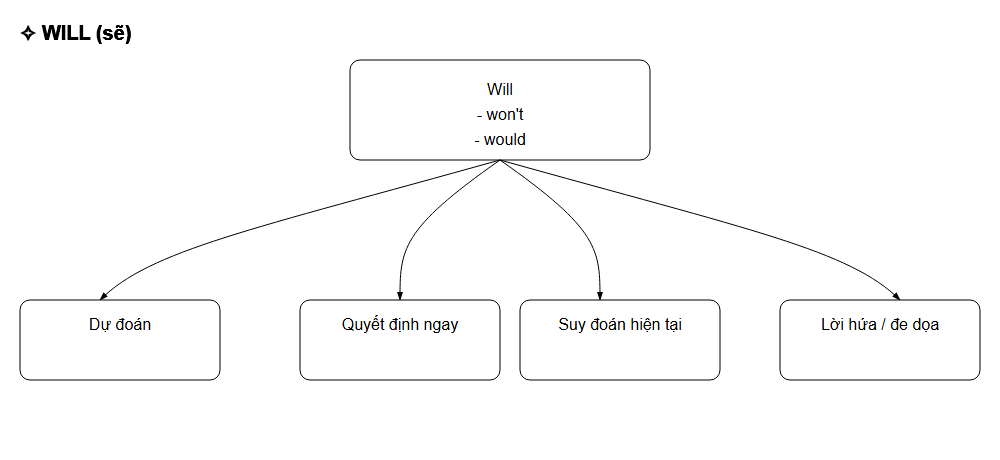
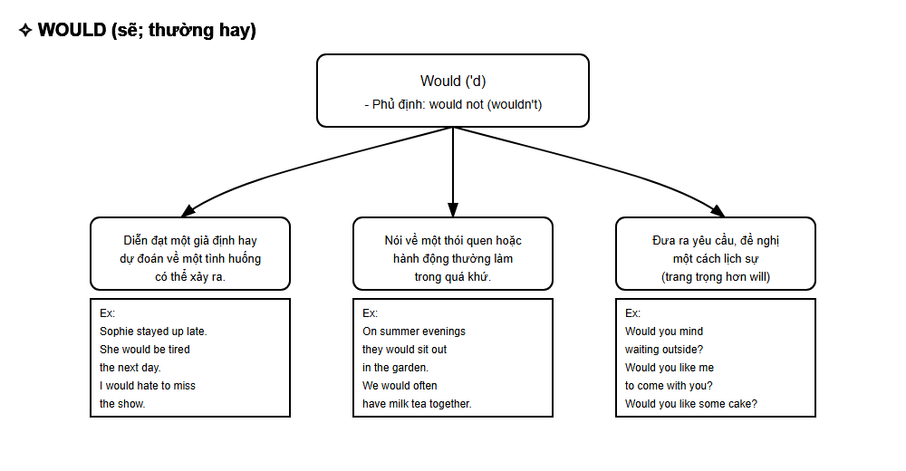
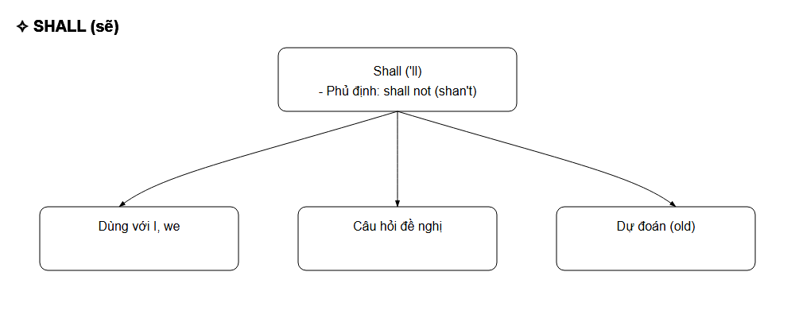
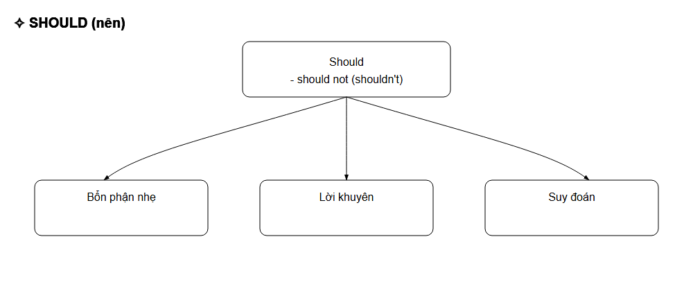
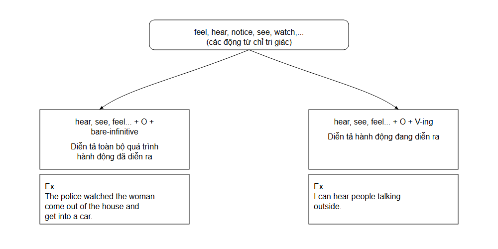
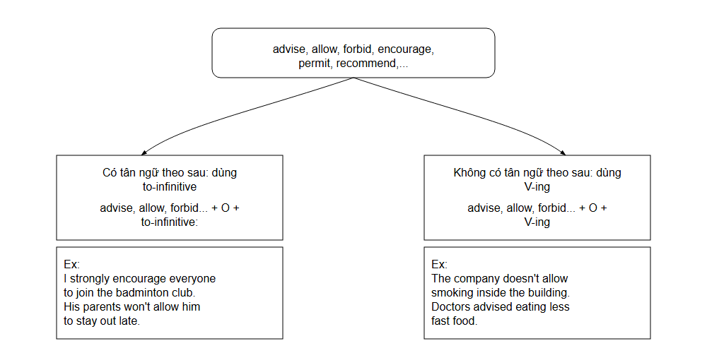

## ĐỘNG TỪ (VERBS)

#### Kiến thức cần nhớ:

Khái niệm cơ bản về chủ ngữ, tân ngữ, tính từ, trạng từ, giới từ.

### Mục tiêu học tập:

Hiểu được định nghĩa và cách phân biệt các loại động từ.

- Nắm được cách thành lập động từ.

- Nắm được cách dùng và vị trí của các động từ trong câu (động từ có quy tắc - động từ bất quy tắc, ngoại động từ - nội động từ).

Phân biệt được ý nghĩa và cách dùng trong trường hợp của các trợ động từ.

- Phân biệt được các hình thức của động từ thường và nắm được cách dùng.

- Hiểu được định nghĩa và cách dùng liên động từ.

### Động từ là gì? (What is a Verb?)

Động từ trong tiếng Anh (verbs) là những từ hoặc cụm từ dùng để diễn đạt một hành động (action) hoặc một trạng thái (state). Động từ là một trong những thành phần chính, bắt buộc phải có trong một câu tiếng Anh.

### Cách thành lập động từ

## 1. Thành lập động từ bằng cách thêm hậu tố (suffix) vào sau danh từ

<table border=1 style='margin: auto; word-wrap: break-word;'><tr><td style='text-align: center; word-wrap: break-word;'>Danh từ</td><td style='text-align: center; word-wrap: break-word;'>Hậu tố</td><td style='text-align: center; word-wrap: break-word;'>→</td><td style='text-align: center; word-wrap: break-word;'>Động từ</td></tr><tr><td style='text-align: center; word-wrap: break-word;'>strength, threat</td><td style='text-align: center; word-wrap: break-word;'>-en</td><td style='text-align: center; word-wrap: break-word;'>→</td><td style='text-align: center; word-wrap: break-word;'>strengthen, threaten</td></tr><tr><td style='text-align: center; word-wrap: break-word;'>beauty, purity</td><td style='text-align: center; word-wrap: break-word;'>-ify</td><td style='text-align: center; word-wrap: break-word;'>→</td><td style='text-align: center; word-wrap: break-word;'>beautify, purify</td></tr><tr><td style='text-align: center; word-wrap: break-word;'>apology, standard</td><td style='text-align: center; word-wrap: break-word;'>-ize/-ise</td><td style='text-align: center; word-wrap: break-word;'>→</td><td style='text-align: center; word-wrap: break-word;'>apologise, standardise</td></tr><tr><td style='text-align: center; word-wrap: break-word;'>origin, formula</td><td style='text-align: center; word-wrap: break-word;'>-ate</td><td style='text-align: center; word-wrap: break-word;'>→</td><td style='text-align: center; word-wrap: break-word;'>originate, formulate</td></tr></table>

### II. Thành lập động từ bằng cách thêm hậu tố (suffix) vào sau tính từ

<table border=1 style='margin: auto; word-wrap: break-word;'><tr><td style='text-align: center; word-wrap: break-word;'>Tính từ</td><td style='text-align: center; word-wrap: break-word;'>Hậu tố</td><td style='text-align: center; word-wrap: break-word;'>→</td><td style='text-align: center; word-wrap: break-word;'>Động từ</td></tr><tr><td style='text-align: center; word-wrap: break-word;'>soft, hard</td><td style='text-align: center; word-wrap: break-word;'>-en</td><td style='text-align: center; word-wrap: break-word;'>→</td><td style='text-align: center; word-wrap: break-word;'>soften, harden</td></tr><tr><td style='text-align: center; word-wrap: break-word;'>simple, clear</td><td style='text-align: center; word-wrap: break-word;'>-ify</td><td style='text-align: center; word-wrap: break-word;'>→</td><td style='text-align: center; word-wrap: break-word;'>simplify, clarify</td></tr><tr><td style='text-align: center; word-wrap: break-word;'>modern, industrial</td><td style='text-align: center; word-wrap: break-word;'>-ize/-ise</td><td style='text-align: center; word-wrap: break-word;'>→</td><td style='text-align: center; word-wrap: break-word;'>modernize, industrialise</td></tr></table>

Tiền tố -en còn có thể được thêm vào trước tính từ, danh từ hoặc một động từ khác.

Ex: danger → endanger

rich  $ \rightarrow $ enrich

courage → encourage

III. Thành lập động từ bằng cách thêm tiền tố (prefix) vào trước động từ

Một số tiền tố phổ biến trước động từ

<table border=1 style='margin: auto; word-wrap: break-word;'><tr><td style='text-align: center; word-wrap: break-word;'>Động từ</td><td style='text-align: center; word-wrap: break-word;'>Tiền tố</td><td style='text-align: center; word-wrap: break-word;'>→ Động từ</td></tr><tr><td style='text-align: center; word-wrap: break-word;'>lock, tie</td><td style='text-align: center; word-wrap: break-word;'>un-</td><td style='text-align: center; word-wrap: break-word;'>→ unlock, untie</td></tr><tr><td style='text-align: center; word-wrap: break-word;'>connect, approve</td><td style='text-align: center; word-wrap: break-word;'>dis-</td><td style='text-align: center; word-wrap: break-word;'>→ disconnect, disapprove</td></tr><tr><td style='text-align: center; word-wrap: break-word;'>activate, frost</td><td style='text-align: center; word-wrap: break-word;'>de-</td><td style='text-align: center; word-wrap: break-word;'>→ deactivate, defrost</td></tr><tr><td style='text-align: center; word-wrap: break-word;'>build, write</td><td style='text-align: center; word-wrap: break-word;'>re-</td><td style='text-align: center; word-wrap: break-word;'>→ rebuild, rewrite</td></tr><tr><td style='text-align: center; word-wrap: break-word;'>think, cook</td><td style='text-align: center; word-wrap: break-word;'>over-</td><td style='text-align: center; word-wrap: break-word;'>→ overthink, overwrite</td></tr><tr><td style='text-align: center; word-wrap: break-word;'>estimate, value</td><td style='text-align: center; word-wrap: break-word;'>under-</td><td style='text-align: center; word-wrap: break-word;'>→ underestimate, undervalue</td></tr><tr><td style='text-align: center; word-wrap: break-word;'>perform, shine</td><td style='text-align: center; word-wrap: break-word;'>out-</td><td style='text-align: center; word-wrap: break-word;'>→ outperform, outshine</td></tr><tr><td style='text-align: center; word-wrap: break-word;'>lead, pronounce</td><td style='text-align: center; word-wrap: break-word;'>mis-</td><td style='text-align: center; word-wrap: break-word;'>→ mislead, mispronounce</td></tr><tr><td style='text-align: center; word-wrap: break-word;'>operate, direct</td><td style='text-align: center; word-wrap: break-word;'>co-</td><td style='text-align: center; word-wrap: break-word;'>→ co-operate, co-direct</td></tr></table>

### Các loại động từ (Types of Verbs)

Động từ có thể được chia thành nhiều loại dựa trên các tiêu chí khác nhau.

I. Động từ có quy tắc (Regular Verbs) và động từ bất quy tắc (Irregular Verbs)

<table border=1 style='margin: auto; word-wrap: break-word;'><tr><td colspan="2">Loại động từ</td><td colspan="3">Ví dụ</td></tr><tr><td rowspan="4">Động từ có quy tắc (Regular Verbs)</td><td rowspan="4">Động từ có quy tắc là những động từ có dạng quá khứ đơn (past simple) và quá khứ phân từ (past participle) được thành lập bằng cách thêm -ed vào động từ nguyên mẫu (infinitive).</td><td style='text-align: center; word-wrap: break-word;'>Nguyên mẫu (Infinitive - V1)</td><td style='text-align: center; word-wrap: break-word;'>Quá khứ đơn (Past simple - V2)</td><td style='text-align: center; word-wrap: break-word;'>Quá khứ phân từ (Past participle - V3)</td></tr><tr><td style='text-align: center; word-wrap: break-word;'>listen</td><td style='text-align: center; word-wrap: break-word;'>listened</td><td style='text-align: center; word-wrap: break-word;'>listened</td></tr><tr><td style='text-align: center; word-wrap: break-word;'>study</td><td style='text-align: center; word-wrap: break-word;'>studied</td><td style='text-align: center; word-wrap: break-word;'>studied</td></tr><tr><td style='text-align: center; word-wrap: break-word;'>want</td><td style='text-align: center; word-wrap: break-word;'>wanted</td><td style='text-align: center; word-wrap: break-word;'>wanted</td></tr><tr><td rowspan="3">Động từ bất quy tắc (Irregular Verbs)</td><td rowspan="3">Động từ bất quy tắc là những động từ có dạng quá khứ đơn (simple past) và quá khứ phân từ (past participle) được thành lập không theo quy tắc nhất định nào.</td><td style='text-align: center; word-wrap: break-word;'>be</td><td style='text-align: center; word-wrap: break-word;'>was / were</td><td style='text-align: center; word-wrap: break-word;'>been</td></tr><tr><td style='text-align: center; word-wrap: break-word;'>eat</td><td style='text-align: center; word-wrap: break-word;'>ate</td><td style='text-align: center; word-wrap: break-word;'>eaten</td></tr><tr><td style='text-align: center; word-wrap: break-word;'>learn</td><td style='text-align: center; word-wrap: break-word;'>learnt</td><td style='text-align: center; word-wrap: break-word;'>learnt</td></tr></table>

### II. Ngoại động từ (Transitive Verbs) và nội động từ (Intransitive Verbs)

<table border=1 style='margin: auto; word-wrap: break-word;'><tr><td style='text-align: center; word-wrap: break-word;'>Loại động từ</td><td style='text-align: center; word-wrap: break-word;'>Ví dụ</td><td style='text-align: center; word-wrap: break-word;'></td></tr><tr><td rowspan="3">Ngoại động từ (Transitive verbs)</td><td rowspan="3">Ngoại động từ thường được dùng để diễn tả các hành động tác động trực tiếp lên người hoặc vật nào đó.→ Cần có danh từ hoặc đại từ theo sau ngoại động từ để làm tân ngữ (object)</td><td style='text-align: center; word-wrap: break-word;'>Lucy bought a cake. [NOT Lucy bought.]</td></tr><tr><td style='text-align: center; word-wrap: break-word;'>She met him. [NOT She met.]</td></tr><tr><td style='text-align: center; word-wrap: break-word;'>I want a new job. [NOT I want.]</td></tr><tr><td rowspan="2">Nội động từ (Intransitive verbs)</td><td rowspan="2">Nội động từ thường được dùng để diễn tả các hành động không cán một người hay vật nào nhận hành động đó.→ Có thể dùng một mình và không cần tân ngữ (object) theo sau</td><td style='text-align: center; word-wrap: break-word;'>The children laugh loudly. The sun rises in the East.</td></tr><tr><td style='text-align: center; word-wrap: break-word;'>Lily and John danced.</td></tr></table>

- Nhiều động từ vừa là ngoại động từ vừa là nội động từ, và nghĩa của chúng có thể thay đổi tùy theo ngữ cảnh.

Ex: He left. [Intransitive]

She sang in the contest. [Intransitive]

Chloe runs every morning. [Intransitive]

He left the gift on the table. [Transitive]

She sang the national anthem. [Transitive]

Chloe runs her own company. [Transitive]

- Trong nhiều trường hợp, ngoại động từ được chia thành hai loại: Ngoại động từ đơn (Monotransitive Verbs) và ngoại động từ kép (Ditransitive Verbs)

Ngoại động từ đơn là những ngoại động từ chỉ có một tân ngữ theo sau.

Ngoại động từ kép là những ngoại động từ có hai tân ngữ theo sau: tân ngữ trực tiếp (direct object) và tân ngữ gián tiếp (indirect object).

+ Tàn ngữ trực tiếp là đối tượng trực tiếp nhận tác động từ động từ.

+ Tân ngữ gián tiếp là đối tượng nhận định hướng từ hành động lên tân ngữ trực tiếp.

+ Tân ngữ gián tiếp luôn đi cùng tân ngữ trực tiếp và đứng trước tân ngữ trực tiếp.

Ex: He wrote Jane a song. [NOT ...wrote a song Jane.]

Kate gave her mom a banana. [NOT ...gavc-a-banana-her-mom.]

My friends sent me flowers. [NOT ...sent flowers me.]

Khi dùng giới từ to hoặc for trong câu: trong trường hợp này, tân ngữ trực tiếp thường dùng trước.

Ex: He wrote a song for Jane. [DO: a song; IO: Jane]

Kate gave a banana to her mom. [DO: a banana; IO: her mom]

My friends sent flowers to me. [DO: flowers; IO: me]

#### LƯU Ý:

- Đối với nội động từ, tân ngữ theo sau thường là tân ngữ của giới từ (object of a preposition) chứ không phải tân ngữ trực tiếp (direct object) của động từ.

Ex: She walked across the road. [NOT She walked the road.]

He sat in the chair. [NOT He sat the chair.]

Six people died in the accident. [NOT Six people died the accident.]

- Một số ngoại động từ có thể theo sau bởi một tân ngữ và một thành phần bổ sung ý nghĩa cho tân ngữ đó - gọi là bổ ngữ của tân ngữ (verb + object + object complement). Thành phần này có thể là tính từ, danh từ, hoặc một cụm từ đóng vai trò như danh từ.

Ex: The judge declared her innocent. [tính từ]

She considers the project a success. [danh từ]

We appointed him manager of the new department. [cụm danh từ]

### III. Trợ động từ (Auxiliary Verbs) và động từ thường (Ordinary Verbs)

## 1. Trợ động từ (Auxiliary Verbs)

Trợ động từ (be, have, do, can, may, must, ought, shall, will, need, dare, used) được chia thành hai nhóm:

<table border=1 style='margin: auto; word-wrap: break-word;'><tr><td style='text-align: center; word-wrap: break-word;'>Trợ động từ chính (principal auxiliary verbs)</td><td style='text-align: center; word-wrap: break-word;'>be, do, have</td></tr><tr><td style='text-align: center; word-wrap: break-word;'>Trợ động từ tình thái (modal auxiliary verbs)</td><td style='text-align: center; word-wrap: break-word;'>can, could, may, might, must, ought, had better, will, would, shall, should</td></tr></table>

a. Trợ động từ chính (principal auxiliary verbs): thường được đặt trước động từ để chỉ thì, thành lập câu hỏi hoặc câu phủ định, và nhấn mạnh các thông tin quan trọng trong câu.

<table border=1 style='margin: auto; word-wrap: break-word;'><tr><td colspan="2">Trợ động từ chính</td><td style='text-align: center; word-wrap: break-word;'>Ví dụ</td></tr><tr><td style='text-align: center; word-wrap: break-word;'>be</td><td style='text-align: center; word-wrap: break-word;'>- present tense: am, is, are - past tense: was, were</td><td style='text-align: center; word-wrap: break-word;'>Được dùng với động từ khác để chỉ thì tiếp diễn hoặc thể bị động.</td></tr><tr><td style='text-align: center; word-wrap: break-word;'>do</td><td style='text-align: center; word-wrap: break-word;'>- present tense: do, does - past tense: did</td><td style='text-align: center; word-wrap: break-word;'>Được dùng để thành lập câu phủ định, câu hỏi và nhấn mạnh thông tin trong câu.</td></tr><tr><td style='text-align: center; word-wrap: break-word;'>have</td><td style='text-align: center; word-wrap: break-word;'>- present tense: have, has - past tense: had</td><td style='text-align: center; word-wrap: break-word;'>Được dùng để chỉ thì hoàn thành.</td></tr></table>

- Trợ động từ chính (be, do, have) cũng được dùng như động từ thường (ordinary verbs) trong câu.

Ex: Chelsea is beautiful.

She did nothing wrong.

They have a beautiful house in New York.

Để phân biệt, ta cần tìm một động từ thứ hai trong câu để xác định xem chúng được sử dụng như một động từ thường hay là trợ động từ.

I did my homework. [“did” là động từ thường]

I did not go home. [“did” là trợ động từ]

b. Trợ động từ tình thái (modal auxiliary verbs): thường được đặt trước dạng nguyên thể không to (bare-infinitive) của động từ chính trong câu để diễn tả các tình thái khác nhau, như khả năng, lời khuyên, đề nghị, sự bắt buộc, sự chắc chắn, sự cho phép, v.v.

- Trợ động từ tình thái có các đặc điểm sau:

Không thêm -s ngay cả khi đi với ngôi thứ ba số ít.

Ex: He can cook. [NOT He-cans-cook.]

Đứng trước NOT trong câu phủ định và đứng trước chủ ngữ trong câu hỏi.

Ex: You should not come late.

He can't swim.

May I go out?

KHÔNG có hình thức to-infinitive, gerund, và participle (to-can, shoulding, maying, musted).

- Phía sau trợ động từ tình thái (trừ "ought") luôn là dạng nguyên thể không to của động từ (bare-infinitive).

Ex: I must work harder. [NOT I must to work...]

You should call him. [NOT You should to call...]

He can speak Chinese. [NOT He can to speak...]

♦ CAN và COULD (có thể)

<table border=1 style='margin: auto; word-wrap: break-word;'><tr><td style='text-align: center; word-wrap: break-word;'>CAN</td><td style='text-align: center; word-wrap: break-word;'>COULD</td></tr><tr><td style='text-align: center; word-wrap: break-word;'>- Phủ định: cannot (can&#x27;t) - Dạng quá khứ: could</td><td style='text-align: center; word-wrap: break-word;'>- Phủ định: could not (couldn&#x27;t) - Could vừa là dạng quá khứ của can vừa là trợ động từ tình thái.</td></tr><tr><td colspan="2">CÁCH DÙNG</td></tr><tr><td style='text-align: center; word-wrap: break-word;'>- Diễn đạt khả năng (ở hiện tại hoặc tương lai): sự kiện gì đó có thể xảy ra, hoặc ai đó có khả năng làm việc gì. Ex: Tiffany can speak French fluently. I&#x27;m afraid Mrs. Smith can&#x27;t see you now - she&#x27;s busy. It can be quite cold here in winter.</td><td style='text-align: center; word-wrap: break-word;'>- Khi là dạng quá khứ của can, could được dùng để diễn đạt khả năng ở quá khứ. Ex: I could speak French when I was a kid. In those days you could buy a box of cigars for a dollar. By the time she was six, she could read Latin.</td></tr><tr><td style='text-align: center; word-wrap: break-word;'>- Can được dùng để diễn đạt sự xin phép và cho phép. - Can&#x27;t được dùng để từ chối lời xin phép. Ex: Can I smoke here? - Yes, of course you can. Can I use your computer? - No, I&#x27;m afraid you can&#x27;t.</td><td style='text-align: center; word-wrap: break-word;'>- Khi là trợ động từ tình thái, could được dùng để diễn tả sự xin phép (mang tính lễ phép và trang trọng hơn can) - Could/ Couldn&#x27;t KHÔNG được dùng để cho phép/ từ chối lời xin phép. Ex: Could I borrow your book? - Yes, you can./ No, I&#x27;m afraid you can&#x27;t.</td></tr><tr><td style='text-align: center; word-wrap: break-word;'>- Diễn tả lời yêu cầu, để nghị hoặc gọi ý. Ex: Can I have a cup of coffee, please? We can eat in a restaurant if you like.</td><td style='text-align: center; word-wrap: break-word;'>- Diễn tả lời yêu cầu lịch sự (trang trọng hơn so với can) hoặc đưa ra lời để nghị, gọi ý. Ex: Could you tell me the time, please? We could go on a picnic tomorrow.</td></tr><tr><td style='text-align: center; word-wrap: break-word;'>- Can&#x27;t được dùng để diễn tả điều gì đó chắc chắn không thể xảy ra ở hiện tại. Ex: That can&#x27;t be Emily. She&#x27;s in Paris.</td><td style='text-align: center; word-wrap: break-word;'>- Điều gì đó có thể xảy ra ở hiện tại hoặc tương lai, nhưng không chắc chắn. Ex: It could be weeks before we get a reply.</td></tr></table>

<table border=1 style='margin: auto; word-wrap: break-word;'><tr><td style='text-align: center; word-wrap: break-word;'>- Can và could được dùng với các động từ chỉ suy nghĩ (decide, believe, understand, remember,...) hoặc giác quan (see, smell, feel, hear, taste,...) để diễn tả sự việc ở một thời điểm cụ thể.</td></tr><tr><td style='text-align: center; word-wrap: break-word;'>Ex: She could feel the warmth of the sun on her face. He can&#x27;t remember where he put the tickets. Can you smell something burning?</td></tr><tr><td style='text-align: center; word-wrap: break-word;'>- Trong một số trường hợp, be able to có thể được dùng thay cho can và could để nói về khả năng. Ex: I am able to/can speak French fluently. She will be able to come to your birthday party. Amanda was able to/could speak French when she was a kid.</td></tr></table>

#### MAY và MIGHT (có thể; có lẽ)

<table border=1 style='margin: auto; word-wrap: break-word;'><tr><td style='text-align: center; word-wrap: break-word;'>MAY</td><td style='text-align: center; word-wrap: break-word;'>MIGHT</td></tr><tr><td style='text-align: center; word-wrap: break-word;'>- Phủ định: may not (ít dùng mayn't).</td><td style='text-align: center; word-wrap: break-word;'>- Phủ định: might not (mightn't).</td></tr><tr><td colspan="2">CÁCH DÙNG</td></tr><tr><td colspan="2">- May và might được dùng để diễn tả một điều có thể là thật hoặc có khả năng xảy ra ở hiện tại hoặc tương lai nhưng bản thân không chắc chắn. Trong trường hợp này, might không phải dạng quá khứ của may.</td></tr><tr><td colspan="2">Ex: Jenna may/might get there in time, but I can't be sure.</td></tr><tr><td colspan="2">Some chemicals may/might cause environmental damage.</td></tr><tr><td colspan="2">- Mức độ khẳng định của might ít hơn may.</td></tr><tr><td colspan="2">Ex: Cindy may go to Prague next week. [50%] → Cindy might go to Prague next week. [30%]</td></tr><tr><td colspan="2">May/might + be + V-ing: diễn đạt một sự kiện có thể đang diễn ra ở hiện tại hoặc tương lai.</td></tr><tr><td colspan="2">Ex: Trisha is late. She may/might be having breakfast.</td></tr><tr><td colspan="2">- May và might được dùng để xin phép (trang trọng hơn can và could).</td></tr><tr><td colspan="2">- May được dùng để thể hiện sự cho phép (trang trọng) và may not được dùng để từ chối lời xin phép.</td></tr><tr><td colspan="2">Ex: May I use your phone? ~ Yes, you may./ No, you may not.</td></tr><tr><td colspan="2">I wonder if I might go out. [cách nói trang trọng nhưng tự nhiên hơn "Might I go out?"]</td></tr><tr><td style='text-align: center; word-wrap: break-word;'>- May được dùng trong những lời cầu chúc trang trọng.</td><td style='text-align: center; word-wrap: break-word;'>- KHÔNG dùng might trong những lời cầu chúc.</td></tr><tr><td style='text-align: center; word-wrap: break-word;'>$ \underline{\text{Ex}} $: May all your new year wishes come true.</td><td style='text-align: center; word-wrap: break-word;'></td></tr><tr><td style='text-align: center; word-wrap: break-word;'>May you and your family have a wonderful new year.</td><td style='text-align: center; word-wrap: break-word;'></td></tr></table>

#### MUST và HAVE TO (phải)

<table border=1 style='margin: auto; word-wrap: break-word;'><tr><td style='text-align: center; word-wrap: break-word;'>MUST</td><td style='text-align: center; word-wrap: break-word;'>HAVE TO</td></tr><tr><td style='text-align: center; word-wrap: break-word;'>- Phủ định: must not (mustn't)</td><td style='text-align: center; word-wrap: break-word;'>- Phủ định: trợ động từ do + not + have to</td></tr><tr><td colspan="2">CÁCH DÙNG VÀ PHÂN BIỆT</td></tr><tr><td colspan="2">- Must và have to đều được dùng để diễn tả sự cần thiết hoặc bắt buộc ở hiện tại và tương lai.Ex: I must go now./ I have to go now.</td></tr><tr><td style='text-align: center; word-wrap: break-word;'>- Must được dùng để diễn đạt sự bắt buộc đến từ quan điểm cá nhân của người nói.- Must được dùng trong văn viết khi viết các quy định và chỉ dẫn.Ex: I must remember to get a present for Jimmy. [ý kiến cá nhân]Seat belts must be worn. [chỉ dẫn]</td><td style='text-align: center; word-wrap: break-word;'>- Have to được dùng để diễn đạt sự bắt buộc từ điều kiện bên ngoài (pháp luật, quy định, sự thật, tình huống,...) thay vì ý kiến người nói.Ex: I have to wear a tie for school. [quy định]We have to work from 8.30 to 5.30 every day. [quy định]</td></tr><tr><td style='text-align: center; word-wrap: break-word;'>- Must not/mustn't được dùng để nói về một điều không được phép làm, hoặc yêu cầu ai không được làm điều gì. → sự cấm đoán.Ex: You mustn't go into the forest. It's dangerous.My parents aren't home. I mustn't forget my keys.In the non-smoking area: You mustn't smoke.</td><td style='text-align: center; word-wrap: break-word;'>- Do not have to/don't have to (= don't need to) được dùng để chỉ một việc không cần thiết phải làm.Ex: You don't have to go into the forest. My parents are home. I don't have to bring my keys.In the smoking area: You don't have to smoke, but you can if you want to.</td></tr><tr><td style='text-align: center; word-wrap: break-word;'>- Must được dùng để nói về một suy luận hợp lí, hoặc một điều gì đó có thể là thật. Ex: You must be hungry after all that walking. Jack's been driving all day - he must be tired. - Must được dùng để đưa lời khuyên hoặc yêu cầu (ở mức nhấn mạnh) vì bạn cho rằng đó là một ý hay/ một việc nên làm. Ex: We must get together soon for lunch.</td><td style='text-align: center; word-wrap: break-word;'>- Have to được dùng thay cho must trong các trường hợp không thể dùng must: thì tương lai, thì tiếp diễn, thì quá khứ, thì hiện tại hoàn thành, danh động từ (gerund)... Ex: She went to the party yesterday, but she had to leave early. [NOT she must...] If you earn more than £5,000, you will have to pay tax. [NOT-you will must pay...]</td></tr></table>

<h3>✧ WILL (sẽ)</h3>

##### LƯU Ý

Dùng "I will" khi đưa ra lời đề nghị, dùng "you will" khi đưa ra mệnh lệnh cho người khác.

Ex: I will pick you up at five.

You will pick me up at five.

#### LƯU Ý:

Would còn được dùng trong các trường hợp sau.

<table border="1" style="margin: auto; word-wrap: break-word;"><tr><td style="text-align: center; word-wrap: break-word;">Cáu trúc</td><td style="text-align: center; word-wrap: break-word;">Ví dụ</td></tr><tr><td style="text-align: center; word-wrap: break-word;">Would like/ love/ prefer... + to-infinitive: diễn tả mong muốn một cách lịch sự (trang trọng hơn so với want).</td><td style="text-align: center; word-wrap: break-word;">My parents would love to meet you. I'd like to get a return ticket for tomorrow. I'd prefer to learn English than Korean.</td></tr><tr><td style="text-align: center; word-wrap: break-word;">Would you like + to-infinitive/ noun...?: đưa ra lời đề nghị hoặc lời mời lịch sự.</td><td style="text-align: center; word-wrap: break-word;">Would you like to listen to that again? Would you like a biscuit with your coffee?</td></tr><tr><td style="text-align: center; word-wrap: break-word;">Would you...(please)? hoặc Would you mind + verb-ing...?: đưa ra yêu cầu hoặc đề nghị một cách lịch sự.</td><td style="text-align: center; word-wrap: break-word;">Would you mind leaving us alone for a few minutes? Would you open the door for me, please?</td></tr><tr><td style="text-align: center; word-wrap: break-word;">Would rather = would prefer: thích (cái gì đó) hơn - would rather + bare-infinitive - would prefer + to-infinitive</td><td rowspan="2">I'd rather come with you. I'd rather have a beer. Helen would prefer to have a quiet night in front of the TV. I'd rather you didn't go out alone. I'd rather you called me instead of sending a text message.</td></tr><tr><td style="text-align: center; word-wrap: break-word;">Would rather + Object + V₂ (past tense): muốn ai đó làm gì</td></tr></table>

<h3>✧ SHALL (sẽ)</h3>

#### ♦ OUGHT (nên)

- Phủ định: ought not (oughtn't).

- Ought là trợ động từ tình thái duy nhất có động từ nguyên mẫu có to (to-infinitive) theo sau.

- Ought được dùng tương tự như should.

<table border=1 style='margin: auto; word-wrap: break-word;'><tr><td colspan="3">SO SÁNH CÁCH DÙNG CỦA OUGHT VÀ SHOULD</td></tr><tr><td colspan="2">OUGHT</td><td style='text-align: center; word-wrap: break-word;'>SHOULD</td></tr><tr><td style='text-align: center; word-wrap: break-word;'>Chỉ sự bắt buộc hoặc bổn phận (mức độ nhẹ hơn so với must)</td><td style='text-align: center; word-wrap: break-word;'>Ex: You really ought to quit smoking.</td><td style='text-align: center; word-wrap: break-word;'>Diễn tả bổn phận hoặc nói về một điều đúng mà ai đó nên làm (mức độ nhẹ hơn so với must)</td></tr><tr><td style='text-align: center; word-wrap: break-word;'>Đưa ra lời khuyên hoặc kiến nghị.</td><td style='text-align: center; word-wrap: break-word;'>Ex: This is delicious. You ought to try some.</td><td style='text-align: center; word-wrap: break-word;'>Dùng để xin hoặc đưa ra ý kiến, lời khuyên.</td></tr><tr><td style='text-align: center; word-wrap: break-word;'>Dự đoán điều gì đó có thể xảy ra (vì điều đó hợp lí hoặc là lẽ thường)</td><td style='text-align: center; word-wrap: break-word;'>Ex: Children ought to be able to read by the age of 7.</td><td style='text-align: center; word-wrap: break-word;'>Nói về một suy đoán người nói tin là đúng hoặc sẽ xảy ra.</td></tr></table>

♦ HAD BETTER (nên; tốt hơn hết là)

- Viết tắt: 'd better

- Phủ định: had better not ('d better not)

- Nghi vấn: Had + Subject + better

- Cách dùng: Được dùng để đưa ra lời khuyên hoặc cảnh báo rằng ai đó nên hoặc không nên làm việc gì đó.

 $ \underline{Ex} $: You'd better go to the doctor about your cough.

You had better keep your mouth shut about this.

Had I better go now?

ĐỘNG TỪ TÌNH THÁI Ở THỂ HOÀN THÀNH (PERFECT MODAL VERBS)

<table border=1 style='margin: auto; word-wrap: break-word;'><tr><td style='text-align: center; word-wrap: break-word;'></td><td style='text-align: center; word-wrap: break-word;'>Cách dùng</td><td style='text-align: center; word-wrap: break-word;'>Ví dụ</td></tr><tr><td style='text-align: center; word-wrap: break-word;'>may/might/could have + past participle</td><td style='text-align: center; word-wrap: break-word;'>Dùng để diễn đạt: - Điều gì đó có thể đã xảy ra hoặc có thể đúng trong quá khứ. - Điều gì đó có thể xảy ra nhưng đã không xảy ra.</td><td style='text-align: center; word-wrap: break-word;'>He may have missed his train. It was terrifying. We might have been lost in the woods. He could have left, but he chose to stay.</td></tr><tr><td style='text-align: center; word-wrap: break-word;'>may not/might/n&#x27;t have + past participle</td><td style='text-align: center; word-wrap: break-word;'>Diễn đạt một điều có thể đã không xảy ra trong quá khứ.</td><td style='text-align: center; word-wrap: break-word;'>You spoke too fast! I think he may not/might/n&#x27;t have understood what you said.</td></tr><tr><td style='text-align: center; word-wrap: break-word;'>can&#x27;t/couldn&#x27;t have + past participle</td><td style='text-align: center; word-wrap: break-word;'>Diễn đạt điều gì đó CHẤC CHẤN KHÔNG THẾ xảy ra trong quá khứ.</td><td style='text-align: center; word-wrap: break-word;'>You couldn&#x27;t have left it at school. You didn&#x27;t go to school yesterday.</td></tr><tr><td style='text-align: center; word-wrap: break-word;'>must have + past participle</td><td style='text-align: center; word-wrap: break-word;'>Diễn đạt điều gì đó gần như chắc chắn đã xảy ra trong quá khứ.</td><td style='text-align: center; word-wrap: break-word;'>I&#x27;m sorry, she&#x27;s not here. She must have left already.</td></tr><tr><td style='text-align: center; word-wrap: break-word;'>should have + past participle</td><td rowspan="2">Diễn đạt một điều lẽ ra nên hoặc phải xảy ra, nhưng lại không xảy ra trong quá khứ.</td><td style='text-align: center; word-wrap: break-word;'>It was an easy test and he should have passed, but he didn&#x27;t.</td></tr><tr><td style='text-align: center; word-wrap: break-word;'>ought to have + past participle</td><td style='text-align: center; word-wrap: break-word;'>They ought to have/ should have apologised to her.</td></tr><tr><td style='text-align: center; word-wrap: break-word;'>shouldn&#x27;t have + past participle</td><td rowspan="2">Diễn đạt một điều lẽ ra không nên xảy ra, nhưng đã xảy ra trong quá khứ.</td><td style='text-align: center; word-wrap: break-word;'>You shouldn&#x27;t have said anything to her. She&#x27;s unreliable.</td></tr><tr><td style='text-align: center; word-wrap: break-word;'>ought not to have + past participle</td><td style='text-align: center; word-wrap: break-word;'>He oughtn&#x27;t to have shouted at us</td></tr></table>

Động từ bán khuyết thiếu (semi modal verbs): là những động từ vừa được sử dụng như động từ thường (ordinary verbs) vừa được sử dụng như trợ động từ tình thái (modal auxiliary verbs).

♢ NEED: Dùng để diễn tả sự cần thiết, nhu cầu, sự bắt buộc phải làm gì đó.

<table border=1 style='margin: auto; word-wrap: break-word;'><tr><td style='text-align: center; word-wrap: break-word;'>Cách dùng</td><td style='text-align: center; word-wrap: break-word;'>Công thức</td><td style='text-align: center; word-wrap: break-word;'>Ví dụ</td></tr><tr><td rowspan="2">Dùng như động từ thường</td><td style='text-align: center; word-wrap: break-word;'>Need + to-infinitive/ Noun: cần làm việc gì/ cần một thứ gì</td><td style='text-align: center; word-wrap: break-word;'>I need to go to the toilet. She needs a nice hot bowl of soup. You don&#x27;t really need a car.</td></tr><tr><td style='text-align: center; word-wrap: break-word;'>Need + V-ing: cần được làm gì đó (nghĩa bị động)</td><td style='text-align: center; word-wrap: break-word;'>This shirt needs washing. The room needed painting.</td></tr><tr><td rowspan="3">Dùng như trợ động từ tình thái (chủ yếu trong câu phủ định, câu hỏi, sau if và whether hoặc với các từ mang nghĩa phủ định như hardly, never, only,... )</td><td style='text-align: center; word-wrap: break-word;'>Need + V₀</td><td style='text-align: center; word-wrap: break-word;'>If she wants anything, she need only ask. Need we write this down? Not a thing need change on this page.</td></tr><tr><td style='text-align: center; word-wrap: break-word;'>Needn&#x27;t have + past participle: diễn đạt một điều đã được thực hiện trong quá khứ, nhưng không cần thiết.</td><td style='text-align: center; word-wrap: break-word;'>You needn&#x27;t have spent all that money. We needn&#x27;t have ordered so much food.</td></tr><tr><td style='text-align: center; word-wrap: break-word;'>Will need + to-infinitive: đưa ra lời khuyên cho tương lai hoặc thể hiện sự bắt buộc phải làm việc gì đó trong tương lai</td><td style='text-align: center; word-wrap: break-word;'>You will need to wear a formal outfit tomorrow.</td></tr></table>

##### DARE (dám)

<table border=1 style='margin: auto; word-wrap: break-word;'><tr><td style='text-align: center; word-wrap: break-word;'>Cách dùng</td><td style='text-align: center; word-wrap: break-word;'>Công thức</td><td style='text-align: center; word-wrap: break-word;'>Ví dụ</td></tr><tr><td style='text-align: center; word-wrap: break-word;'>Dùng như động từ thường</td><td style='text-align: center; word-wrap: break-word;'>Dare + to-infinitive</td><td style='text-align: center; word-wrap: break-word;'>Do you dare to tell him the news? He didn&#x27;t dare to say what he thought.</td></tr><tr><td rowspan="2">Dùng như trợ động từ tình thái (chủ yếu trong câu phủ định, câu hỏi, sau if và whether hoặc với các từ mang nghĩa phủ định như hardly, never, only, no one,...)</td><td style='text-align: center; word-wrap: break-word;'>Dare + V₀</td><td style='text-align: center; word-wrap: break-word;'>Dare you tell him the news? I daren&#x27;t go home. She hardly dared hope that he was alive.</td></tr><tr><td style='text-align: center; word-wrap: break-word;'>Dare + object + to-infinitive: dùng để thách đố ai đó</td><td style='text-align: center; word-wrap: break-word;'>They dared Edgar to steal a bottle of whiskey.</td></tr></table>

✓ USED TO: dùng để diễn tả một thói quen trong quá khứ mà nay không còn nữa.

Dùng như động từ thường:

- Used to + V₀: đã từng

(Dùng "did" trong câu hỏi và câu phủ định)

Ex: She used to work for a large insurance company.

When we were younger, we used to go sailing on the lake in summer.

I didn't use to like him much when we were at school.

Did you use to have long hair?

#### LƯU Ý:

- Used to không có hình thức ở thì hiện tại. Để nói về thói quen ở hiện tại, ta dùng thì hiện tại đơn.
Ex: Hannah used to love dancing, but she doesn't do it any more
I used to live in London, but now I live in Warsaw.
- Trong câu hỏi đuôi (tag-questions), used to không được xem là trợ động từ tình thái. Thay vào đó, ta sử dụng trợ động từ did.
Ex: He used to smoke, didn't he? (NOT He used to smoke, usedn't he?)
Lisa used to visit us more often, didn't she? (NOT Lisa used to visit us more often, usedn't she?)

- Dùng như trợ động từ tình thái: cách này thường được sử dụng trong lối văn trang trọng, nhưng ÍT PHỔ BIẾN, với hình thức nghi vấn là: Used + S + to-infinitive?

Ex: Used he to sing in the choir before his retirement?

They used not to believe in ghosts.

Tuy nhiên, trong tiếng Anh hiện đại, cấu trúc nghi vấn Did + S + use to + to-infinitive vẫn PHỔ BIẾN hơn.

Ex: Did he use to sing in the choir before his retirement?

They didn't use to believe in ghosts.

Cấu trúc Be used to + V-ing/ noun: đã quen với việc gì đó và không cảm thấy nó khó khăn

Ex: I do the dishes every day, so I'm used to it.

We were used to a cold climate, so the weather didn't bother us.

• Get used to + verb-ing/ noun: làm quen, trở nên quen với

Ex: I just can't get used to waking up early.

It took me a while to get used to my new laptop.

2. Động từ thường (Ordinary Verbs)

- Động từ thường có các đặc điểm sau:

- Thêm -s/-es khi đi với ngôi thứ ba số ít.

Ex: He phones me every day.

My favourite TV show starts at 8 o'clock.

- Dùng trợ động từ do để thành lập câu phủ định và câu hỏi.

 $ \underline{Ex} $: Do you read a lot of books?

Does he speak English?

- Động từ thường có ba hình thức: nguyên mẫu (infinitive), danh động từ (gerund) và phân từ (participle).

a. Hình thức nguyên mẫu (infinitive) bao gồm: nguyên mẫu có to (to-infinitive) và nguyên mẫu không to (infinitive without to/ bare-infinitive).

Động từ nguyên mẫu có to (to-infinitive):

<table border=1 style='margin: auto; word-wrap: break-word;'><tr><td colspan="2">Cách dùng</td><td style='text-align: center; word-wrap: break-word;'>Ví dụ</td><td colspan="2">Lưu ý</td></tr><tr><td style='text-align: center; word-wrap: break-word;'>Chủ ngữ của câu (subject of a sentence)</td><td style='text-align: center; word-wrap: break-word;'>Đứng đầu câu làm chủ ngữ (hoặc dùng cấu trúc với chủ ngữ giả)</td><td style='text-align: center; word-wrap: break-word;'>To learn a foreign language is hard. It is hard to learn a foreign language</td><td colspan="2"></td></tr><tr><td style='text-align: center; word-wrap: break-word;'>Bổ ngữ cho chủ ngữ (subject complement)</td><td style='text-align: center; word-wrap: break-word;'>Dùng sau be</td><td style='text-align: center; word-wrap: break-word;'>The only solution is to reduce our use of water. His advice was to give up smoking.</td><td colspan="2"></td></tr><tr><td rowspan="2">Tân ngữ của động từ (object of a verb)</td><td rowspan="2">Dùng như một tân ngữ trực tiếp sau các động từ</td><td rowspan="2">Maria planned to be a teacher. Justin's hoping to study law at Harvard. Liam decided to ignore the warning</td><td colspan="2">Một số động từ theo sau bởi to-Infinitive</td></tr><tr><td style='text-align: center; word-wrap: break-word;'>agree arrange ask bear begin care choose come continue decide demand expect fail fear forget hate help hesitate hope intend</td><td style='text-align: center; word-wrap: break-word;'>learn like love manage need offer plan prefer pretend promise refuse regret seem start swear tend threaten try want wish</td></tr><tr><td rowspan="5">Tân ngữ của tính từ (object of an adjective)</td><td rowspan="2">Dùng sau một số tính từ diễn tả phân ứng hoặc cảm xúc của con người, (cùng nhiều tính từ thông dụng khác)</td><td rowspan="2">Kim was careful to avoid similar problems. We are happy to announce the news.</td><td colspan="2">Một số tính từ theo sau bởi to-infinitive</td></tr><tr><td rowspan="3">afraid amused annoyed anxious ashamed boring careful certain crazy curious dangerous delighted difficult eager easy</td><td rowspan="3">horrified impatient interested keen lucky pleased possible prepared proud quick ready relieved safe scared slow sorry surprised thankful usual unless wise wonderful worthy wrong</td></tr><tr><td style='text-align: center; word-wrap: break-word;'>* Adj + for + O + to-infinitive</td><td style='text-align: center; word-wrap: break-word;'>It's (im)possible to get there by train.</td></tr><tr><td rowspan="2">* Adj + of + O + to-infinitive: dược dùng vól những tính từ diễn tả cách cư xử (brave, careful, good, generous, intelligent, kind, nice, polite, silly, wrong,...)</td><td rowspan="2">It's easy for you to win the game. It was really kind of you to help me. It was brave of you to reveal the truth.</td></tr><tr><td style='text-align: center; word-wrap: break-word;'>free fortunate furious frightened glad good grateful hard happy</td><td style='text-align: center; word-wrap: break-word;'>worried</td></tr><tr><td rowspan="2">Bổ ngữ cho danh từ hoặc đại từ (complement of a noun/ pronoun)</td><td rowspan="2">Dùng sau một danh từ hoặc đại từ để bổ nghĩa cho danh từ hoặc đại từ đó:</td><td style='text-align: center; word-wrap: break-word;'>His parents allowed him to travel alone.</td><td style='text-align: center; word-wrap: break-word;'>Một số động từ theo sau bởi object + to-infinitive</td><td style='text-align: center; word-wrap: break-word;'></td></tr><tr><td style='text-align: center; word-wrap: break-word;'>Michael got his brother to help him with his homework.</td><td style='text-align: center; word-wrap: break-word;'>advise allow ask assume bear beg believe cause challenge command compel consider enable encourage expect find forbid force get hate help instruct intend invite</td><td style='text-align: center; word-wrap: break-word;'>know lead leave like love mean need observe order permit persuade prefer remind request suspect teach tell think trust urge understand want warn wish</td></tr><tr><td style='text-align: center; word-wrap: break-word;'>Trong lời nói gián tiếp (indirect speech)</td><td style='text-align: center; word-wrap: break-word;'>Dùng sau các từ nghi vấn như what, who, which, when, where, how (nhưng KHÔNG dùng sau why).</td><td style='text-align: center; word-wrap: break-word;'>Jessie couldn't decide what to wear to the business meeting. I want to know who to contact about the missing shipment.</td><td style='text-align: center; word-wrap: break-word;'>He's unsure which movie to watch this weekend.</td><td style='text-align: center; word-wrap: break-word;'>know</td></tr></table>

Động từ nguyên mẫu không to (bare-infinitive)
 

<table border=1 style='margin: auto; word-wrap: break-word;'><tr><td style='text-align: center; word-wrap: break-word;'>Cách dùng</td><td style='text-align: center; word-wrap: break-word;'>Ví dụ</td></tr><tr><td style='text-align: center; word-wrap: break-word;'>Dùng sau các trợ động từ tình thái can, could, may, might, should, shall, must, will, would,...</td><td style='text-align: center; word-wrap: break-word;'>You must tell me the truth. Julie can speak French.</td></tr><tr><td style='text-align: center; word-wrap: break-word;'>Dùng sau các động từ have, let, make, hear, feel, see, watch, notice + object</td><td style='text-align: center; word-wrap: break-word;'>She should go to the hospital. Minh is a funny guy. He always makes me laugh. I saw him put your car keys in his pocket. Let me have a look at that picture.</td></tr><tr><td style='text-align: center; word-wrap: break-word;'>Lưu ý: - Khi dùng những động từ trên (trừ let) ở thể bị động, theo sau nó là to-infinitive. Ex: He was seen to put your car keys in his pocket. - Let không được dùng ở thể bị động → thay bằng allow/permit. Ex: I was allowed to have a look at that picture. - Động từ help có thể đi cùng với bare-infinitive hoặc to-infinitive. Ex: Can you come and help me (to) lift this box? Sau các cụm động từ had better, would better, would rather, had sooner,...</td><td style='text-align: center; word-wrap: break-word;'>We had better leave now. I would rather have dinner at home. Why waste time going to the store when you can buy it online? Why not make a special card for your mother?</td></tr></table>

b. Danh động từ (gerund): là hình thức động từ được thêm -ing và được dùng như một danh từ.

<table border=1 style='margin: auto; word-wrap: break-word;'><tr><td style='text-align: center; word-wrap: break-word;'>Cách dùng</td><td style='text-align: center; word-wrap: break-word;'>Ví dụ</td><td style='text-align: center; word-wrap: break-word;'>Lưu ý</td><td style='text-align: center; word-wrap: break-word;'></td></tr><tr><td style='text-align: center; word-wrap: break-word;'>Chủ ngữ của câu (subject of a sentence)</td><td style='text-align: center; word-wrap: break-word;'>Cycling is fun. Swimming is a good way to stay healthy.</td><td style='text-align: center; word-wrap: break-word;'></td><td style='text-align: center; word-wrap: break-word;'></td></tr><tr><td style='text-align: center; word-wrap: break-word;'>Bổ ngữ của động từ (complement of a verb)</td><td style='text-align: center; word-wrap: break-word;'>Her dreams is travelling around the world.</td><td style='text-align: center; word-wrap: break-word;'></td><td style='text-align: center; word-wrap: break-word;'></td></tr><tr><td rowspan="3">Tân ngữ của động từ (object of a verb)</td><td rowspan="2">Dùng như một tân ngữ trực tiếp (direct object) sau động từ</td><td style='text-align: center; word-wrap: break-word;'>They postponed going to Milan because the kids were sick. We are considering selling the old car. Jane enjoys playing chess.</td><td style='text-align: center; word-wrap: break-word;'></td></tr><tr><td style='text-align: center; word-wrap: break-word;'>Một số động từ theo sau bởi gerund admit appreciate avoid consider deny discuss dislike endure enjoy escape excuse fancy</td><td style='text-align: center; word-wrap: break-word;'>keep mention mind miss postpone practise recall recollect regret resist risk save spend stop suggest involve</td></tr><tr><td style='text-align: center; word-wrap: break-word;'>It&#x27;s worth remembering that regular exercise can improve sleep quality. I can&#x27;t help laughing at his joke.</td><td style='text-align: center; word-wrap: break-word;'>Một số cụm động từ theo sau bởi gerund - It&#x27;s worth... - There&#x27;s no point feel like</td><td style='text-align: center; word-wrap: break-word;'></td></tr></table>

<table border=1 style='margin: auto; word-wrap: break-word;'><tr><td rowspan="2">Bổ ngữ của tân ngữ (object complement)</td><td rowspan="2">* V+O+gerund (-Ing form)</td><td rowspan="2">Wendy imagined herself sitting in a beautiful garden. My dad watched the kids playing in the yard.</td><td colspan="2">Một số cụm động từ theo sau bởi object + gerund</td></tr><tr><td style='text-align: center; word-wrap: break-word;'>catch discover dislike feel find hear imagine keep mind</td><td style='text-align: center; word-wrap: break-word;'>notice prevent remember risk see spend stop watch</td></tr><tr><td style='text-align: center; word-wrap: break-word;'>Dùng sau các liên từ after, before, though, although, since, when, while, ...</td><td style='text-align: center; word-wrap: break-word;'></td><td style='text-align: center; word-wrap: break-word;'>After leaving him a message, she left. Though feeling tired, she pushed herself to finish the marathon.</td><td colspan="2"></td></tr><tr><td style='text-align: center; word-wrap: break-word;'>Dùng sau các động từ need, deserve, require với nghĩa bị động</td><td style='text-align: center; word-wrap: break-word;'></td><td style='text-align: center; word-wrap: break-word;'>The room needs painting. This shirt doesn&#x27;t require washing.</td><td colspan="2"></td></tr><tr><td rowspan="2">Dùng sau tất cả các giới từ</td><td rowspan="2">* V + prep. + -Ing form * V + O + prep. + -Ing form * Adj + prep. + -Ing form (xem ví dụ về một số động từ và tính từ của 3 mục này ở bên dưới )</td><td rowspan="2">I look forward to hearing from you. We apologise for coming late. He is interested in learning new languages.</td><td colspan="2"></td></tr><tr><td style='text-align: center; word-wrap: break-word;'></td><td style='text-align: center; word-wrap: break-word;'></td></tr></table>

#### Một số động từ + giới từ thường dùng:

approve of consist of depend on lead to count on

return to result in object to insist on threaten with

admit to end in give up suffer from think about/ of

<table border=1 style='margin: auto; word-wrap: break-word;'><tr><td style='text-align: center; word-wrap: break-word;'>succeed in</td><td style='text-align: center; word-wrap: break-word;'>rely on</td><td style='text-align: center; word-wrap: break-word;'>mean by</td><td style='text-align: center; word-wrap: break-word;'>believe in</td><td style='text-align: center; word-wrap: break-word;'>apologise for</td></tr><tr><td style='text-align: center; word-wrap: break-word;'>forget about</td><td style='text-align: center; word-wrap: break-word;'>go back to</td><td style='text-align: center; word-wrap: break-word;'>worry about</td><td style='text-align: center; word-wrap: break-word;'>talk about</td><td style='text-align: center; word-wrap: break-word;'>hesitate about</td></tr><tr><td style='text-align: center; word-wrap: break-word;'>carry on</td><td style='text-align: center; word-wrap: break-word;'>persist in</td><td style='text-align: center; word-wrap: break-word;'>got to</td><td style='text-align: center; word-wrap: break-word;'>plan on</td><td style='text-align: center; word-wrap: break-word;'>concentrate on</td></tr><tr><td style='text-align: center; word-wrap: break-word;'>confess to</td><td style='text-align: center; word-wrap: break-word;'>keep on</td><td style='text-align: center; word-wrap: break-word;'>put off</td><td style='text-align: center; word-wrap: break-word;'>care for</td><td style='text-align: center; word-wrap: break-word;'>look forward to</td></tr><tr><td style='text-align: center; word-wrap: break-word;'>agree with</td><td style='text-align: center; word-wrap: break-word;'>focus on</td><td style='text-align: center; word-wrap: break-word;'>complain about</td><td style='text-align: center; word-wrap: break-word;'>dream of/ about</td><td style='text-align: center; word-wrap: break-word;'>contribute to</td></tr></table>

##### Một số động từ + tân ngữ + giới từ thường dùng:

accuse (of) blame (for) congratulate (on) warn (against) discourage (from)

forgive (for) prevent (from) stop (from) suspect (of) thank (for)

##### Một số tính từ + giới từ thường dùng:

afraid of careful about excited about grateful for careless of tired of happy in/at proud of aware of successful at/in interested in frightened of accustomed to scared of careful about/of ashamed of worried about bored with/at good at bad at angry with different from embarrassed at certain of delighted with fed up with satisfied with surprised at annoyed at responsible for capable of amused at content with furious at far from sick of sure of pleased at clever at keen on sorry for fond of skilled at/in nice about upset at/about

LƯU Ý: MỘT SỐ ĐỘNG TỪ ĐI VỚI CẢ HAI DẠNG TO-INFINITIVE VÀ ING-FORM
 

<table border=1 style='margin: auto; word-wrap: break-word;'><tr><td style='text-align: center; word-wrap: break-word;'>allow</td><td style='text-align: center; word-wrap: break-word;'>advise</td><td style='text-align: center; word-wrap: break-word;'>begin</td></tr><tr><td style='text-align: center; word-wrap: break-word;'>continue</td><td style='text-align: center; word-wrap: break-word;'>forget</td><td style='text-align: center; word-wrap: break-word;'>go</td></tr><tr><td style='text-align: center; word-wrap: break-word;'>go on</td><td style='text-align: center; word-wrap: break-word;'>hate</td><td style='text-align: center; word-wrap: break-word;'>hear</td></tr><tr><td style='text-align: center; word-wrap: break-word;'>intend</td><td style='text-align: center; word-wrap: break-word;'>like</td><td style='text-align: center; word-wrap: break-word;'>love</td></tr><tr><td style='text-align: center; word-wrap: break-word;'>permit</td><td style='text-align: center; word-wrap: break-word;'>prefer</td><td style='text-align: center; word-wrap: break-word;'>propose</td></tr><tr><td style='text-align: center; word-wrap: break-word;'>regret</td><td style='text-align: center; word-wrap: break-word;'>remember</td><td style='text-align: center; word-wrap: break-word;'>see</td></tr><tr><td style='text-align: center; word-wrap: break-word;'>stand</td><td style='text-align: center; word-wrap: break-word;'>start</td><td style='text-align: center; word-wrap: break-word;'>stop</td></tr><tr><td style='text-align: center; word-wrap: break-word;'>try</td><td style='text-align: center; word-wrap: break-word;'>watch</td><td style='text-align: center; word-wrap: break-word;'></td></tr></table>

- Một số động từ như begin, start, like, love, hate, prefer, continue, intend, propose, bother: không có sự khác nhau về nghĩa dù dùng to-infinitive hay ing-form.

Ex: It started to rain. = It started raining.

Audrey hates to come home late. = Audrey hates coming home late.

Seth continued to work after the break. = Seth continued working after the break.

- Trong những trường hợp khác, sẽ có sự khác nhau về nghĩa khi dùng to-infinitive thay vì -ing form. Cụ thể là:

<table border=1 style='margin: auto; word-wrap: break-word;'><tr><td rowspan="2">Động từ</td><td colspan="2">Đi với to-infinitive</td><td colspan="2">Đi với ing-form</td></tr><tr><td style='text-align: center; word-wrap: break-word;'>Nghia</td><td style='text-align: center; word-wrap: break-word;'>Vi dụ</td><td style='text-align: center; word-wrap: break-word;'>Nghia</td><td style='text-align: center; word-wrap: break-word;'>Vi dụ</td></tr><tr><td style='text-align: center; word-wrap: break-word;'>forget</td><td style='text-align: center; word-wrap: break-word;'>Quên một việc chưa xảy ra - hành động từơng lai. (việc "quên" xảy ra trước khi hành động được thực hiện)</td><td style='text-align: center; word-wrap: break-word;'>Don't forget to call me when you arrive. Oh, no! I forgot to lock the door.</td><td style='text-align: center; word-wrap: break-word;'>Quên một việc đã xảy ra - hành động trong quá khứ (việc "quên" xảy ra sau khi hành động được thực hiện)</td><td style='text-align: center; word-wrap: break-word;'>I'll never forget meeting him for the first time. I believe Tiffany will never forget singing on stage in front of a large audience.</td></tr><tr><td style='text-align: center; word-wrap: break-word;'>remember</td><td style='text-align: center; word-wrap: break-word;'>Nhớ đến một việc chưa xảy ra - hành động từơng lai. (việc "nhớ" xảy ra trước khi hành động được thực hiện)</td><td style='text-align: center; word-wrap: break-word;'>Remember to call me when you arrive! You must remember to lock the door before leaving.</td><td style='text-align: center; word-wrap: break-word;'>Nhớ đến một chuyện đã xảy ra - hành động trong quá khứ (việc "nhớ" xảy ra sau khi hành động được thực hiện)</td><td style='text-align: center; word-wrap: break-word;'>I remember seeing pictures of this woman when I was a child. I remember meeting Alex at a party once.</td></tr><tr><td style='text-align: center; word-wrap: break-word;'>stop</td><td style='text-align: center; word-wrap: break-word;'>Dừng lại để làm một việc gì đó (mang nghĩa mục đích)</td><td style='text-align: center; word-wrap: break-word;'>Tina stopped to buy ice cream. We stopped to enjoy the scenery.</td><td style='text-align: center; word-wrap: break-word;'>Dừng làm việc gì đó (mang nghĩa từ bỏ)</td><td style='text-align: center; word-wrap: break-word;'>Tina stopped eating ice cream. My dad stopped smoking ten years ago.</td></tr><tr><td style='text-align: center; word-wrap: break-word;'>try</td><td style='text-align: center; word-wrap: break-word;'>Cố gắng, nỗ lực làm điều gì đó.</td><td style='text-align: center; word-wrap: break-word;'>Although Pam was anxious, she tried to control her voice. He tried to lose weight.</td><td style='text-align: center; word-wrap: break-word;'>Thử làm điều gì đó (mang nghĩa thử nghiệm, kiểm tra)</td><td style='text-align: center; word-wrap: break-word;'>I tried living in the UK for a month. Maybe you should try getting up earlier.</td></tr><tr><td style='text-align: center; word-wrap: break-word;'>regret</td><td style='text-align: center; word-wrap: break-word;'>Dùng để báo tin xấu hoặc thể hiện sự tiếc nuối về điều mình đang làm.</td><td style='text-align: center; word-wrap: break-word;'>I regret to inform you that your contract will not be renewed. We regret to announce the cancellation of your flight to Bangkok.</td><td style='text-align: center; word-wrap: break-word;'>Thể hiện sự hối hận về một việc đã làm trong quá khứ.</td><td style='text-align: center; word-wrap: break-word;'>Mike regretted dropping out of college. I regret leaving school so young.</td></tr><tr><td style='text-align: center; word-wrap: break-word;'>mean</td><td style='text-align: center; word-wrap: break-word;'>Diễn tả dự định, ý định làm gì đó</td><td style='text-align: center; word-wrap: break-word;'>I didn't mean to upset you. She meant to say 9 A.M. instead of 9 P.M.</td><td style='text-align: center; word-wrap: break-word;'>Diễn tả kết quả, ý nghĩa, sự liên quan</td><td style='text-align: center; word-wrap: break-word;'>Eating clean also means being careful about which foods you eat.</td></tr><tr><td style='text-align: center; word-wrap: break-word;'>go on</td><td style='text-align: center; word-wrap: break-word;'>Diễn tả việc tiếp tục chuyển sang làm việc mới sau khi đả làm xong một việc khác.</td><td style='text-align: center; word-wrap: break-word;'>After graduating, she went on to study medicine. You can go on to read the next question when you've finished.</td><td style='text-align: center; word-wrap: break-word;'>Diễn tả tiếp tục làm một điều gì đó vẫn đang làm.</td><td style='text-align: center; word-wrap: break-word;'>We really can't go on living like this. We need to find a bigger place. He went on working until he was 91.</td></tr></table>

- Trong những trường hợp động từ có tân ngữ (object) di cùng:

feel, hear, notice, see, watch,...

(các động từ chỉ trị giác)

hear, see, feel... + O +

bare-infinitive:

Diễn tả toàn bộ quá trình: nghe, thấy, cảm thấy... toàn bộ hành động hoặc sự việc đã diễn ra.

Ex: The police watched the woman come out of the house and get into a car.

hear, see, feel... + O + V-ing:

Diễn tả hành động/ quá trình đang diễn ra: nghe, thấy, cảm thấy... một hành động hoặc sự việc đang diễn ra.

advise, allow, forbid, encourage, permit, recommend,...

##### LƯU Ý:

Không nên dùng hai động từ -Ing form cùng nhau.

Ex: I'm learning to play the piano. [NOT I'm learning playing...]

c. Phân từ (participle): là hình thức của động từ được dùng trong các thì tiếp diễn và hoàn thành (going, gone, wanting, wanted,...) hoặc được dùng như một tính từ (interesting, interested, breaking, broken).

Ngoại trừ các động từ tình thái (modal verbs), hầu hết các động từ đều có hai dạng: hiện tại phân từ (present participle) và quá khứ phân từ (past participle).

Hiện tại phân từ (present participle)

- Cách thành lập: thêm -ing vào động từ nguyên mẫu.

Ex: sing → singing love → loving sleep → sleeping

- Cách dùng:

<table border="1" style="margin: auto; word-wrap: break-word;"><tr><td style="text-align: center; word-wrap: break-word;">Cách dùng</td><td style="text-align: center; word-wrap: break-word;">Ví dụ</td></tr><tr><td style="text-align: center; word-wrap: break-word;">Dùng với động từ to be → tạo thành thì tiếp diễn.</td><td style="text-align: center; word-wrap: break-word;">The children are sleeping. I'm leaving the office. We were waiting for the bus when it started to rain.</td></tr><tr><td style="text-align: center; word-wrap: break-word;">Dùng như một tính từ để miêu tả người/vật/sự việc đem lại cảm xúc nào đó.</td><td style="text-align: center; word-wrap: break-word;">It was really exciting for them to see him in person. It is an amazing film.</td></tr><tr><td style="text-align: center; word-wrap: break-word;">Dùng như một tính từ hoặc trạng từ (mang nghĩa tương tự như động từ ở thể chủ động).</td><td style="text-align: center; word-wrap: break-word;">He was trapped inside the burning house.</td></tr><tr><td style="text-align: center; word-wrap: break-word;">Dùng sau các động từ chỉ vị trí hoặc sự di chuyển.</td><td style="text-align: center; word-wrap: break-word;">He goes swimming on the weekend. She stood there waiting for him.</td></tr><tr><td style="text-align: center; word-wrap: break-word;">Dùng hiện tại phân từ trong cụm phân từ thay cho mệnh đề trạng ngữ chỉ lí do, nguyên nhân, hoặc thời gian.</td><td style="text-align: center; word-wrap: break-word;">Because she felt tired, she went to bed early. → Feeling tired, she went to bed early. After he had studied for hours, he finally felt prepared for the exam. → Having studied for hours, he finally felt prepared for the exam.</td></tr><tr><td style="text-align: center; word-wrap: break-word;">Dùng sau các động từ tri giác (perception verbs): see, hear, feel, smell, taste,... * perception verbs + O + present participle</td><td style="text-align: center; word-wrap: break-word;">I can smell something burning. She heard her son crying in the living room.</td></tr><tr><td style="text-align: center; word-wrap: break-word;">Dùng sau spend và waste. * spend/waste + (time/money expression) + present participle</td><td style="text-align: center; word-wrap: break-word;">She spent the whole day using social media. Don't waste your time watching that movie.</td></tr><tr><td style="text-align: center; word-wrap: break-word;">Dùng sau catch, find, keep. * catch/find/keep + O + present participle</td><td style="text-align: center; word-wrap: break-word;">She caught her brother reading her diary. Sasha kept her friends waiting for her for two hours.</td></tr></table>

Ta dùng present participle thay cho chủ ngữ + động từ ở dạng chủ động (subject + active verb) khi:

Hai hành động (có cùng chủ ngữ) xảy ra cùng một lúc.

→ hành động sau được diễn đạt bằng present participle.

Ex: She walked down the street. She sang happily.

Hai hành động (có cùng chủ ngữ) xảy ra liên tiếp nhau.

→ She walked down the street singing happily.

→ hành động xảy ra trước được diễn đạt bảng present participle.

Ex: He put on this coat and then left the house.

→ Putting on his coat, he left the house.

Khi hành động thứ hai là một phán hoặc là kết quả của hành động thứ nhất → hành động thứ hai được diễn đạt bằng present participle.

Ex: They pump waste into the water and killed all the fish.

→ They pump waste into the water, killing all the fish.

<table border=1 style='margin: auto; word-wrap: break-word;'><tr><td colspan="2">* Lưu ý: Present participle (hiện tại phân từ) KHÔNG PHẢI gerund (danh động từ).</td></tr><tr><td style='text-align: center; word-wrap: break-word;'>Snowboarding is fun. [gerund]</td><td style='text-align: center; word-wrap: break-word;'>He is snowboarding. [present participle]</td></tr><tr><td style='text-align: center; word-wrap: break-word;'>Leo hates shopping. [gerund]</td><td style='text-align: center; word-wrap: break-word;'>Their shopping trip lasted all day. [present participle]</td></tr><tr><td style='text-align: center; word-wrap: break-word;'>Running along the river relaxed Jane. [gerund]</td><td style='text-align: center; word-wrap: break-word;'>Running along the river, Jane felt relaxed. [present participle]</td></tr></table>

Quá khứ phân từ (past participle)

- Cách thành lập:

Đối với động từ có quy tắc: thêm -ed vào động từ nguyên mẫu.

Đối với động từ bất quy tắc: sử dụng cột thứ 3 (past participle) trong bảng động từ bất quy tắc.

Ex: dance → danced look → looked walk → walked

eat → eaten go → gone see → seen

- Cách dùng:

<table border=1 style='margin: auto; word-wrap: break-word;'><tr><td style='text-align: center; word-wrap: break-word;'>Cách dùng</td><td style='text-align: center; word-wrap: break-word;'>Ví dụ</td></tr><tr><td style='text-align: center; word-wrap: break-word;'>Dùng với trợ động từ be và have để tạo thành dạng bị động và các thì hoàn thành.</td><td style='text-align: center; word-wrap: break-word;'>This book was written by Stephen King. Jade has lived in Liverpool since 2010.</td></tr><tr><td style='text-align: center; word-wrap: break-word;'>Dùng như một tính từ để miêu tả cảm giác của một người đối với một hành động hoặc sự việc.</td><td style='text-align: center; word-wrap: break-word;'>He is interested in acting. I was very disappointed with myself. The children were excited about opening their presents.</td></tr><tr><td style='text-align: center; word-wrap: break-word;'>Dùng như một tính từ hoặc trạng từ (mang nghĩa tương tự như động từ ở thể bị động)</td><td style='text-align: center; word-wrap: break-word;'>The damaged car needed extensive repairs. The hidden treasure was found yesterday.</td></tr><tr><td style='text-align: center; word-wrap: break-word;'>Lưu ý: Một số động từ có quá khứ phân từ có thể được dùng như một tính từ mang nghĩa chủ động (nhất là khi dùng trước danh từ).</td><td style='text-align: center; word-wrap: break-word;'>- a fallen leaf [chủ động] - a retired doctor [chủ động]</td></tr><tr><td style='text-align: center; word-wrap: break-word;'>Dùng thay cho chủ ngữ + động từ ở dạng bị động (subject + passive verb) để liên kết hai câu có cùng chủ ngữ.</td><td style='text-align: center; word-wrap: break-word;'>He was shocked by the news. He couldn&#x27;t say a word. → Shocked by the news, he couldn&#x27;t say a word. The president entered the room. He was surrounded by reporters. → The president entered the hall, surrounded by reporters.</td></tr></table>

### IV. Liên động từ (Linking verbs)

- Liên động từ dùng để nối chủ ngữ và bổ ngữ của nó trong câu, dùng để chỉ trạng thái của sự vật, sự việc, con người.

- Bổ ngữ theo sau các liên động từ có thể là một danh từ hoặc một tính từ.

- Các liên động từ thường gặp:

Động từ "to be": am, is, are, was, were, be, been, being.

Động từ chỉ tri giác, giác quan: look, smell, sound, taste, feel.

- Một số liên động từ khác (dùng để nói về sự thay đổi hoặc không thay đổi: seem, appear, become, grow, prove, remain, stay.

Ex: Yesterday was Monday.

This poem sounds interesting.

Amanda looks  $ \underline{\text{happy}} $.

- Đối với các liên động từ như appear, look, prove, seem,... → có thể dùng tính từ theo ngay sau đó hoặc thêm to be.

Ex: This book seems boring. (= This book seems to be boring.)

- Một số liên động từ cũng có thể được dùng như động từ thường (ordinary verb) nhưng mang ý nghĩa khác: look, taste, feel, appear.

- Khi các động từ này được dùng như động từ thường → thường được dùng với trạng từ (không dùng với tính từ).

Ex: She looks unhappy. What happened? [look là liên động từ]

She looked at me angrily. [look là động từ thường]
